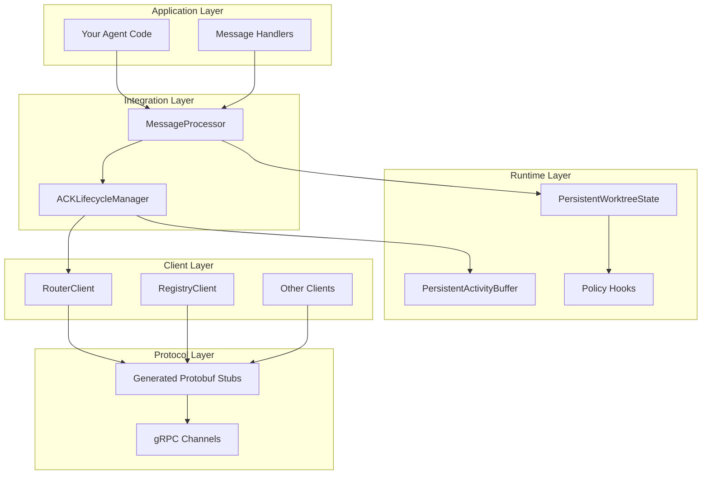

# 5. Architecture

Deep dive into the SW4RM SDK architecture, design patterns, and extensibility.

## 5.1. Overview

The SW4RM SDK is built with a layered architecture that provides flexibility while maintaining simplicity:

## 5.2. Core Principles

### 5.2.1. Persistence by Design
All stateful components support persistence across restarts with configurable backends.

### 5.2.2. Policy-Driven Behavior  
Extensible policy hooks for validation, transformation, and custom logic.

### 5.2.3. Automatic ACK Lifecycle
Built-in acknowledgment handling reduces boilerplate and ensures reliability.

### 5.2.4. Composable Architecture
Mix and match components based on your agent's requirements.

## 5.3. Key Components

Learn more about each architectural layer:

- [Components](components.md) - Detailed component breakdown
- [Message Flow](messages.md) - How messages flow through the system
- [Persistence](persistence.md) - Storage backends and data flow