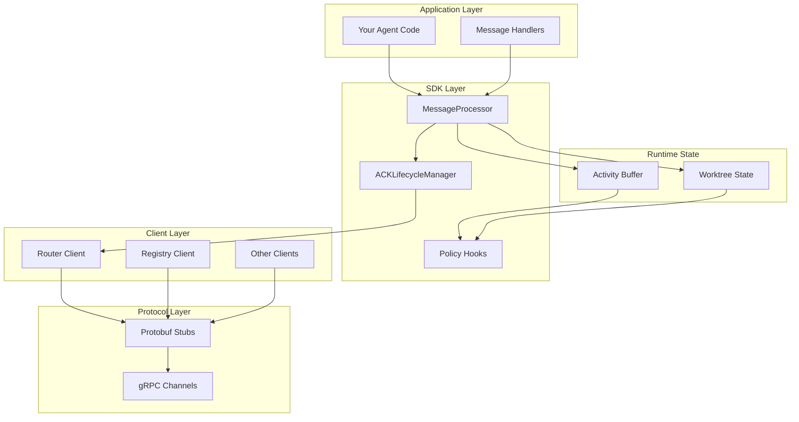
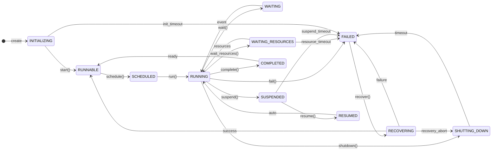
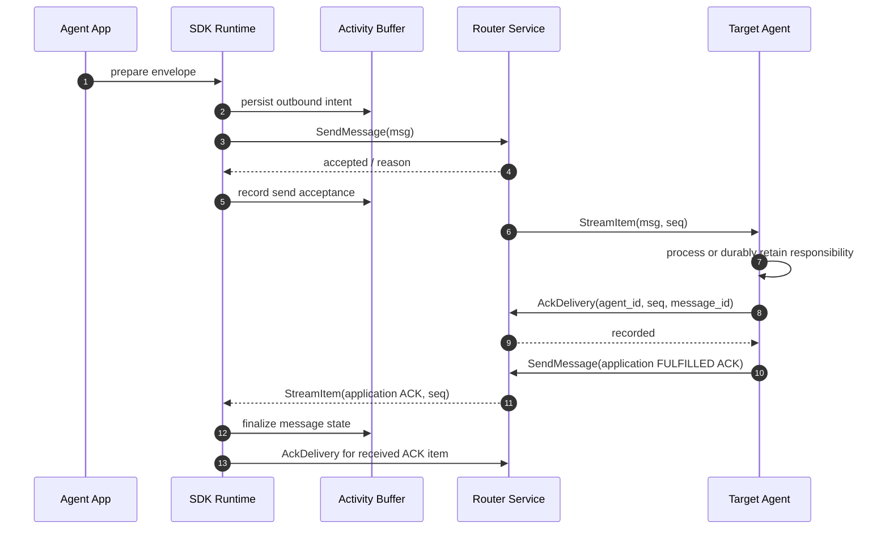
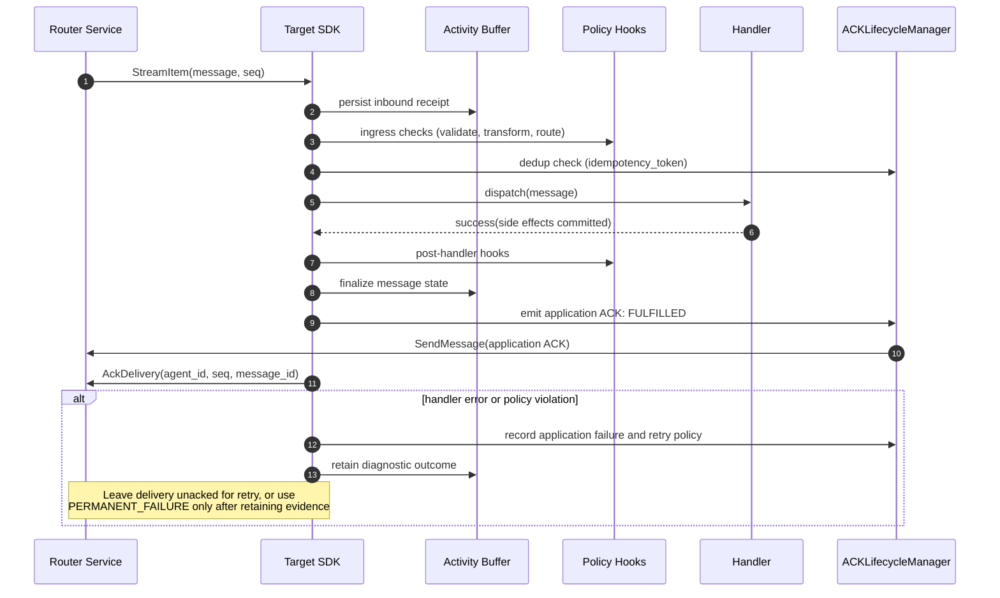

# 5. Architecture

Deep dive into the SW4RM SDK architecture, design patterns, and extensibility. This page complements the Protocol Specification and Getting Started guides, and links into deeper sections where appropriate.

The layers below describe how to assemble an agent runtime. SDK helpers,
reference servers, and deployment controls have different responsibilities;
instantiating a client does not wire all these layers together. Use the
[implementation coverage](../protocol/implementation.md) to select the parts
available in your SDK and the [first-agent tutorial](../quickstart/first-agent.md)
for a concrete Python integration.

## 5.1. Overview

The SDK follows a layered architecture that keeps the runtime simple while enabling robust interop with core services and protocol primitives.

Note: "Agent" in this documentation follows the supervised, process‑isolated definition (see "Agents and Agentic Interaction" in the [Overview](../overview.md)) rather than the colloquial "LLM wrapper" usage.

- Overview diagrams: [Overview](#51-overview)
- Persistent state model: [State and Persistence](#56-state-and-persistence)
- Protocol services and messages: [Services](../protocol/services.md) and [Messages](../protocol/messages.md)

## 5.2. Agent State Machine

The SW4RM agent runtime implements a 12-state machine for lifecycle management:

See [State Machines](state-machines.md) for detailed transition documentation, lifecycle hooks, and recovery protocols.

## 5.3. Core Principles

- **Persistence by design**: Select a durable backend for unfinished message records and explicitly save progress before releasing delivery responsibility. Reload and reconcile those records on restart. Causal ordering reconciliation (e.g., vector clocks) is specified as an extension point and is not yet implemented in the SDKs.
- **Policy-driven behavior**: Use the chosen SDK's policy hooks to validate messages and control dispatch. The application wires those hooks into its processing loop and supplies its concurrency, timeout, authorization, and quota decisions; a generated client alone does not enforce them.
- **Explicit ACK lifecycle**: Application progress is visible through RECEIVED → READ → FULFILLED or a terminal error. Router `AckDelivery` separately releases a pending delivery. Keep the logical operation token stable across retries and make effects idempotent or transactional; ACKs alone cannot prevent duplicate side effects.
- **Composability**: SDK components are modular and replaceable—use only MessageProcessor, ACKLifecycleManager, ActivityBuffer, or Worktree integrations you need. Clients are loosely coupled through protobuf contracts, enabling incremental adoption and component swaps behind stable interfaces.

## 5.4. Runtime Data Flow

The sequence below shows a typical end-to-end message journey with ACK lifecycle and persistence.

!!! tip "ACK Legend"

    - Send acceptance: Router accepted the send; this is a response flag, not an application ACK.
    - RECEIVED: Application receipt stage; its exact emission point belongs to the integrated runtime.
    - READ: Target validated and accepted the message for processing (omitted from the diagram for brevity).
    - FULFILLED: Emitted by the target after successful handling; the origin records the terminal application outcome.
    - AckDelivery: Consumer releases one router pending row by delivery sequence. Even an application ACK envelope needs this transport receipt.

Explanation

- Prepare: Assign a new `message_id`, a workflow correlation ID, and a stable logical-operation token. Encode the payload and declare its MIME type. The Envelope includes an optional `ttl_ms`, but has no general destination field; configure timeout enforcement and routing through the applicable implementation or application convention.
- Persist outbound intent: Save the pending record before network I/O. If a crash leaves acceptance uncertain, reconcile before retrying. A new application attempt uses a new message ID with the same logical-operation token.
- Send acceptance: Check `accepted` and `reason`. If the call times out, the server may already have enqueued the message; do not infer non-delivery from a missing response.
- Delivery: The Python reference Router broadcasts to eligible known queues other than the producer. The consumer preserves the delivery sequence and decides whether to handle or filter the payload.
- Responsibility: Process safely or commit the work to a durable inbox before `AckDelivery`. A crash before this point permits redelivery; a crash after it requires recovery from the consumer's own durable state.
- Application completion: Send FULFILLED only after the handler's work is complete. The origin processes that ACK and records the outcome. A receiver of an ACK sends its delivery receipt but does not recursively generate another application ACK.
- Terminal failure: Preserve the error, attempt history, and payload reference for triage. A deployment implementing the RFC's DLQ must supply the storage and operator procedures; the reference Router does not expose a DLQ API.

Notes

- Semantics: Transport acceptance, transport release, and application completion are separate observations. Record each without substituting one for another.
- Ordering: Envelope sequence numbers are producer metadata; router sequences identify delivery rows. Neither provides global causal ordering or ordered completion across concurrent handlers.
- Recovery: Reload unfinished records and completed-operation evidence before resuming. Recognizing a token after completion helps deduplicate; an external effect and its completion record still need an atomic or idempotent design.

Inbound Processing Flow

Explanation

- Ingress persistence: In this integration pattern, save the receipt before user code and retain the router sequence separately if the local record format does not include it. Choose and configure a durable buffer; the in-memory buffer is not a recovery store.
- Dedup/idempotency: Check completed logical-operation tokens before repeating work. Serialize concurrent attempts for the same operation or use a transactional/idempotent downstream operation to close the race between two handlers.
- Policy enforcement: Run validation and authorization before dispatch. Apply the chosen SDK's hooks explicitly and decide how policy failures affect retry versus terminal rejection.
- Handler execution: Handlers run with full context and should commit side effects atomically or implement compensations, ensuring retry safety and correctness.
- Acknowledgment: Persist the completed outcome before releasing the delivery, and send the application FULFILLED ACK separately. If publishing the ACK can fail, retain an outbound intent so recovery can finish that step.
- Failure path: The application chooses bounded retries with backoff or terminal rejection. Preserve a diagnostic outcome before permanently releasing a delivery, and route exhausted work to the deployment's triage facility.

Learn more about message types and services in the Protocol Specification: [Messages](../protocol/messages.md) and [Services](../protocol/services.md).

## 5.5. Components and Services

- **MessageProcessor**: Dispatches messages through registered handlers and policy hooks in SDKs that provide it. The application connects it to the inbound stream and defines worker limits and failure handling.
- **ACKLifecycleManager**: Represents application lifecycle progress and retry decisions in SDKs that provide it. Confirm which actions the helper performs and which the caller must implement; it is separate from Router delivery acknowledgements.
- **Activity Buffer**: Stores outbound intents and inbound processing records. Persistent implementations save and reload those records. The Python JSON backend uses atomic snapshots, not an append-only event log; Python also supplies SQLite. See [Persistence](../quickstart/persistence.md) for flush and recovery procedures.
- **Worktree State**: Associates work with repository/worktree context. Binding state, Git execution, path confinement, and merge policy are separate concerns; an application must connect its worktree client or local helper to the actual filesystem controls.
- **Core services**: Registry owns registration and heartbeat state, Router owns pending deliveries and leases, Scheduler owns task/activity records, and NegotiationRoom owns proposal/vote/decision state. See [Services](../protocol/services.md) for RPC procedures and server availability.

## 5.6. State and Persistence

Keep three kinds of state distinct when assembling recovery:

- **Activity Buffer**: Persist records and terminal tokens with an explicit flush policy. Reconcile unfinished outgoing work after restart. Retain completed-token evidence for the deduplication window; pruning it too early can make an old retry appear new.
- **Worktree State**: Retain the binding and checkpoint needed to resume, then revalidate the actual directory and repository on recovery. A saved ID does not prove the filesystem is unchanged or access is still authorized.
- **Configuration State**: Record which validated endpoint, policy, and schema configuration a run used. If your deployment supports hot reload, validate a candidate before replacing active configuration and retain a rollback copy. This is application/deployment guidance, not a shared SDK configuration transaction.

 Design details and recovery strategies: [Services](../protocol/services.md) and [Messages](../protocol/messages.md)

## 5.7. Reliability and Failure Modes

- **Delivery semantics**: Unacknowledged reference-router deliveries can return after reconnect or lease expiry. Bound application retries separately, keep tokens stable, and record timeout versus known terminal failure distinctly.
- **Ordering**: Tolerate duplicate and reordered processing. If a workflow needs sequential effects, serialize its work or validate application sequence/dependency state before execution.
- **Backpressure**: Bound in-flight handlers and local buffer capacity. On a full buffer, pause intake or reject work explicitly instead of acknowledging responsibility for records you could not retain. Credit-based flow control is a protocol option, not an automatic property of every client.
- **Degraded operation**: Use circuit breakers for failing dependencies where supported or supplied by your application. Define permitted fallback behavior explicitly; a cached/read-only result must not masquerade as completion of a requested mutation.

## 5.8. Security

- **Transport**: Configure authenticated TLS channels and server credentials for deployment outside the local trusted boundary. Choose certificate lifetime, rotation, cipher policy, and any pinning through that implementation. The reference launchers do not establish a complete mTLS platform.
- **Authn/Authz**: Authenticate the peer and authorize agent IDs, RPC methods, messages, and resources. If the deployment uses JWT/OIDC, service accounts, or role/attribute policy, connect those decisions to the service boundary; an Envelope ID or public-key field does not enforce them.
- **Audit**: Record actor, message IDs, decisions, and payload redaction status. Configure access, retention, integrity protection, and exports in the chosen logging backend. The Logging wire contract offers ingestion, not a complete immutable audit store.

Security and audit considerations appear throughout the protocol and runtime sections.

## 5.9. Scaling Considerations

- **Horizontal scaling**: Scale stateless services with additional replicas; partition work by tenant/conversation/shard to maintain locality where appropriate.
- **Resource isolation**: Use bulkheads, timeouts, and quotas to prevent cascading failures; configure pools and queues per deployment context.
- **Caching**: Apply bounded caches with explicit TTLs where they simplify repeated lookups.

## 5.10. Extensibility

- **Policy hooks**: Extensible hook points run at ingress, pre-dispatch, post-handler, and egress with deterministic priority, deadlines, and failure isolation. Plugins are expected to be side-effect aware and can mutate headers/payloads under explicit policies with full tracing.
- **Handler model**: Handlers are registered per message type with typed payloads and concurrency controls, supporting sync or async execution. The model encourages idempotent operations, retry-safety, and structured error signaling to integrate cleanly with ACK semantics.
- **Versioning**: Preserve protobuf field numbers and reserve removed fields; review additive changes for behavioral compatibility as well as decoding compatibility. The 0.7.0 delivery ACK contract requires coordinated router/consumer upgrades. See [release migration](../release-status.md) for the actual rollout steps.

## 5.11. Deployment Topologies

- **Local development**: Run the reference services and example agents on localhost with isolated state directories. The reference launchers use insecure local transport; use the documented commands to verify registration and delivery before adding application behavior.
- **Single-node deployment**: Use persistent volumes, process supervision, backups, and resource limits. Add authenticated transport and recovery validation appropriate to the environment. This topology is an operational design choice, not production certification of the reference servers.
- **Multi-node (roadmap)**: the target deployment model is HA replicas behind load balancers with leader election, and clustered PostgreSQL/Redis for durable state and coordination. The current reference services are single-node with SQLite persistence; canary releases, rolling upgrades, and SLO autoscaling are roadmap capabilities.

See examples and patterns: [Deployment Patterns](../examples/deployment.md)

## 5.12. What's Next

- **Protocol Specification**: Dive into the gRPC services, message envelopes, and ACK semantics to design custom integrations or services. Start here when you need authoritative contract details and behavior guarantees; see [Protocol](../protocol/index.md).
- **Examples**: Explore end-to-end agent samples that showcase handler registration, persistence, retries, and deployment patterns. Use these as blueprints to bootstrap your own agents; see [Examples](../examples/index.md).
- **Quickstart**: Install the SDK, run a local stack, and send your first messages with sensible defaults. Ideal for validating your environment and wiring before deeper customization; see [Getting Started](../quickstart/index.md).
