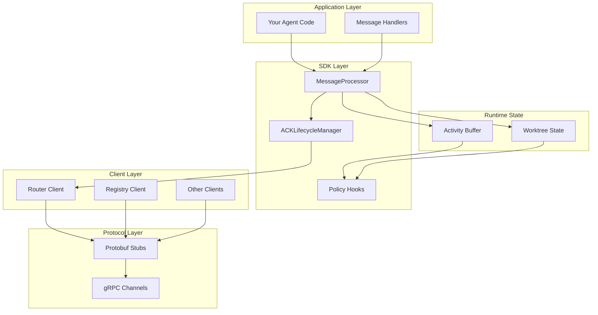
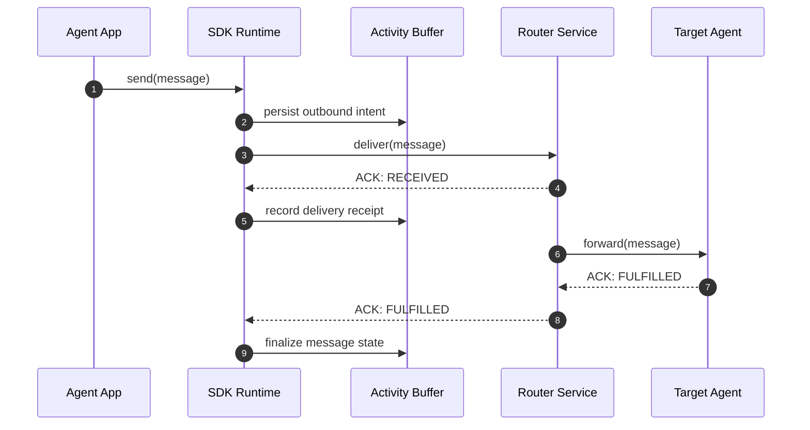
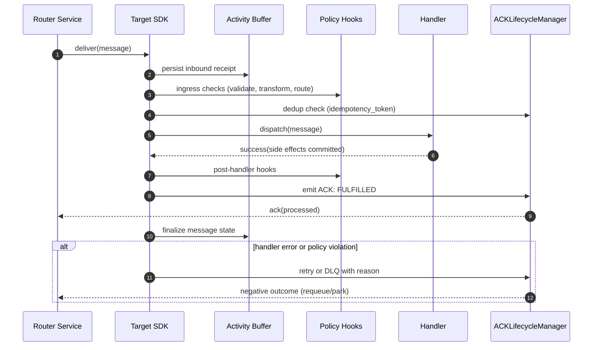

# 5. Architecture

Deep dive into the SW4RM SDK architecture, design patterns, and extensibility. This page complements the Protocol Specification and Getting Started guides, and links into deeper sections where appropriate.

## 5.1. Overview

The SDK follows a layered architecture that keeps the runtime simple while enabling robust interop with core services and protocol primitives.

Note: “Agent” in this documentation follows the supervised, process‑isolated definition in the main index (see “Agents and Agentic Interaction” in documentation/index.md) rather than the colloquial “LLM wrapper” usage.

!!! tip "ACK Legend"

    - RECEIVED: Router durably accepted and persisted the message; origin records receipt and retries if this is not observed before timeout.
    - READ: Target parsed and validated the message and accepted it for processing.
    - FULFILLED: Target completed processing successfully; origin finalizes lifecycle.

For a system-wide view including services, data stores, and ports, see Detailed System Architecture in the main index.

- Detailed system diagram: [Detailed System Architecture](../#17-detailed-system-architecture)
- Persistent state model: [Persistent State Management Architecture](../#142-persistent-state-management-architecture)
- Protocol services and messages: [Services](../protocol/services.md) and [Messages](../protocol/messages.md)

## 5.2. Core Principles

- **Persistence by design**: All stateful runtime components (Activity Buffer, Worktree State, configuration) persist across restarts using pluggable backends. Writes are made durable before emitting downstream ACKs, and on startup the runtime replays the log and reconciles ordering (e.g., vector clocks) to guarantee consistent recovery.
- **Policy-driven behavior**: Policy hooks intercept messages at defined phases (ingress, pre-dispatch, post-handler, egress) for validation, transformation, routing, and quota enforcement. Hooks execute deterministically with priority, timeouts, and error isolation to ensure predictable outcomes without compromising throughput.
- **Explicit ACK lifecycle**: Delivery confirmation is explicit (RECEIVED → READ → FULFILLED) with `idempotency_token`s, bounded retries with exponential backoff, and DLQ on exhaustion. This yields at-least-once delivery while preventing duplicate side effects in handlers via idempotent processing.
- **Composability**: SDK components are modular and replaceable—use only MessageProcessor, ACKLifecycleManager, ActivityBuffer, or Worktree integrations you need. Clients are loosely coupled through protobuf contracts, enabling incremental adoption and component swaps behind stable interfaces.

## 5.3. Runtime Data Flow

The sequence below shows a typical end-to-end message journey with ACK lifecycle and persistence.

!!! tip "ACK Legend"

    - RECEIVED: Router durably accepted and persisted the message at ingress to the Router.
    - READ: Target validated and accepted the message for processing (omitted from the diagram for brevity).
    - FULFILLED: Emitted by the target after successful handling; Router relays to origin which then finalizes lifecycle state.

Explanation

- send(message): The application calls the SDK, which assigns a `message_id` and `idempotency_token`, stamps causal metadata (e.g., vector clock), and prepares delivery options (TTL, priority, retries).
- persist outbound intent: The SDK appends an immutable record to the Activity Buffer before any network I/O so a crash cannot lose intent; on restart, the SDK can safely re‑emit the same message-id.
- deliver(message): The SDK transmits to the Router. The Router durably persists and enqueues the message; only after fsync/durable write does it emit ACK: RECEIVED.
- ACK: RECEIVED: Confirms the Router accepted responsibility for delivery. If this isn’t received before timeout, the SDK retries with exponential backoff; duplicates are harmless due to idempotency.
- forward(message): The Router routes to the target agent based on addressing/capabilities. The target SDK pulls/receives and dispatches to the appropriate handler.
- ACK: FULFILLED: After the target handler completes successfully (side effects committed), the target SDK emits FULFILLED back via the Router.
- finalize message state: The origin SDK records completion in the Activity Buffer and closes the lifecycle. On repeated failures, the Router moves the message to a DLQ with reason and trace context.

Notes

- Semantics: RECEIVED = durably accepted by Router; READ = validated by the target; FULFILLED = successfully handled by the target. This supports at‑least‑once delivery with idempotent handlers.
- Ordering: FIFO within a conversation is preserved using causal metadata; cross‑conversation ordering is not guaranteed.
- Recovery: On restart, the origin SDK replays unsatisfied intents from the Activity Buffer and resumes delivery using the same ids, preventing duplicate side effects.

Inbound Processing Flow

Explanation

- Ingress persistence: The target SDK writes a durable receipt before any user code executes, enabling safe resumption after crashes with no message loss or double-processing.
- Dedup/idempotency: The `idempotency_token` (plus causal metadata) prevents re-applying side effects when redeliveries occur due to retries or network partitions.
- Policy enforcement: Ingress and post-handler hooks enforce validation, transformation, and routing with deterministic priorities and bounded execution to protect throughput.
- Handler execution: Handlers run with full context and should commit side effects atomically or implement compensations, ensuring retry safety and correctness.
- Acknowledgment: The SDK sends FULFILLED only after successful handler completion and post-hooks, preserving at-least-once semantics.
- Failure path: On errors, the ACK manager applies bounded retries with backoff; persistent failures are DLQ’d with structured reason and trace correlation for analysis.

Learn more about message types and services in the Protocol Specification: [Messages](../protocol/messages.md) and [Services](../protocol/services.md).

## 5.4. Components and Services

- **MessageProcessor**: Registers typed handlers, applies the policy chain, and routes inbound/outbound messages based on conversation context and addressing. It executes handlers in bounded worker pools with timeouts, propagates trace/causal metadata, and enforces backpressure to protect latency targets.
- **ACKLifecycleManager**: Tracks message state transitions (RECEIVED → READ → FULFILLED) with `idempotency_token`s and emits retries using exponential backoff with jitter and caps. It deduplicates redeliveries, records DLQ handoff on exhaustion, and exposes per-message outcome metrics for observability.
- **Activity Buffer**: Provides an append-only, fsync-backed transaction log for outbound intents and inbound processing results. On startup it replays incomplete lifecycles and reconciles order using causal metadata (e.g., vector clocks) to guarantee consistent recovery after crashes.
- **Worktree State**: Maintains repository/workspace context with deep Git integration, including branch tracking, file diffs, and isolated working directories per conversation or task. It supports background sync, conflict handling with policy-driven strategies, and controlled side effects for code-aware agents.
- **Core services**: The Router durably persists and routes messages with FIFO ordering within a conversation and delivery retries; the Registry provides agent discovery, health, and capability advertisement; the Scheduler allocates work via priority queues and lease-based dispatch. All services expose gRPC endpoints secured with mTLS; see ../protocol/services.md for API details.

Deeper system context and diagrams: [Detailed System Architecture](../#17-detailed-system-architecture)

## 5.5. State and Persistence

The SDK provides multi-level persistence for robustness and recovery:

- **Activity Buffer**: Uses atomic, append-only writes with periodic compaction and retention policies to bound disk usage. Recovery reprocesses only incomplete lifecycles and preserves idempotency by resending the same `message_id` and `idempotency_token`.
- **Worktree State**: Persists workspace bindings and file metadata, isolating tenant/conversation state in sandboxed directories. Git operations (fetch/merge/commit) run under policy control with explicit conflict resolution and audit trails.
- **Configuration State**: Stores versioned configuration with JSON Schema validation, hot-reload, and automatic rollback on failed validations. Changes are recorded with actor, timestamp, and diff to support audit and rapid recovery.

Design details and recovery strategies: [Persistent State Management Architecture](../#142-persistent-state-management-architecture)

## 5.6. Reliability and Failure Modes

- **Delivery semantics**: Implements at-least-once delivery with bounded retries, exponential backoff with jitter, and DLQ on exhaustion, while preserving the same `idempotency_token` across attempts. Timeouts are enforced with monotonic clocks and traced so operators can correlate redeliveries with upstream failures.
- **Ordering**: Guarantees FIFO within a conversation using causal metadata and queue discipline at the Router, but does not impose global ordering across conversations. Handlers must be idempotent and side-effect safe to tolerate retries and reordering in distributed conditions.
- **Backpressure**: Applies credit- or queue-depth-based flow control and per-handler concurrency limits to prevent receiver overload. When limits are exceeded, the SDK sheds load via timeouts and the circuit breaker, signaling upstream to slow down while preserving system stability.
- **Degraded operation**: Circuit breakers isolate failing dependencies and switch components into a constrained feature set (e.g., read-only operations or cached responses). Recovery uses exponential probe intervals, and fallbacks are governed by explicit policies to avoid silent data loss.

See system-wide guarantees and tradeoffs: [Enterprise Problem Resolution](../#14-enterprise-problem-resolution)

## 5.7. Security

- **Transport**: Enforces mutual TLS (TLS 1.3) with certificate rotation, strict cipher suites, and optional certificate pinning/SPKI checks. Handshake and session lifetimes are configurable, and all channels require authenticated peers before any data exchange.
- **Authn/Authz**: Supports JWT/OIDC and service accounts with RBAC/ABAC enforcement at the service boundary and within the SDK. Authorization decisions are policy-driven and evaluated per message, with scoped tokens and expirations to minimize blast radius.
- **Audit**: Emits structured, immutable audit logs including actor, message IDs, decisions, and payload redaction status. Logs are timestamped, trace-correlated, retained per policy, and exportable to SIEM systems for compliance.

Security and audit considerations appear throughout the protocol and runtime sections.

## 5.8. Scaling Considerations

- **Horizontal scaling**: Scale stateless services with additional replicas; partition work by tenant/conversation/shard to maintain locality where appropriate.
- **Resource isolation**: Use bulkheads, timeouts, and quotas to prevent cascading failures; configure pools and queues per deployment context.
- **Caching**: Apply bounded caches with explicit TTLs where they simplify repeated lookups.

## 5.9. Extensibility

- **Policy hooks**: Extensible hook points run at ingress, pre-dispatch, post-handler, and egress with deterministic priority, deadlines, and failure isolation. Plugins are expected to be side-effect aware and can mutate headers/payloads under explicit policies with full tracing.
- **Handler model**: Handlers are registered per message type with typed payloads and concurrency controls, supporting sync or async execution. The model encourages idempotent operations, retry-safety, and structured error signaling to integrate cleanly with ACK semantics.
- **Versioning**: Protobuf evolution guidelines (field reservations, `oneof`, additive changes) maintain wire compatibility across SDK and services. Semantic versioning signals breaking changes, and schema migration tools assist with staged rollouts.

## 5.10. Deployment Topologies

- **Local development**: Runs all core services on localhost with in-memory or file-backed storage for rapid feedback, optional insecure transport, and hot-reload of configuration. Make targets or Compose files bootstrap the stack with seeded data and example agents.
- **Single-node production**: Consolidates services on one host or VM with persistent volumes, TLS enabled, and systemd/container supervision. Backups, resource limits, and rolling binary restarts are configured to achieve predictable recovery and maintainability.
- **Multi-node**: Deploys HA replicas behind load balancers with leader election where required, and clustered PostgreSQL/Redis for durable state and coordination. Canary releases and rolling upgrades preserve availability while SLOs are enforced via autoscaling and alerting.

See examples and patterns: [Deployment Patterns](../examples/deployment.md)

## 5.11. What’s Next

- **Protocol Specification**: Dive into the gRPC services, message envelopes, and ACK semantics to design custom integrations or services. Start here when you need authoritative contract details and behavior guarantees; see [Protocol](../protocol/).
- **Examples**: Explore end-to-end agent samples that showcase handler registration, persistence, retries, and deployment patterns. Use these as blueprints to bootstrap your own agents; see [Examples](../examples/).
- **Quickstart**: Install the SDK, run a local stack, and send your first messages with sensible defaults. Ideal for validating your environment and wiring before deeper customization; see [Getting Started](../quickstart/).
