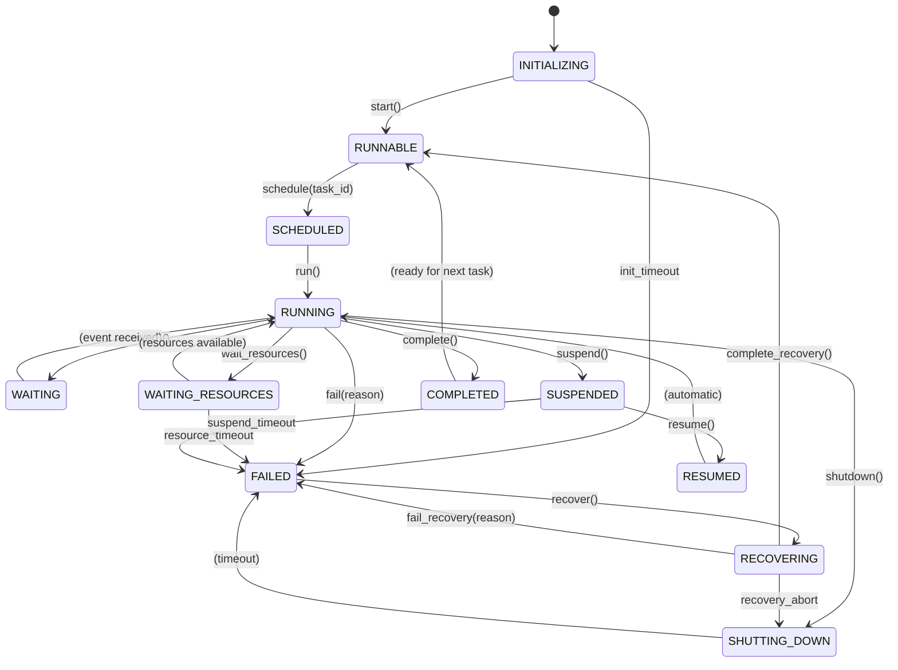
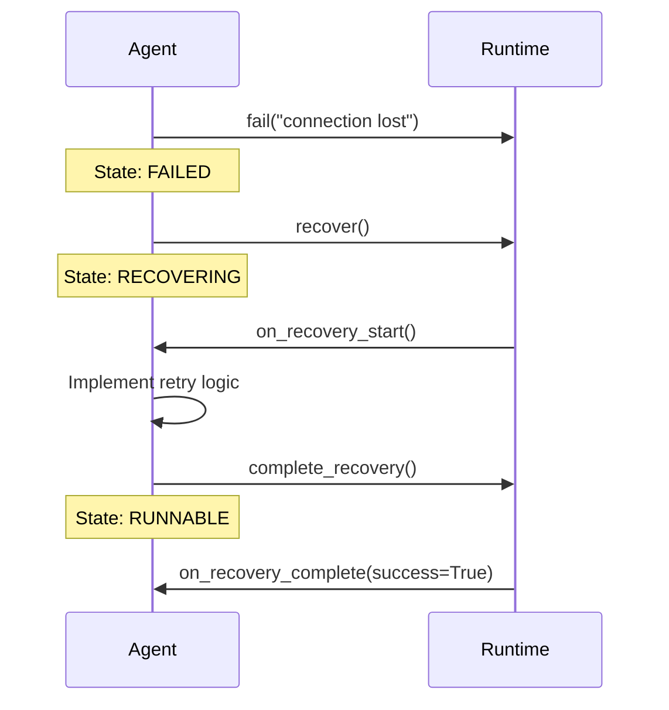
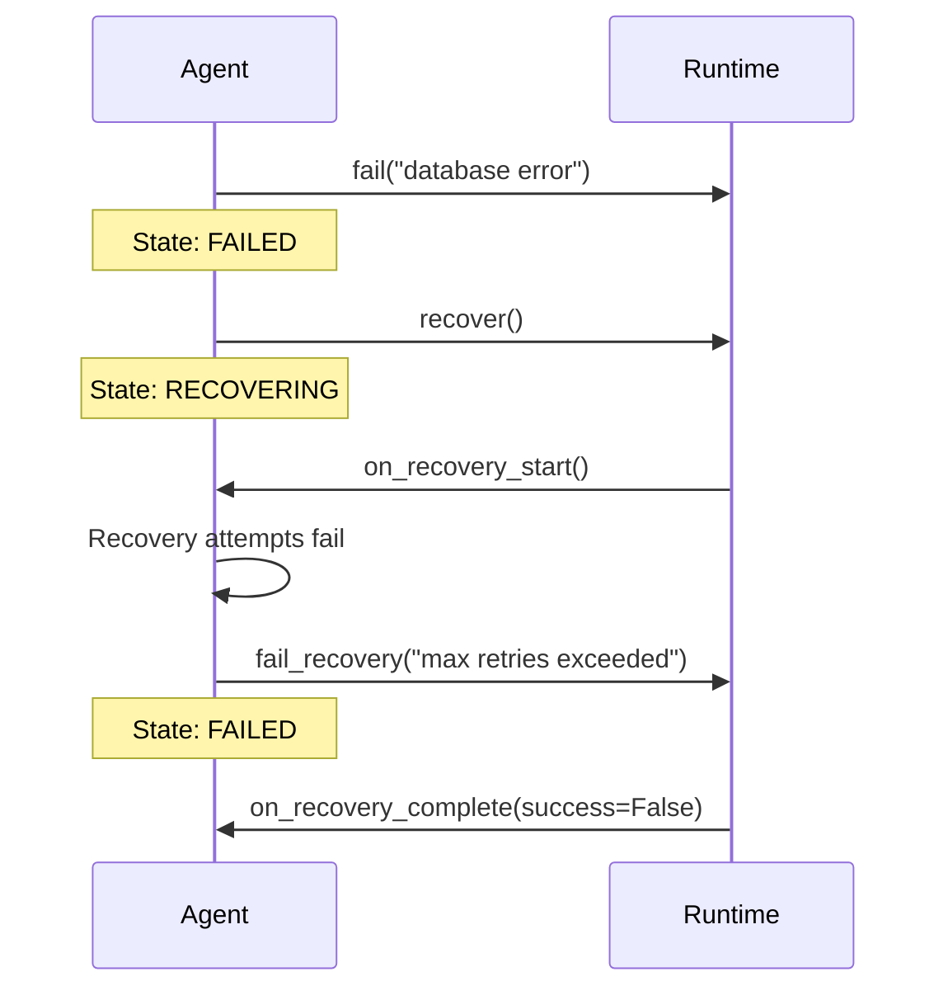

# Agent Runtime State Machines

This document describes the SW4RM agent lifecycle state machine, including all state transitions, lifecycle hooks, and recovery protocols.

## Overview

The SW4RM agent runtime implements a 12-state machine for lifecycle management. This state machine ensures predictable agent behavior, enables cooperative preemption, and provides structured recovery from failures.

**Source:** `sdks/py_sdk/sw4rm/runtime/agent.py`

## State Machine Diagram



## State Reference Table

| State | Value | Entry Condition | Exit Transitions | Lifecycle Hook |
|-------|-------|-----------------|------------------|----------------|
| INITIALIZING | 0 | Agent created | RUNNABLE | `on_startup()` |
| RUNNABLE | 1 | Ready for work | SCHEDULED | - |
| SCHEDULED | 2 | Task assigned | RUNNING | `on_scheduled(task_id)` |
| RUNNING | 3 | Processing | WAITING, WAITING_RESOURCES, SUSPENDED, COMPLETED, FAILED, SHUTTING_DOWN | - |
| WAITING | 4 | Awaiting message/event | RUNNING | - |
| WAITING_RESOURCES | 5 | Awaiting resources | RUNNING | - |
| SUSPENDED | 6 | Preempted | RESUMED | `on_suspend()` |
| RESUMED | 7 | Resuming | RUNNING | `on_resume()` |
| COMPLETED | 8 | Task finished | RUNNABLE | - |
| FAILED | 9 | Error occurred | RECOVERING | - |
| SHUTTING_DOWN | 10 | Graceful stop | FAILED | `on_shutdown()` |
| RECOVERING | 11 | Recovery in progress | RUNNABLE, FAILED, SHUTTING_DOWN | `on_recovery_start()`, `on_recovery_complete()` |

## State Descriptions

### INITIALIZING (0)

The agent is being created and configured. This is the initial state for all agents.

- **Entry:** Agent constructor completes
- **Exit:** Call `start()` to transition to RUNNABLE
- **Hook:** `on_startup()` is called before transitioning out

### RUNNABLE (1)

The agent is ready to be scheduled for work. It has completed initialization and is waiting for task assignment.

- **Entry:** Successful `start()` call or recovery completion
- **Exit:** Call `schedule(task_id)` when a task is assigned

### SCHEDULED (2)

The agent has been assigned a task and is preparing to execute it.

- **Entry:** Scheduler assigns a task via `schedule(task_id)`
- **Exit:** Call `run()` to begin execution
- **Hook:** `on_scheduled(task_id)` is called after entering this state

### RUNNING (3)

The agent is actively executing its assigned task. This is the primary working state.

- **Entry:** Call `run()` from SCHEDULED, WAITING, WAITING_RESOURCES, or RESUMED
- **Exit:** Multiple transitions available depending on outcome

### WAITING (4)

The agent is waiting for external input such as a message from another agent or an external event.

- **Entry:** Call `wait()` when awaiting input
- **Exit:** Transition back to RUNNING when input is received

### WAITING_RESOURCES (5)

The agent is waiting for resources to become available (memory, compute capacity, external service limits).

- **Entry:** Call `wait_resources()` when resources are unavailable
- **Exit:** Transition back to RUNNING when resources are available

### SUSPENDED (6)

The agent has been preempted and execution is suspended. State should be preserved for later resumption.

- **Entry:** Call `suspend()` when preempted
- **Exit:** Call `resume()` to begin resumption
- **Hook:** `on_suspend()` is called before entering this state

### RESUMED (7)

The agent is resuming from suspension and preparing to continue execution.

- **Entry:** Call `resume()` from SUSPENDED
- **Exit:** Automatically transitions to RUNNING
- **Hook:** `on_resume()` is called after entering this state

### COMPLETED (8)

The agent has successfully finished its task. This is a terminal state.

- **Entry:** Call `complete()` when task finishes successfully
- **Exit:** None (terminal state)

### FAILED (9)

The agent has encountered an error and cannot continue normal execution.

- **Entry:** Call `fail(reason)` when an error occurs
- **Exit:** Call `recover()` to attempt recovery

### SHUTTING_DOWN (10)

The agent is performing graceful shutdown procedures.

- **Entry:** Call `shutdown()` to initiate graceful shutdown
- **Exit:** Transitions to FAILED on timeout
- **Hook:** `on_shutdown()` is called before entering this state

### RECOVERING (11)

The agent is attempting to recover from a failure.

- **Entry:** Call `recover()` from FAILED state
- **Exit:** `complete_recovery()` returns to RUNNABLE, `fail_recovery(reason)` returns to FAILED
- **Hooks:** `on_recovery_start()` on entry, `on_recovery_complete(success)` on exit

## Transition Method Reference

### start()

```python
def start(self) -> None:
    """Transition from INITIALIZING to RUNNABLE.

    Call this after the agent has completed initialization and is
    ready to be scheduled for work.

    Precondition: state == INITIALIZING
    Raises: StateTransitionError if not in INITIALIZING state
    """
```

### schedule(task_id)

```python
def schedule(self, task_id: str) -> None:
    """Transition from RUNNABLE to SCHEDULED.

    Called when the scheduler assigns a task to this agent.

    Args:
        task_id: The identifier of the task being assigned.

    Precondition: state == RUNNABLE
    Raises: StateTransitionError if not in RUNNABLE state
    """
```

### run()

```python
def run(self) -> None:
    """Transition to RUNNING state.

    Valid from SCHEDULED, WAITING, WAITING_RESOURCES, or RESUMED states.

    Precondition: state in {SCHEDULED, WAITING, WAITING_RESOURCES, RESUMED}
    Raises: StateTransitionError if transition is not valid from current state
    """
```

### wait()

```python
def wait(self) -> None:
    """Transition from RUNNING to WAITING.

    Call this when the agent needs to wait for external input
    (e.g., waiting for a response from another agent or service).

    Precondition: state == RUNNING
    Raises: StateTransitionError if not in RUNNING state
    """
```

### wait_resources()

```python
def wait_resources(self) -> None:
    """Transition from RUNNING to WAITING_RESOURCES.

    Call this when the agent needs to wait for resources to become
    available (e.g., memory, compute capacity, external service limits).

    Precondition: state == RUNNING
    Raises: StateTransitionError if not in RUNNING state
    """
```

### suspend()

```python
def suspend(self) -> None:
    """Transition from RUNNING to SUSPENDED.

    Call this when the agent is being preempted and needs to
    suspend execution. The agent should save its state before
    calling this method.

    Precondition: state == RUNNING
    Raises: StateTransitionError if not in RUNNING state
    """
```

### resume()

```python
def resume(self) -> None:
    """Transition from SUSPENDED to RESUMED.

    Call this when resuming a suspended agent. After resuming,
    call run() to continue execution.

    Precondition: state == SUSPENDED
    Raises: StateTransitionError if not in SUSPENDED state
    """
```

### complete()

```python
def complete(self) -> None:
    """Transition from RUNNING to COMPLETED.

    Call this when the agent has successfully finished its task.
    COMPLETED is a terminal state.

    Precondition: state == RUNNING
    Raises: StateTransitionError if not in RUNNING state
    """
```

### fail(reason)

```python
def fail(self, reason: str) -> None:
    """Transition to FAILED state.

    This transition is allowed from RUNNING, SHUTTING_DOWN, or
    RECOVERING (on recovery failure).

    Args:
        reason: Description of why the agent failed.

    Precondition: FAILED is a valid target from current state
    Raises: StateTransitionError if transition to FAILED is not valid
    """
```

### shutdown()

```python
def shutdown(self) -> None:
    """Transition from RUNNING to SHUTTING_DOWN.

    Call this to initiate a graceful shutdown. The agent should
    complete any critical operations and then transition to
    either COMPLETED or FAILED.

    Precondition: state == RUNNING
    Raises: StateTransitionError if not in RUNNING state
    """
```

### recover()

```python
def recover(self) -> None:
    """Transition from FAILED to RECOVERING.

    Call this to initiate recovery after a failure. Override
    on_recovery_start to implement recovery logic, then call
    either complete_recovery() or fail_recovery().

    Precondition: state == FAILED
    Raises: StateTransitionError if not in FAILED state
    """
```

### complete_recovery()

```python
def complete_recovery(self) -> None:
    """Complete recovery successfully, transitioning to RUNNABLE.

    Call this after recovery procedures have completed successfully.
    The agent will return to RUNNABLE state and can be scheduled again.

    Precondition: state == RECOVERING
    Raises: StateTransitionError if not in RECOVERING state
    """
```

### fail_recovery(reason)

```python
def fail_recovery(self, reason: str) -> None:
    """Recovery failed, transitioning back to FAILED.

    Call this if recovery procedures fail. The agent will return
    to FAILED state.

    Args:
        reason: Description of why recovery failed.

    Precondition: state == RECOVERING
    Raises: StateTransitionError if not in RECOVERING state
    """
```

## Recovery Flow

The recovery subsystem handles agent failures gracefully with structured retry and escalation.

### Successful Recovery



### Failed Recovery



### Retry Strategies

Recommended retry strategies for recovery:

| Strategy | Description | Use Case |
|----------|-------------|----------|
| **Exponential Backoff** | Delay doubles with each attempt (1s, 2s, 4s, 8s...) | Network failures, rate limits |
| **Fixed Delay** | Constant delay between attempts | Resource contention |
| **Jittered Backoff** | Exponential + random jitter | Avoid thundering herd |

Example implementation:

```python
import time
import random

class RecoverableAgent(Agent):
    MAX_RETRIES = 5
    BASE_DELAY_S = 1.0

    def on_recovery_start(self) -> None:
        for attempt in range(self.MAX_RETRIES):
            try:
                self._reconnect_to_service()
                self.complete_recovery()
                return
            except ConnectionError:
                # Exponential backoff with jitter
                delay = self.BASE_DELAY_S * (2 ** attempt)
                jitter = random.uniform(0, delay * 0.1)
                time.sleep(delay + jitter)

        self.fail_recovery(f"Failed after {self.MAX_RETRIES} attempts")
```

## Preemption Protocol

SW4RM supports cooperative preemption where agents voluntarily yield execution at safe points.

### safe_point()

```python
def safe_point(self) -> bool:
    """Return True if preemption is requested and caller should yield.

    Call this at safe points in your agent's execution loop to
    check if preemption has been requested.

    Returns:
        True if preemption is requested, False otherwise.
    """
```

Usage in an agent loop:

```python
def process_items(self, items: list) -> None:
    for item in items:
        # Check for preemption at each iteration
        if self.safe_point():
            self.suspend()
            return

        self.process_single_item(item)
```

### non_preemptible(deadline_ms)

```python
@contextlib.contextmanager
def non_preemptible(self, *, deadline_ms: Optional[int] = None) -> ContextManager[None]:
    """Context manager for critical sections that should not be preempted.

    While inside this context, safe_point() will return False even if
    preemption has been requested. Note that the scheduler may still
    enforce a hard kill externally after the deadline.

    Args:
        deadline_ms: Optional deadline in milliseconds for the critical
            section. The scheduler may force preemption after this time.

    Yields:
        None
    """
```

Usage for critical sections:

```python
def commit_transaction(self) -> None:
    # This section must complete atomically
    with self.non_preemptible(deadline_ms=5000):
        self.db.begin_transaction()
        self.db.write(self.pending_changes)
        self.db.commit()
```

### Cooperative vs. Forced Preemption

| Type | Description | Agent Responsibility |
|------|-------------|---------------------|
| **Cooperative** | Agent checks `safe_point()` and voluntarily suspends | Must call `safe_point()` regularly |
| **Forced** | Scheduler terminates agent after deadline | Use `non_preemptible()` for critical sections |

Forced preemption occurs when:

1. The agent does not respond to preemption requests within the configured timeout
2. The agent is in `non_preemptible()` but exceeds its deadline
3. System resources are critically low

## Lifecycle Hooks

Override these methods to customize agent behavior at state transitions:

```python
class MyAgent(Agent):
    def on_startup(self) -> None:
        """Called during agent startup initialization."""
        self.logger.info("Agent starting up")
        self._init_connections()

    def on_shutdown(self) -> None:
        """Called during agent shutdown."""
        self.logger.info("Agent shutting down")
        self._close_connections()

    def on_scheduled(self, task_id: str) -> None:
        """Called when the agent is scheduled with a task."""
        self.logger.info(f"Assigned task: {task_id}")
        self._prepare_for_task(task_id)

    def on_state_change(self, old_state: int, new_state: int) -> None:
        """Called whenever the agent state changes."""
        self.logger.debug(
            f"State: {AgentState.name(old_state)} -> {AgentState.name(new_state)}"
        )

    def on_preempt_request(self, reason: str) -> None:
        """Called when a preemption is requested."""
        self.logger.warning(f"Preemption requested: {reason}")

    def on_suspend(self) -> None:
        """Called when the agent is suspended."""
        self._save_checkpoint()

    def on_resume(self) -> None:
        """Called when the agent resumes from suspension."""
        self._load_checkpoint()

    def on_recovery_start(self) -> None:
        """Called when recovery begins after a failure."""
        self.logger.info("Starting recovery")

    def on_recovery_complete(self, success: bool) -> None:
        """Called when recovery completes."""
        if success:
            self.logger.info("Recovery successful")
        else:
            self.logger.error("Recovery failed")
```

## StateTransitionError

Invalid state transitions raise `StateTransitionError`:

```python
from sw4rm.runtime.agent import Agent, AgentState, StateTransitionError

agent = Agent("agent-1", "Worker")
# Agent starts in INITIALIZING

try:
    # Invalid: cannot schedule without first calling start()
    agent.schedule("task-123")
except StateTransitionError as e:
    print(f"Current state: {e.current_state}")  # 0 (INITIALIZING)
    print(f"Target state: {e.target_state}")    # 2 (SCHEDULED)
    print(str(e))  # "Invalid state transition: INITIALIZING -> SCHEDULED"
```

## Utility Methods

### state

```python
@property
def state(self) -> int:
    """Return the current agent state (read-only)."""
```

### state_name

```python
@property
def state_name(self) -> str:
    """Return the human-readable name of the current state."""
```

### is_terminal()

```python
def is_terminal(self) -> bool:
    """Check if the agent is in a terminal state (COMPLETED)."""
```

### can_transition_to(target_state)

```python
def can_transition_to(self, target_state: int) -> bool:
    """Check if a transition to the target state is valid."""
```

## Complete Example

```python
from sw4rm.runtime.agent import Agent, AgentState

class WorkerAgent(Agent):
    def __init__(self, agent_id: str):
        super().__init__(agent_id, "Worker")
        self.work_queue = []

    def on_startup(self) -> None:
        print(f"[{self.agent_id}] Starting up...")

    def on_scheduled(self, task_id: str) -> None:
        print(f"[{self.agent_id}] Scheduled for task: {task_id}")

    def on_suspend(self) -> None:
        print(f"[{self.agent_id}] Suspending, saving state...")

    def on_resume(self) -> None:
        print(f"[{self.agent_id}] Resuming from checkpoint...")

    def process_work(self) -> None:
        """Main work loop with preemption support."""
        for item in self.work_queue:
            if self.safe_point():
                print(f"[{self.agent_id}] Yielding to preemption")
                self.suspend()
                return

            self._process_item(item)

        self.complete()


# Usage
agent = WorkerAgent("worker-1")
assert agent.state == AgentState.INITIALIZING

agent.start()
assert agent.state == AgentState.RUNNABLE

agent.schedule("task-abc")
assert agent.state == AgentState.SCHEDULED

agent.run()
assert agent.state == AgentState.RUNNING

# Agent processes work and completes
agent.complete()
assert agent.state == AgentState.COMPLETED
assert agent.is_terminal()
```

## See Also

- [Architecture Overview](index.md) - System architecture context
- [Exceptions Reference](../clients/exceptions.md) - StateTransitionError and other exceptions
- [Agent Runtime Source](https://github.com/rahulrajaram/sw4rm/blob/master/sdks/py_sdk/sw4rm/runtime/agent.py) - Implementation details
