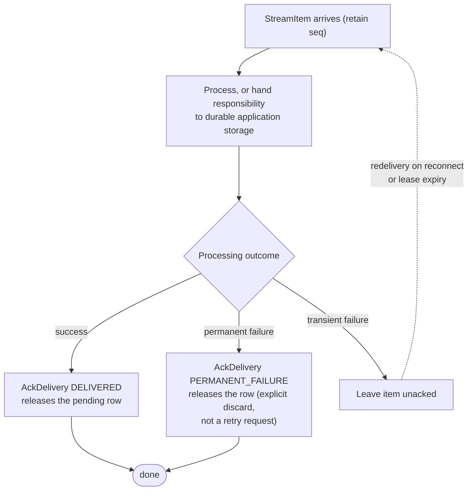

# 6.2. Router Client

The Router client talks to `sw4rm.router.RouterService`. Use it to:

- Send envelopes to the durable delivery store.
- Stream incoming deliveries for a receiving agent.
- Acknowledge completed deliveries to release the pending row.

The 0.7.0 development contract adds consumer acknowledgements to sending and
streaming. Published 0.6.0 clients require migration before using this
delivery behavior.

## 6.2.1. Wire operations

| RPC | Purpose |
|---|---|
| `SendMessage` | Submit an envelope; return acceptance and a reason |
| `StreamIncoming` | Stream `StreamItem` messages for a receiving agent |
| `AckDelivery` | Release an in-flight delivery belonging to that recipient |

The [generated reference](../reference/release-contract.md) supplies exact
request/response types. `StreamItem.msg` is the envelope; `StreamItem.seq` is an
int64 router delivery identifier. Preserve it exactly, including in JavaScript.
It is distinct from `Envelope.sequence_number`.

### Response fields

`SendMessage` returns `accepted` (whether the router accepted the envelope) and
an optional `reason` explaining a rejection. `StreamIncoming` yields
`StreamItem` values with `msg` (the incoming `Envelope`) and `seq` (the router's
delivery identifier). `AckDelivery` returns `recorded`, which is true only when
the supplied recipient, sequence, and outcome released an eligible pending row.

The Python constructor accepts a connected gRPC channel. JavaScript/TypeScript
uses `new RouterClient({ address: "host:port" })`; Rust uses
`RouterClient::new("http://host:port")`. The default RouterService endpoint is
port `50051`.

## 6.2.2. Processing order

1. Receive and retain the stream item, including its sequence.
2. Check any durable completion token used by the application.
3. Process the message or hand responsibility to durable application storage.
4. Persist completion when appropriate.
5. Acknowledge delivery using the receiving agent ID and sequence.

An acknowledgement has two outcomes: delivered, or permanent failure. Both
release the row. A transient processing failure should leave the item unacked.
The Python reference router redelivers on reconnect or lease expiry.

`recorded=false` means no eligible in-flight row was released: the sequence may
be unknown, already acknowledged, expired to pending, or owned by another agent.
Invalid recipient/sequence/outcome fields also return false. Recipient fields
are checked for consistency; authentication is a deployment responsibility.



## 6.2.3. SDK entry points

| SDK | Receiving | Acknowledging |
|---|---|---|
| Python | `RouterClient.stream_incoming` | `RouterClient.ack_delivery` |
| JavaScript/TypeScript | `RouterClient.streamIncoming` | `RouterClient.ackDelivery` / `ackStreamItem` |
| Rust | `RouterClient::stream_incoming_with_seq` | `ack_delivery` / `ack_delivered` / `ack_permanent_failure` |
| Elixir | `Sw4rm.Clients.Router.stream_incoming` | `Sw4rm.Clients.Router.ack_delivery` |
| Common Lisp | `open-stream`, `stream-item-seq` | `ack-delivery` |

Rust retains the older envelope-only stream helper for compatibility; it drops
the delivery sequence, so acknowledgement-aware consumers use the new stream
method. Refer to the SDK READMEs for exact language-native signatures and
transport availability. See [first agent](../quickstart/first-agent.md) for a
complete Python example.

### Usage example

```python
import grpc
from sw4rm.clients import RouterClient

router = RouterClient(grpc.insecure_channel("localhost:50051"))

for item in router.stream_incoming("worker-1"):
    if process(item.msg):  # application work
        # Delivered: preserve item.seq exactly and release the pending row.
        ack = router.ack_delivery("worker-1", item.seq, item.msg.message_id)
    else:
        # Transient failure: leave the item unacked so it is redelivered.
        # Deliberate discard uses the permanent-failure outcome instead.
        continue
```

```typescript
import { RouterClient } from '@sw4rm/js-sdk';

const router = new RouterClient({ address: 'localhost:50051' });
const stream = router.streamIncoming('worker-1');
stream.on('data', async (item) => {
  if (await process(item.msg)) {
    // Preserve item.seq exactly; 64-bit values arrive as decimal strings.
    const ack = await router.ackDelivery('worker-1', item.seq, item.msg.message_id ?? '');
  }
  // No ack on transient failure; the item is redelivered later.
});
```

```rust
use sw4rm_sdk::clients::RouterClient;
use tokio_stream::StreamExt;

#[tokio::main]
async fn main() -> sw4rm_sdk::Result<()> {
    let mut router = RouterClient::new("http://localhost:50051").await?;
    let mut stream = router.stream_incoming_with_seq("worker-1").await?;
    while let Some(item) = stream.next().await {
        let item = item?; // IncomingMessage: envelope + router delivery seq
        if process(&item.envelope) {
            router.ack_delivery("worker-1", item.seq, "").await?;
        }
        // No ack on transient failure; the item is redelivered later.
    }
    Ok(())
}
```

## 6.2.4. Guarantees and limits

Delivery is at least once. The protocol does not make external side effects
atomic with deduplication records, and `AckDelivery` does not mean a business
operation was approved. Application `Ack` envelopes and their lifecycle are a
separate mechanism.

The Python reference router retains pending state in SQLite; it is a
single-process implementation. Rust and JavaScript reference/demo servers do
not implement this complete recovery path. See
[implementation coverage](../protocol/implementation.md) and
[upgrade instructions](../release-status.md).

## 6.2.5. Complete examples

The SDK repositories contain longer examples that show agent setup and
message construction in context:

- [:simple-python: Python echo agent](https://github.com/rahulrajaram/sw4rm/tree/master/sdks/py_sdk/examples/echo_agent.py)
- [:simple-rust: Rust echo agent](https://github.com/rahulrajaram/sw4rm/tree/master/sdks/rust_sdk/examples/echo_agent.rs)
- [:simple-typescript: TypeScript echo agent](https://github.com/rahulrajaram/sw4rm/tree/master/sdks/js_sdk/examples/echoAgent.ts)

If the generated Python protobuf modules are absent, run `make protos` before
using the Python client.
