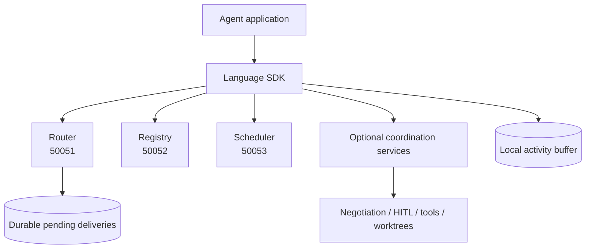
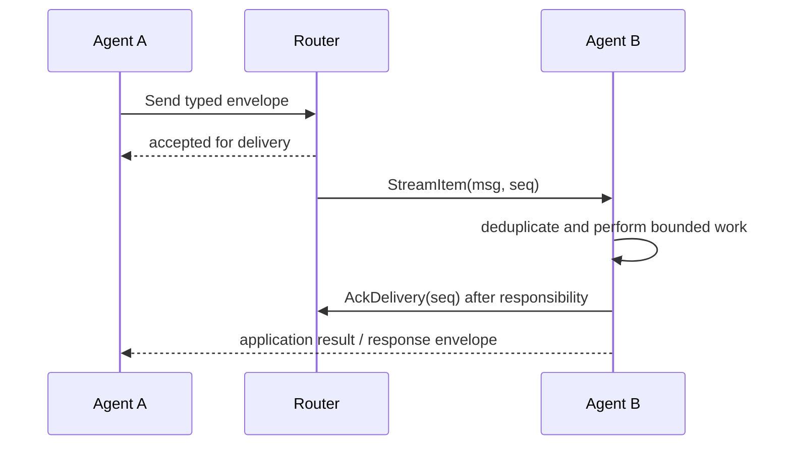

# SW4RM

A coordination protocol and SDK toolkit for independently implemented agents.
SW4RM describes messages, handoffs, review votes, and decisions, with Python
reference services for exercising those contracts.

**Published packages: 0.6.0. Development target: 0.7.0.** See
[release status and migration](release-status.md) before upgrading a consumer or
server. The new delivery contract requires explicit consumer acknowledgements.

SW4RM (pronounced “swarm”) is the coordination layer for agentic systems. It
defines the message envelope, service contracts, acknowledgement lifecycle, and
stateful coordination patterns that let independently implemented agents work
together. The protocol is transport-oriented: an SDK supplies language-native
helpers, while the application supplies business logic, authorization, and
external side-effect handling.

## Start here

- [Overview](overview.md): what SW4RM does and when it is useful.
- [Installation](quickstart/installation.md) and [first agent](quickstart/first-agent.md).
- [Implementation coverage](protocol/implementation.md): running services, SDK helpers, and gaps.
- [Protocol specification](protocol/spec.md) and [generated RPC reference](reference/release-contract.md).
- [Documentation maintenance](documentation-contract.md): how code, packages, and prose are checked together.

## What the protocol provides

- **Discovery:** Registry descriptors advertise stable agent identities and
  capabilities.
- **Routing:** Router delivery is durable until the receiving consumer records
  a delivery acknowledgement; unacknowledged rows may be redelivered.
- **Coordination:** Scheduler, negotiation, handoff, HITL, tool, and worktree
  clients expose explicit coordination boundaries.
- **State and recovery:** Activity buffers track message attempts, idempotency
  tokens, and application acknowledgement state.
- **Interoperability:** The shared protobuf schema allows clients written in
  Python, JavaScript/TypeScript, Rust, Common Lisp, and Elixir to exchange the
  same wire messages.

The protocol does not make arbitrary external effects exactly once. Consumers
must decide when work is complete, persist completion or use a downstream
idempotency key, and only then release the router delivery.

## Architecture at a glance

The reference Python services are useful for local development and protocol
experiments. [Implementation coverage](protocol/implementation.md) records
which services and persistence choices are actually shipped; the protocol
specification remains normative where a helper or backend is absent.

## SDKs

Python, JavaScript/TypeScript, Rust, Elixir, and Common Lisp have SDKs in this
repository. They target the shared wire schema while exposing language-native
APIs. Transport support, persistence backends, and validation results are recorded
per SDK; matching version numbers alone do not establish behavioral parity.

## Important boundaries

The reference router provides at-least-once delivery with consumer acknowledgements.
The application handles duplicate work and external side effects. The default
reference stack assumes a trusted deployment environment. See implementation
coverage for the requirements it does not enforce.

## Why SW4RM exists

An agent can be reliable inside its own process and still lose work at the
boundary to another process. SW4RM gives that boundary a shared shape: stable
identity, typed content, correlation, delivery ownership, explicit application
state, and a place to record recovery decisions. This remains useful when one
agent is Python, another is Rust or TypeScript, and their services restart or
upgrade independently.

The protocol is a coordination layer. It does not replace the application's
domain model, authorization system, database transaction, or observability
platform. The docs distinguish protocol requirements from reference-service
behavior so implementers can tell which guarantees must be preserved and which
choices can vary.

## The shortest useful mental model

The `seq` in the stream item belongs to Router delivery storage. The envelope's
`message_id` identifies the transmitted message, while its idempotency token
identifies the logical operation across retries. Keeping these identities
separate is the key to building a consumer that can recover without repeating
an unsafe external effect.

## A guided reading path

1. Read [Overview](overview.md) for the architecture and failure model.
2. Follow [Installation](quickstart/installation.md) and [Your First Agent](quickstart/first-agent.md).
3. Read [Messages](protocol/messages.md) and [Acknowledgements](protocol/acks.md)
   before implementing a custom producer or consumer.
4. Use [Implementation coverage](protocol/implementation.md) and [SDK parity](sdk-parity.md)
   to check which service and language features are actually available.
5. Use [Deployment Patterns](examples/deployment.md) after the local delivery
   and recovery behavior is understood.
