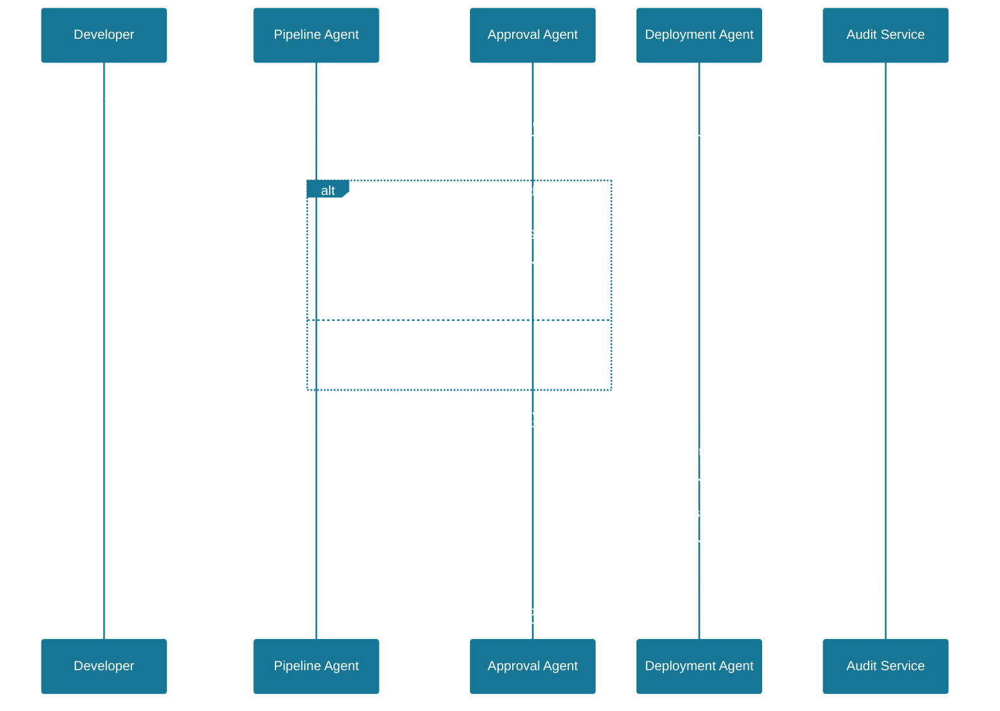
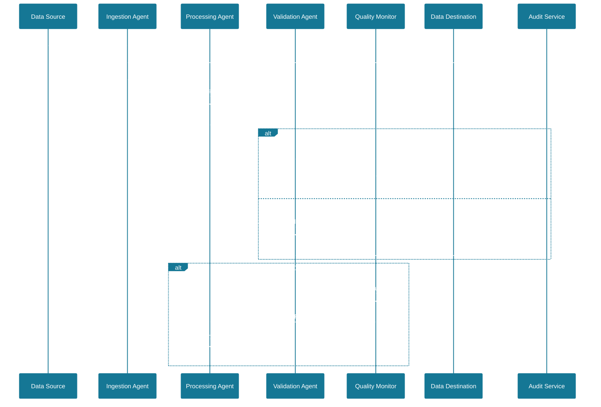
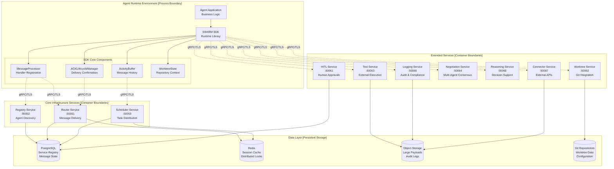

# 1. SW4RM Agentic Protocol

## 1.1. Overview and Motivation

Contemporary agentic systems lack standardized inter-process communication (IPC) mechanisms for agent-to-agent coordination. This architectural gap constrains system composability and operational efficiency. As a result, present capabilities and LLM engagement often suffer from context rot, sycophancy, and an inability to change course mid‑execution. Common symptoms include brittle long‑context prompting without stable correlation or deduplication, duplicate side effects on retry, weak interruption and scheduling controls, unreliable delivery confirmation and reconciliation, missing escalation paths for risky decisions, and poor observability and auditability.

Due to these reasons, the ability to achieve true autonomy remains limited, often necessitating human intervention. As agentic systems evolve toward true autonomy—where agents operate independently without human intervention and make complex decisions through agent-to-agent negotiation—the need for robust, standardized communication protocols becomes even more critical.

**Agents and Agentic Interaction**

An **Agent** is a process-isolated execution participant supervised by the **Scheduler**. Each agent has a stable `agent_id`, registers with the **Registry** (name, ≤200‑word description, declared capabilities, and **Communication Class**), and MAY run multiple instances subject to `max_parallel_instances` and concurrency policy. Agents exchange typed **Messages** over gRPC via the **Router**, using standardized message envelopes and acknowledgement lifecycles. Agents maintain an advisory **Activity Buffer** for in‑flight tasks, MAY bind to a **Worktree** for repository state, and implement cooperative preemption safe points so the Scheduler can orchestrate priority, ordering, and preemption.

**Agentic interaction** is the message‑driven coordination among Agents and core services (Registry, Router, Scheduler, HITL, Tool/Connector, Negotiation, Reasoning, Logging). Interactions are expressed as routed Messages that MUST carry `message_id`, `producer_id`, `correlation_id`, `sequence_number`, `retry_count`, `message_type`, and payload `content_type`/`content_length` when present, and MAY include `idempotency_token`, HLC timestamp, or `ttl_ms`. Messages follow the normative lifecycle `SENT → RECEIVED → ACKNOWLEDGED → READ → FULFILLED` with error outcomes (`REJECTED`, `FAILED`, `TIMED_OUT`, etc.). The Router enforces addressing and declared modalities; the Scheduler provides ordering, cooperative preemption, and HITL escalation; tools are invoked via the Tool service; inter‑agent decisions MAY use Negotiation and the **Reasoning Engine** for conflict assessment. Buffers and back‑pressure policies prevent overload, and idempotency semantics ensure exactly‑once effects where required.

Note on terminology: This definition intentionally departs from some prevailing industry usage of “agent,” which often refers to an LLM wrapper, autonomous script runner, or library-managed coroutine with implicit control flow. In this specification, an **Agent** is a supervised, process‑isolated participant with registry‑backed identity, explicit message lifecycles, cooperative preemption, and protocol‑level contracts for routing, acknowledgements, idempotency, and back‑pressure. “Agentic interaction” denotes this message‑routed, service‑mediated coordination rather than ad‑hoc tool invocation within a single runtime.

### 1.1.1. Communication Protocol Landscape Analysis

Modern day computing stack employs well-defined communication protocols at each abstraction layer: operating systems provide POSIX IPC primitives (pipes, shared memory, message queues, semaphores), the network layer standardizes TCP/IP and UDP with socket APIs, application protocols include HTTP/REST, gRPC, and GraphQL with defined message semantics, message brokers implement AMQP and MQTT specifications, and AI tool integration uses the Model Context Protocol (MCP) for LLM-tool communication.

**Agentic systems lack comprehensive standardization.** While protocols like MCP address specific use cases (tool integration), no universal standard exists for agent-to-agent communication, task scheduling, and message exchange between heterogeneous implementations, along with supporting capabilities like agent discovery and capability negotiation. SW4RM defines agent-to-agent communication more thoroughly than existing specifications like Google's A2A protocol (detailed comparison available in [Protocol Specification §3.9](protocol/index.md)).

### 1.1.2. Technical Implications

The absence of agent IPC standards produces several systemic effects:

**Interoperability Constraints**


- Agents developed using different frameworks cannot communicate directly
- Message formats and transport mechanisms remain framework-specific
- Multi-agentic systems cannot span implementation boundaries

**Development Inefficiency**


- IPC primitives are reimplemented across frameworks
- Message routing, acknowledgment protocols, and error handling lack reusable abstractions
- No standardized libraries for agent communication

**Operational Complexity**


- Monitoring and debugging requires framework-specific tooling
- Load balancing, failover, and scaling patterns vary by implementation
- No unified observability model for agent communications

**Enterprise Integration Limitations**


- agentic systems cannot leverage existing enterprise messaging infrastructure
- Security and authentication models are implementation-dependent
- Compliance and audit trails require custom solutions per framework

## 1.2. SW4RM: A Universal Agentic Protocol

SW4RM (pronounced "swarm") establishes the foundational protocol that enables agentic systems to operate with the same level of standardization and reliability as traditional distributed systems. Just as TCP provides reliable packet delivery and Linux provides process scheduling, SW4RM provides:


- **Standardized Message Protocols**: Guaranteed delivery semantics with explicit acknowledgment lifecycle
- **Agent Scheduling Framework**: Priority-based task ordering with cooperative preemption policies
- **Autonomous Decision-Making Support**: Built-in negotiation protocols enabling agents to resolve conflicts and make decisions independently without human intervention
- **Interoperability Standards**: Protocol-level compatibility enabling cross-framework agent communication
- **Production-Ready Infrastructure**: Enterprise-grade features including audit trails, state persistence, and security

SW4RM defines a standardized communication protocol for agentic systems, providing the architectural foundation for agent interoperability. The protocol establishes:


- **Service Discovery**: Registry-based agent discovery and capability advertisement
- **Message Envelope Format**: Structured message format with metadata and payload separation
- **Acknowledgment Protocol**: Reliable message delivery with confirmation semantics
- **Flow Control**: Backpressure mechanisms to prevent receiver overload
- **Error Handling**: Standardized error codes and recovery procedures

This protocol specification enables heterogeneous agent implementations to communicate using a common IPC layer, similar to how TCP/IP enables network interoperability across diverse systems.

SW4RM is an open agentic protocol for building resilient, distributed agentic systems that operate reliably in mission‑critical enterprise environments. It defines services, message envelopes, and ACK lifecycle semantics that enable robust, stateful, message‑driven architectures.

The protocol addresses the fundamental challenges inherent in distributed agentic systems — message loss, state corruption, coordination failures, autonomous decision-making, and operational complexity — while enabling developers to build truly autonomous agents that can negotiate, coordinate, and resolve conflicts independently without human intervention. A reference Python SDK implementation is available at [rahulrajaram/sw4rm/sdks/py_sdk](https://github.com/rahulrajaram/sw4rm/tree/master/sdks/py_sdk).

## 1.3. Technical Architecture Overview

SW4RM implements a **process-based architecture** where agents are independent processes that communicate through a central scheduler. The base case consists of multiple agent processes coordinating task execution and message exchange via standardized protocols. These are gRPC-based message formats, acknowledgment lifecycle, scheduling primitives, and negotiation protocols defined in the SW4RM specification. This architecture can scale from single-node deployments with local process communication to distributed microservices deployments across multiple hosts.

### 1.3.1. Core Architecture Components

The SW4RM ecosystem consists of three primary architectural layers:


1. **Agent Runtime Layer**: Client-side execution environment containing application-specific business logic, SW4RM SDK runtime libraries, and local state management (Activity Buffer, Worktree State Manager, ACK Lifecycle Manager)
2. **Core Services Layer**: Essential distributed infrastructure services providing message routing with delivery guarantees, centralized agent registry and discovery, and distributed task scheduling with preemption support
3. **Extended Services Layer**: Optional specialized services enabling human-in-the-loop workflows, Git repository context management, external tool execution, multi-agent negotiation, reasoning analytics, audit logging, and third-party API integration

<div class="diagram-container">

```kroki-graphviz
digraph G {
  graph [rankdir=TB, nodesep=0.45, ranksep=0.8, splines=spline, compound=true, margin=6];
  node  [shape=box, style="rounded,filled", fillcolor="white", color="#1f2937", fontsize=12, fontname="Inter,Helvetica,Arial,sans-serif"];
  edge  [color="#1f2937", arrowsize=0.7];

  subgraph cluster_runtime {
    label="Agent Runtime Environment"; labelloc=t; labeljust=l; color="#e5e7eb"; style=rounded;
    A   [label="Agent Application Code"];
    SDK [label="SW4RM SDK Runtime", fillcolor="#f9fafb"];
    AB  [label="Activity Buffer"];
    WS  [label="Worktree State Manager"];
    AL  [label="ACK Lifecycle Manager"];
    A -> SDK;
    SDK -> AB; SDK -> WS; SDK -> AL;
  }

  subgraph cluster_core {
    label="Core Infrastructure Services"; labelloc=t; labeljust=l; color="#e5e7eb"; style=rounded;
    CORE [label="Core Services", shape=ellipse, fillcolor="#f3f4f6"];
    R   [label="Registry Service\nPort: 50052"];
    RT  [label="Router Service\nPort: 50051"];
    SCH [label="Scheduler Service\nPort: 50053"];
    CORE -> R; CORE -> RT; CORE -> SCH;
  }

  subgraph cluster_ext {
    label="Extended Capability Services"; labelloc=t; labeljust=l; color="#e5e7eb"; style=rounded;
    EXT [label="Extended Services", shape=ellipse, fillcolor="#f3f4f6"];
    H   [label="Human-in-the-Loop\nPort: 50061"];
    WT  [label="Worktree Management\nPort: 50062"];
    T   [label="Tool Execution\nPort: 50063"];
    N   [label="Negotiation\nPort: 50064"];
    RS  [label="Reasoning\nPort: 50065"];
    L   [label="Logging & Audit\nPort: 50066"];
    C   [label="External Connector\nPort: 50067"];
    EXT -> H; EXT -> WT; EXT -> T; EXT -> N; EXT -> RS; EXT -> L; EXT -> C;
  }

  subgraph cluster_persistence {
    label="Persistence Layer"; labelloc=t; labeljust=l; color="#e5e7eb"; style=rounded;
    DB  [shape=ellipse, label="State Database", fillcolor="#f9fafb"];
    FS  [shape=ellipse, label="File System", fillcolor="#f9fafb"];
    OBJ [shape=ellipse, label="Object Storage", fillcolor="#f9fafb"];
  }

  // primary integration
  SDK -> CORE;
  SDK -> EXT;

  // persistence relations
  R -> DB; RT -> DB; SCH -> DB;
  WS -> FS; AB -> FS; T -> OBJ;
}
```
</div>

## 1.4. Enterprise Problem Resolution {#14-enterprise-problem-resolution}

**Enterprises lack standardized inter-process communication (IPC) mechanisms for agentic systems, resulting in ad-hoc implementations that fail under production conditions.** Traditional distributed agentic systems exhibit systemic failures when these inadequate IPC mechanisms encounter real-world operational challenges. Common failure modes include:


- **Message Loss**: Network partitions, service failures, and improper error handling result in lost messages and incomplete processing
- **State Corruption**: Lack of persistent state management leads to inconsistent system states after failures or restarts
- **Coordination Failures**: Absence of proper service discovery and consensus mechanisms causes agent conflicts and resource contention
- **Operational Blindness**: Insufficient observability makes debugging, monitoring, and performance optimization nearly impossible
- **Security Vulnerabilities**: Ad-hoc security implementations create attack vectors and compliance violations
- **Scalability Bottlenecks**: Monolithic architectures and shared state create performance limitations and single points of failure

SW4RM addresses these enterprise challenges through systematic architectural solutions:

### 1.4.1. Guaranteed Message Delivery Semantics

**At-Least-Once Delivery Guarantee**: SW4RM implements a comprehensive message delivery assurance system based on distributed consensus protocols and persistent message queuing. This guarantee is essential in distributed agentic systems where network partitions, service crashes, container restarts, and infrastructure failures are inevitable. Without delivery guarantees, agents lose critical task assignments, coordination messages, and state synchronization updates, leading to inconsistent system behavior and incomplete workflows. At-least-once semantics ensure that even under adverse conditions—network timeouts, receiver overload, or temporary service unavailability—messages will eventually reach their intended recipients and be processed.

**Technical Specifications**:


- **Message Persistence**: All messages are durably written to persistent storage before acknowledgment

- **Retry Policy**: Exponential backoff retry mechanism with configurable parameters (initial delay: 100ms, maximum delay: 30s, maximum attempts: 10)

- **Dead Letter Queue**: Failed messages are automatically routed to dead letter queues after exhausting retry attempts

- **Delivery Timeout**: Configurable message TTL with automatic cleanup (default: 24 hours)

- **Duplicate Detection**: Idempotency tokens prevent duplicate message processing during retry scenarios

### 1.4.2. Persistent State Management Architecture {#142-persistent-state-management-architecture}

**Multi-Level State Persistence**: SW4RM provides comprehensive state management across multiple persistence domains with different consistency and performance characteristics.

**State Management Components**:


1. **Activity Buffer State**: Maintains persistent message processing history and enables crash recovery through durable transaction logs
   - **Storage Backend**: File-based JSON persistence implements atomic write operations using write-ahead logging to prevent state corruption during system failures
   - **Reconciliation**: Automatic state reconciliation on startup employs vector clocks to resolve message ordering conflicts and ensure consistent state recovery across agent restarts
   - **Retention Policy**: Configurable retention periods control storage lifecycle with automatic cleanup of expired entries to prevent unbounded disk usage growth

2. **Worktree State**: Manages repository context bindings and file system state through persistent workspace tracking and Git repository integration
   - **Git Integration**: Deep integration with Git repositories provides native access to repository metadata, branch tracking, and commit history for context-aware agent operations
   - **Isolation**: Workspace isolation provides secure multi-tenant repository access without cross-contamination between different agent workspaces
   - **Synchronization**: Automatic synchronization with remote repositories maintains local workspace consistency through background fetch operations and conflict-aware merge strategies
   - **Conflict Resolution**: Merge strategies with manual override capabilities enable agents to resolve repository conflicts autonomously or escalate complex scenarios to human oversight

3. **Agent Configuration State**: Persistent configuration management with comprehensive versioning and validation capabilities for runtime adaptability
   - **Schema Validation**: JSON Schema-based configuration validation ensures type safety and structural integrity while preventing invalid configurations from corrupting agent behavior
   - **Hot Reloading**: Runtime configuration updates without service restart provide dynamic behavior modification capabilities through configuration change detection and seamless state transitions
   - **Rollback Support**: Configuration history with automatic rollback capabilities maintains complete audit trails and enables rapid recovery from configuration errors through versioned snapshots

### 1.4.3. Multi-Agent Coordination Framework

**Service Discovery and Registry**: Centralized agent registry with health monitoring and capability advertisement.

**Technical Implementation**:


- **Health Checks**: Configurable health check intervals implement heartbeat monitoring with exponential backoff detection to identify failing agents before they impact system performance and trigger graceful degradation procedures
- **Capability Matching**: Agent registration with semantic capability matching provides structured capability descriptors and ontology-based reasoning to automatically route tasks to agents with appropriate skills and resource availability
- **Load Balancing**: Multiple load balancing strategies including round-robin, weighted distribution, and least-connections algorithms provide adaptive traffic distribution capabilities based on real-time agent performance metrics and capacity utilization
- **Failover**: Automatic failover provisions with configurable timeout thresholds provide agent failure detection capabilities and traffic redirection to healthy instances while maintaining message delivery guarantees

**Autonomous Conflict Resolution**: Built-in conflict detection and resolution mechanisms that enable agents to negotiate and resolve resource contention scenarios independently. As agents become truly autonomous, they must handle conflicts without human oversight, making distributed consensus and automated negotiation protocols essential for system reliability.

### 1.4.4. Production Observability Suite

**Distributed Tracing**: OpenTelemetry-compliant distributed tracing with complete request lifecycle visibility.

**Metrics Collection**: Comprehensive metrics collection covering:

- Message processing rates and latencies
- Resource utilization (CPU, memory, network, storage)
- Error rates and failure classifications
- Business-level metrics (custom metrics support)

**Audit Logging**: Immutable audit logs for compliance and security monitoring:

- All message transactions with full payload logging (configurable)
- State changes and configuration modifications
- Authentication and authorization events
- System lifecycle events (startup, shutdown, configuration changes)

### 1.4.5. Multi-Agent System Coordination

**Coordination Challenges Addressed**:


- **Resource Contention**: Distributed locking and resource allocation mechanisms prevent conflicts when multiple agents compete for shared resources, ensuring safe concurrent access through lease-based coordination protocols.
- **Load Balancing**: Dynamic load balancing distributes workload across available agents based on real-time capability assessment and current resource utilization to optimize system performance and prevent agent overload.
- **Failure Detection**: Rapid failure detection mechanisms identify non-responsive agents through configurable heartbeat monitoring and automatically trigger failover procedures to maintain system availability.
- **Consensus Building**: Distributed consensus protocols enable multi-agent decision making through voting mechanisms and conflict resolution strategies that ensure consistent system behavior across agent populations.

**Technical Implementation**:


- **Service Mesh Integration**: Native integration with service mesh architectures provides traffic management, security policies, and observability features while maintaining protocol compatibility with existing infrastructure.
- **Load Balancing Algorithms**: Multiple load balancing algorithms including consistent hashing, weighted distribution, and connection-based routing provide flexible traffic distribution strategies based on deployment requirements.
- **Health Check Protocols**: Configurable health check strategies implement exponential backoff and adaptive timeout mechanisms to balance system responsiveness with resource efficiency during monitoring operations.
- **Circuit Breaker Patterns**: Automatic circuit breaking mechanisms detect cascading failure patterns and temporarily isolate failing components to prevent system-wide degradation and enable graceful recovery.

**Coordination Protocols**:


- **Leader Election**: Distributed leader election protocols establish coordinated decision-making authority among agent groups while providing automatic leadership transfer during node failures or network partitions.
- **Distributed Locking**: Distributed lock management provides exclusive resource access through lease-based mechanisms with automatic expiration and renewal capabilities to prevent deadlock scenarios.
- **Message Ordering**: Guaranteed message ordering within conversation contexts maintains causal consistency through sequence numbering and acknowledgment protocols that preserve logical dependencies.
- **Conflict Resolution**: Automated conflict detection and resolution strategies identify resource contention scenarios and apply configurable resolution policies including priority-based arbitration and consensus-based negotiation.

### 1.4.6. Human-in-the-Loop (HITL) Integration

**Enterprise HITL Requirements**:


- **Role-Based Approvals**: Complex organizational approval hierarchies are supported through configurable role mappings and delegation chains that accommodate enterprise organizational structures and authority models.
- **Timeout Management**: Configurable timeout policies implement automatic escalation strategies that prevent workflow stalls while respecting organizational approval timeframes and emergency override procedures.
- **Audit Trail**: Complete audit trails capture all human intervention activities including decision rationale, timing information, and approval chain progression for compliance and forensic analysis requirements.
- **Integration Capabilities**: Native integration with enterprise identity providers and workflow systems enables seamless incorporation of existing organizational processes and authentication infrastructure.

**Approval Workflow Engine**:


- **Multi-Stage Approvals**: Complex multi-stage approval workflows support sequential and parallel approval patterns with conditional branching based on request attributes and organizational policies.
- **Conditional Logic**: Rule-based approval routing evaluates request context including risk assessment, financial thresholds, and content sensitivity to automatically determine appropriate approval paths and authority levels.
- **Delegation Support**: Approval delegation capabilities maintain full audit logging while enabling temporary authority transfer during organizational changes or absence scenarios.
- **Mobile Integration**: Mobile-friendly approval interfaces provide responsive design and push notification capabilities to ensure timely decision-making regardless of approver location or device.

**Security and Compliance**:


- **Authentication Integration**: Enterprise authentication protocols including SAML, OAuth 2.0, and OpenID Connect ensure secure identity verification while maintaining compatibility with existing organizational security infrastructure.
- **Authorization Controls**: Fine-grained role-based access control with policy-based authorization engines provide granular permission management and dynamic access control based on contextual factors.
- **Encryption**: End-to-end encryption protects sensitive approval requests throughout the workflow lifecycle using industry-standard cryptographic protocols and key management practices.
- **Compliance Reporting**: Automated compliance reporting generates detailed audit reports for regulatory requirements including approval timelines, decision rationale, and policy adherence metrics.

## 1.5. Enterprise Use Case Implementations {#15-enterprise-use-case-implementations}

SW4RM provides specialized implementations for complex enterprise scenarios that require reliable, stateful, and coordinated agentic systems. Each use case demonstrates the SDK's capability to handle specific enterprise requirements including fault tolerance, compliance, security, and operational excellence.

### 1.5.1. Example 1: DevOps Automation and Infrastructure Orchestration

**Technical Implementation Requirements**:


- **Pipeline State Persistence**: SW4RM maintains complete pipeline execution state through persistent activity buffers that survive infrastructure failures and enable seamless recovery from any checkpoint in the deployment process.
- **Approval Workflow Integration**: The system provides configurable approval chains with timeout handling and automatic escalation to ensure deployment workflows can navigate complex organizational approval hierarchies without manual intervention.
- **Git Repository Integration**: Deep integration with version control systems enables automatic artifact management, branch tracking, and deployment synchronization through the worktree service's repository binding capabilities.
- **Compliance Logging**: Comprehensive audit trails capture all deployment activities with immutable logging to support regulatory compliance requirements across multiple frameworks including financial services and healthcare standards.

**Architecture Pattern**:


**Key Features**:


- **Infrastructure as Code Integration**: Native integration with infrastructure management tools enables agents to execute Terraform plans, Ansible playbooks, and Kubernetes deployments while maintaining full state tracking and rollback capabilities.
- **Blue/Green Deployment Support**: Automated blue/green deployment patterns provide zero-downtime deployments with intelligent traffic switching and automated rollback capabilities based on health checks and performance metrics.
- **Canary Release Management**: Progressive rollout strategies enable controlled release deployments with automated monitoring of key performance indicators and automatic rollback triggers when anomalies are detected.
- **Multi-Environment Orchestration**: Coordinated deployments across multiple environments ensure consistent application delivery through environment-specific configuration management and dependency orchestration.
- **Compliance Automation**: Automated compliance checks integrate policy validation directly into deployment pipelines with comprehensive reporting capabilities for audit requirements and regulatory frameworks.

### 1.5.2. Example 2: Data Processing and ETL Pipeline Management

**Technical Requirements**:


- **Checkpoint-Based Recovery**: Fine-grained checkpointing capabilities enable data processing agents to resume operations from specific points in large-scale processing pipelines, minimizing data reprocessing overhead during recovery scenarios.
- **Data Lineage Tracking**: Complete data lineage tracking maintains detailed provenance records from source to destination, enabling compliance reporting and impact analysis for data governance requirements.
- **Schema Evolution Support**: Dynamic schema evolution handling allows processing pipelines to adapt to structural changes in streaming data sources without pipeline interruption or data loss.
- **Quality Monitoring**: Real-time data quality monitoring provides continuous validation of data integrity with automated alerting when quality thresholds are violated or anomalies are detected.

**Processing Architecture**:


- **Stream Processing**: Integration capabilities with distributed streaming platforms enable agents to consume, process, and produce streaming data while maintaining exactly-once processing semantics and fault tolerance.
- **Batch Processing**: Support for distributed batch processing frameworks allows agents to coordinate large-scale data transformations with automatic resource allocation and job dependency management.
- **Data Validation**: Comprehensive data validation encompasses schema validation, data quality checks, and statistical anomaly detection with configurable validation rules and error handling policies.
- **Error Handling**: Robust error handling mechanisms include dead letter queues for problematic records, error classification systems, and configurable retry strategies with exponential backoff patterns.

**Architecture Pattern**:


<div class="grid cards" markdown>


-   :material-rocket-launch:{ .lg .middle } **Quick Start**

    ---

    Get up and running with your first agent in 5 minutes

    [:octicons-arrow-right-24: Get Started](quickstart/index.md)


-   :material-file-document-outline:{ .lg .middle } **Protocol Spec**

    ---

    Complete protocol specification and service architecture

    [:octicons-arrow-right-24: View Spec](protocol/index.md)


-   :material-code-braces:{ .lg .middle } **Examples**

    ---

    Comprehensive examples from basic to advanced agents

    [:octicons-arrow-right-24: View Examples](examples/index.md)


-   :material-architecture:{ .lg .middle } **Architecture**

    ---

    Deep dive into SDK architecture and design patterns

    [:octicons-arrow-right-24: Learn More](architecture/index.md)

</div>

## 1.6. Considerations and Trade-offs {#16-technical-differentiators-and-competitive-analysis}

This section previously included comparative and performance-oriented content. To avoid implying guarantees, it has been condensed to focus on qualitative architectural choices and trade-offs. Quantitative performance varies by workload, environment, and configuration.

## 1.7. Detailed System Architecture {#17-detailed-system-architecture}

SW4RM SDK implements a **microservices architecture** with clearly defined service boundaries, standardized communication protocols, and comprehensive fault tolerance mechanisms. The architecture supports horizontal scaling, multi-tenancy, and zero-downtime deployments.

### 1.7.1. Service Communication Architecture



### 1.7.2. Architectural Design Principles

**1. Message-Driven Communication Protocol**:


- **Asynchronous Message Passing**: All inter-service communication uses asynchronous message passing with explicit acknowledgment
- **Message Ordering Guarantees**: FIFO ordering within conversation contexts with vector clock synchronization
- **Delivery Semantics**: Configurable delivery guarantees (at-most-once, at-least-once, exactly-once)
- **Protocol Buffers**: Type-safe message serialization with forward/backward compatibility
- **Transport Security**: Mutual TLS (mTLS) for all service-to-service communication

**2. Fault Tolerance and Resilience**:


- **Circuit Breaker Pattern**: Automatic circuit breaking with exponential backoff and jitter
- **Bulkhead Isolation**: Resource isolation between different agent workloads
- **Graceful Degradation**: Configurable degraded mode operation during partial service failures
- **Health Check Protocols**: Comprehensive health checking with custom health indicators
- **Automatic Recovery**: Self-healing capabilities with configurable recovery policies

**3. Scalability**:


- **Horizontal Scaling**: Scale stateless services via additional replicas; design stateful components with HA backends
- **Caching Strategy**: Use caching where appropriate with explicit TTL and invalidation policies
- **Connection Management**: Configure connection pooling and keepalives per deployment needs
- **Load Balancing**: Employ health-aware routing where supported

**4. Security and Compliance**:


- **Zero-Trust Architecture**: All service interactions require authentication and authorization
- **Encryption at Rest**: AES-256 encryption for all persistent data
- **Encryption in Transit**: TLS 1.3 for all network communication
- **Audit Logging**: Immutable audit logs with cryptographic integrity verification
- **Access Control**: Role-based access control (RBAC) with fine-grained permissions

### 1.7.3. Service Deployment Topology

**Single-Node Development Deployment**:


- All services deployed as containers on single host
- Shared PostgreSQL and Redis instances
- Local file system for worktree storage
- Suitable for development and testing environments

**Multi-Node Production Deployment**:


- Services distributed across multiple availability zones
- Dedicated database clusters with replication
- Distributed object storage for large payloads
- Container orchestration with Kubernetes
- Service mesh integration (Istio/Linkerd) for observability

## 1.8. Production-Ready Implementation Guide

### 1.8.1. Comprehensive Installation and Configuration

=== "Enterprise Installation"

    **System Requirements**:

    - Python 3.9+ (3.11+ recommended)
    - 4+ GB RAM (8+ GB recommended for production workloads)
    - 2+ CPU cores (4+ cores recommended)
    - 10+ GB disk space for persistent state and logs
    - Network connectivity for gRPC communication (ports 50051-50067)

    ```bash
    # Create isolated environment for security
    python -m venv sw4rm-env
    source sw4rm-env/bin/activate
    
    # Install with all production dependencies
    pip install sw4rm-sdk[production,monitoring,security]
    
    # Generate protocol buffer stubs for type safety
    sw4rm generate-stubs
    
    # Validate installation with diagnostic checks
    sw4rm doctor --comprehensive
    ```

=== "Production Agent Implementation"

    **Complete Agent with Error Handling and Observability**:

    ```python
    import logging
    import signal
    import sys
    import time
    from dataclasses import dataclass, field
    from typing import Any, Dict

    import grpc

    from sw4rm import constants as C
    from sw4rm.ack_integration import ACKLifecycleManager, MessageProcessor
    from sw4rm.activity_buffer import PersistentActivityBuffer
    from sw4rm.clients.registry import RegistryClient
    from sw4rm.clients.router import RouterClient
    from sw4rm.config import Endpoints
    from sw4rm.exceptions import ValidationError
    from sw4rm.metrics import InMemoryMetricsCollector, MetricName
    from sw4rm.worktree_state import PersistentWorktreeState


    @dataclass
    class AgentConfiguration:
        """Application-level configuration with validation."""
        agent_id: str
        capabilities: list[str]
        endpoints: Endpoints = field(default_factory=Endpoints)
        log_level: str = "INFO"
        enable_metrics: bool = True

        def validate(self) -> None:
            if not self.agent_id or len(self.agent_id) < 3:
                raise ValidationError(
                    "agent_id must be at least 3 characters",
                    field="agent_id",
                    constraint="len(agent_id) >= 3",
                )


    class ProductionDataProcessingAgent:
        """Production-ready agent composed from core SDK primitives."""

        def __init__(self, config: AgentConfiguration):
            self.config = config
            self.config.validate()

            self._setup_logging()
            self.logger = logging.getLogger(__name__)

            router_ch = grpc.insecure_channel(config.endpoints.router_addr)
            registry_ch = grpc.insecure_channel(config.endpoints.registry_addr)

            self.router = RouterClient(router_ch)
            self.registry = RegistryClient(registry_ch)
            self.buffer = PersistentActivityBuffer(max_items=2000)
            self.ack_manager = ACKLifecycleManager(
                router_client=self.router,
                activity_buffer=self.buffer,
                agent_id=config.agent_id,
            )
            self.processor = MessageProcessor(self.ack_manager)
            self.worktree_state = PersistentWorktreeState()
            self.metrics = InMemoryMetricsCollector() if config.enable_metrics else None

            self._register_handlers()
            signal.signal(signal.SIGTERM, self._handle_shutdown)
            signal.signal(signal.SIGINT, self._handle_shutdown)

        def _setup_logging(self) -> None:
            logging.basicConfig(
                level=getattr(logging, self.config.log_level.upper()),
                format="%(asctime)s - %(name)s - %(levelname)s - %(message)s",
                handlers=[
                    logging.StreamHandler(sys.stdout),
                    logging.FileHandler(f"/var/log/sw4rm/{self.config.agent_id}.log"),
                ],
            )

        def _register_handlers(self) -> None:
            self.processor.register_handler(C.DATA, self.handle_data)
            self.processor.set_default_handler(self.handle_unknown)

        def handle_data(self, envelope: Dict[str, Any]) -> Dict[str, Any]:
            start = time.time()
            payload = envelope.get("payload", b"")

            self.logger.info(
                "Processing payload",
                extra={"bytes": len(payload), "agent_id": self.config.agent_id},
            )

            result = {
                "status": "processed",
                "payload_bytes": len(payload),
                "agent_id": self.config.agent_id,
            }

            if self.metrics:
                self.metrics.record_histogram(
                    MetricName.PROCESS_TIME_SECONDS,
                    time.time() - start,
                    labels={"agent_id": self.config.agent_id},
                )

            return result

        def handle_unknown(self, envelope: Dict[str, Any]) -> Dict[str, Any]:
            return {
                "status": "ignored",
                "message_type": envelope.get("message_type"),
            }

        def register(self) -> bool:
            descriptor = {
                "agent_id": self.config.agent_id,
                "name": "production-agent",
                "description": "Production data processor",
                "capabilities": self.config.capabilities,
                "communication_class": C.STANDARD,
                "modalities_supported": ["application/json"],
            }
            response = self.registry.register(descriptor)
            return getattr(response, "accepted", False)

        def run(self) -> None:
            for item in self.router.stream_incoming(self.config.agent_id):
                envelope_msg = getattr(item, "msg", item)
                envelope = {
                    "message_id": getattr(envelope_msg, "message_id", ""),
                    "message_type": getattr(envelope_msg, "message_type", 0),
                    "content_type": getattr(envelope_msg, "content_type", ""),
                    "payload": getattr(envelope_msg, "payload", b""),
                    "producer_id": getattr(envelope_msg, "producer_id", ""),
                }
                self.processor.process_message(envelope)

        def _handle_shutdown(self, *_: Any) -> None:
            self.logger.info("Shutdown requested")
            self.buffer.flush()
    ```

=== "Container Deployment"

    **Production Docker Deployment with Service Dependencies**:

    ```yaml
    # docker-compose.production.yml
    version: '3.8'
    
    services:
      # Core Infrastructure Services
      sw4rm-registry:
        image: sw4rm/registry:latest
        ports:
          - "50052:50052"
        environment:
          - POSTGRES_HOST=postgres
          - POSTGRES_DB=sw4rm_registry
          - POSTGRES_USER=sw4rm
          - POSTGRES_PASSWORD=${POSTGRES_PASSWORD}
          - LOG_LEVEL=INFO
          - ENABLE_TLS=true
          - TLS_CERT_PATH=/certs/server.crt
          - TLS_KEY_PATH=/certs/server.key
        volumes:
          - ./certs:/certs:ro
          - registry_logs:/var/log/sw4rm
        depends_on:
          - postgres
          - redis
        healthcheck:
          test: ["CMD", "grpc_health_probe", "-addr=:50052"]
          interval: 30s
          timeout: 10s
          retries: 3
          start_period: 60s
    
      sw4rm-router:
        image: sw4rm/router:latest
        ports:
          - "50051:50051"
        environment:
          - POSTGRES_HOST=postgres
          - REDIS_HOST=redis
          - REGISTRY_HOST=sw4rm-registry:50052
          - MAX_MESSAGE_SIZE_MB=16
          - MESSAGE_TTL_HOURS=24
          - ENABLE_COMPRESSION=true
        volumes:
          - ./certs:/certs:ro
          - router_logs:/var/log/sw4rm
        depends_on:
          - postgres
          - redis
          - sw4rm-registry
        healthcheck:
          test: ["CMD", "grpc_health_probe", "-addr=:50051"]
          interval: 30s
          timeout: 10s
          retries: 3

      # Your Production Agent
      data-processing-agent:
        build:
          context: .
          dockerfile: Dockerfile.agent
        environment:
          - SW4RM_REGISTRY_HOST=sw4rm-registry:50052
          - SW4RM_ROUTER_HOST=sw4rm-router:50051
          - POSTGRES_HOST=postgres
          - REDIS_HOST=redis
          - AGENT_ID=data-processor-prod-001
          - LOG_LEVEL=INFO
          - ENABLE_METRICS=true
          - ENABLE_TLS=true
        volumes:
          - ./certs:/certs:ro
          - agent_logs:/var/log/sw4rm
          - agent_data:/var/lib/sw4rm
        depends_on:
          - sw4rm-registry
          - sw4rm-router
        deploy:
          replicas: 3
          resources:
            limits:
              cpus: '2.0'
              memory: 4G
            reservations:
              cpus: '1.0'
              memory: 2G
        healthcheck:
          test: ["CMD", "curl", "-f", "http://localhost:8080/health"]
          interval: 30s
          timeout: 10s
          retries: 3
    
      # Infrastructure Dependencies
      postgres:
        image: postgres:15-alpine
        environment:
          - POSTGRES_DB=sw4rm
          - POSTGRES_USER=sw4rm
          - POSTGRES_PASSWORD=${POSTGRES_PASSWORD}
          - POSTGRES_INITDB_ARGS=--auth-host=scram-sha-256
        volumes:
          - postgres_data:/var/lib/postgresql/data
          - ./init-scripts:/docker-entrypoint-initdb.d:ro
        healthcheck:
          test: ["CMD-SHELL", "pg_isready -U sw4rm"]
          interval: 30s
          timeout: 10s
          retries: 5
    
      redis:
        image: redis:7-alpine
        command: redis-server --requirepass ${REDIS_PASSWORD} --maxmemory 2gb --maxmemory-policy allkeys-lru
        volumes:
          - redis_data:/data
        healthcheck:
          test: ["CMD", "redis-cli", "ping"]
          interval: 30s
          timeout: 10s
          retries: 3
    
      # Monitoring and Observability
      prometheus:
        image: prom/prometheus:latest
        ports:
          - "9090:9090"
        volumes:
          - ./monitoring/prometheus.yml:/etc/prometheus/prometheus.yml:ro
          - prometheus_data:/prometheus
    
      grafana:
        image: grafana/grafana:latest
        ports:
          - "3000:3000"
        environment:
          - GF_SECURITY_ADMIN_PASSWORD=${GRAFANA_PASSWORD}
        volumes:
          - grafana_data:/var/lib/grafana
          - ./monitoring/grafana:/etc/grafana/provisioning:ro
    
    volumes:
      postgres_data:
      redis_data:
      prometheus_data:
      grafana_data:
      registry_logs:
      router_logs:
      agent_logs:
      agent_data:
    
    networks:
      default:
        driver: bridge
        ipam:
          config:
            - subnet: 172.20.0.0/16
    ```

    **Agent Dockerfile**:
    ```dockerfile
    # Dockerfile.agent
    FROM python:3.11-slim
    
    # Install system dependencies
    RUN apt-get update && apt-get install -y \
        git \
        curl \
        ca-certificates \
        && rm -rf /var/lib/apt/lists/*
    
    # Create non-root user for security
    RUN groupadd -r sw4rm && useradd -r -g sw4rm sw4rm
    
    # Set working directory
    WORKDIR /app
    
    # Copy requirements and install dependencies
    COPY requirements.txt .
    RUN pip install --no-cache-dir -r requirements.txt
    
    # Copy application code
    COPY . .
    
    # Create necessary directories
    RUN mkdir -p /var/log/sw4rm /var/lib/sw4rm && \
        chown -R sw4rm:sw4rm /var/log/sw4rm /var/lib/sw4rm /app
    
    # Switch to non-root user
    USER sw4rm
    
    # Expose health check port
    EXPOSE 8080
    
    # Health check endpoint
    HEALTHCHECK --interval=30s --timeout=10s --start-period=60s --retries=3 \
        CMD curl -f http://localhost:8080/health || exit 1
    
    # Start agent
    CMD ["python", "production_agent.py"]
    ```
    
    **Deployment Commands**:
    ```bash
    # Set environment variables
    export POSTGRES_PASSWORD=$(openssl rand -base64 32)
    export REDIS_PASSWORD=$(openssl rand -base64 32)
    export GRAFANA_PASSWORD=$(openssl rand -base64 32)
    
    # Start services in production mode
    docker-compose -f docker-compose.production.yml up -d
    
    # Monitor deployment
    docker-compose -f docker-compose.production.yml logs -f
    
    # Verify service health
    docker-compose -f docker-compose.production.yml ps
    ```

## 1.9. Real-World Example: DevOps Pipeline

```python
import grpc
import json

from sw4rm import constants as C
from sw4rm.ack_integration import ACKLifecycleManager, MessageProcessor
from sw4rm.activity_buffer import PersistentActivityBuffer
from sw4rm.clients.hitl import HitlClient
from sw4rm.clients.router import RouterClient
from sw4rm.clients.tool import ToolClient
from sw4rm.clients.worktree import WorktreeClient

router = RouterClient(grpc.insecure_channel("localhost:50051"))
hitl = HitlClient(grpc.insecure_channel("localhost:50060"))
tool = ToolClient(grpc.insecure_channel("localhost:50063"))
worktree = WorktreeClient(grpc.insecure_channel("localhost:50062"))

ack_manager = ACKLifecycleManager(
    router_client=router,
    activity_buffer=PersistentActivityBuffer(),
    agent_id="devops-pipeline",
)
processor = MessageProcessor(ack_manager)


def handle_deploy(envelope):
    payload = json.loads(envelope.get("payload", b"{}").decode())
    app = payload["application"]
    env = payload["environment"]

    if env == "production":
        decision = hitl.decide({
            "correlation_id": envelope.get("correlation_id", ""),
            "reason_type": "deployment",
            "context": payload,
            "options": ["approve", "reject"],
        })
        if not getattr(decision, "approved", False):
            return {"status": "rejected", "reason": getattr(decision, "reason", "")}

    worktree.bind("devops-pipeline", app["repo"], payload["worktree_id"])
    result = tool.call({
        "call_id": payload.get("call_id", "deploy-1"),
        "tool_name": "kubectl",
        "provider_id": "default",
        "args": ["apply", "-f", f"{app['k8s_path']}/{env}/"],
    })
    return {"status": "deployed", "tool_status": getattr(result, "status", "ok")}


processor.register_handler(C.DATA, handle_deploy)
```

**This 30-line agent provides:**


- Persistent state across restarts
- Human approval workflows  
- Repository context management
- External tool execution
- Automatic error handling and retry
- Complete audit trail

## 1.10. Next Steps

<div class="grid" markdown>

<div markdown>
**New to SW4RM?**


Start with our quickstart guide to build your first agent in minutes.

[Get Started :material-arrow-right:](quickstart/index.md){ .md-button .md-button--primary }
</div>

<div markdown>
**Ready for Production?**


Check out our advanced examples and production deployment guides.

[View Examples :material-arrow-right:](examples/index.md){ .md-button }
</div>

</div>
