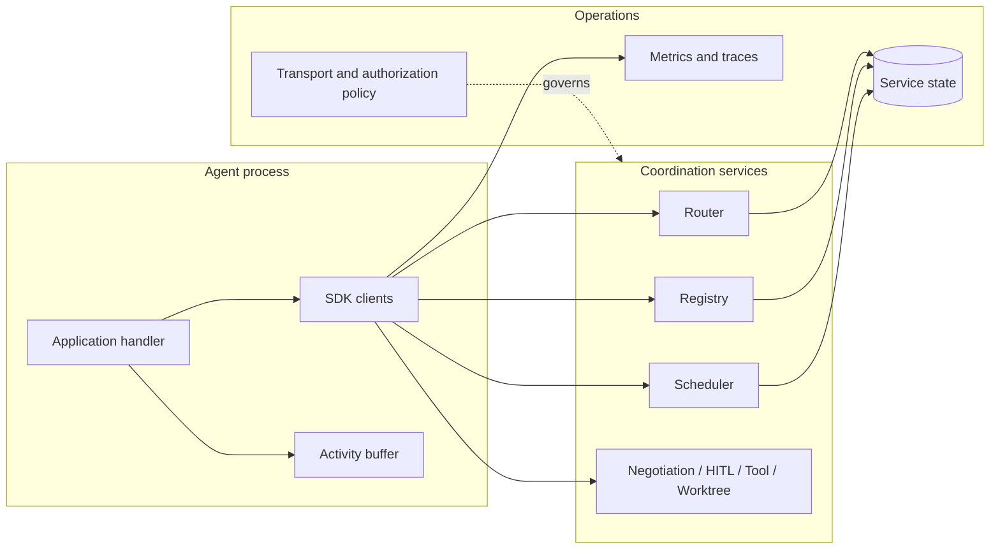
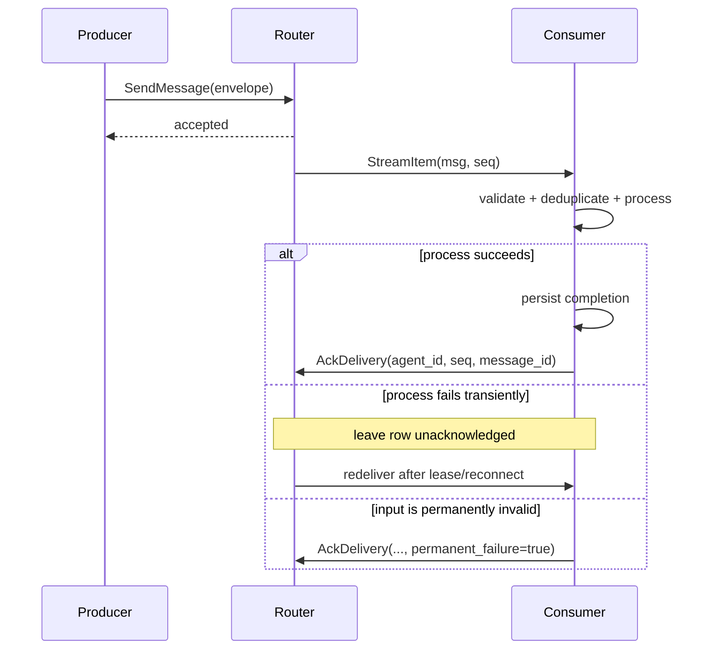

# 1. SW4RM Agentic Protocol

SW4RM defines messages and coordination rules for agents implemented in different
languages. This repository supplies five SDKs and a Python reference stack for
registration, routing, scheduling, and negotiation-room state.

The next release target is 0.7.0; published packages remain 0.6.0. Read
[release status and migration](release-status.md) before mixing SDK and server
versions.

## 1.1 When it is useful

Use SW4RM when independently implemented agents need explicit handoffs, review
votes, decision policies, or a shared message contract. Agents can use any model
or runtime; the application implements the work and starts the required services.
A single model call or a simple in-process workflow usually needs less machinery.

## 1.2 What runs

The Python Registry tracks agents. The Router persists pending deliveries and
retains them until the recipient acknowledges them. The Scheduler provides task
and preemption operations. A separate NegotiationRoom service stores proposals,
votes, and decisions. The A2A gateway exposes a subset of external task operations.
See [implementation coverage](protocol/implementation.md) for service boundaries.

A receiving agent keeps the delivery sequence, processes the message, records
completion if needed, and acknowledges delivery. A crash before acknowledgement
allows redelivery. Applications must handle duplicates; a message transport
cannot make an arbitrary external action atomic with its completion record.

```mermaid
sequenceDiagram
    autonumber
    participant P as Producer
    participant R as Router
    participant C as Consumer
    P->>R: SendMessage (Envelope)
    R->>C: StreamItem (seq)
    note over C: process message,<br/>record completion if needed
    alt crash before acknowledgement
        note over R,C: pending row retained;<br/>redelivered after lease expiry or reconnect
        R->>C: StreamItem (seq) — redelivery
    end
    C->>R: AckDelivery (agent_id, seq)
    R-->>C: recorded=true — pending row released
```

## 1.3 Coordination concepts

| Concept | Responsibility |
|---|---|
| Envelope | Message identity, producer, content, correlation, optional idempotency token |
| Delivery acknowledgement | Release one router pending row after the consumer takes responsibility |
| Application acknowledgement | Report received/read/fulfilled/rejected/failed/timed-out processing state |
| Negotiation room | Associate a proposal, critic votes, and a decision |
| Quorum policy | Decide whether sufficient distinct critics responded and what to do otherwise |
| Handoff | Describe work and context transferred between agents |
| Activity buffer | Track local message state and optional persisted deduplication records |

These concepts do not confer permissions. A review result is evidence an
application can use; the component performing an effect still checks authority.

## 1.4 Operating limits

The reference deployment assumes a trusted environment and local persistent
storage. It does not implement replicated consensus, automatic multi-host
failover, universal scheduling guarantees, or configurable exactly-once effects.
The SDKs provide different language-native helpers and persistence formats.
Protocol requirements and extension drafts are broader than shipped backends.

## 1.5 Where to start

- [Installation](quickstart/installation.md): choose published packages or a source checkout.
- [First agent](quickstart/first-agent.md): receive, process, and acknowledge a message.
- [Router API](clients/router.md): delivery and acknowledgement behavior.
- [Protocol specification](protocol/spec.md): normative requirements.
- [Generated RPC reference](reference/release-contract.md): actual wire methods and versions.

## 1.6 What an agent means in SW4RM

An Agent is a supervised, process-isolated participant with a stable
`agent_id`. It registers a descriptor containing its name, description,
capabilities, communication class, and supported modalities. The descriptor is
used for discovery and routing eligibility; registration does not grant access
to a repository, tool, secret, or production operation.

An agent may run multiple instances, but the application and deployment must
choose how those instances share work and state. The Router's pending-delivery
semantics do not replace a scheduler, a distributed lock, or an application
level lease. Agents should therefore make handlers bounded, observable, and
safe to run more than once.

## 1.7 Why this boundary matters

Agent frameworks commonly solve local orchestration: a model call, a tool loop,
or an in-process task queue. SW4RM addresses the seams that become difficult
when those loops are split across processes or languages:

| Seam | SW4RM contract | Application responsibility |
|---|---|---|
| Identity | Registry descriptor and stable agent ID | authenticate callers and authorize actions |
| Transport | protobuf/gRPC service methods and envelope fields | choose payload schema and validate input |
| Delivery | pending row, stream sequence, and delivery ACK | process duplicates and decide completion |
| Correlation | request, parent, and operation identifiers | preserve context across delegated work |
| Recovery | activity-buffer records and reconciliation hooks | reconcile effects that cross a process boundary |
| Decisions | negotiation, voting, and HITL result objects | enforce policy before applying the result |

This separation keeps the SDK useful across application domains without
pretending that transport acknowledgements provide a business transaction.

## 1.8 Runtime architecture

The runtime has three cooperating planes:

1. **Agent plane:** application handlers, language SDK clients, local activity
   state, and optional repository or tool bindings.
2. **Coordination plane:** Registry, Router, Scheduler, and optional Negotiation,
   Handoff, Workflow, HITL, Tool, Connector, or Worktree services.
3. **Operations plane:** persistence, metrics, logs, traces, backups, transport
   security, and deployment supervision.



The reference Python Compose stack currently starts Registry on 50052, Router
on 50051, and Scheduler on 50053, with service metrics on 9100, 9101, and
9102. Optional coordination services have separate implementation and
deployment requirements; consult [implementation coverage](protocol/implementation.md)
before designing a topology around them.

## 1.9 Delivery semantics in practice

The Router's stream item contains two identifiers that must not be conflated:
the envelope's `message_id` and the Router's delivery `seq`. The sequence is
the handle used by `AckDelivery`; the message ID is useful for logging,
correlation, and application records.



An accepted send means the Router accepted delivery responsibility. It does not
mean a consumer received, read, fulfilled, or durably applied the work. For
the application lifecycle and ACK envelope states, use [Acknowledgements](protocol/acks.md).

A minimal Python producer makes that distinction visible:

```python
import grpc
from sw4rm import constants as C
from sw4rm.clients.router import RouterClient
from sw4rm.envelope import build_envelope

router = RouterClient(grpc.insecure_channel("localhost:50051"))
envelope = build_envelope(
    producer_id="pipeline-agent",
    message_type=C.DATA,
    content_type="application/json",
    payload=b'{"operation":"deploy","release":"42"}',
    idempotency_token="deploy:payments:42",
)
response = router.send_message(envelope)
if not response.accepted:
    raise RuntimeError(response.reason)
```

The consumer still owns the later steps: validate the payload, perform or
reconcile the operation, persist completion, and acknowledge its Router stream
item. For a runnable consumer, continue to [Your First Agent](quickstart/first-agent.md).

## 1.10 State, idempotency, and crash recovery

The practical recovery unit is the logical operation, not the individual
transmission. A retry normally keeps `correlation_id` and
`idempotency_token`, increments `retry_count`, and receives a new
`message_id`. The consumer can then distinguish a new operation from another
attempt to deliver the same one.

```text
logical operation: deploy:payments:release-42
  correlation_id: workflow-7
  idempotency_token: deploy:payments:release-42
  attempt 1: message_id m1, retry_count 0
  attempt 2: message_id m2, retry_count 1
```

Persist the completion decision before releasing the delivery when the effect
can be repeated. If the effect and completion record live in different systems,
there is a crash interval between them; use a downstream idempotency key,
reconciliation query, or a transaction supported by the downstream provider.
The Python activity buffer supports JSON and SQLite snapshots for this local
record. It does not provide distributed consensus, cross-service transactions,
or automatic replay of external effects.

## 1.11 Coordination patterns and their limits

### Scheduling and cooperative preemption

The Scheduler represents task priority, ordering, and preemption requests. A
preemption request is cooperative: agent code must reach a safe point, preserve
state, and report its outcome. Do not describe scheduler state as proof that a
running external process has stopped.

### Negotiation and quorum

Negotiation separates a proposal from critic votes and a decision policy. A
useful policy names the eligible critic set, quorum, deadline, duplicate-vote
handling, and no-quorum result. A quorum decision is evidence for the calling
application; it does not bypass the caller's authorization checks.

### Human-in-the-loop escalation

HITL is appropriate when a risk, cost, or ambiguity needs an explicit human
decision. Include the relevant context and correlation identifier, distinguish
approval, rejection, and timeout, and retain the decision for audit. Identity
verification and role authorization still belong to the deployment's security
layer.

### Handoff, workflow, and repository context

Use a handoff when ownership changes, and a workflow when a sequence of steps
must be resumed or compensated. Bind a Worktree only when repository state is
part of the operation, and retain the repository/worktree identifiers in the
operation record. Neither handoff nor worktree binding makes a file change
atomic with delivery acknowledgement.

## 1.12 Operational design checklist

Before exposing a SW4RM deployment to real work, verify:

| Area | Questions to answer |
|---|---|
| Identity | How are agent IDs issued, authenticated, and retired? |
| Transport | Are TLS/mTLS, authorization, and network boundaries configured? |
| Persistence | Which service and local state stores are durable, backed up, and restored in drills? |
| Delivery | What is the redelivery lease, and where is duplicate work suppressed? |
| Effects | Which external operations have provider idempotency or reconciliation? |
| Capacity | What happens when Router queues, activity buffers, or tool providers fill? |
| Observability | Can operators correlate message, operation, delivery, and trace IDs? |
| Operations | Who handles poison messages, permanent failures, schema changes, and rollback? |

The reference services expose useful local metrics and logs, but a production
deployment still needs alert thresholds, retention, access control, and a
runbook. See [Deployment Patterns](examples/deployment.md) for concrete
single-node, Compose, and Kubernetes considerations.

### 1.12.1 Service communication map

The following map describes the normal direction of calls. It is a design aid,
not a claim that every SDK exposes every optional client:

| Caller | Service | Typical calls | Boundary to preserve |
|---|---|---|---|
| Agent | Registry | `RegisterAgent`, `Heartbeat`, `DeregisterAgent` | identity and capability metadata |
| Producer agent | Router | `SendMessage` | accepted delivery is not completion |
| Consumer agent | Router | `StreamIncoming`, `AckDelivery` | `seq` is separate from `message_id` |
| Agent / supervisor | Scheduler | `SubmitTask`, `RequestPreemption`, shutdown | preemption is cooperative |
| Proposer / critics | Negotiation room | submit proposal/vote, `GetVotes`, `GetDecision`, `WaitForDecision` | quorum and deadline are policy inputs |
| Agent / operator | HITL | request decision, resolve | approval does not replace authorization |
| Agent | Connector / Tool | register or describe providers; invoke tools through Tool | provider result and idempotency need reconciliation |
| Agent | Worktree | bind, switch, status, unbind | repository context has its own lifecycle |

When a call crosses a service boundary, log the operation's correlation and
idempotency identifiers and retain the provider outcome. This makes a retry
reviewable instead of guessing from a transport exception.

### 1.12.2 Observability that follows the operation

At minimum, make these values available in structured logs and traces:

- `message_id` for one envelope attempt;
- `correlation_id` for a workflow or request family;
- `idempotency_token` for the logical operation;
- Router delivery `seq` for pending-row and acknowledgement diagnostics;
- agent ID, service name, result state, retry count, and elapsed time.

Useful metrics include delivery acceptance, stream age, redelivery count,
permanent failures, handler duration, activity-buffer capacity, and external
provider outcomes. Avoid logging credentials or unrestricted payloads merely to
make tracing convenient; redact or hash sensitive fields according to the
deployment policy. The SDK tracing and metrics helpers provide integration
points, while retention, export, and alerting remain deployment choices.

### 1.12.3 Deployment topologies

| Topology | Good for | Extra responsibilities |
|---|---|---|
| One host, local persistence | development and small controlled workloads | backups, supervision, resource limits, TLS if traffic leaves the host |
| Compose on one node | repeatable integration environments | named volumes, image provenance, health checks, log collection |
| Kubernetes services | independently scaled services and rolling updates | shared durable state, network policy, secret rotation, disruption budgets |
| Multi-node control plane | availability and larger throughput | consistent Router state, failover drills, quorum/storage design, capacity planning |

Do not infer high availability from multiple containers alone. A second Router
without coordinated pending-delivery state can duplicate or lose ownership.

## 1.13 Enterprise patterns, stated precisely

### DevOps and infrastructure automation

A pipeline agent can receive a stage, bind the required worktree, run a tool,
pause for approval at a production gate, persist the result, and acknowledge
the delivery. The durable boundary is the stage's operation record; a Router
retry must not blindly rerun a deployment that may already have succeeded.
Use the [HITL](clients/hitl.md), [Worktree](clients/worktree.md), and [Tool](clients/tool.md)
client pages for the actual service calls.

### Data processing and ETL

An ETL consumer can use one idempotency token per source record or batch, retain
checkpoints in application storage, and route permanently invalid input to an
operator-managed failure path. Schema validation, data lineage, and retention
remain application concerns. The Router provides delivery and redelivery, not
an ETL checkpoint protocol.

## 1.14 Trade-offs

SW4RM favors explicit contracts and inspectable state over a hidden runtime
abstraction. That makes cross-language integration and failure analysis easier,
but it asks application authors to handle payload schemas, duplicate effects,
security, and operational policy themselves. SDKs also differ in helper
coverage and local persistence formats. Use the [SDK parity matrix](sdk-parity.md)
and implementation page before assuming that an example in one language maps
one-for-one to another.
