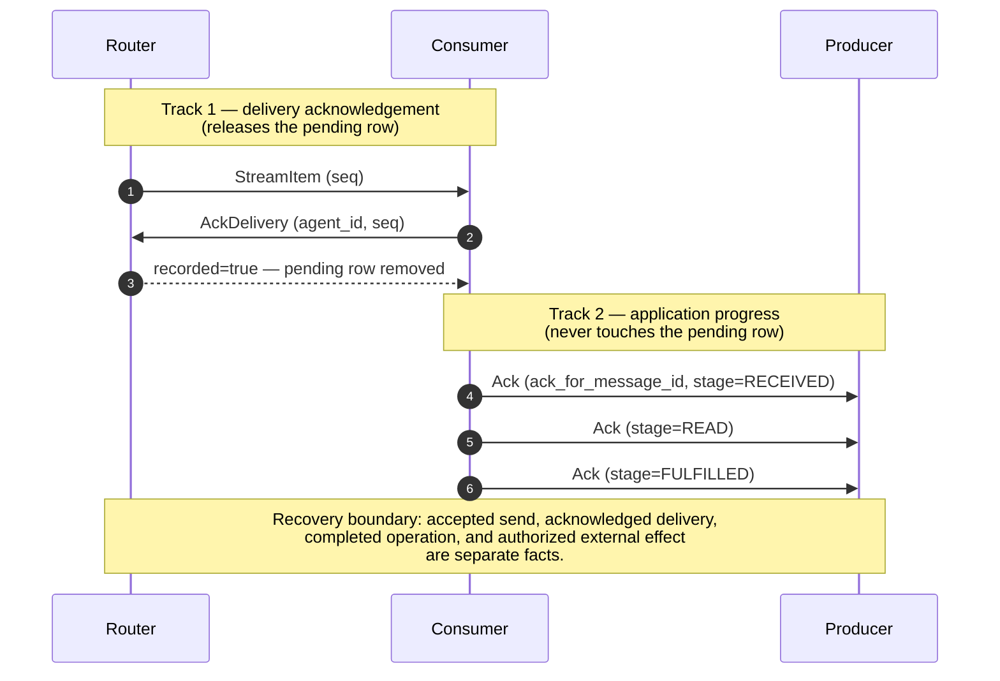

# Acknowledgements

SW4RM has two acknowledgement mechanisms. They have different effects and must
not be substituted for each other.



## Router delivery acknowledgement

The 0.7.0 Router adds `AckDelivery`. A consumer sends its receiving agent ID and
`StreamItem.seq` after completing processing or durably taking responsibility.
The reference router removes the matching in-flight pending row. Unacknowledged
items can be redelivered after reconnect or lease expiry.

Both `DELIVERY_ACK_OUTCOME_DELIVERED` and
`DELIVERY_ACK_OUTCOME_PERMANENT_FAILURE` release the row. Permanent failure is an
explicit discard, not a request to retry. `recorded=false` means no eligible row
was removed. See [Router](../clients/router.md) for the full contract.

## Application progress acknowledgement

An `Ack` envelope reports progress for a message. It does not remove a pending
router row. Canonical fields are:

```proto
message Ack {
  string ack_for_message_id = 1;
  AckStage ack_stage = 2;
  ErrorCode error_code = 3;
  string note = 4;
}
```

| Stage | Value | Application meaning |
|---|---|---|
| `ACK_STAGE_UNSPECIFIED` | 0 | No stage specified |
| `RECEIVED` | 1 | Received for processing |
| `READ` | 2 | Read/validated by the consumer |
| `FULFILLED` | 3 | Application reports successful processing |
| `REJECTED` | 4 | Rejected by application or policy |
| `FAILED` | 5 | Processing failed |
| `TIMED_OUT` | 6 | Processing deadline expired |

An SDK lifecycle helper may emit these progress messages or update an activity
record. Neither operation automatically acknowledges the incoming router stream
item. Use the delivery API explicitly, or a runtime that documents doing so.

## Application retry and timeout policy

Delivery redelivery and application retries are separate decisions. A consumer
should acknowledge the stream item once it has durably taken responsibility for
it, then use the application ACK stages to report work. If it crashes before
the delivery ACK, the router may redeliver the item; if it reports `FAILED`, the
producer may retry the logical operation according to its policy.

| Condition | Recommended action | Idempotency requirement |
|---|---|---|
| `BUFFER_FULL` or temporary unavailability | Back off with jitter and retry | Keep the logical operation token stable |
| `VALIDATION_ERROR`, `PERMISSION_DENIED`, or malformed payload | Correct or quarantine the request | Do not blindly retry |
| `ACK_TIMEOUT` or `INTERNAL_ERROR` | Check service health, then retry if the operation is safe | Deduplicate before repeating side effects |
| `OVERSIZE_PAYLOAD` | Reduce the payload or store bulk data externally | Preserve correlation when creating a follow-up |

The protocol defines error codes and stages; retry limits, backoff, and circuit
breaker thresholds are deployment policy. A useful policy records
`max_attempts`, an initial delay, a multiplier, a maximum delay, and the set of
retryable errors. Add jitter so many consumers do not retry simultaneously. For
example, a bounded policy can compute:

```python
def retry_delay(attempt: int, initial_s: float = 1.0,
                multiplier: float = 2.0, maximum_s: float = 30.0) -> float:
    """Return the deterministic ceiling before adding deployment jitter."""
    return min(maximum_s, initial_s * (multiplier ** max(0, attempt - 1)))

def should_retry(error_code: str, attempt: int, max_attempts: int) -> bool:
    return attempt < max_attempts and error_code in {
        "BUFFER_FULL", "ACK_TIMEOUT", "AGENT_UNAVAILABLE", "INTERNAL_ERROR",
    }
```

Count attempts per logical operation, keep its `idempotency_token` stable, and
generate a new `message_id` for each transmission. Treat `VALIDATION_ERROR`,
`PERMISSION_DENIED`, `OVERSIZE_PAYLOAD`, and `TTL_EXPIRED` as terminal unless a
policy-specific correction creates a new operation.

## Late ACKs and recovery

An ACK can arrive after a timeout or after a retry has been scheduled. Record it
for audit and reconcile it against the current message state. A timeout may
leave the original attempt terminal while a separately tracked logical
operation is `RETRYING`; do not use a blanket rule that either always reopens or
never reopens a timed-out operation:

1. **`TIMED_OUT` attempt:** record and log the late ACK with both timestamps,
   but do not change that attempt’s terminal state.
2. **`RETRYING` logical operation:** record the original attempt’s late ACK. If
   the retry has not been delivered, an implementation MAY cancel it and adopt
   the ACK’s `RECEIVED`, `READ`, or `FULFILLED` state. If it has been delivered,
   track both attempts and deduplicate by the stable token.
3. **Other terminal attempt (`FULFILLED`, `REJECTED`, or `FAILED`):** retain the
   late ACK for audit without reopening that attempt.
4. **Token cache:** for a token-bearing operation, update the cache to the
   earliest successful completion so later retries return the recorded outcome.

On process restart, load outgoing records from the Activity Buffer, classify
them as acknowledged, retryable, or terminal, and reconcile before creating new
logical operations. A persisted snapshot helps find work; it does not make the
snapshot and an external side effect one atomic transaction.

## Monitoring and operator practice

Track counts by stage and error code, delivery-redelivery rate, time from send
to each application stage, unresolved delivery rows, and DLQ growth. Alert on a
sustained failure or timeout increase relative to the service’s normal baseline,
missing delivery acknowledgements, and repeated errors from one route or
consumer. Keep `message_id`, `correlation_id`, and (when present)
`idempotency_token` in logs so one operation can be followed across retries.

Senders should handle every terminal stage and avoid treating `RECEIVED` as
completion. Consumers should validate before reporting `READ`, report a useful
error code and note on failure, and make processing safe to repeat. Operators
should retain enough DLQ history to diagnose failures while bounding payload
retention and access to sensitive content.

## Dead Letter Queue

The protocol recommends that routers provide a Dead Letter Queue (DLQ) for
operator triage. The reference Router in this release does not expose a DLQ
service or `RouterClient` DLQ methods; deployments that provide a DLQ backend
must apply the following §21.1 rules. Messages MUST be moved to DLQ when any of
the following occur:

- **Retry budget exhausted** without successful processing.
- **Terminal error** indicating the operation cannot succeed (validation
  error, permission denied, malformed message).
- **Policy violation** (security, resource limits) or TTL expiry.

Each DLQ entry MUST include diagnostic context sufficient for operator
triage:

| Field | Description |
|-------|-------------|
| Final error classification | The terminal error code and stage |
| Attempt history | Timestamps and failure reasons for each retry attempt |
| Routing context | Producer ID, route, hops traversed |
| Creation and failure times | When the message was created and when it finally failed |
| Payload size and content type | Message metadata for inspection |
| Payload excerpt or reference | Either a truncated payload or a secure reference to the full payload |

Implementations SHOULD provide inspection and reprocessing tools. Operators
MUST be able to requeue selected entries, export diagnostic bundles, and
filter by time range, error class, route, or producer. Implementations SHOULD
enforce retention policies that bound storage (time-based or count-based
eviction). DLQ inspection is an operator facility, not a `RouterClient`
method.

## Recovery boundary

An accepted send, an acknowledged delivery, a completed application operation,
and an authorized external effect are different facts. The reference stack
provides no general exactly-once side-effect transaction. A persisted idempotency
token helps recognize duplicate work after completion; it does not eliminate the
crash interval between an external effect and recording completion.

See [release migration](../release-status.md),
[activity buffer](activity-buffer.md), and
[canonical schema](../reference/protobuf.md).
