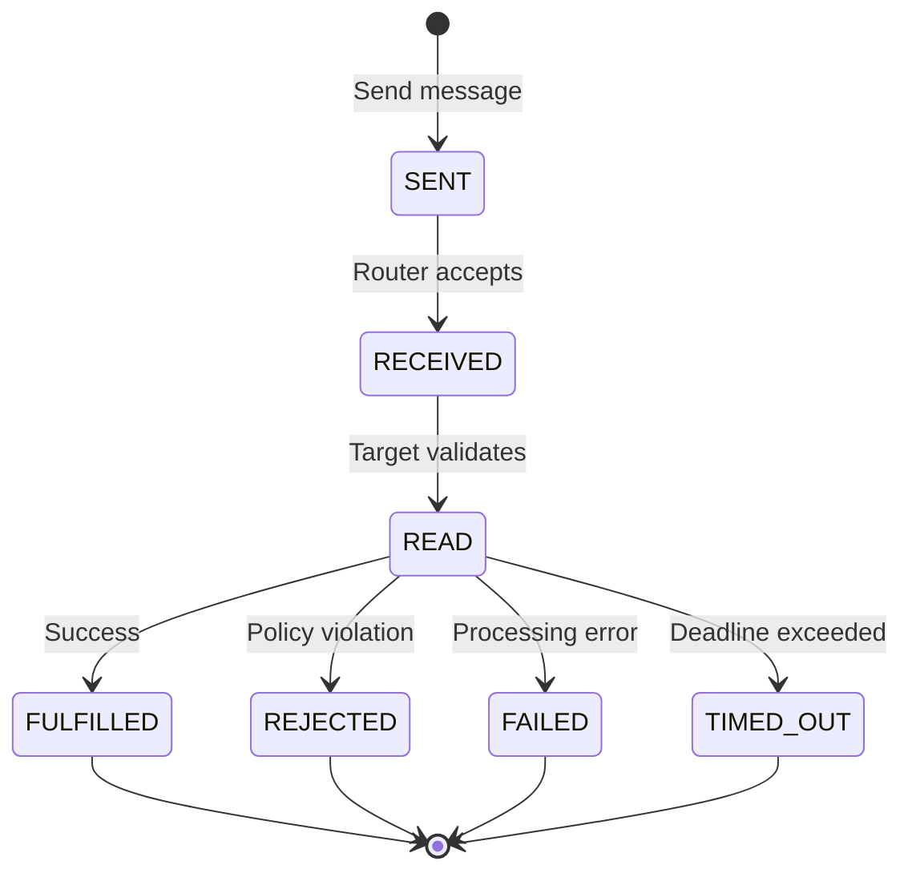
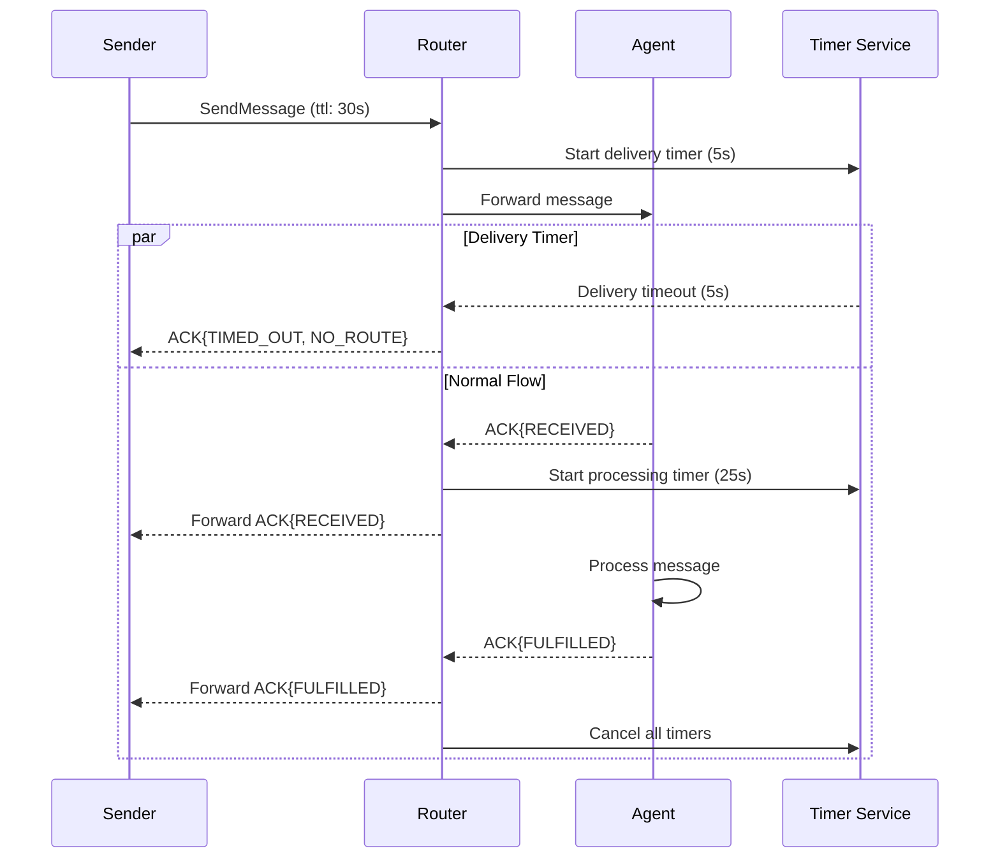

# ACK Lifecycle

Complete specification of the acknowledgment lifecycle in SW4RM protocol, including delivery guarantees, failure handling, and state management patterns.

## Overview

The ACK (acknowledgment) lifecycle provides reliable message delivery guarantees and enables senders to track message processing status. Every message can progress through multiple acknowledgment stages, with each stage representing a different level of processing completion.

## ACK Stages

### Stage Progression



### Stage Definitions

| Stage | Value | Meaning | Responsibility |
|-------|-------|---------|----------------|
| `RECEIVED` | 1 | Message delivered to target agent's queue | Router Service |
| `READ` | 2 | Message parsed, validated, and accepted for processing | Target Agent |
| `FULFILLED` | 3 | Processing completed successfully | Target Agent |
| `REJECTED` | 4 | Message rejected due to policy or validation | Target Agent |
| `FAILED` | 5 | Processing failed due to error | Target Agent |
| `TIMED_OUT` | 6 | Processing exceeded configured deadline | System |

## ACK Message Structure

### Protocol Definition

```protobuf
message Ack {
  string ack_for_message_id = 1;    // Original message ID
  AckStage ack_stage = 2;           // Processing stage reached
  ErrorCode error_code = 3;         // Error details (if applicable)
  string note = 4;                  // Human-readable context
  uint64 processing_time_ms = 5;    // Time spent in this stage
  map<string, string> metadata = 6; // Stage-specific data
}

enum AckStage {
  ACK_STAGE_UNSPECIFIED = 0;
  RECEIVED = 1;
  READ = 2;
  FULFILLED = 3;
  REJECTED = 4;
  FAILED = 5;
  TIMED_OUT = 6;
}
```

### Examples by Stage

#### RECEIVED Stage
```json
{
  "ack_for_message_id": "msg-abc123",
  "ack_stage": "RECEIVED",
  "error_code": "NO_ERROR", 
  "note": "Message queued for processing",
  "processing_time_ms": 2,
  "metadata": {
    "queue_depth": "15",
    "router_id": "router-west-01"
  }
}
```

#### READ Stage
```json
{
  "ack_for_message_id": "msg-abc123",
  "ack_stage": "READ",
  "error_code": "NO_ERROR",
  "note": "Message validated and accepted",
  "processing_time_ms": 45,
  "metadata": {
    "schema_version": "2.1",
    "validation_rules_applied": "12"
  }
}
```

#### FULFILLED Stage
```json
{
  "ack_for_message_id": "msg-abc123", 
  "ack_stage": "FULFILLED",
  "error_code": "NO_ERROR",
  "note": "Task completed successfully",
  "processing_time_ms": 2340,
  "metadata": {
    "result_size_bytes": "1024",
    "records_processed": "567",
    "output_location": "s3://results/task-abc123.json"
  }
}
```

#### FAILED Stage
```json
{
  "ack_for_message_id": "msg-abc123",
  "ack_stage": "FAILED", 
  "error_code": "VALIDATION_ERROR",
  "note": "Required field 'input_path' missing from payload",
  "processing_time_ms": 15,
  "metadata": {
    "validation_errors": "3",
    "recovery_suggestion": "retry_with_complete_payload"
  }
}
```

## Delivery Guarantees

### At-Least-Once Delivery

Messages are guaranteed to be delivered **at least once** to the target agent:


1. **Router Persistence**: Router stores messages until RECEIVED ACK
2. **Retry Logic**: Failed deliveries trigger automatic retry with exponential backoff
3. **Dead Letter Queue**: Messages exceeding retry limits moved to DLQ for manual inspection
4. **Idempotency**: Duplicate detection via `idempotency_token` prevents processing duplicates

### Exactly-Once Processing

While delivery is at-least-once, processing is **exactly once** via:


1. **Idempotency Tokens**: Stable identifiers across retry attempts
2. **Deduplication Windows**: Track processed tokens within time window
3. **State Checkpointing**: Persist processing state before side effects
4. **Transaction Boundaries**: Atomic commit of processing results and ACK

### Ordering Guarantees

Message ordering is preserved **per conversation**:


1. **Sequence Numbers**: Monotonic sequence within `correlation_id` groups
2. **Router Queuing**: FIFO queues maintain sequence order
3. **Agent Processing**: Sequential processing of ordered messages
4. **ACK Sequencing**: ACKs reflect original message sequence

## Error Handling

### Error Codes and Recovery

| Error Code | Recovery Strategy | Retry Recommended |
|------------|-------------------|-------------------|
| `BUFFER_FULL` | Wait and retry with exponential backoff | Yes |
| `NO_ROUTE` | Check agent registration and routing | No |
| `ACK_TIMEOUT` | Increase timeout or check agent health | Maybe |
| `VALIDATION_ERROR` | Fix message format and retry | No |
| `PERMISSION_DENIED` | Check agent permissions | No |
| `OVERSIZE_PAYLOAD` | Reduce payload or use streaming | No |
| `INTERNAL_ERROR` | Investigate system health and retry | Yes |

### Automatic Retry Configuration

```protobuf
message RetryPolicy {
  uint32 max_attempts = 1;           // Maximum retry attempts
  uint64 initial_delay_ms = 2;       // First retry delay
  double backoff_multiplier = 3;     // Exponential backoff factor
  uint64 max_delay_ms = 4;           // Maximum retry delay
  repeated ErrorCode retryable_errors = 5; // Which errors to retry
}
```

**Example Configuration**:
```json
{
  "max_attempts": 5,
  "initial_delay_ms": 1000,
  "backoff_multiplier": 2.0,
  "max_delay_ms": 30000,
  "retryable_errors": ["BUFFER_FULL", "ACK_TIMEOUT", "INTERNAL_ERROR"]
}
```

### Circuit Breaker Integration

ACK patterns trigger circuit breaker state changes:


- **Failure Rate**: High FAILED/TIMED_OUT ACK rate opens circuit
- **Latency**: Slow FULFILLED ACKs indicate performance issues  
- **Error Types**: Certain error codes immediately open circuit
- **Recovery**: Successful ACK patterns close circuit

## Timeline Management

### Message Timeouts

Multiple timeout configurations control ACK lifecycle:

```protobuf
message TimeoutConfig {
  uint64 delivery_timeout_ms = 1;    // Router → Agent delivery
  uint64 read_timeout_ms = 2;        // Agent validation time
  uint64 processing_timeout_ms = 3;  // Agent processing time
  uint64 total_ttl_ms = 4;          // End-to-end message TTL
}
```

### Late ACKs and Reconciliation

Implementations MUST reconcile late ACKs. If an ACK arrives after local timeout handling, the system SHOULD update the final outcome to reflect the terminal stage observed (e.g., FULFILLED) and clear retries or DLQ markers accordingly. Per the base spec, the default time to reach RECEIVED is 10 seconds; upon timeout, set `TIMED_OUT` and NACK with `ack_timeout`, but accept a subsequent late ACK and reconcile state.

### Timeout Enforcement



## Activity Buffer Integration

### Persistent ACK State

The Activity Buffer maintains ACK state across agent restarts:

```json
{
  "message_id": "msg-abc123",
  "ack_history": [
    {
      "stage": "RECEIVED",
      "timestamp": "2024-08-08T15:30:00Z",
      "processing_time_ms": 2
    },
    {
      "stage": "READ", 
      "timestamp": "2024-08-08T15:30:01Z",
      "processing_time_ms": 45
    }
  ],
  "current_stage": "READ",
  "next_timeout": "2024-08-08T15:32:00Z",
  "retry_count": 0
}
```

### Recovery Patterns

When agents restart, they can resume from last ACK state:


1. **Query Activity Buffer**: Load pending message state
2. **Resume Processing**: Continue from last ACK stage  
3. **Send Recovery ACK**: Notify of current processing state
4. **Update Timers**: Reset timeouts based on elapsed time

## Advanced Patterns

### Batch Acknowledgments

For high-throughput scenarios, agents can batch ACKs:

```protobuf
message BatchAck {
  repeated Ack acknowledgments = 1;
  uint64 batch_timestamp = 2;
  string batch_id = 3;
}
```

### Partial Acknowledgments

For large messages processed in chunks:

```json
{
  "ack_for_message_id": "msg-large-dataset",
  "ack_stage": "PARTIAL_FULFILLED",
  "note": "Processed 45% of records (2300/5000)",
  "metadata": {
    "progress_percent": "45",
    "records_completed": "2300",
    "records_total": "5000",
    "estimated_completion": "2024-08-08T15:45:00Z"
  }
}
```

### Conditional ACKs

ACKs can include conditions for further processing:

```json
{
  "ack_for_message_id": "msg-approval-needed",
  "ack_stage": "READ",
  "note": "Awaiting human approval before processing",
  "metadata": {
    "approval_request_id": "approval-789",
    "expected_decision_by": "2024-08-09T09:00:00Z",
    "approver_roles": "security_admin,data_steward"
  }
}
```

## Monitoring and Observability

### ACK Metrics

Key metrics for monitoring ACK health:

```yaml
ack_metrics:
  # Throughput
  - acks_sent_total: Counter by stage and error_code
  - ack_rate_per_second: Rate of ACK generation
  
  # Latency
  - ack_stage_duration: Histogram of time per stage
  - end_to_end_latency: Message send to FULFILLED ACK
  
  # Reliability  
  - ack_success_rate: Percentage reaching FULFILLED
  - ack_retry_rate: Percentage requiring retry
  - ack_timeout_rate: Percentage timing out
  
  # Queue Health
  - pending_acks: Gauge of unresolved messages
  - ack_buffer_depth: Messages awaiting ACK
```

### ACK Tracing

Distributed tracing spans ACK lifecycle:

```json
{
  "trace_id": "trace-abc123",
  "spans": [
    {
      "name": "message.send", 
      "duration_ms": 1500,
      "tags": {"message_id": "msg-abc123"}
    },
    {
      "name": "ack.received",
      "duration_ms": 2,
      "parent": "message.send"
    },
    {
      "name": "ack.read", 
      "duration_ms": 45,
      "parent": "message.send"
    },
    {
      "name": "ack.fulfilled",
      "duration_ms": 2340, 
      "parent": "message.send"
    }
  ]
}
```

### Alert Conditions

Critical ACK patterns trigger alerts:


- **High Failure Rate**: >5% FAILED ACKs in 5-minute window
- **Slow Processing**: >95th percentile ACK latency exceeds SLA
- **Timeout Spike**: >10x normal TIMED_OUT ACK rate
- **Missing ACKs**: Messages without ACKs beyond expected timeout
- **Error Pattern**: Recurring error codes from specific agents

## Best Practices

### For Message Senders


1. **Set Appropriate Timeouts**: Balance responsiveness with processing complexity
2. **Handle All ACK Stages**: Don't assume RECEIVED means FULFILLED
3. **Implement Retry Logic**: Use exponential backoff with jitter
4. **Monitor ACK Patterns**: Track success rates and latencies
5. **Use Idempotency Tokens**: Ensure duplicate safety

### For Message Receivers


1. **Send Timely ACKs**: ACK RECEIVED immediately upon message arrival
2. **Validate Before READ ACK**: Only ACK READ after successful validation
3. **Provide Detailed Error Info**: Include helpful context in FAILED ACKs
4. **Handle Timeouts Gracefully**: Clean up resources on timeout
5. **Support Idempotency**: Check tokens before processing

### For System Operators


1. **Monitor End-to-End Latency**: Track full message lifecycle
2. **Set Up ACK Dashboards**: Visualize success rates and error patterns
3. **Configure Appropriate Timeouts**: Balance user experience with system load
4. **Implement Dead Letter Handling**: Process permanently failed messages
5. **Capacity Plan for ACK Volume**: ACKs generate additional message load
