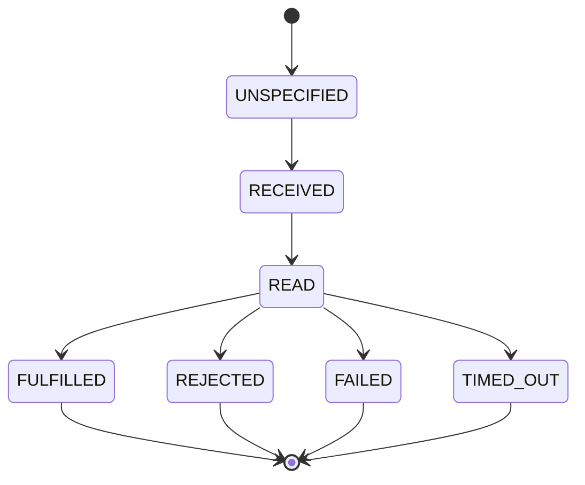

# Activity Buffer API

The Activity Buffer provides in-memory and persistent message tracking for SW4RM agents. It integrates with the Three-ID model for deduplication and workflow correlation, and tracks ACK stage progression for reliable message delivery.

## Overview

The Activity Buffer tracks message lifecycle state. Persistence is optional and
backend-specific; a snapshot is not a transaction with external effects. See
[persistence and recovery](../quickstart/persistence.md).

Its responsibilities are:

- **Message Recording:** Track all incoming and outgoing messages
- **ACK Tracking:** Monitor acknowledgment progression through stages
- **Deduplication:** Prevent duplicate processing using idempotency tokens
- **Persistence:** Survive restarts with optional persistent storage
- **Capacity:** max_items is enforced per spec §10.1; registrations beyond the limit are rejected with `error_code=activity_buffer_full` (no pluggable eviction API)

**Source:** `sdks/py_sdk/sw4rm/activity_buffer.py`

## Three-ID Model Integration

The Activity Buffer works with the Three-ID model defined in the SW4RM protocol:

| ID | Purpose | Buffer Usage |
|----|---------|--------------|
| `message_id` | Per-attempt unique identifier | Primary lookup key |
| `idempotency_token` | Deduplication across retries | Checked via `get_by_idempotency_token()` |
| `correlation_id` | Workflow/conversation linking | Stored in envelope, accessible via record |

## ActivityRecord

Each recorded message is stored as an `ActivityRecord`:

```python
from dataclasses import dataclass, field
from typing import Dict, Any

@dataclass
class ActivityRecord:
    message_id: str
    direction: str  # "in" or "out"
    envelope: Dict[str, Any]
    ts_ms: int = field(default_factory=lambda: int(time.time() * 1000))
    ack_stage: int = ACK_STAGE_UNSPECIFIED
    error_code: int = ERROR_CODE_UNSPECIFIED
    ack_note: str = ""

    def ack(self, stage: int, error_code: int = 0, note: str = "") -> None:
        """Update ACK stage with optional error code and note."""
        self.ack_stage = stage
        self.error_code = error_code
        self.ack_note = note

    @property
    def state(self) -> int:
        """Get envelope state from the envelope dict."""
        return self.envelope.get("state", ENVELOPE_STATE_UNSPECIFIED)

    @property
    def idempotency_token(self) -> str:
        """Get idempotency token from the envelope dict."""
        return self.envelope.get("idempotency_token", "")

    @property
    def correlation_id(self) -> str:
        """Get correlation ID from the envelope dict."""
        return self.envelope.get("correlation_id", "")
```

### Fields

| Field | Type | Description |
|-------|------|-------------|
| `message_id` | `str` | Unique identifier for this message attempt |
| `direction` | `str` | `"in"` for incoming, `"out"` for outgoing |
| `envelope` | `Dict[str, Any]` | Full message envelope |
| `ts_ms` | `int` | Timestamp in milliseconds since epoch |
| `ack_stage` | `int` | Current ACK stage (see ACK Stage Progression) |
| `error_code` | `int` | Error code if failed (from `constants.py`) |
| `ack_note` | `str` | Human-readable note about the ACK |

## ACK Stage Progression

Messages progress through ACK stages as they are processed:



| Stage | Value | Description (canonical meaning in [acks.md](./acks.md)) |
|-------|-------|-------------|
| `ACK_STAGE_UNSPECIFIED` | 0 | No stage specified |
| `RECEIVED` | 1 | Received for processing |
| `READ` | 2 | Read/validated by the consumer |
| `FULFILLED` | 3 | Application reports successful processing |
| `REJECTED` | 4 | Rejected by application or policy |
| `FAILED` | 5 | Processing failed |
| `TIMED_OUT` | 6 | Processing deadline expired |

### Terminal States

Use `is_terminal_state()` to check if an envelope has reached a final state. The
argument is an **envelope** state; use the `*_ENVELOPE` constants (the bare
`C.FULFILLED` is an ACK-stage value and would be the wrong state):

```python
from sw4rm.activity_buffer import is_terminal_state
from sw4rm import constants as C

# Terminal envelope states: FULFILLED_ENVELOPE, REJECTED_ENVELOPE, FAILED_ENVELOPE, TIMED_OUT_ENVELOPE
is_terminal_state(C.FULFILLED_ENVELOPE)   # True
is_terminal_state(C.REJECTED_ENVELOPE)    # True
is_terminal_state(C.READ_ENVELOPE)        # False - still processing
```

## ActivityBuffer (In-Memory)

The in-memory `ActivityBuffer` is suitable for development and short-lived agents:

```python
class ActivityBuffer:
    def __init__(
        self,
        *,
        max_items: int = 10000,
        dedup_window_s: int = 3600
    ) -> None:
        """Create an in-memory activity buffer.

        Args:
            max_items: Maximum records before capacity is enforced (default: 10000)
            dedup_window_s: Deduplication window in seconds (default: 3600)
        """
```

### Methods

#### record_incoming(envelope)

```python
def record_incoming(self, envelope: Dict[str, Any]) -> ActivityRecord:
    """Record an incoming message.

    Args:
        envelope: The message envelope dictionary

    Returns:
        The created ActivityRecord
    """
```

#### record_outgoing(envelope)

```python
def record_outgoing(self, envelope: Dict[str, Any]) -> ActivityRecord:
    """Record an outgoing message.

    Args:
        envelope: The message envelope dictionary

    Returns:
        The created ActivityRecord
    """
```

#### ack(ack)

```python
def ack(self, ack: Dict[str, Any]) -> Optional[ActivityRecord]:
    """Process an ACK message.

    Args:
        ack: ACK message with 'ack_for_message_id', 'ack_stage',
             optional 'error_code' and 'note'

    Returns:
        Updated ActivityRecord if found, None otherwise
    """
```

#### get(message_id)

```python
def get(self, message_id: str) -> Optional[ActivityRecord]:
    """Retrieve a record by message_id.

    Args:
        message_id: The message identifier

    Returns:
        ActivityRecord if found, None otherwise
    """
```

#### unacked()

```python
def unacked(self) -> List[ActivityRecord]:
    """Get all records awaiting ACK.

    Returns:
        List of records with ack_stage in {UNSPECIFIED, RECEIVED, READ}
    """
```

#### recent(n)

```python
def recent(self, n: int = 50) -> List[ActivityRecord]:
    """Get n most recent records.

    Args:
        n: Number of records to return (default: 50)

    Returns:
        List of most recent ActivityRecords
    """
```

#### update_state(message_id, new_state)

```python
def update_state(self, message_id: str, new_state: int) -> Optional[ActivityRecord]:
    """Update record state.

    Args:
        message_id: The message identifier
        new_state: New envelope state from constants.EnvelopeState

    Returns:
        Updated ActivityRecord if found, None otherwise
    """
```

#### get_by_idempotency_token(token)

```python
def get_by_idempotency_token(self, token: str) -> Optional[ActivityRecord]:
    """Find record by idempotency token for deduplication.

    Used to check if an operation with this token has already been
    processed within the deduplication window.

    Args:
        token: Idempotency token to look up

    Returns:
        ActivityRecord if found and within dedup window, None otherwise
    """
```

## PersistentActivityBuffer

For production use, `PersistentActivityBuffer` provides disk persistence:

```python
class PersistentActivityBuffer:
    def __init__(
        self,
        *,
        max_items: int = 10000,
        persistence: Optional[PersistenceBackend] = None,
        dedup_window_s: int = 3600
    ) -> None:
        """Create a persistent activity buffer.

        Args:
            max_items: Maximum records before capacity is enforced (default: 10000)
            persistence: Storage backend (default: JSONFilePersistence)
            dedup_window_s: Deduplication window in seconds (default: 3600)
        """
```

### Additional Methods

#### flush()

```python
def flush(self) -> None:
    """Force save to persistent storage.

    Call this to ensure all changes are persisted immediately.
    """
```

#### reconcile()

```python
def reconcile(self) -> List[PersistentActivityRecord]:
    """Return unacked outgoing messages that may need retry/reconciliation.

    Call this on startup to find messages that were sent but not
    acknowledged before shutdown.

    Returns:
        List of unacked outgoing records
    """
```

#### clear()

```python
def clear(self) -> None:
    """Clear all activity records and persistent storage."""
```

### Context Manager Support

`PersistentActivityBuffer` supports the context manager protocol for automatic flushing:

```python
with PersistentActivityBuffer(persistence=JSONFilePersistence("./data")) as buffer:
    buffer.record_outgoing(envelope)
    # ... process messages ...
# Buffer is automatically flushed on exit
```

## Capacity and overflow handling

The old `FIFOBufferStrategy`, `LIFOBufferStrategy`, and custom-victim API are
not part of the current message Activity Buffer contract. Capacity handling is
deliberate and differs from the SDKs' advisory task-history buffers:

| Runtime | Current behavior when full | Practical response |
|---|---|---|
| Python `ActivityBuffer` / `PersistentActivityBuffer` | Reject a new message with `BufferFullError`; existing records are preserved | Reconcile or explicitly purge completed records, or increase `max_items`; never silently discard an unacknowledged record |
| Rust message buffer | Return `Error::BufferFull` | Apply the same explicit reconciliation/purge policy at the caller |
| Elixir activity buffer | Return `{:error, %BufferFull{}}` for a new key; updates to an existing key remain possible | Remove or reconcile entries, then retry the upsert |
| JavaScript advisory task history | Apply a count cap by dropping the oldest history records | Treat this as local history, separate from router delivery state |

For Python, a bounded consumer can make the overflow path explicit:

```python
from sw4rm import constants as C
from sw4rm.exceptions import BufferFullError

try:
    record = buffer.record_incoming(envelope)
except BufferFullError:
    # Reconcile completed/terminal records under application policy.
    terminal_stages = {C.FULFILLED, C.REJECTED, C.FAILED, C.TIMED_OUT}
    terminal = [r for r in buffer.recent() if r.ack_stage in terminal_stages]
    raise RuntimeError(
        f"activity buffer full; {len(terminal)} recent terminal records to inspect"
    )
```

This fragment uses the consumer's existing `buffer` and envelope dictionary.
`recent()` defaults to the most recent 50 records, so this diagnostic is not
a count of every terminal record. A terminal record may still be needed for
deduplication or late-ACK reconciliation; inspect its age and operation outcome
before purging it.

Capacity is a local bookkeeping limit. It does not release a Router pending
delivery row, and purging a local activity record does not acknowledge or
redeliver a message. Keep the router's delivery ACK and the activity buffer's
recovery record coordinated explicitly.

## Usage Examples

### Basic Recording and ACK Processing

```python
from sw4rm.activity_buffer import ActivityBuffer
from sw4rm.envelope import build_envelope
from sw4rm import constants as C

# Create buffer
buffer = ActivityBuffer(max_items=1000)

# Record outgoing message
envelope = build_envelope(
    producer_id="agent-1",
    message_type=C.DATA,
    content_type="application/json",
    payload=b'{"action": "process"}'
)
record = buffer.record_outgoing(envelope)
print(f"Recorded message: {record.message_id}")

# Process incoming ACK
ack = {
    "ack_for_message_id": record.message_id,
    "ack_stage": C.RECEIVED,
}
updated = buffer.ack(ack)
print(f"Updated ACK stage: {updated.ack_stage}")  # 1 (RECEIVED)

# Later, fulfilled
ack["ack_stage"] = C.FULFILLED
buffer.ack(ack)
print(f"Final ACK stage: {updated.ack_stage}")  # 3 (FULFILLED)
```

### Deduplication with Idempotency Tokens

```python
from sw4rm.activity_buffer import ActivityBuffer, is_terminal_state

buffer = ActivityBuffer(dedup_window_s=3600)  # 1-hour window

def process_message(envelope):
    token = envelope.get("idempotency_token")

    if token:
        # Check for duplicate
        existing = buffer.get_by_idempotency_token(token)
        if existing:
            if is_terminal_state(existing.state):
                # Already processed, return cached result
                return {"status": "duplicate", "original": existing.message_id}
            else:
                # Still processing, reject duplicate
                return {"status": "in_progress", "original": existing.message_id}

    # Record and process new message
    record = buffer.record_incoming(envelope)
    result = do_actual_processing(envelope)

    # Update state based on result
    if result.success:
        buffer.update_state(record.message_id, C.FULFILLED_ENVELOPE)
    else:
        buffer.update_state(record.message_id, C.FAILED_ENVELOPE)

    return result
```

### Reconciliation Pattern for Unacked Outgoing Messages

```python
from sw4rm.activity_buffer import PersistentActivityBuffer
from sw4rm.persistence import JSONFilePersistence

def startup_reconciliation():
    """Retry unacked messages from previous run."""

    buffer = PersistentActivityBuffer(
        persistence=JSONFilePersistence("./agent_data/activity.json")
    )

    # Find messages that need retry
    unacked = buffer.reconcile()
    print(f"Found {len(unacked)} unacked outgoing messages")

    for record in unacked:
        print(f"Retrying message: {record.message_id}")

        # Re-send the message
        try:
            send_message(record.envelope)
        except Exception as e:
            print(f"Retry failed: {e}")
            buffer.update_state(record.message_id, C.FAILED_ENVELOPE)

    return buffer
```

### Persistent Buffer with Recovery

```python
from sw4rm.activity_buffer import PersistentActivityBuffer
from sw4rm.persistence import JSONFilePersistence
import signal
import sys

class AgentWithPersistence:
    def __init__(self, data_dir: str):
        self.buffer = PersistentActivityBuffer(
            persistence=JSONFilePersistence(f"{data_dir}/activity.json"),
            max_items=5000,
            dedup_window_s=7200,  # 2 hours
        )

        # Handle graceful shutdown
        signal.signal(signal.SIGINT, self._shutdown_handler)
        signal.signal(signal.SIGTERM, self._shutdown_handler)

    def _shutdown_handler(self, signum, frame):
        print("Shutting down, flushing buffer...")
        self.buffer.flush()
        sys.exit(0)

    def run(self):
        # Reconcile on startup
        unacked = self.buffer.reconcile()
        for record in unacked:
            self._retry_message(record)

        # Main processing loop
        while True:
            message = self._receive_message()
            self._process(message)

    def _process(self, message):
        record = self.buffer.record_incoming(message)

        try:
            result = self._handle_message(message)
            self.buffer.update_state(record.message_id, C.FULFILLED_ENVELOPE)
        except Exception as e:
            self.buffer.update_state(record.message_id, C.FAILED_ENVELOPE)
            raise
        finally:
            # Periodically flush
            self.buffer.flush()
```

## Thread Safety

!!! warning "Not Thread-Safe"

    `ActivityBuffer` and `PersistentActivityBuffer` are **not thread-safe**.
    If using across threads, callers must synchronize access externally.

```python
import threading

class ThreadSafeBuffer:
    def __init__(self):
        self._buffer = ActivityBuffer()
        self._lock = threading.Lock()

    def record_incoming(self, envelope):
        with self._lock:
            return self._buffer.record_incoming(envelope)

    def ack(self, ack):
        with self._lock:
            return self._buffer.ack(ack)
```

## See Also

- [ACK Lifecycle](acks.md) - Full ACK protocol specification
- [Messages](messages.md) - Envelope structure and Three-ID model
- [Architecture](../architecture/index.md) - Activity Buffer in system context
