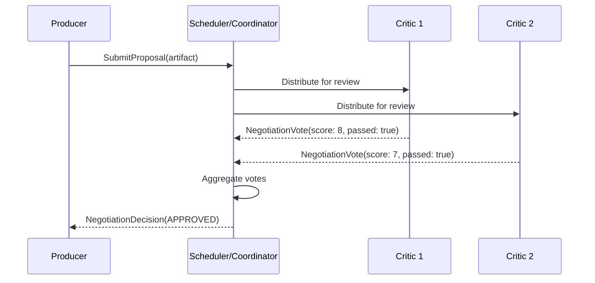
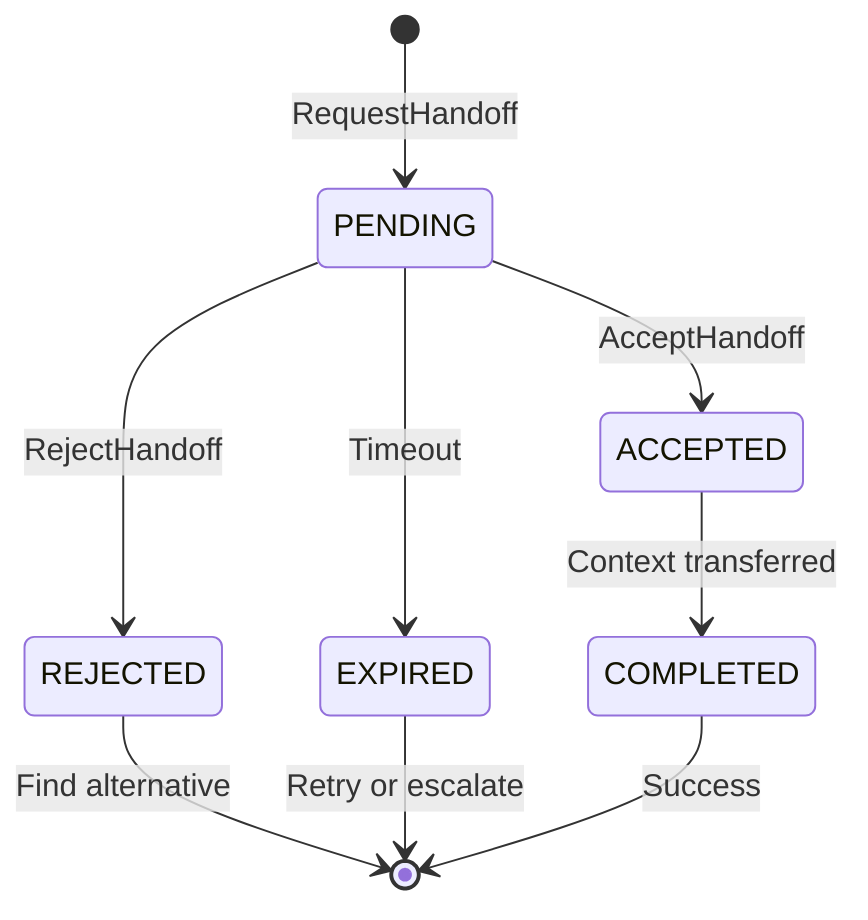
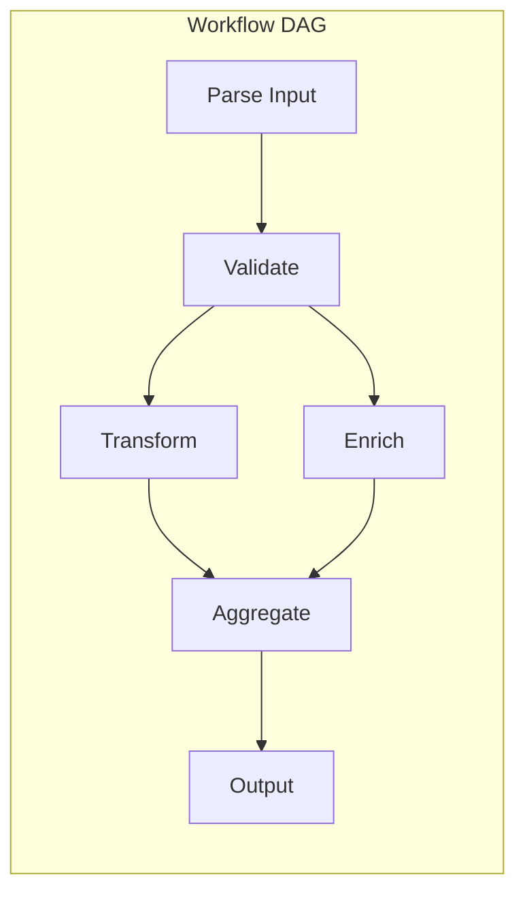

# 3.11 Advanced Patterns (v0.5.0)

This section documents the advanced multi-agent coordination patterns introduced in SW4RM Protocol v0.5.0. These patterns enable sophisticated workflows for artifact approval, agent delegation, and DAG-based orchestration.

## 3.11.1 Negotiation Room Pattern

The Negotiation Room pattern provides a structured multi-agent artifact approval workflow where Producers submit artifacts for evaluation by multiple Critic agents, with a Coordinator aggregating votes and making final decisions.

### Roles

| Role | Description |
|------|-------------|
| **Producer** | Agent that submits an artifact for approval via `NegotiationProposal` |
| **Critic** | Agent that evaluates artifacts and submits `NegotiationVote` with scores and feedback |
| **Coordinator** | Component (typically the Scheduler) that aggregates votes and issues decisions |

### Artifact Types

Implementations support the following artifact categories:

- `REQUIREMENTS`: The artifact contains specifications and requirements documents.
- `PLAN`: The artifact contains implementation plans and architectural designs.
- `CODE`: The artifact contains source code and executable artifacts.
- `DEPLOYMENT`: The artifact contains deployment configurations and infrastructure definitions.

### Proposal Flow



### Proposal Submission

A Producer submits artifacts via `SubmitProposal` RPC with:

```protobuf
message NegotiationProposal {
  string artifact_type = 1;        // REQUIREMENTS, PLAN, CODE, DEPLOYMENT
  string artifact_id = 2;          // Unique identifier
  bytes artifact = 3;              // Binary content
  string artifact_content_type = 4; // MIME type (e.g., application/json)
  repeated string requested_critics = 5; // Critic agent IDs
  string negotiation_room_id = 6;  // Session identifier
}
```

### Voting

Critics evaluate artifacts and submit votes containing:

| Field | Type | Description |
|-------|------|-------------|
| `score` | float | The critic assigns a numerical score from 0 to 10. A score of 10 indicates excellent quality. |
| `confidence` | float | The critic assigns a confidence level from 0 to 1 representing POMDP uncertainty. |
| `passed` | bool | The critic indicates whether the artifact meets minimum criteria. |
| `strengths` | string[] | The critic lists positive aspects of the artifact. |
| `weaknesses` | string[] | The critic lists areas for improvement. |
| `recommendations` | string[] | The critic lists suggested changes. |

### Vote Aggregation

The Coordinator computes `AggregatedScore` from all votes:

```python
# Python SDK example
from sw4rm.voting import aggregate_votes

votes = [vote1, vote2, vote3]  # NegotiationVote objects
aggregated = aggregate_votes(votes)

print(f"Mean score: {aggregated.mean}")
print(f"Weighted mean: {aggregated.weighted_mean}")
print(f"Std deviation: {aggregated.std_dev}")
print(f"Vote count: {aggregated.vote_count}")
```

### Decision Outcomes

| Outcome | Description |
|---------|-------------|
| `APPROVED` | The artifact meets all thresholds. The workflow proceeds. |
| `REVISION_REQUESTED` | The artifact requires changes. The Producer should iterate. |
| `ESCALATED_TO_HITL` | Human judgment is required. The system escalates via HITL (Section 3.4). |

### Blocking Wait

For synchronous workflows, Producers can block until a decision is rendered:

```python
# Wait for decision with timeout
decision = await client.wait_for_decision(
    negotiation_room_id=room_id,
    timeout_seconds=300
)
```

---

## 3.11.2 Agent Handoff Protocol

The Handoff Protocol enables safe delegation of work between agents when capability requirements change or workload balancing is needed.

### Handoff Lifecycle



### Handoff States

| State | Description |
|-------|-------------|
| `PENDING` | The request was submitted. The system awaits a response. |
| `ACCEPTED` | The target agent accepted the handoff. |
| `REJECTED` | The target agent declined the handoff. The response includes a reason. |
| `COMPLETED` | The system executed the handoff. The context was transferred. |
| `EXPIRED` | The timeout was reached before resolution. |

### Handoff Request

An originating agent initiates handoff via `RequestHandoff`:

```protobuf
message HandoffRequest {
  string request_id = 1;           // Unique identifier
  string from_agent = 2;           // Originating agent ID
  string to_agent = 3;             // Target agent ID (or empty for routing)
  string reason = 4;               // Human-readable explanation
  bytes context_snapshot = 5;      // Serialized execution context
  repeated string capabilities_required = 6; // Required capabilities
  int32 priority = 7;              // Priority level
  int64 timeout_ms = 8;            // Maximum wait duration
}
```

### Accept/Reject Semantics

```python
# Python SDK example - handling incoming handoffs
from sw4rm.handoff import HandoffClient

async def handle_handoffs(client: HandoffClient, agent_id: str):
    pending = await client.get_pending_handoffs(agent_id)

    for request in pending:
        if can_handle(request.capabilities_required):
            await client.accept_handoff(request.request_id)
            context = deserialize_context(request.context_snapshot)
            await process_handoff_work(context)
        else:
            await client.reject_handoff(
                request.request_id,
                reason="Missing required capabilities"
            )
```

### Context Transfer

The `context_snapshot` field carries serialized state necessary for the receiving agent to continue work:

- The originating agent MUST NOT continue work on transferred context after handoff completion.
- Implementations SHOULD define content types for context snapshots.
- Agents SHOULD call `GetPendingHandoffs` periodically after recovery from failures.

---

## 3.11.3 Workflow Orchestration

The Workflow Orchestration pattern enables DAG-based multi-agent task coordination where nodes represent agent-executed steps with explicit dependencies.

### Workflow Structure



### Workflow Definition

A `WorkflowDefinition` comprises:

```protobuf
message WorkflowDefinition {
  string workflow_id = 1;          // Unique identifier
  map<string, WorkflowNode> nodes = 2; // Node definitions
  map<string, string> metadata = 3; // Workflow-level configuration
}

message WorkflowNode {
  string node_id = 1;              // Unique within workflow
  string agent_id = 2;             // Responsible agent
  repeated string dependencies = 3; // Must complete before execution
  TriggerType trigger_type = 4;    // Activation mechanism
  map<string, string> input_mapping = 5;  // Workflow state -> node input
  map<string, string> output_mapping = 6; // Node output -> workflow state
}
```

### Node Status Transitions

| Status | Description |
|--------|-------------|
| `PENDING` | The node waits for dependencies to complete. |
| `READY` | All dependencies are satisfied. The node is eligible for execution. |
| `RUNNING` | The node is currently executing. |
| `COMPLETED` | The node finished successfully. |
| `FAILED` | The node encountered an error. |
| `SKIPPED` | The node was bypassed due to conditional logic. |

**Constraint**: Nodes MUST NOT execute until all nodes in their `dependencies` set have reached `COMPLETED` status.

### Trigger Types

| Type | Description |
|------|-------------|
| `EVENT` | The node executes when an external event or message arrives. |
| `SCHEDULE` | The node executes on a time-based schedule (cron-like). |
| `MANUAL` | The node executes when a user explicitly triggers it. |
| `DEPENDENCY` | The node executes when all dependencies complete. This is the default. |

### Workflow Operations

```python
# Python SDK example
from sw4rm.workflow import WorkflowClient

client = WorkflowClient(channel)

# Create workflow definition
workflow_id = await client.create_workflow(definition)

# Start execution with initial data
await client.start_workflow(
    workflow_id=workflow_id,
    initial_data={"input_file": "/data/source.csv"}
)

# Monitor progress
state = await client.get_workflow_state(workflow_id)
for node_id, node_state in state.node_states.items():
    print(f"{node_id}: {node_state.status}")

# Resume from specific node (recovery)
await client.resume_workflow(workflow_id, from_node="transform")
```

### Input/Output Mapping

Data flows between nodes through shared `workflow_data`:

1. **Before execution**: The system extracts values from `workflow_data` according to `input_mapping`.
2. **After completion**: The system writes node outputs to `workflow_data` according to `output_mapping`.

Example:
```yaml
nodes:
  parse:
    agent_id: "parser-agent"
    output_mapping:
      parsed_records: "records"  # Node output -> workflow state key

  transform:
    agent_id: "transform-agent"
    dependencies: ["parse"]
    input_mapping:
      input_records: "records"   # Workflow state key -> node input
    output_mapping:
      transformed: "results"
```

---

## 3.11.4 Three-ID Model

The SW4RM messaging model uses three distinct identifiers to enable reliable message processing with retry safety and correlation tracking.

### Identifier Types

| Identifier | Purpose | Scope | Mutability |
|------------|---------|-------|------------|
| `message_id` | Unique per transmission attempt | Per-attempt | New on each retry |
| `correlation_id` | Links request-response pairs | Conversation/workflow | Stable across related messages |
| `idempotency_token` | Enables exactly-once processing | Retry window | Stable across retries |

### Message ID

- **Format**: The system generates a UUIDv4 per transmission.
- **Purpose**: The ID uniquely identifies each message attempt.
- **Behavior**: The system generates a new `message_id` on every send, including retries.

### Correlation ID

- **Format**: The caller provides a string, typically a UUIDv4.
- **Purpose**: The ID links related messages in a conversation or workflow.
- **Behavior**: Response messages copy the `correlation_id` from the request.

```python
# Request
request = build_envelope(
    message_type=MessageType.DATA,
    correlation_id="workflow-123",
    payload=task_data
)

# Response uses same correlation_id
response = build_envelope(
    message_type=MessageType.DATA,
    correlation_id="workflow-123",  # Same as request
    payload=result_data
)
```

### Idempotency Token

- **Format**: The caller provides a deterministic string.
- **Purpose**: The token enables safe retry of operations.
- **Behavior**: The Router deduplicates messages with the same token within the deduplication window.

```python
# Generate deterministic token for retry safety
token = f"{agent_id}:{task_id}:{content_hash}"

envelope = build_envelope(
    message_type=MessageType.DATA,
    idempotency_token=token,  # Same token on retries
    payload=data
)
```

### Deduplication Window

- The default window is 3600 seconds (1 hour).
- Messages with identical `idempotency_token` within the window return `DUPLICATE_DETECTED`.
- Implementations SHOULD configure the window based on expected retry patterns.

---

## See Also

- [Protocol Specification](index.md) - Core protocol concepts
- [Services Reference](services.md) - Complete service API reference
- [ACK Lifecycle](acks.md) - Acknowledgment handling patterns
- [Messages](messages.md) - Message type specifications
