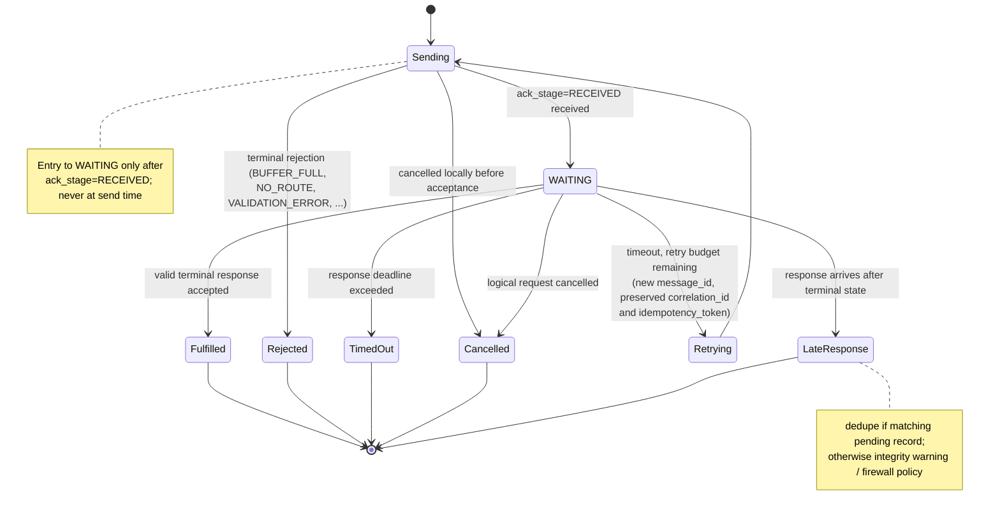

# SW4-007: Explicit Request/Response Semantics

**Status:** Draft
**Version:** 0.1.0
**Date:** 2026-03-28
**Extends:** Core Spec §10, §11, §13, §21

## Abstract

This extension defines transport-agnostic request/response semantics for SW4RM message exchange. It standardizes how a request declares that a terminal response is required, how a responder links the response back to the originating request, when the requester enters and leaves `WAITING`, how timeout and retry budgets are enforced, and how duplicate or late responses are reconciled. The goal is portable request round-trips without introducing a transport-specific binding or a new core message plane.

## Motivation

The core specification already defines correlation IDs, message envelopes, backpressure handling, and terminal error behavior, but it does not define the canonical shape of a request that expects a response. Without this extension, implementations drift on:

- how a response links back to a request
- when a sender enters or exits `WAITING`
- what happens on timeout
- how duplicate or late responses are reconciled

This extension is deliberately transport-agnostic. It is not an A2A binding. Transport-specific mappings belong in SW4-015.

## 1. Scope

SW4-007 applies to message-plane SW4RM exchanges where a sender expects exactly one terminal response to a logical request. It standardizes:

- request declaration (`response_required`)
- portable response policy fields
- canonical response linkage
- bounded `WAITING` behavior
- pending-response visibility
- timeout, retry, duplicate, and late-response reconciliation

SW4-007 does not define:

- A2A, HTTP, SSE, or any other transport binding
- RPC method return shapes for services such as Handoff or Workflow
- multi-part streaming response protocols
- application-specific response payload schemas beyond the linkage and status fields defined here

## 2. Normative Language

The key words MUST, MUST NOT, SHOULD, SHOULD NOT, and MAY in this document are to be interpreted as described in RFC 2119.

## 3. Protocol Additions

### 3.1 Envelope Additions

SW4-007 allocates per-message fields 120-129 and defines:

```protobuf
message Envelope {
  // existing fields...
  bool response_required = 120;
  ResponsePolicy response_policy = 121;
  ResponseLink response_link = 122;
}

message ResponsePolicy {
  uint64 response_timeout_ms = 1;   // 0 => effective default 30000
  uint32 max_request_attempts = 2;  // 0 => effective default 1
  bool fail_on_timeout = 3;         // default true
}

message ResponseLink {
  string in_response_to_message_id = 1;
  string in_response_to_idempotency_token = 2;
  ResponseStatus response_status = 3;
}

enum ResponseStatus {
  RESPONSE_STATUS_UNSPECIFIED = 0;
  RESPONSE_STATUS_FULFILLED = 1;
  RESPONSE_STATUS_REJECTED = 2;
  RESPONSE_STATUS_FAILED = 3;
  RESPONSE_STATUS_TIMED_OUT = 4;
  RESPONSE_STATUS_CANCELLED = 5;
}
```

### 3.2 Applicability Rules

1. `response_required=true` MUST be used only on payload-bearing request messages.
2. `response_required` MUST NOT be set on `ACKNOWLEDGEMENT` or `HEARTBEAT` messages.
3. Implementations claiming SW4-007 conformance MUST support request/response semantics for `DATA` messages.
4. A response message defined by SW4-007 MUST use `message_type=DATA`. This extension does not allocate a new core `RESPONSE` message type.
5. A message with `response_required=true` MUST include `response_policy`.
6. A response message MUST include `response_link`.

## 4. Request Emission Rules

For a request that requires a response:

1. The sender MUST generate a fresh `message_id`.
2. The sender MUST set `response_required=true`.
3. The sender MUST provide `response_policy.response_timeout_ms` explicitly or rely on the effective default of `30000ms`.
4. If `max_request_attempts` is unset or `0`, the effective value MUST be `1`.
5. If the request includes `ttl_ms`, `response_timeout_ms` MUST be less than or equal to `ttl_ms`.
6. The sender SHOULD include an `idempotency_token` so retries and responses can be reconciled as one logical operation.
7. Retries of the same logical request MUST preserve `correlation_id` and `idempotency_token` while generating a new `message_id` and incrementing `retry_count`.

## 5. `WAITING` State Semantics

### 5.1 Entry

For SW4-007 requests, the sender MUST NOT enter `WAITING` at send time. The sender enters `WAITING` only after the request has been acknowledged at `ack_stage=RECEIVED` and only if the request has not already been terminally rejected.

The sender MUST NOT enter `WAITING` when:

- the request is rejected with `BUFFER_FULL`, `NO_ROUTE`, `VALIDATION_ERROR`, or any other terminal rejection
- the request times out before reaching `RECEIVED`
- the request is cancelled locally before acceptance

### 5.2 Pending-Response Tracking

When the sender enters `WAITING`, the Scheduler or equivalent coordination layer MUST record a pending-response entry containing at minimum:

- request `message_id`
- request `correlation_id`
- request `idempotency_token` when present
- response deadline
- current attempt number
- `waiting_since` timestamp

Implementations claiming SW4-007 conformance MUST surface equivalent waiting metadata in operator-visible state, logs, or activity buffers.

### 5.3 Exit

The sender MUST leave `WAITING` when one of the following occurs:

1. A valid terminal response is accepted.
2. The response deadline is exceeded.
3. The logical request is cancelled.
4. Retry budget is exhausted and timeout handling becomes terminal.



Leaving `WAITING` MUST remove or terminalize the pending-response entry.

## 6. Response Construction and Validation

### 6.1 Response Shape

A conforming SW4-007 response MUST:

1. Use `message_type=DATA`.
2. Reuse the request's `correlation_id`.
3. Set `response_link.in_response_to_message_id` to the delivered request attempt's `message_id`.
4. Set `response_link.in_response_to_idempotency_token` when the request carried an `idempotency_token`.
5. Set a terminal `response_status`.
6. Be rejected as protocol-invalid if linkage fields are missing, malformed, or inconsistent with the open logical request.

`response_status` meanings:

- `FULFILLED`: the request completed successfully and the payload is authoritative
- `REJECTED`: the responder intentionally refused the request after inspection
- `FAILED`: execution began but ended in error
- `TIMED_OUT`: the responder timed out the logical request locally
- `CANCELLED`: the logical request was cancelled before completion

If a receiver cannot correlate a response to an open or recently terminalized logical request, it MUST treat the response as `VALIDATION_ERROR` for protocol purposes and MUST NOT let it complete a different request by accident.

### 6.2 Response Idempotency

If the request carried an `idempotency_token`, the response MUST carry a deterministic response token derived from it. The RECOMMENDED form is:

```text
{request_idempotency_token}:response:v1
```

Normative rules:

1. Exactly one terminal response is valid for a logical request.
2. Duplicate responses with the same derived response token and identical terminal outcome MUST be deduplicated.
3. Conflicting terminal responses for the same logical request MUST be treated as protocol-invalid and MUST be logged as an integrity violation.

## 7. Timeout, Retry, and Late-Response Reconciliation

### 7.1 Timeout

If no valid terminal response arrives before the response deadline:

1. The sender MUST terminate the current waiting attempt.
2. If additional attempts remain under `max_request_attempts`, the sender MAY retry the request.
3. If no attempts remain and `fail_on_timeout=true`, the sender MUST mark the logical request terminal with timeout semantics.
4. If no attempts remain and `fail_on_timeout=false`, the sender MAY escalate via local policy, but MUST still leave `WAITING`.

### 7.2 Retry Rules

Retries under SW4-007 MUST:

1. Preserve `correlation_id`.
2. Preserve the logical request `idempotency_token`.
3. Generate a new `message_id`.
4. Recompute the remaining timeout budget based on elapsed wall-clock time.
5. Maintain a single logical pending-response record across attempts.

### 7.3 Late Responses

If a response arrives after the requester has already terminalized the logical request as timed out, cancelled, or otherwise closed:

1. The late response MUST be recorded for auditability.
2. The late response MUST NOT reopen the logical request.
3. If the late response matches the cached terminal response token and payload, it MAY be treated as a duplicate for observability purposes.
4. If the late response conflicts with the cached terminal outcome, the implementation MUST surface an integrity warning.

## 8. Backpressure and Rejection Semantics

If a response-required request is rejected before `WAITING` begins, the sender MUST treat the rejection as authoritative for that attempt.

Required behavior:

1. `BUFFER_FULL` rejection MUST NOT create a pending-response entry.
2. `VALIDATION_ERROR` rejection MUST NOT be retried unless the payload is corrected.
3. `NO_ROUTE` or `AGENT_UNAVAILABLE` MAY be retried only if attempt budget remains.
4. Response-required behavior MUST NOT suppress ordinary NACK semantics from the core protocol.

## 9. Observability Requirements

Implementations claiming SW4-007 conformance MUST emit enough telemetry to answer:

- which logical requests are currently waiting for responses
- which request attempt produced the accepted response
- whether a terminal result came from fulfillment, rejection, failure, timeout, or cancellation
- whether duplicates or late responses were observed

The following metrics are RECOMMENDED:

- `sw4rm_pending_responses{producer_id}`
- `sw4rm_response_wait_duration_ms{producer_id,consumer_id,result}`
- `sw4rm_late_responses_total{producer_id,consumer_id}`
- `sw4rm_response_duplicates_total{producer_id,consumer_id}`

## 10. Worked Examples

### 10.1 Successful Request/Response Round-Trip

1. Agent A sends `DATA` with `response_required=true`, `response_timeout_ms=30000`, and `idempotency_token=req-123`.
2. The Router emits `ACK{ack_stage=RECEIVED}` and Agent A enters `WAITING`.
3. Agent B completes the request and returns `DATA` with the same `correlation_id` and `response_link.in_response_to_message_id` set to Agent A's request `message_id`.
4. The response uses `response_status=FULFILLED`; Agent A exits `WAITING` and records the logical request as completed.

Representative JSON (illustrative; the wire Envelope is defined in the
canonical proto — see [reference/protobuf.md](../../reference/protobuf.md)):

```json
{
  "message_id": "m1",
  "producer_id": "agent-a",
  "correlation_id": "wf-7",
  "message_type": "DATA",
  "sequence_number": 1,
  "content_type": "application/json",
  "payload": {"operation": "create-report"},
  "response_required": true,
  "response_policy": {
    "response_timeout_ms": 30000,
    "max_request_attempts": 1,
    "fail_on_timeout": true
  },
  "idempotency_token": "agent-a:create-report:req-123"
}
```

```json
{
  "message_id": "m2",
  "producer_id": "agent-b",
  "correlation_id": "wf-7",
  "message_type": "DATA",
  "sequence_number": 1,
  "content_type": "application/json",
  "payload": {"status": "created"},
  "idempotency_token": "agent-a:create-report:req-123:response:v1",
  "response_link": {
    "in_response_to_message_id": "m1",
    "in_response_to_idempotency_token": "agent-a:create-report:req-123",
    "response_status": "RESPONSE_STATUS_FULFILLED"
  }
}
```

### 10.2 Timeout and Retry

1. Agent A sends a response-required request with `max_request_attempts=2`.
2. No valid terminal response arrives before the first deadline, so the first attempt times out.
3. Agent A retries with a fresh `message_id`, the same `correlation_id`, and the same `idempotency_token`.
4. The second attempt succeeds; the logical request is closed against the second response while the first attempt remains timed out in audit history.

### 10.3 Cancellation Before Response

1. Agent A sends a response-required request and enters `WAITING` after `RECEIVED`.
2. Local policy or a caller cancellation closes the logical request before Agent B responds.
3. Agent A leaves `WAITING`, terminalizes the pending-response record, and rejects any later response from reopening the request.

### 10.4 Late Response After Timeout

1. Agent A times out a logical request after exhausting retry budget.
2. Agent B later emits a response with valid linkage to the original request.
3. Agent A records the late response for auditability, but the logical request remains terminalized as timed out.
4. If the late response conflicts with cached terminal outcome metadata, Agent A surfaces an integrity warning.

## 11. Conformance Test Outline

| ID | Scenario | Expected Result |
|---|---|---|
| RR-001 | Accepted response-required request | Sender enters `WAITING` only after `RECEIVED` |
| RR-002 | Pre-accept rejection (`BUFFER_FULL`) | Sender never enters `WAITING` |
| RR-003 | Successful response | Response uses `DATA`, echoes `correlation_id`, and exits `WAITING` |
| RR-004 | Timeout with no retry budget | Logical request terminalizes as timed out |
| RR-005 | Timeout with retry budget | New attempt gets fresh `message_id`; same logical token persists |
| RR-006 | Duplicate identical response | Duplicate is deduplicated |
| RR-007 | Conflicting duplicate response | Integrity violation is surfaced |
| RR-008 | Late response after timeout | Response is logged but does not reopen the request |
| RR-009 | Response idempotency token derivation | Derived response token is stable across retries |
| RR-010 | Pending-response visibility | Waiting metadata is present in operator-visible state |

## 12. Field Allocation Registry

SW4-007 claims:

| Context | Range | Allocations in this spec |
|---|---|---|
| Envelope per-message fields | 120-129 | `response_required = 120`, `response_policy = 121`, `response_link = 122` |
| `ResponsePolicy` fields | 1-9 | `response_timeout_ms = 1`, `max_request_attempts = 2`, `fail_on_timeout = 3` |
| `ResponseLink` fields | 1-9 | `in_response_to_message_id = 1`, `in_response_to_idempotency_token = 2`, `response_status = 3` |
| `ResponseStatus` enum | 0-9 | `FULFILLED = 1`, `REJECTED = 2`, `FAILED = 3`, `TIMED_OUT = 4`, `CANCELLED = 5` |

Future SW4-007 revisions MUST keep new envelope allocations within 120-129.

## 13. Proto and Schema Alignment Review (Non-Normative)

This draft was reviewed against the current repository proto layout on 2026-03-28.

- The canonical proto landing point for `response_required`, `response_policy`, `response_link`, `ResponsePolicy`, `ResponseLink`, and `ResponseStatus` is `protos/common.proto` in package `sw4rm.common`. Mirrored proto copies and generated SDK bindings SHOULD derive from that definition rather than introducing service-local variants.
- Current `Envelope` allocations in `protos/common.proto` are core fields `1-16` plus `parent_correlation_id = 100` from SW4-004. The proposed SW4-007 envelope fields `120-122` do not collide with currently shipped schema.
- `in_response_to_message_id` and `in_response_to_idempotency_token` intentionally mirror the existing core identifiers `message_id` and `idempotency_token`. Future proto or SDK work SHOULD preserve those names instead of introducing ambiguous aliases such as `request_id` or `reply_to`.
- `ResponseStatus` is intentionally distinct from `AckStage` and `EnvelopeState`. Implementations SHOULD NOT overload ACK/NACK enums to represent the responder's terminal business outcome.

## 14. Compatibility and Rollout

SW4-007 is additive.

Compatibility rules:

1. Non-SW4-007 implementations may continue using local request/response conventions, but those conventions are not portable.
2. Mixed-version deployments SHOULD roll out requester-side waiting and timeout handling before requiring portable response linkage from responders.
3. Gateways or transports MAY map these semantics into their own request models, but the internal SW4RM contract remains the source of truth.

## 15. Implementation Requirements

### 15.1 MUST

1. Support `response_required`, `response_policy`, and `response_link`.
2. Enter `WAITING` only after `ack_stage=RECEIVED`.
3. Track pending responses with deadline and attempt metadata.
4. Emit responses as `DATA` with canonical linkage.
5. Preserve logical identity across retries.
6. Reconcile late and duplicate responses without reopening truthful terminal state.

### 15.2 SHOULD

1. Require `idempotency_token` on response-required requests in production profiles.
2. Expose waiting metadata in activity buffers or equivalent operator state.
3. Emit metrics for wait duration, late responses, and duplicates.

### 15.3 MAY

1. Apply stricter local timeout ceilings.
2. Escalate timed-out requests to HITL or policy engines when `fail_on_timeout=false`.

## 16. Security Considerations

Portable response semantics increase the risk of forged or replayed responses if linkage fields are trusted without sender validation.

Implementations SHOULD:

- authorize which agents may answer a given logical request
- validate that response linkage matches a currently open or recently closed logical request
- reject conflicting duplicate responses as integrity failures, not routine retries
- retain enough audit history to attribute late or invalid responses to a concrete producer

## References

- [Core Protocol Specification](../spec.md)
- [Versioned extension release v0.6.0](./v0.6.0.md)
- [SW4-015: A2A Gateway Binding](./SW4-015-a2a-gateway-binding.md)
