# SW4-014: Dynamic Swarm Spawning

**Status:** Draft
**Version:** 0.1.0
**Date:** 2026-03-28
**Extends:** Core Spec §4, §17.6, §17.7

## Abstract

This extension defines bounded child-swarm spawning for SW4RM. It allows a parent swarm to create a scoped child swarm as a first-class execution unit for task decomposition while preserving parent-child identity, budget inheritance, lifecycle visibility, cancellation propagation, and deterministic result-join semantics.

## Motivation

SW4RM already supports delegation and workflows, but it does not define when a new swarm should be created as a first-class execution unit. Without a protocol-level contract, "spawn" becomes ambiguous and risks collapsing into ad hoc recursive delegation.

## 1. Scope

SW4-014 applies only to bounded child-swarm creation for task decomposition. It defines:

- spawn request and result shape
- parent-child identity linkage
- admission checks and policy limits
- cancellation and failure propagation
- result rejoin and teardown

SW4-014 does not define:

- general cluster autoscaling
- infrastructure provisioning APIs
- arbitrary cross-swarm mesh topologies
- unbounded recursive self-replication

## 2. Normative Language

The key words MUST, MUST NOT, SHOULD, SHOULD NOT, and MAY in this document are to be interpreted as described in RFC 2119.

## 3. Distinguishing Spawn from Existing Patterns

SW4-014 adds child-swarm spawning as a behavior distinct from two existing ones:

1. **Ordinary delegation**: work is handed to an already-existing agent or gateway.
2. **Workflow node execution**: an already-defined workflow activates an already-existing execution target.

3. **Child-swarm spawning** (new in SW4-014): a new logical swarm boundary is created, assigned a new swarm identity, and exposed through its own gateway lifecycle.

An implementation MUST NOT claim SW4-014 conformance if "spawn" is only a local alias for delegation to an existing worker pool.

## 4. Protocol Additions

### 4.1 Spawn Messages

SW4-014 defines:

```protobuf
message SpawnPolicy {
  uint32 max_child_swarms = 1;   // 0 => effective default 1
  uint32 max_spawn_depth = 2;    // 0 => effective default 1
  bool allow_nested_spawns = 3;  // default false
  uint64 child_ttl_ms = 4;       // 0 => inherited deadline bound
}

message SpawnChildSwarmRequest {
  string spawn_request_id = 1;
  string parent_swarm_id = 2;
  string template_id = 3;
  string purpose = 4;
  string parent_correlation_id = 5;
  BudgetEnvelope budget = 100;
  SpawnPolicy spawn_policy = 101;
}

message SpawnChildSwarmResponse {
  bool accepted = 1;
  string child_swarm_id = 2;
  string child_gateway_agent_id = 3;
  ErrorCode rejection_code = 100;
}

message ChildSwarmJoin {
  string child_swarm_id = 1;
  string parent_correlation_id = 2;
  ChildSwarmTerminalStatus terminal_status = 3;
  string result_payload_ref = 4;
  string summary = 5;
}

enum ChildSwarmTerminalStatus {
  CHILD_SWARM_TERMINAL_STATUS_UNSPECIFIED = 0;
  CHILD_SWARM_COMPLETED = 1;
  CHILD_SWARM_FAILED = 2;
  CHILD_SWARM_CANCELLED = 3;
  CHILD_SWARM_TIMED_OUT = 4;
}
```

### 4.2 Registry and Identity Additions

To preserve lineage and operator visibility, gateways representing spawned child swarms SHOULD expose:

```protobuf
message AgentDescriptor {
  // existing fields...
  string parent_swarm_id = 130;
  string root_swarm_id = 131;
  uint32 swarm_depth = 132;
}
```

These fields are optional for non-SW4-014 agents and normative for child-swarm gateways.

## 5. Admission and Budget Rules

### 5.1 Admission

A `SpawnChildSwarmRequest` MUST be rejected unless all of the following hold:

1. `parent_swarm_id` identifies an existing parent swarm boundary.
2. `template_id` resolves to an allowed child-swarm template or profile.
3. `purpose` is non-empty and suitable for audit logs.
4. `parent_correlation_id` identifies the parent logical operation.
5. Inherited budget is present and valid.

### 5.2 Bounds

Required defaults:

- effective `max_child_swarms = 1`
- effective `max_spawn_depth = 1`
- effective `allow_nested_spawns = false`

Normative rules:

1. A parent MUST NOT exceed its active child-swarm limit.
2. A child MUST NOT be created at a depth greater than `max_spawn_depth`.
3. Nested spawning MUST be rejected when `allow_nested_spawns=false`.
4. A child budget MUST be less than or equal to the parent budget in every inherited dimension.
5. `child_ttl_ms`, when set, MUST NOT extend beyond the inherited deadline.

### 5.3 Rejection Codes

Spawn rejection MUST use explicit error codes so callers can distinguish policy, routing, and capacity failures.

| Condition | Required ErrorCode |
|---|---|
| malformed request, depth violation, or budget inflation | `VALIDATION_ERROR` |
| unauthorized parent or disallowed child template | `PERMISSION_DENIED` |
| unknown or unroutable child template/profile | `NO_ROUTE` |
| no capacity for another active child swarm | `AGENT_UNAVAILABLE` |

## 6. Spawn Lifecycle

### 6.1 Creation

When a spawn request is accepted:

1. The implementation MUST allocate a fresh `child_swarm_id`.
2. The implementation MUST register or otherwise expose a unique child gateway identity before returning a successful response.
3. `SpawnChildSwarmResponse.child_gateway_agent_id` MUST be populated.
4. The child swarm MUST begin in a non-serving initialization state until its gateway is ready.

### 6.2 Operational Phase

Once ready, the child swarm behaves as an ordinary SW4-004 gateway from the parent's perspective:

1. The parent MAY delegate work to the child gateway using existing inter-swarm delegation semantics.
2. External callers other than the parent or scheduler MUST NOT bypass the child gateway boundary.
3. The child MUST preserve lineage to `parent_swarm_id` and `parent_correlation_id`.

### 6.3 Join and Teardown

When the child swarm reaches terminal state:

1. It MUST emit exactly one `ChildSwarmJoin`.
2. `ChildSwarmJoin.terminal_status` MUST reflect the authoritative terminal outcome.
3. After emitting join, the child gateway MUST stop accepting new delegations.
4. The child swarm MUST enter teardown and release ephemeral resources after a local retention window.

### 6.4 Teardown Timing Defaults

Implementations SHOULD use the following defaults unless a stricter local policy applies:

- `gateway_quiesce_ms = 5000`: after join, the child gateway should be deregistered or marked non-serving within 5 seconds
- `child_retention_ms = 30000`: join metadata and child-scoped audit records should remain available for 30 seconds after terminal join

Normative rules:

1. The child gateway MUST reject new work immediately after emitting `ChildSwarmJoin`.
2. The effective teardown deadline MUST be clamped by any stricter inherited parent deadline.
3. Ephemeral child resources MUST be released by the effective teardown deadline.

```mermaid
stateDiagram-v2
    [*] --> SpawnRequested: parent SpawnChildSwarm
    SpawnRequested --> Init: accepted — fresh child_swarm_id,<br/>gateway identity exposed
    SpawnRequested --> JoinEmitted: admission rejected (VALIDATION_ERROR,<br/>PERMISSION_DENIED, NO_ROUTE, AGENT_UNAVAILABLE)
    Init --> Serving: gateway ready (non-serving until then)
    Serving --> JoinEmitted: terminal state reached —<br/>exactly one ChildSwarmJoin
    Serving --> JoinEmitted: parent cancellation propagates<br/>(terminal_status=CANCELLED)
    Init --> JoinEmitted: failure or timeout before serving
    note right of Serving
        behaves as an ordinary SW4-004 gateway
        from the parent's perspective
    end note
    JoinEmitted --> Quiesce: reject new work<br/>(gateway_quiesce_ms default 5000)
    Quiesce --> Teardown: release ephemeral resources<br/>(child_retention_ms default 30000)
    Teardown --> [*]
```



## 7. Cancellation and Failure Propagation

### 7.1 Parent-to-Child Cancellation

If the parent logical operation is cancelled, the implementation MUST:

1. propagate cancellation to all active child delegations
2. prevent new work from being admitted to the child swarm
3. produce a terminal `ChildSwarmJoin` with `CANCELLED` unless a stricter terminal status has already been reached

### 7.2 Child Failure

Child failure MUST be explicit rather than implicit:

1. A child swarm failure MUST result in `ChildSwarmJoin.terminal_status=FAILED` or `TIMED_OUT`.
2. Child failure MUST NOT automatically fail the parent swarm outside the parent policy or workflow rules.
3. Parent workflows MAY map child failure into compensation, retry, or escalation logic, but that behavior is outside SW4-014 itself.

## 8. Nested Spawning

Nested child swarms are OPTIONAL.

If nested spawning is enabled:

1. Each nested child MUST increment `swarm_depth`.
2. The full parent chain MUST remain reconstructible from registry and join records.
3. Each nested child MUST inherit a budget that is no larger than its direct parent.

If nested spawning is disabled, any nested spawn attempt MUST be rejected with a policy error.

## 9. Observability Requirements

Implementations claiming SW4-014 conformance MUST provide enough visibility to answer:

- which parent spawned which child
- how many active child swarms a parent currently owns
- whether a child completed, failed, timed out, or was cancelled
- whether spawn rejections were due to template, depth, or quota limits

The following metrics are RECOMMENDED:

- `sw4rm_child_swarms_active{parent_swarm_id}`
- `sw4rm_child_swarms_spawned_total{parent_swarm_id,result}`
- `sw4rm_child_swarm_lifetime_ms{parent_swarm_id,child_swarm_id,result}`
- `sw4rm_child_swarm_join_total{terminal_status}`

## 10. Conformance Test Outline

| ID | Scenario | Expected Result |
|---|---|---|
| SP-001 | Accept valid spawn request | Child swarm receives fresh identity and gateway |
| SP-002 | Spawn over active-child limit | Request is rejected with `AGENT_UNAVAILABLE` |
| SP-003 | Unknown child template | Request is rejected with `NO_ROUTE` |
| SP-004 | Nested spawn disabled or depth exceeded | Request is rejected with `VALIDATION_ERROR` |
| SP-005 | Unauthorized child template | Request is rejected with `PERMISSION_DENIED` |
| SP-006 | Child budget inflation attempt | Request is rejected with `VALIDATION_ERROR` |
| SP-007 | Parent cancellation | Child joins with terminal cancelled status |
| SP-008 | Child failure | Join reports failure without implicitly forcing parent failure |
| SP-009 | Terminal join uniqueness | Exactly one `ChildSwarmJoin` is emitted |
| SP-010 | Post-join teardown | Child gateway stops accepting new delegations and tears down within default bounds |
| SP-011 | Lineage visibility | Parent/child linkage is reconstructible from registry and join records |

## 11. Field Allocation Registry

SW4-014 claims:

| Context | Range | Allocations in this spec |
|---|---|---|
| `AgentDescriptor` fields | 130-139 | `parent_swarm_id = 130`, `root_swarm_id = 131`, `swarm_depth = 132` |
| `SpawnPolicy` fields | 1-9 | `max_child_swarms = 1`, `max_spawn_depth = 2`, `allow_nested_spawns = 3`, `child_ttl_ms = 4` |
| `SpawnChildSwarmRequest` extra fields | 100-109 | `budget = 100`, `spawn_policy = 101` |
| `SpawnChildSwarmResponse` extra fields | 100-109 | `rejection_code = 100` |

Future SW4-014 revisions MUST keep new `AgentDescriptor` allocations within 130-139.

## 12. Proto and Schema Alignment Review (Non-Normative)

This draft was reviewed against the current repository proto layout on 2026-03-28.

- `SpawnChildSwarmRequest`, `SpawnChildSwarmResponse`, and `ChildSwarmJoin` SHOULD land in a dedicated spawn-oriented proto package such as `sw4rm.spawn` rather than being folded into `handoff.proto` or `workflow.proto`. Spawning has a distinct lifecycle even though it reuses existing delegation budgets.
- `SpawnChildSwarmRequest.budget` is intentionally the existing SW4-004 `BudgetEnvelope` shape from `protos/handoff.proto`. Implementations SHOULD import and reuse that type instead of introducing a near-duplicate spawn budget message.
- `protos/registry.proto` currently uses `AgentDescriptor` fields `100-101` for SW4-004 gateway metadata. The proposed SW4-014 lineage fields `130-132` do not collide with shipped schema and intentionally leave `102-129` available for future registry metadata revisions.
- `child_gateway_agent_id` intentionally follows existing registry `agent_id` naming. It MUST identify the externally registered child gateway, not an internal worker, template identifier, or scheduler task ID.

## 13. Compatibility and Rollout

SW4-014 is additive.

Compatibility rules:

1. Existing delegation and workflow implementations remain valid without spawn support.
2. Deployments SHOULD roll out registry lineage support before enabling nested spawning.
3. Deployments SHOULD start with `max_child_swarms=1` and `allow_nested_spawns=false` until operational evidence justifies broader fanout.

## 14. Implementation Requirements

### 14.1 MUST

1. Distinguish child-swarm creation from ordinary delegation.
2. Enforce child-count and depth bounds.
3. Inherit and tighten, never expand, parent budget limits.
4. Expose a unique child gateway identity.
5. Emit exactly one terminal join record.
6. Propagate cancellation into active children.

### 14.2 SHOULD

1. Preserve parent-child lineage in registry-visible metadata.
2. Require explicit templates or profiles for spawn admission.
3. Delay nested spawning until operators have observability on child lifetime and failure modes.

### 14.3 MAY

1. Apply stricter local template allowlists.
2. Attach richer child result references in `result_payload_ref`.

## 15. Security Considerations

Child-swarm creation increases the blast radius of untrusted or misconfigured parents if spawn rights are not bounded.

Implementations SHOULD:

- authorize which parents may spawn which child templates
- audit every spawn request with purpose, budget, and lineage metadata
- prevent external callers from bypassing the child gateway boundary
- clamp child lifetime and depth to avoid recursive denial-of-service patterns

## References

- [Core Protocol Specification](../spec.md)
- [SW4-004: Inter-Swarm Composition](./SW4-004-inter-swarm-composition.md)
- [Workflow client documentation](../../clients/workflow.md)
