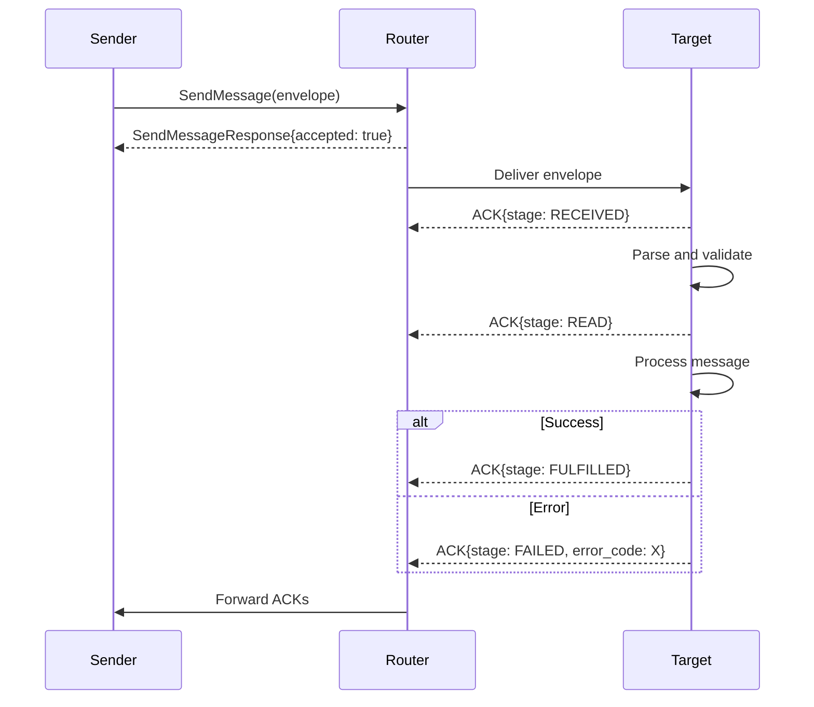

# 3. SW4RM Protocol Specification

([Link to full RFC](https://github.com/rahulrajaram/sw4rm/blob/master/documentation/protocol/spec.md))

**SW4RM Protocol v0.6.0** | **Status: Production Ready** | **Last Updated: 2026-02-11**

Related documents:

- [Protocol RFC](spec.md)
- [Protocol Extensions](extensions/index.md)
- [Voting Strategies](voting-strategies.md)
- [Spec Enhancements (Draft)](spec_enhancements.md)

??? note "Changelog"
    **0.6.0 (2026-02-11)**

    - Spec compliance and cross-SDK parity release.
    - Added Advanced Patterns to navigation (Negotiation Room, Handoff, Workflow Orchestration).
    - Added Spec Extensions to navigation.
    - Updated all protocol docs to match spec v0.6.0.
    - Refreshed stale protocol pages (messages, ACKs).
    - De-duplicated index/overview content.

    **0.5.0 (2026-01-04)**

    - Documentation alignment release. Updated protocol docs and examples to
      match current SDK/proto behavior and clarified planned features.

    **0.4.0 (2025-12-24)**

    - Added Negotiation Room pattern (Section 3.11.1)
    - Added Agent Handoff Protocol (Section 3.11.2)
    - Added Workflow Orchestration (Section 3.11.3)
    - Formalized Three-ID Model (Section 3.11.4)
    - Unified proto namespaces to `sw4rm.{service}` convention
    - Added edge case documentation for HITL unavailability
    - Added streaming cancellation protocol
    - Added activity buffer size limits

    **0.3.0 (2025-08-31)**

    - RFC rigor pass (BCP 14 compliance)
    - Expanded Activity Buffer documentation
    - Enhanced HITL expectations and message shapes
    - Comprehensive MCP/Tool Calling documentation
    - Renamed negotiation terminology to NegotiationPolicy

    **0.2.0 (2025-08-17)**

    - Canonicalized `sw4rm.*` package namespace
    - Enhanced negotiation protocol with event fanout
    - Room-based correlation semantics
    - Policy broadcast mechanisms

    **0.1.0 (2025-08-08)**

    - Initial specification release

This specification defines the SW4RM message-driven agent communication system. The protocol uses gRPC and Protocol Buffers to provide guaranteed message delivery, observability, and security features for distributed agentic systems.

This specification defines "Agent" as a supervised, process-isolated participant. See "Agents and Agentic Interaction" in documentation/index.md. This definition differs from common industry usage where "agent" means an LLM wrapper or in-process automation.

## 3.1. Executive Summary

The SW4RM protocol addresses the challenges of distributed agentic systems. The protocol provides the following capabilities:

- **Guaranteed Message Delivery**: The protocol delivers messages using at-least-once semantics. You configure consistency levels per message.
- **State Management**: The protocol persists state across failures and recovers automatically from crashes.
- **Security**: The protocol implements zero-trust architecture with mutual TLS and role-based access control.
- **Observability**: The protocol provides distributed tracing, metrics collection, and audit logging.
- **Horizontal Scalability**: The protocol scales linearly with no single points of failure.
- **Multi-Tenancy**: The protocol isolates agent workloads securely from each other.

## 3.2. Architectural Foundation and Design Principles

### 3.2.1. Service-Oriented Architecture (SOA) Implementation

SW4RM implements a **microservices architecture** with clear service boundaries, standardized communication protocols, and fault tolerance mechanisms. The architecture provides:

- **Independent Service Scaling**: You scale each service independently based on workload requirements.
- **Fault Isolation**: The system contains service failures so they do not cascade to other components.
- **Technology Diversity**: You implement services in different technologies while maintaining protocol compatibility.
- **Operational Independence**: You deploy, monitor, and manage each service independently.

```mermaid
graph TB
    subgraph "Client Layer [gRPC/TLS]"
        AGENT[Agent Applications<br/>Business Logic Layer]
        SDK[SW4RM SDK<br/>Runtime Library]
    end
    
    subgraph "Core Infrastructure Services"
        REGISTRY[Registry Service<br/>:50052<br/>Agent Discovery & Health]
        ROUTER[Router Service<br/>:50051<br/>Message Delivery & Routing]
        SCHEDULER[Scheduler Service<br/>:50053<br/>Task Distribution & Load Balancing]
    end
    
    subgraph "Extended Capability Services"
        HITL[Human-in-the-Loop Service<br/>:50061<br/>Approval Workflows & Escalation]
        WORKTREE[Worktree Service<br/>:50062<br/>Git Integration & Repository Management]
        TOOLS[Tool Service<br/>:50063<br/>External System Integration]
        NEGOTIATE[Negotiation Service<br/>:50064<br/>Multi-Agent Consensus & Coordination]
        NEGROOM[Negotiation Room Service<br/>:50068<br/>Multi-Agent Artifact Approval]
        REASON[Reasoning Service<br/>:50065<br/>Decision Support & Analytics]
        AUDIT[Audit Service<br/>:50066<br/>Compliance & Security Logging]
        CONNECT[Connector Service<br/>:50067<br/>External API Integration]
        ACTIVITY[Activity Service<br/>:50069<br/>Activity Buffer Management]
        SCHPOLICY[Scheduler Policy Service<br/>:50070<br/>Negotiation Policy & Profiles]
        HANDOFF[Handoff Service<br/>:50071<br/>Agent Delegation & Transfer]
        WORKFLOW[Workflow Service<br/>:50072<br/>DAG-Based Orchestration]
    end
    
    subgraph "Data & Storage Layer"
        POSTGRES[(PostgreSQL Cluster<br/>Transactional State)]
        REDIS[(Redis Cluster<br/>Session & Cache)]
        S3[(Object Storage<br/>Large Payloads & Archives)]
        GIT[(Git Repositories<br/>Source Code & Configuration)]
    end
    
    subgraph "Observability & Security"
        PROMETHEUS[Prometheus<br/>Metrics Collection]
        JAEGER[Jaeger<br/>Distributed Tracing]
        VAULT[HashiCorp Vault<br/>Secrets Management]
        CONSUL[Consul<br/>Service Discovery]
    end
    
    AGENT -->|gRPC/TLS| SDK
    SDK -->|Load Balanced| REGISTRY
    SDK -->|Message Flow| ROUTER
    SDK -->|Task Requests| SCHEDULER
    
    SDK -->|Approval Requests| HITL
    SDK -->|Repository Operations| WORKTREE
    SDK -->|External Calls| TOOLS
    SDK -->|Coordination| NEGOTIATE
    SDK -->|Analytics| REASON
    SDK -->|Audit Events| AUDIT
    SDK -->|API Integrations| CONNECT
    
    REGISTRY --> POSTGRES
    ROUTER --> POSTGRES
    ROUTER --> REDIS
    SCHEDULER --> POSTGRES
    SCHEDULER --> REDIS
    
    WORKTREE --> GIT
    TOOLS --> S3
    AUDIT --> S3
    
    REGISTRY -.-> PROMETHEUS
    ROUTER -.-> JAEGER
    SCHEDULER -.-> VAULT
    HITL -.-> CONSUL
```



### 3.2.2. Fundamental Protocol Design Principles

#### 3.2.2.1. Message-Driven Communication Model

**Event Sourcing Architecture**: All system interactions are represented as immutable events (messages) that form an event log, enabling complete system state reconstruction and audit trails.

**Technical Implementation**:

- **Message Persistence**: The system persists all messages durably before acknowledgment using write-ahead logging.
- **Event Ordering**: The system orders messages globally using hybrid logical clocks (HLC) for causal consistency.
- **Message Deduplication**: The system uses SHA-256 content hashing to prevent duplicate message processing.
- **Delivery Semantics**: You configure delivery guarantees as at-most-once, at-least-once, or exactly-once.

<!-- This document omits performance characteristics to avoid implying guarantees. -->

#### 3.2.2.2. Distributed System Consistency Model

**Consistency Options**:

- **Eventual Consistency (Default)**: The system uses eventual consistency as the default mode and guarantees eventual convergence.
- **Strong Consistency**: You configure strong consistency for critical operations. The system uses distributed consensus.
- **Causal Consistency**: The system maintains causal relationships between related messages using vector clocks.
- **Session Consistency**: The system guarantees consistency within agent session boundaries.

**Consistency Configuration**:
```protobuf
message ConsistencyConfig {
  ConsistencyLevel default_level = 1;
  map<string, ConsistencyLevel> operation_overrides = 2;
  uint32 eventual_consistency_timeout_ms = 3;  // Default: 5000ms
  uint32 strong_consistency_timeout_ms = 4;    // Default: 30000ms
}

enum ConsistencyLevel {
  EVENTUAL = 0;      // Best performance, eventual convergence
  CAUSAL = 1;        // Maintains causal relationships
  SESSION = 2;       // Consistency within agent sessions
  STRONG = 3;        // Distributed consensus, highest latency
}
```

#### 3.2.2.3. Security Architecture

**Zero-Trust Network Model**: Every service interaction requires authentication and authorization. The system establishes no implicit trust relationships.

**Security Layers**:

1. **Transport Security**:
   - The system uses mutual TLS (mTLS) for all inter-service communication.
   - The system uses TLS 1.3 with forward secrecy using ECDHE key exchange.
   - The system rotates certificates with a 24-hour certificate lifetime.
   - The system pins certificates for critical service connections.

2. **Authentication and Authorization**:
   - The system integrates OAuth 2.0 and OpenID Connect for external authentication.
   - The system issues JWT tokens with configurable expiration. The default is 1 hour.
   - The system enforces Role-Based Access Control (RBAC) with fine-grained permissions.
   - The system supports Attribute-Based Access Control (ABAC) for complex authorization scenarios.

3. **Data Protection**:
   - The system encrypts sensitive payloads using AES-256-GCM.
   - The system encrypts PII and sensitive data at the field level.
   - The system verifies message integrity using cryptographic signatures.
   - The system integrates with HashiCorp Vault or AWS KMS for key management.

**Security Configuration Example**:
```protobuf
message SecurityConfig {
  TLSConfig tls_config = 1;
  AuthenticationConfig auth_config = 2;
  EncryptionConfig encryption_config = 3;
  AuditConfig audit_config = 4;
}

message TLSConfig {
  string ca_cert_path = 1;
  string client_cert_path = 2;
  string client_key_path = 3;
  repeated string cipher_suites = 4;
  uint32 handshake_timeout_seconds = 5;  // Default: 10
  bool enable_cert_pinning = 6;
}

message AuthenticationConfig {
  string jwt_secret_key = 1;
  uint32 token_expiry_seconds = 2;       // Default: 3600
  repeated string allowed_issuers = 3;
  bool enable_service_accounts = 4;
  string service_account_key_path = 5;
}
```

#### 3.2.2.4. Enterprise-Grade Observability Framework

**Three Pillars of Observability Implementation**:


1. **Metrics Collection**:
   - The system collects business metrics including message processing rates, success and failure ratios, and processing latencies.
   - The system collects system metrics including CPU, memory, network, and disk utilization per service.
   - You define custom metrics for domain-specific KPIs and performance indicators.
   - The system alerts in real time using configurable thresholds and escalation policies.

2. **Distributed Tracing**:
   - The system implements OpenTelemetry-compliant distributed tracing across all service boundaries.
   - The system supports four trace sampling strategies: always, never, probabilistic, and adaptive.
   - The system correlates traces across message processing pipelines.
   - The system identifies performance bottlenecks and provides optimization recommendations.

3. **Structured Audit Logging**:
   - The system writes immutable audit logs with cryptographic integrity verification.
   - The system logs all security events including authentication, authorization, and data access.
   - The system maintains business process audit trails for compliance requirements.
   - The system enforces log retention policies with automated archival to cold storage.

**Observability Configuration**:
```protobuf
message ObservabilityConfig {
  MetricsConfig metrics = 1;
  TracingConfig tracing = 2;
  LoggingConfig logging = 3;
}

message TracingConfig {
  bool enabled = 1;
  string jaeger_endpoint = 2;
  SamplingStrategy sampling = 3;
  map<string, string> tags = 4;
}

enum SamplingStrategy {
  ALWAYS = 0;
  NEVER = 1;
  PROBABILISTIC = 2;  // Requires sampling_rate
  ADAPTIVE = 3;       // AI-based sampling
}
```

## 3.3. Core Concepts

### 3.3.1. Message Envelope

Every message is wrapped in a standard envelope providing:

```protobuf
message Envelope {
  string message_id = 1;                // UUIDv4 per attempt
  string idempotency_token = 2;         // Stable across retries
  string producer_id = 3;               // Source agent identifier
  string correlation_id = 4;            // Request/response correlation
  uint64 sequence_number = 5;           // Ordering within conversation
  uint32 retry_count = 6;               // Retry attempt number
  MessageType message_type = 7;         // Message classification
  string content_type = 8;              // Payload format (MIME type)
  uint64 content_length = 9;            // Payload size in bytes
  string repo_id = 10;                  // Repository context (optional)
  string worktree_id = 11;              // Worktree context (optional)  
  string hlc_timestamp = 12;            // Hybrid logical clock
  uint64 ttl_ms = 13;                   // Time-to-live in milliseconds
  google.protobuf.Timestamp timestamp = 14; // Delivery timestamp
  bytes payload = 15;                   // Message content
}
```

### 3.3.2. Message Types

| Type | Value | Description | Use Case |
|------|-------|-------------|----------|
| `CONTROL` | 1 | System commands | Status requests, configuration |
| `DATA` | 2 | Application payload | Business logic, responses, content |
| `HEARTBEAT` | 3 | Liveness signals | Health checks, keep-alive |
| `NOTIFICATION` | 4 | One-way informational messages | Alerts, status updates (no ACK expected) |
| `ACKNOWLEDGEMENT` | 5 | Message confirmations | Delivery receipts, error reports |
| `HITL_INVOCATION` | 6 | Human-in-the-loop requests | Approval workflows, escalations |
| `WORKTREE_CONTROL` | 7 | Repository operations | Bind, unbind, switch contexts |
| `NEGOTIATION` | 8 | Multi-party coordination | Consensus, resource allocation |
| `TOOL_CALL` | 9 | External tool execution | API calls, system commands |
| `TOOL_RESULT` | 10 | Tool execution results | Success responses, data returns |
| `TOOL_ERROR` | 11 | Tool execution failures | Error conditions, exceptions |

### 3.3.3. Acknowledgment Lifecycle

Every message follows a predictable ACK progression:



**ACK Stages:**

- `RECEIVED` (1): The target received the message.
- `READ` (2): The target parsed and validated the message.
- `FULFILLED` (3): The target completed processing successfully.
- `REJECTED` (4): The target rejected the message due to policy or validation failure.
- `FAILED` (5): The target failed to process the message due to an error.
- `TIMED_OUT` (6): The target exceeded time limits during processing.

## 3.4. Service Architecture

### 3.4.1. Core Services

**Registry Service** manages agent lifecycle.

- The Registry Service registers agents and enables discovery.
- The Registry Service monitors health and processes heartbeats.
- The Registry Service advertises agent capabilities.

**Router Service** delivers messages.

- The Router Service routes messages between agents with guaranteed delivery.
- The Router Service streams and buffers messages.
- The Router Service balances load and handles failover.

**Scheduler Service** coordinates work.

- The Scheduler Service distributes and prioritizes tasks.
- The Scheduler Service allocates resources and handles preemption.
- The Scheduler Service manages the activity buffer.

### 3.4.2. Extended Services

**HITL Service** provides human oversight.

- The HITL Service manages escalation workflows and approvals.
- The HITL Service handles decision points and manual overrides.
- The HITL Service maintains audit trails for compliance.

**Worktree Service** manages repository context.

- The Worktree Service binds and switches Git repositories.
- The Worktree Service manages branches and commits.
- The Worktree Service isolates workspaces.

**Tool Service** integrates external systems.

- The Tool Service executes APIs and system commands.
- The Tool Service captures results and handles errors.
- The Tool Service enforces permission and security policies.

## 3.5. Message Patterns

### 3.5.1. Request-Response
```protobuf
// Request
message: {
  message_type: DATA,
  correlation_id: "req-123",
  payload: {...}
}

// Response  
message: {
  message_type: DATA,
  correlation_id: "req-123",
  payload: {...}
}
```

### 3.5.2. Fire-and-Forget
```protobuf
message: {
  message_type: NOTIFICATION,
  correlation_id: "",  // No response expected
  payload: {...}
}
```

### 3.5.3. Command Pattern
```protobuf
message: {
  message_type: CONTROL,
  payload: {
    "command": "status",
    "parameters": {...}
  }
}
```

## 3.6. Error Handling

### 3.6.1. Error Codes

| Code | Name | Description |
|------|------|-------------|
| 0 | `UNSPECIFIED` | No error or unknown error |
| 1 | `BUFFER_FULL` | Message queue capacity exceeded |
| 2 | `NO_ROUTE` | No path to destination agent |
| 3 | `ACK_TIMEOUT` | Acknowledgment not received in time |
| 6 | `VALIDATION_ERROR` | Message format or content invalid |
| 7 | `PERMISSION_DENIED` | Insufficient privileges for operation |
| 9 | `OVERSIZE_PAYLOAD` | Message exceeds size limits |
| 99 | `INTERNAL_ERROR` | Unexpected system failure |

### 3.6.2. Error Response Pattern
```protobuf
ack: {
  ack_for_message_id: "original-msg-id",
  ack_stage: FAILED,
  error_code: VALIDATION_ERROR,
  note: "Required field 'agent_id' missing"
}
```

## 3.7. Security Model

### 3.7.1. Authentication

- The system authenticates service-to-service communication using mutual TLS.
- The system verifies agent identity using public key cryptography.
- The system manages sessions using tokens.

### 3.7.2. Authorization

- The system enforces role-based access control (RBAC) for service operations.
- The system applies message-level permissions based on sender and receiver identity.
- The system filters and transforms messages based on policy.

### 3.7.3. Data Protection

- The system encrypts sensitive payloads end-to-end.
- The system logs all security-relevant operations for audit.
- The system complies with data residency and retention policies.

## 3.8. Deployment Considerations

### 3.8.1. Scalability

- You scale all services horizontally.
- The system partitions and shards messages.
- The system balances load with session affinity.

### 3.8.2. Reliability

- The system guarantees at-least-once message delivery.
- The system implements circuit breakers and retry policies.
- The system degrades gracefully during partial failures.

### 3.8.3. Observability

- The system traces requests across service boundaries.
- The system collects metrics for throughput, latency, and error rates.
- The system logs in structured format with correlation IDs.

## 3.9. Comparison with Google's Agent-to-Agent Protocol

### Overview of Google's A2A Protocol

Google's Agent2Agent (A2A) is an open standard for enterprise-grade interoperability among AI agents. A2A provides the following capabilities:

- **Agent Discovery via Agent Cards**: Agents advertise capabilities in a JSON Agent Card format. Other agents use Agent Cards to find the best fit for a task.

- **Task-Oriented Communication**: Client agents send tasks to remote agents. Remote agents respond with artifacts and real-time status updates. A2A supports long-running tasks and streaming as first-class features.

- **Secure Standard Protocol**: A2A uses HTTP, JSON-RPC, and Server-Sent Events. A2A includes enterprise-ready authentication and authorization aligned with OpenAPI schemes.

- **Modality Agnostic**: A2A supports text, audio, video, and multi-part content. A2A negotiates content through "parts" attached to each message.

- **Interoperability with MCP**: A2A complements Anthropic's Model Context Protocol (MCP). MCP focuses on tool invocation. Together they create a full-stack agent interoperability ecosystem.

### Architectural Comparison

| Aspect                            | A2A Protocol                                    | SW4RM Framework                                                    |
| --------------------------------- | ----------------------------------------------- | ------------------------------------------------------------------ |
| **Discovery Mechanism**           | Agent Card-based (via well-known URLs)          | Internal registry with broadcast discovery                         |
| **Underlying Transport**          | HTTP / JSON-RPC / SSE                           | gRPC-native                                                        |
| **Modality Handling**             | "Parts" with content-type negotiation           | content\_type + modality capabilities in registry                  |
| **Task Focus**                    | External task outsourcing and artifact return   | Intra-system task scheduling and messaging                         |
| **Preemption & Scheduling**       | Not addressed                                   | Preemption, priorities, safe-points deeply defined                 |
| **Preemptible Sections**          | ─                                               | Fully specified (§7)                                               |
| **Idempotency / Retry Logic**     | ─                                               | Robust idempotency\_token model with cache (§11.1)                 |
| **Negotiation & HITL Escalation** | ─                                               | Built-in negotiation framework (§17) and escalation via HITL (§15) |
| **Worktree & Confinement**        | ─                                               | Explicit Git worktree isolation (§16)                              |
| **Observability & Logging**       | Enterprise-secure flow, but spec is lightweight | Strict structured logs and audit trails (§19)                      |

### Overlap with SW4RM Specification

**Similarities:**

- **Agent Discovery and Registration**: A2A Agent Cards align with SW4RM Registry and Discovery module. SW4RM supports name, capabilities, modality, and description in the registry (§14). SW4RM does not use the Agent Card structure explicitly.

- **Secure Communication and Modality Support**: SW4RM uses gRPC with optional signing and multi-modal content types. This corresponds to A2A's modality-agnostic design and enterprise security foundation.

- **Long-Running Tasks and States**: A2A supports long-running workflows. SW4RM provides a parallel implementation through task lifecycle, message states, and streaming tool calls.

**Complementary Design Philosophy:**

Google's A2A focuses on secure, interoperable agent messaging across enterprise boundaries. A2A emphasizes discovery, modality negotiation, and long-running tasks. SW4RM defines deeper machinery: scheduling, cancellation, preemption, idempotency, negotiation, worktree confinement, logs, and tool integration. You can use both together: A2A for agent-to-agent orchestration and SW4RM for a resilient internal engine.

## 3.10. Next Steps


- [Message Types](messages.md) - Detailed message specifications
- [Content Types](content-types.md) - MIME types and payload format conventions
- [Services](services.md) - Complete service API reference
- [ACK Lifecycle](acks.md) - Acknowledgment handling patterns
- [Advanced Patterns (v0.6.0)](advanced-patterns.md) - Negotiation Room, Agent Handoff, Workflow Orchestration, Three-ID Model
- [Handoff Serialization](handoff-serialization.md) - Agent delegation and state transfer wire format
- [Spec Extensions](spec_extensions.md) - Protocol extension specifications
- [Deprecations](../migration/deprecations.md) - Deprecated APIs and migration guides
