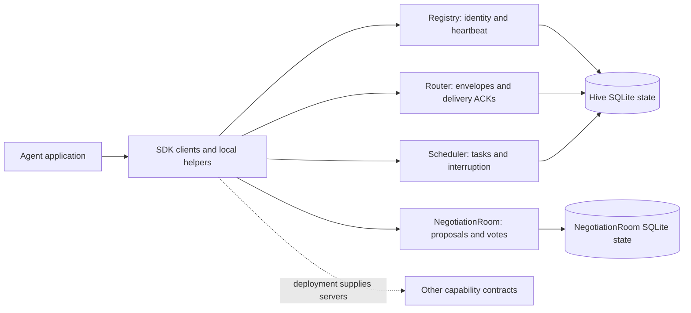

# 3. Protocol reference

**Development target: 0.7.0.** Published SDK packages remain 0.6.0. This protocol
and its reference implementations are experimental; see
[release status](../release-status.md) and
[implementation coverage](implementation.md) before relying on a capability.

The [RFC specification](spec.md) defines requirements. Canonical root proto
files define the wire schema. The [generated reference](../reference/release-contract.md)
provides the current service/RPC inventory and version carriers. This chapter
introduces how the pieces fit together before you implement a message flow.

## Reading order

1. Read [implementation coverage](implementation.md) to distinguish running
   backends, SDK helpers, and requirements that are not implemented.
2. Read [messaging](messages.md), [router delivery](../clients/router.md), and
   [acknowledgements](acks.md) together.
3. Read [activity buffers](activity-buffer.md) and
   [persistence](../quickstart/persistence.md) for local recovery boundaries.
4. Read [voting strategies](voting-strategies.md) and
   [NegotiationRoom](../clients/negotiation-room.md) for artifact review.
5. Consult [extensions](extensions/index.md) for versioned additions and drafts.

## Core concepts

An agent is an independently supervised participant with an identity and an
explicit lifecycle. Its application code handles work; the protocol describes
how that work is communicated, acknowledged, interrupted, and transferred.
An LLM may support its decisions, but message handling and durable recovery must
also work when the model or another service is unavailable.

| Concept | What you supply | What it lets you track |
|---|---|---|
| Envelope | Producer ID, message type, encoded payload and content type | One transmission attempt and its context |
| `message_id` | A UUIDv4 for each new attempt | The exact attempt named by an ACK |
| `correlation_id` | A stable workflow/session UUID | Related requests, responses, and diagnostics |
| `idempotency_token` | A stable token for one logical operation | Duplicate work across retries |
| Application ACK | Stage, original attempt ID, error code and note | Receipt, validation, completion, or terminal failure |
| Router delivery sequence | Preserve `StreamItem.seq` from the server | The pending recipient delivery released by `AckDelivery` |
| Activity buffer | Persisted message records using your SDK's backend | Unfinished work after a process restart |

The [message guide](messages.md) covers the entire message-type enum and gives
a worked three-ID retry example. [Content Types](content-types.md) explains how
to encode, validate, and dispatch the payload. Neither a content hash nor a
correlation ID is an external-effect transaction.

## Service architecture

Registry describes agents and receives their heartbeats. Router transports
envelopes. Scheduler accepts agent-targeted tasks and interruption requests.
NegotiationRoom collects artifact proposals, critic votes, and decisions. These
four services have Python reference implementations with local SQLite state.

Other contracts cover human decisions, worktree binding, tool execution,
provider descriptors, debate, workflow, reasoning, policy, logs, and artifacts.
They let you implement those capabilities behind consistent wire interfaces;
they do not automatically provision a backend.

State belongs to each service. There is no system-wide transaction spanning
registration, task acceptance, delivery, and an agent's business effect. The
[service guide](services.md) walks through every service's calls, response
checks, and operational boundary; the [schema reference](../reference/protobuf.md)
contains their exact protobuf definitions.

## Message patterns

### Request and response

For an application request, send a `DATA` envelope with a declared payload
schema, a new attempt ID, and the workflow's correlation ID. Give the logical
request a stable idempotency token. The handler validates the payload, performs
the work safely, and publishes the result using the same workflow correlation
ID and a new message ID. The response is a different logical operation and
should not reuse the request's deduplication token.

Core correlation groups a conversation; it does not identify which of several
concurrent requests a response answers. For that case, agree an application
payload field linking the response to its request, or implement the explicit
semantics in [SW4-007](extensions/SW4-007-explicit-request-response-semantics.md)
on both ends. That extension remains a draft. The reference router broadcasts
to known queues; use application filtering or an addressed contract where
recipient selection is required.

### Notification

Use `NOTIFICATION` for an informational event such as progress or an alert.
Its application semantics do not require an ACK reply, preventing endless
notification/ACK chatter. A notification delivered in `StreamItem` still needs
the separate router delivery acknowledgement. A correlation ID is useful even
when no response is expected, because it links the event to its workflow.

### Control and tool operations

Use `CONTROL` for an agreed application command and validate its action and
parameters before dispatch. A payload saying "shutdown" is not authorization
to stop another agent. Use Scheduler's dedicated preemption/shutdown contracts
when implementing scheduler control, and apply the appropriate policy checks.

Tool operations can use the `TOOL_CALL`, `TOOL_RESULT`, and `TOOL_ERROR` message
types, or the Tool service's unary/streaming RPCs. Preserve the call ID across
frames and errors. Message types classify payloads; they do not themselves
invoke a tool provider or install a handler.

## Error handling

| Error | Interpretation | Next action |
|---|---|---|
| `BUFFER_FULL` (1) | Receiver cannot admit more work | Reduce load and back off |
| `NO_ROUTE` (2) | Routing could not find an eligible path | Inspect membership and route configuration |
| `ACK_TIMEOUT` (3) | Expected application acknowledgement did not arrive | Reconcile before retrying; work may have run |
| `AGENT_UNAVAILABLE` (4) | Target cannot currently handle work | Check heartbeat and recovery status |
| `VALIDATION_ERROR` (6) | Envelope or payload is invalid | Correct the request rather than repeat it |
| `PERMISSION_DENIED` (7) | Policy refuses the operation | Resolve authorization before resubmission |
| `OVERSIZE_PAYLOAD` (9) | Payload exceeds the supported limit | Reduce it or use an agreed external reference |
| `INTERNAL_ERROR` (99) | Unclassified processing failure | Preserve evidence; retry only if safe |

These are selected canonical error codes, not a claim that every reference
server emits every code. For an application failure, the `Ack` payload names
`ack_for_message_id`, `ack_stage`, `error_code`, and `note`; its enclosing
Envelope has `message_type=ACKNOWLEDGEMENT`. See [Message Types](messages.md)
for the complete ACK shape and [Error Handling](../clients/error-handling.md)
for client exceptions and retry procedures.

## Delivery profile

The Python reference router uses persisted pending rows and explicit consumer
acknowledgements. Unacknowledged items can be redelivered after reconnect or lease
expiry. A recipient preserves `StreamItem.seq`, distinct from envelope sequence
numbers, and calls `AckDelivery` after taking responsibility for processing.

This is at-least-once delivery. Arbitrary external effects can still repeat after
a crash. Application `Ack` envelopes and router `AckDelivery` are separate
operations. There is no selectable exactly-once delivery mode.

## Specification and implementation

A normative MUST describes a conforming implementation requirement; it is not a
claim that every reference backend satisfies it today. Security, HITL, resource
isolation, high availability, and worktree enforcement require particular
implementations. A proto service or generated client alone supplies none of those.
The source-derived inventory and the implementation coverage page are the release
review entry points.

## Deployment and security decisions

Before enabling an agent flow, decide who owns each durable record, what proves
completion, and what happens if either side restarts. Test the crash interval
between an external effect and its completion record. For message ordering,
distinguish envelope sequence metadata from router delivery sequence; concurrent
handlers and redelivery can change completion order.

The reference servers are useful for local integration. A multi-host deployment
needs an explicit design for shared or partitioned state, failover, stream
affinity, capacity limits, and recovery. PostgreSQL, Redis, leader election,
configurable consistency modes, and automatic autoscaling are not provisioned
by the core protocol or reference stack.

Native gRPC requires HTTP/2; an HTTP/1.1 edge needs its own compatible gateway.
Authenticate peers, authorize claimed agent IDs and resource operations, confine
worktree/tool effects, and protect retained payloads and logs. RFC §6 and §23
state security requirements. The current local services do not establish a
complete mTLS, token, encryption, or certificate-rotation system.

For observability, record attempt and correlation IDs with stage transitions,
timeouts, retries, and terminal outcomes. Measure pending work and processing
latency separately from transport acceptance. See [Deployment Patterns](../examples/deployment.md)
and the [observability draft](extensions/SW4-003-observability.md) for the
operational guidance and proposed metric vocabulary.

## A2A comparison

This retained anchor supports links from earlier drafts. The current
[product assessment](../product-direction.md) compares A2A and other alternatives.
The local gateway implements a subset; it is not evidence of complete compliance
with the latest A2A specification.
