# RFC: SW4RM - Interruptible, Message-Driven Agent Coordination Protocol

Version: 0.6.0 (2026-01-10)

## Versioning and Changelog

This specification follows semantic versioning principles adapted for pre-1.0 development. Normative changes that impact implementers trigger MINOR version increments, while editorial and formatting changes use PATCH increments. Pure structural reorganizations do not require version bumps.

The versioning scope encompasses this document and the canonical protocol buffer namespace guidance (`sw4rm.*`). Until version 1.0, MINOR releases MAY introduce breaking changes, which are explicitly documented and called out in migration guidance.

**Changelog:**

- **0.6.0 (2026-01-10)**: Spec completeness release. Added policy-based auto-approval thresholds for Negotiation Room (§17.5). Added DAG validation and cycle detection requirements for Workflow Orchestration (§17.7). Expanded Appendix A with complete proto file reference table. Added explicit three-ID model documentation (§11.3) clarifying `message_id`, `correlation_id`, and `idempotency_token` semantics. Added sequence diagrams for Negotiation Room (C.10), Handoff (C.11), and Workflow (C.12) patterns.

- **0.5.0 (2026-01-04)**: Documentation alignment release. Updated protocol docs
  and examples to reflect actual SDK/proto behavior and clarified planned vs
  implemented features. No wire-format changes.

- **0.4.0 (2025-12-23)**: Added Negotiation Room pattern (§17.5), Agent Handoff Protocol (§17.6), and Workflow Orchestration (§17.7) to align spec with proto definitions. Unified proto namespaces to `sw4rm.{service}` convention (e.g., `sw4rm.negotiation_room`, `sw4rm.handoff`, `sw4rm.workflow`). Added edge case documentation for HITL unavailability (§15.4), streaming cancellation (§18.6), and activity buffer limits (§10.1). Formalized EnvelopeState lifecycle and three-ID model.

- **0.3.0 (2025-08-31)**: RFC rigor pass (BCP 14, imperative voice, ASCII), expanded sections 10 (Activity Buffer), 11 (Messaging Model readability), 13 (Buffers and Back-Pressure with examples and metrics), 15 (HITL expectations and message shapes), and 18 (MCP/Tool Calling with discovery, invocation, retries, security). Renamed negotiation policy terminology to NegotiationPolicy (formerly "Waggle/Pheromone" naming) in this document and example stubs; clarified canonical proto packaging policy in §5.1. Note: canonical proto identifiers will be updated to match NegotiationPolicy in a subsequent proto release.

- **0.2.0 (2025-08-17)**: Canonicalized `sw4rm.*` package namespace; enhanced negotiation protocol with event fanout (JSON), room-based correlation semantics (`correlation_id=negotiation_id`), policy broadcast mechanisms (NegotiationPolicy/EffectivePolicy), comprehensive validation/diff/scoring guidance; introduced optional policy and activity protocol buffer stubs. This release maintains wire compatibility with 0.1.x implementations beyond the namespace canonicalization requirement.

- **0.1.1 (2025-08-08)**: Editorial clarifications and protocol buffer formatting improvements. No normative behavioral changes.

- **0.1.0 (2025-08-08)**: Initial specification release establishing core framework concepts and requirements.

## 1. Status of this Memo

This document specifies the SW4RM (pronounced "swarm") protocol for interruptible, message-driven Agent coordination. It defines normative requirements for conformant implementations and provides implementation guidance.

This specification targets implementers of Agent coordination systems, distributed task schedulers, and automation frameworks.

Distribution of this memo is unlimited.

## 2. Abstract

This document defines the SW4RM protocol for coordinating interruptible, message-driven agents in distributed computing environments. The protocol enables automated task orchestration with human oversight capabilities.

The framework comprises: a central Scheduler for task ordering and preemption; a routed messaging plane with explicit lifecycle management; Human-In-The-Loop (HITL) escalation; worktree isolation for concurrent operations; inter-agent negotiation protocols; and MCP-compatible tool calling.

Agents are process-isolated, register capabilities with the Scheduler, and communicate through typed messages. The system supports both single-node and distributed deployments.

## 3. Terminology

The key words "MUST", "MUST NOT", "REQUIRED", "SHALL", "SHALL NOT", "SHOULD", "SHOULD NOT", "RECOMMENDED", "NOT RECOMMENDED", "MAY", and "OPTIONAL" in this document are to be interpreted as described in BCP 14 (RFC 2119 and RFC 8174) when, and only when, they appear in all capitals, as shown here. These terms indicate the relative requirements of protocol elements, with "MUST" indicating absolute requirements and "MAY" indicating truly optional elements.

This section defines core SW4RM concepts and entities.

### Core Entities

**Agent**: Process-isolated execution participant supervised by the Scheduler. Registers capabilities, receives task assignments, and executes work. Maintains own execution context and MAY specialize in specific operations.

**Task**: Unit of work executed by an Agent. Carries priority, resource requirements, and scope metadata. Tasks MAY be interdependent and MAY generate additional tasks.

**Message**: Routed communication unit with defined lifecycle (creation to completion/failure). Carries typed payloads and correlation identifiers for tracking.

**Scheduler**: Central authority for task ordering, preemption, message routing, and HITL invocations. Authoritative source for system state and policy enforcement.

### Supporting Components

**Inference Engine**: Decision support service that an Agent uses to inform its own state changes and decision-making. Each Agent MAY have its own Inference Engine that employs algorithms, ML models, LLMs, or rule systems. An Agent's Inference Engine MUST NOT directly mutate other Agents' or the Scheduler's state. The Inference Engine SHOULD return confidence scores for its recommendations to the Agent.

**Tool**: External capability invokable by Agents. Enables interaction with external systems, databases, or APIs. Tools MUST expose MCP-like descriptive interfaces that Agents use for capability discovery and invocation.

**Worktree**: Git worktree bound to specific Agent. Provides isolated filesystem access for repository operations, enabling safe concurrent operations on shared codebases.

### Communication and Coordination

**Communication Class**: Agent routing preference affecting message priority and delivery. Three classes: PRIVILEGED (high-priority, low-latency), STANDARD (normal traffic), BULK (high-volume, latency-tolerant).

**Connector**: Protocol adapter for Tool/Inference Engine integration. Handles protocol translation, capability negotiation, and lifecycle management.

## 4. Architecture

The SW4RM framework employs a hub-and-spoke architectural pattern with the Scheduler serving as the central coordination hub and Agents operating as autonomous spokes. This design choice prioritizes system-wide consistency and coordination over fully distributed decision-making, reflecting the framework's focus on managing complex, interdependent tasks that require careful orchestration.

### Core Components

The architecture comprises several key components that work together to provide reliable, coordinated task execution:

**Scheduler (Central Hub)**: The Scheduler serves as the authoritative coordinator for all system operations. It maintains definitive state for both task queues and message routing, performs system-wide reconciliation operations, and serves as the exclusive authority for execution preemption and Human-In-The-Loop escalations. This centralized approach ensures global consistency and enables sophisticated scheduling policies that consider system-wide resource constraints and task dependencies.

**Agents (Execution Nodes)**: Agents operate as semi-autonomous execution environments that register their capabilities with the Scheduler, receive task assignments, and execute work within their designated domains. Each Agent maintains its own execution context and local state while participating in the broader coordination protocols. Agents communicate exclusively through the central routing infrastructure, ensuring that all interactions are observable and controllable by the Scheduler.

**Routed Messaging Plane**: The messaging infrastructure provides reliable, ordered communication between all framework components. Messages follow explicit lifecycle protocols from creation through terminal states, enabling robust error handling and system recovery. The routing layer enforces communication policies, manages message priorities based on Communication Classes, and provides the foundation for system observability.

**Human-In-The-Loop (HITL)**: Capability for human operator intervention when escalation conditions are met. The Scheduler MUST provide interfaces for handling policy violations, conflict resolution scenarios, security approvals, and other situations requiring human judgment or oversight.

**Tool and Connector Layer (Optional)**: Layer for Agents to interact with external systems through standardized interfaces. Tools provide specific capabilities (database access, API integration, specialized processing), while Connectors handle the protocol adaptation and lifecycle management required for these integrations.

**Observability Sink**: Observability infrastructure captures, correlates, and stores telemetry data from all framework components. This enables system monitoring, debugging, audit trails, and performance analysis across the distributed system.

### Communication Protocols

All inter-component communication operates over gRPC protocols, providing strong typing, efficient serialization, and robust error handling. This choice enables reliable communication patterns while supporting both unary request-response interactions and streaming data flows as needed for different operational scenarios.

The current architecture specification defines **unicast** routing semantics, where each message is delivered to a single designated recipient. This design simplification reduces complexity in the initial protocol version while maintaining the architectural foundation needed to support multicast or broadcast patterns in future iterations.

### State Management and Consistency

The Scheduler maintains authoritative state for all system-wide concerns, including task queues, agent registrations, message routing tables, and policy configurations. This centralized state management approach enables strong consistency guarantees and simplifies reasoning about system behavior, particularly important for managing complex task dependencies and resource conflicts.

### Optional Enhancements

**Hybrid Logical Clocks (HLC)**: Implementations MAY enable HLC timestamping to support causal relationship analysis across the distributed system. This capability can enhance debugging, audit trails, and system analysis without impacting the core coordination protocols.

For example, when Agent A sends a task completion message that triggers Agent B to start a related task, HLC timestamps enable precise causal ordering analysis:

```
Agent A completes task: HLC="1725552000.000001.node-a"
Agent B receives notification: HLC="1725552000.000002.node-b"
Agent B starts dependent task: HLC="1725552000.000003.node-b"
```

The HLC format combines physical time (Unix microseconds), logical counter, and node identifier, enabling operators to reconstruct the precise causal chain even when wall-clock times differ across hosts. This is particularly valuable for debugging race conditions and analyzing complex multi-agent interaction patterns.

## 5. Transport

The framework's transport layer builds upon gRPC to provide reliable, type-safe communication between all system components. This choice reflects the need for robust inter-process communication that can handle both request-response patterns and streaming data flows while maintaining strong typing and efficient serialization.

### 5.1. Protocol Foundation

The transport layer employs a hybrid approach combining gRPC unary RPCs for synchronous operations and server-streaming RPCs for scenarios requiring real-time data delivery or long-lived connections. This combination provides the flexibility needed for diverse communication patterns within the framework while maintaining the benefits of gRPC's protocol buffers and HTTP/2 foundation.

**HTTP Version Requirements**: While gRPC implementations typically prefer HTTP/2 for optimal performance (multiplexing, header compression, flow control), the framework MUST support HTTP/1.1 fallback to ensure broad deployment compatibility. Many enterprise environments, proxy configurations, and network appliances may not fully support HTTP/2, making HTTP/1.1 compatibility essential for production deployments. However, implementations SHOULD prefer HTTP/2 when available to benefit from improved performance characteristics.

All framework components MUST expose interfaces that conform to the canonical protobuf contracts. The canonical `.proto` files are versioned with this specification and serve as the single source of truth. Official SW4RM SDKs SHOULD distribute generated stubs by default and MAY include the canonical `.proto` sources for consumers who wish to regenerate. Each SDK release SHOULD reference the canonical proto artifact for the same version (for example, a tarball attached to the spec release). Implementations MUST NOT modify canonical messages or services; extensions MUST use separate packages or namespaces.

**Core Process Interfaces:**

- **Registry Service**: Agent registration, capability advertisement, and discovery (separate process)
- **Scheduler Interface**: Task submission, priority management, execution control, and message routing (single process combining scheduler and router functions)
- **HITL Interface**: Human intervention and escalation handling capability

**Embedded Component Interfaces:**

- **Observability Interface**: Telemetry collection, audit trails, and observability data (adapters embedded in each process)
- **Tool Interface**: External capability invocation and result handling (adapters embedded within agents)
- **Connector Interface**: Integration adapter management and protocol translation (embedded adapters for external services)
- **Worktree Interface**: Repository isolation and workspace management (component embedded within agents)

**Protocol-Level Interfaces:**

- **Negotiation Protocol**: Inter-agent collaboration and consensus building (direct agent-to-agent communication coordinated by scheduler, not a separate service)

### 5.2. Message Correlation and Tracing

All messages and stream communications MUST include a `correlation_id` field that enables tracking of related operations across component boundaries. This correlation mechanism is essential for debugging distributed operations, implementing proper error handling, and maintaining audit trails for complex multi-step processes.

Implementations MAY include Hybrid Logical Clock (HLC) timestamps in messages to support sophisticated causal analysis and ordering relationships. When HLC timestamps are enabled, they provide valuable debugging and analysis capabilities without impacting the core functional requirements of the protocol.

### 5.3. Service Health and Readiness (Implementation Guidance)

While this protocol specification does not mandate specific health signaling mechanisms, operational deployments benefit significantly from standardized health checking. Implementations SHOULD implement the gRPC Health Checking Protocol (`grpc.health.v1.Health`) to enable seamless integration with modern deployment and orchestration platforms.

This approach provides several operational benefits:

- **Container Orchestration Integration**: Kubernetes and similar platforms can leverage gRPC health probes for `readinessProbe` and `livenessProbe` configurations where supported, enabling more sophisticated health monitoring than simple TCP connectivity checks.

- **Administrative Tooling**: Command-line administrative tools can use standard utilities like `grpcurl` or `grpc-health-probe` to verify service status and diagnose connectivity issues without requiring framework-specific tooling.

- **Load Balancer Integration**: gRPC-aware load balancers can use health check results to make intelligent routing decisions, improving overall system reliability.

For implementations that cannot adopt the standard gRPC Health Checking Protocol due to technical constraints, implementations SHOULD expose a minimal HTTP `/healthz` endpoint that provides basic liveness indication. This fallback approach ensures that even simplified implementations can integrate with standard monitoring and orchestration tooling.

### 5.4. Payload Size, Chunking, and Batching

Implementations MUST declare payload sizes (`content_length`) for messages that carry payloads to enable pre-admission checks and resource planning. Implementations SHOULD enforce configurable maximum payload sizes and MUST reject oversize payloads with `error_code=oversize_payload`.

Chunking for large payloads is OPTIONAL and MUST be explicitly negotiated per route/tool. When chunking is enabled:

- Producers MUST include chunk sequence information, total chunk count, and per-chunk size, and SHOULD include per-chunk integrity hashes.
- Receivers MUST validate chunk integrity and MUST process payloads only after complete reassembly and validation.
- On partial delivery or corruption, receivers MUST fail the transfer with a descriptive error and MAY request retransmission of missing/corrupted chunks.

Batching is OPTIONAL and MUST be explicitly advertised by receivers. When batching is enabled:

- A batch is delivered atomically for transport admission (success/fail as a unit), but each message within a batch retains normal processing semantics and terminal states.
- Implementations MUST track per-message outcomes within a batch and MUST support retrying only failed members of a batch.
- Batches remain subject to overall size limits and SHOULD be constrained by size and count configuration.

### 5.5. Stream Resumption and Backlog Management

For long-lived streams, implementations SHOULD support durable resumption. Two patterns are permitted:

- Offset-based resumption: Consumers resume from the last acknowledged offset (sequence number/timestamp) plus one.
- Opaque token resumption: Consumers resume using an implementation-defined opaque token that encodes position.

Implementations MUST bound backlog processing to protect memory and latency. Receivers SHOULD provide time/size windows for resume, and MAY require checkpointing or periodic heartbeats to extend resume windows. Expired resume positions MUST fail with a clear error that includes recovery guidance.

### 5.6. SDK Implementation Guidance

SDK implementers building clients for SW4RM services should consult the supplementary SDK documentation for behavioral contracts and cross-SDK consistency requirements:

- **Operational Contracts**: Detailed behavioral specifications for HandoffClient, WorkflowClient, and NegotiationRoomClient including state machine rules, validation requirements, and edge case handling. See [Operational Contracts Documentation](../../sdks/docs/OPERATIONAL_CONTRACTS.md).

- **Error Codes**: Cross-SDK error code mappings, exception handling patterns, and gRPC status code requirements for Phase 3 integration. See [Error Codes Documentation](../../sdks/docs/ERROR_CODES.md).

These documents ensure behavioral consistency across Python, Rust, and TypeScript SDK implementations.

## 6. Identity and Security

Security within the SW4RM framework operates on multiple layers to provide comprehensive protection while maintaining operational flexibility. The security model adapts to different deployment scenarios, from single-user development environments to multi-tenant production systems, ensuring that appropriate security measures are applied based on the threat model and operational requirements.

### 6.1. Agent Identity Management

Each Agent within the framework maintains a stable `agent_id` that serves as its persistent identity across system restarts, reconnections, and other operational events. This stable identity enables consistent policy application, audit trail correlation, and long-term operational tracking.

The Agent identity system is designed to support various authentication mechanisms depending on the deployment context and security requirements. In single-user, localhost deployments where the threat model primarily concerns operational safety rather than adversarial security, simpler identity schemes MAY be appropriate. However, distributed deployments and multi-tenant environments require more robust identity assurance mechanisms.

### 6.2. Message Authentication and Integrity

The framework provides a pluggable message signing architecture that MAY be adapted to different security requirements:

**Development and Single-User Deployments**: Message signing MAY be disabled in environments where all components operate within a trusted boundary (such as a developer's local machine). This reduces operational complexity and performance overhead while maintaining the framework's coordination and safety properties.

**Distributed and Multi-Tenant Deployments**: Message signing MUST be enabled when the framework operates across network boundaries or supports multiple tenants. The signing mechanism employs modern cryptographic algorithms (Ed25519 or ECDSA) applied over both message metadata and payload content. Cryptographic keys are distributed and managed through the registry handshake process, ensuring that all participants can verify message authenticity and integrity.

The choice of cryptographic algorithms reflects current best practices in secure communications, with Ed25519 preferred for its performance characteristics and ECDSA available for environments requiring NIST-approved algorithms.

### 6.3. Access Control and Authorization

The framework MAY implement comprehensive Access Control Lists (ACLs) that constrain multiple dimensions of system access:

**Message Type Authorization**: ACLs MAY control which Agents can send and receive specific message types. This prevents unauthorized Agents from sending privileged control messages or accessing sensitive data channels.

**Tool Access Control**: ACLs MAY govern which Agents can invoke specific Tools and with what parameters. This is particularly critical for Tools that interact with external systems, modify persistent state, or access sensitive resources.

**Resource Scope Authorization**: ACLs MAY consider the scope and context of operations, enabling fine-grained control over what resources each Agent can access and modify.

### 6.4. Worktree Isolation and Confinement

Implementations SHOULD restrict agent filesystem access to designated worktree directories and prevent unauthorized access to system files or other agents' data:

**Application-Level Enforcement**: Implementations MUST validate that Agent filesystem operations remain within designated worktree boundaries through path canonicalization and access validation. This provides basic protection against accidental misuse and programming errors.

**Operating System Isolation**: Implementations MAY leverage operating system mechanisms for additional confinement, such as chroot jails, filesystem namespaces, container isolation, or security policy frameworks (AppArmor, SELinux). The choice of mechanism depends on deployment requirements, platform capabilities, and security posture.

**Path Traversal Protection**: All implementations MUST prevent path traversal attacks (e.g., "../../../etc/passwd") through input validation and path canonicalization before performing filesystem operations.

**Additional Resource Considerations**: Implementations MAY extend confinement beyond filesystem access to include network access restrictions, process spawning limitations, and inter-process communication controls, depending on the deployment threat model and operational requirements.

### 6.5. Security Considerations for Different Deployment Models

The framework's security requirements vary significantly based on deployment context and threat model. Implementations SHOULD adapt their security posture to match the operational environment while maintaining a baseline level of protection appropriate to the deployment scenario.

**Single-User Development Deployments**: In environments where a single developer operates all framework components on a trusted local system, implementations MAY relax authentication requirements and focus security measures on operational safety. The primary security concerns in this context are preventing accidental data corruption, resource exhaustion, and configuration errors that could impact system stability. Message signing MAY be disabled, and access controls MAY be simplified to reduce operational overhead.

**Multi-User Shared System Deployments**: When multiple users share framework resources on a common system, implementations MUST implement user-to-user isolation mechanisms. Each user's Agents MUST operate within distinct security boundaries that prevent access to other users' data, configurations, or system resources. Implementations SHOULD enforce process-level isolation, filesystem access controls, and resource quotas to ensure fair sharing and prevent interference between users.

**Multi-Tenant Production Deployments**: Production environments serving multiple organizational tenants require comprehensive security measures. Implementations MUST provide strong authentication for all participants, comprehensive authorization controls for all operations, complete audit trails for compliance and forensic analysis, and defense-in-depth protections against both external attackers and malicious insiders. All communications MUST be signed and optionally encrypted, and all access decisions MUST be logged and auditable.

## 7. Scheduler: Priority, Ordering, and Cooperative Preemption

The Scheduler component serves as the central coordination authority for task execution, implementing sophisticated priority management and preemption policies that balance system responsiveness with operational stability. The design philosophy emphasizes cooperative coordination over forceful interruption, reflecting the framework's focus on maintaining system consistency and data integrity during complex, long-running operations.

### 7.1. Task Priority System

Implementations MUST support a task priority system with integer values ranging from -19 (highest priority) to 20 (lowest priority). The default priority level MUST be 0. This priority range provides 40 distinct priority levels, enabling fine-grained scheduling control while maintaining compatibility with Unix process priority conventions.

**Priority-Based Task Ordering**: The Scheduler MUST order tasks first by numerical priority value (lower numbers indicating higher priority), then by arrival time within each priority level using First-In-First-Out (FIFO) semantics. Tasks with priority -19 MUST be scheduled before tasks with priority -18, and so forth. Within a single priority level, tasks MUST be ordered by their submission timestamp.

**Preemption Requirements**: When a new task is submitted with a priority value numerically lower (higher priority) than the currently executing task's priority, the Scheduler MUST initiate a preemption sequence for the running task. The Scheduler MUST NOT initiate preemption for tasks of equal or lower priority. This requirement ensures that urgent tasks receive immediate scheduling attention without unnecessary interruption of equal-priority work.

### 7.2. Cooperative Preemption Model

Implementations MUST implement cooperative preemption mechanisms that prioritize data integrity and system consistency over immediate task termination. Schedulers MUST NOT forcefully terminate tasks without first attempting cooperative preemption sequences, as abrupt termination can result in data corruption, resource leaks, or inconsistent system state.

**Safe Point Requirements**: Agents MUST implement designated safe points within their execution logic where preemption can occur without compromising data integrity or system consistency. Safe points MUST be positioned at transaction boundaries, after completing discrete operations, or at other points where the Agent's state remains consistent if execution is interrupted. Agents MUST respond to preemption requests when execution reaches a safe point.

**Non-Preemptible Section Declaration**: Agents MAY declare bounded non-preemptible sections for critical regions where interruption would cause data corruption or violate safety invariants. When declaring a non-preemptible section, Agents MUST specify a maximum duration timeout. Non-preemptible sections SHOULD be used sparingly and only for operations such as database transactions, atomic file system operations, or critical sections that maintain data structure invariants.

**Scheduler Preemption Deferral**: The Scheduler MUST defer preemption requests when an Agent has declared a non-preemptible section that has not exceeded its specified timeout. The Scheduler MUST enforce the maximum duration limits declared by Agents. When a non-preemptible section exceeds its declared timeout, the Scheduler MAY escalate to forced preemption to maintain system responsiveness.

**Forced Preemption Protocol**: When cooperative preemption fails or exceeds acceptable time limits, the Scheduler MAY initiate forced preemption. The forced preemption process MUST follow this sequence: first, the Scheduler MUST send a soft termination signal with a specified grace period; if the Agent fails to terminate within the grace period, the Scheduler MUST proceed to hard termination. Tasks terminated through forced preemption MUST be marked as FAILED with `error_code=forced_preemption` to distinguish them from normal task failures.

### 7.3. Communication Class Priority Lanes

Implementations MUST support differentiated message processing based on Communication Class designations. The message routing system MUST implement separate processing lanes for different traffic classes to provide Quality of Service guarantees.

**PRIVILEGED Lane Requirements**: Messages marked with PRIVILEGED Communication Class MUST receive expedited processing through a dedicated urgent lane. The Scheduler MUST process PRIVILEGED messages immediately after the currently executing message completes, without initiating preemption of ongoing operations. PRIVILEGED messages MUST NOT cause hard preemption but MAY trigger cooperative preemption sequences.

**Rate Limiting Requirements**: Implementations MUST implement rate limiting on the PRIVILEGED lane to prevent starvation of STANDARD and BULK traffic classes. When PRIVILEGED message traffic exceeds configured thresholds, implementations MUST redirect overflow messages to STANDARD processing queues. The rate limiting thresholds SHOULD be configurable by administrators.

**Traffic Class Isolation**: The routing system MUST ensure that no single Communication Class can monopolize system resources. Implementations SHOULD implement fair queuing algorithms or weighted round-robin scheduling to balance resource allocation across all Communication Classes while respecting priority relationships.

## 8. Agent Lifecycle Management

Implementations MUST implement a comprehensive Agent lifecycle state machine that governs Agent behavior from startup through termination. The state machine MUST provide predictable state transitions and clear operational semantics for coordination between Agents and the Scheduler.

### 8.1. Agent State Transitions

Implementations MUST support the following Agent lifecycle states with their specified behavioral requirements and transition conditions:

**INITIALIZING**: Agents in this state MUST perform initial configuration, capability discovery, and system integration. Agents MUST establish their identity, register with the Scheduler, and prepare their execution environment. Agents in INITIALIZING state MUST NOT accept task assignments from the Scheduler.

**RUNNABLE**: Agents in this state MUST be available to receive task assignments from the Scheduler. This represents the normal idle state where Agents MUST indicate their readiness to accept work but are not currently executing tasks.

**SCHEDULED**: Agents in this state have received a task assignment from the Scheduler but MUST NOT begin task execution until transitioning to RUNNING state. This intermediate state allows for scheduling coordination and resource preparation.

**RUNNING**: Agents in this state MUST actively execute their assigned task. Agents MAY interact with Tools and external systems during execution and SHOULD communicate progress updates to the Scheduler. This is the primary productive state for Agent operations.

**WAITING**: Agents in this state MUST temporarily suspend task execution while waiting for external events (user input, external service responses, or coordination with other Agents). The task assignment MUST remain with the Agent, but execution MUST be suspended until the awaited event occurs.

**WAITING_RESOURCES**: Agents in this state MUST suspend execution when required resources (memory, disk space, exclusive locks) are unavailable. This state enables resource-aware scheduling and prevents resource exhaustion. Agents MUST transition to RUNNING when resources become available.

**SUSPENDED**: Agents in this state MUST pause execution in response to Scheduler requests, typically for higher-priority task preemption or system maintenance. Agents MUST preserve their execution state and MUST be capable of resuming when conditions permit.

**RESUMED**: Agents in this state MUST transition back to active execution after being suspended. This intermediate state allows for state reconstruction and coordination before returning to the RUNNING state.

**COMPLETED**: Agents in this state have successfully finished their assigned task and MUST perform cleanup operations and result reporting before transitioning to RUNNABLE state.

**FAILED**: Agents in this state have encountered an unrecoverable error. Failed Agents MAY attempt automatic recovery or MAY require administrative intervention, depending on the failure type and configured policies.

**SHUTTING_DOWN**: Agents in this state MUST perform graceful termination procedures. Agents MAY complete their current task if time permits, but the Scheduler MUST NOT dispatch new tasks to Agents in this state.

**RECOVERING**: Agents in this state MUST attempt to recover from a previous failure. Recovery procedures MAY involve restarting processes, reconnecting to services, or rebuilding corrupted state. Recovery implementations SHOULD follow established patterns for reliability and MUST transition to either RUNNABLE (on success) or FAILED (on recovery failure).

### 8.2. Additional State Transitions

Implementations MUST support the following additional state transitions to handle timeout and escalation scenarios:

**WAITING_RESOURCES to FAILED**: If an Agent remains in WAITING_RESOURCES state beyond the configured resource acquisition timeout, the Scheduler MUST transition the Agent to FAILED state with `error_code=resource_timeout`. Implementations SHOULD configure a default resource timeout of 300 seconds (5 minutes). The timeout value SHOULD be configurable per Agent type or task priority.

**RECOVERING to SHUTTING_DOWN**: If an operator or policy requests Agent shutdown while the Agent is in RECOVERING state, the Scheduler MUST transition the Agent to SHUTTING_DOWN state. This transition represents a recovery abort scenario where continued recovery attempts are no longer desired. The Agent MUST abandon recovery procedures and proceed with graceful shutdown.

### 8.3. State Timeout Guidelines

Implementations SHOULD enforce the following default timeout values for Agent states. These values are RECOMMENDED defaults; implementations MAY adjust based on operational requirements:

| State | Default Timeout | Behavior on Timeout |
|-------|-----------------|---------------------|
| INITIALIZING | 60 seconds | Transition to FAILED with `error_code=init_timeout` |
| WAITING | No default (task-specific) | Application-defined; MAY escalate to HITL |
| WAITING_RESOURCES | 300 seconds | Transition to FAILED with `error_code=resource_timeout` |
| SUSPENDED | 3600 seconds | Transition to FAILED with `error_code=suspend_timeout` |
| RECOVERING | 120 seconds | Transition to FAILED with `error_code=recovery_timeout` |
| SHUTTING_DOWN | 30 seconds | Mark as FAILED with `error_code=agent_shutdown_timeout` |

Implementations MUST log all timeout-triggered state transitions for operational visibility.

### 8.4. Shutdown and Grace Period Management

Implementations MUST provide comprehensive shutdown procedures that maintain system reliability and data integrity:

**Graceful Shutdown Requirements**: When an Agent transitions to SHUTTING_DOWN state, implementations MUST provide a configurable grace period during which the Agent MAY complete its current task. The Agent MUST NOT accept new task assignments during the grace period. If task completion would extend beyond the configured timeout, the Agent MUST terminate the task and report its incomplete status.

**Grace Timeout Handling**: Implementations MUST monitor Agents in SHUTTING_DOWN state for grace period compliance. If an Agent exceeds its configured grace timeout, the Scheduler MUST mark it as FAILED with the error code `agent_shutdown_timeout`. This error code MUST be distinct from other failure modes to enable appropriate remediation.

**Resource Cleanup Requirements**: Implementations MUST ensure complete cleanup of Agent-associated resources regardless of shutdown method (graceful or timeout). Resource cleanup MUST include temporary files, network connections, locks, and any other system resources. Implementations SHOULD implement resource tracking to ensure comprehensive cleanup.

## 9. Concurrency Model and Inference Engine Integration

Implementations MUST provide a comprehensive concurrency control system that prevents conflicts, data corruption, and inconsistent results when multiple Agents operate on potentially related tasks. The concurrency model is particularly critical in environments where Agents access shared resources such as code repositories, databases, or external systems.

### 9.1. Parallel Instance Management

Implementations MUST support configurable concurrency limits for Agent types through a `max_parallel_instances` parameter that constrains simultaneous execution of Agent instances of the same type.

**Resource Protection Requirements**: The Scheduler MUST enforce `max_parallel_instances` limits to prevent resource exhaustion scenarios. When the limit is reached, additional task assignments for that Agent type MUST be queued until running instances complete or fail.

**Concurrency Enforcement**: The Scheduler MUST track active instances per Agent type and MUST reject task assignments that would exceed the configured limit. The system MUST provide feedback to requesters when tasks are queued due to concurrency limits.

**Configuration Requirements**: Implementations MUST allow administrators to configure `max_parallel_instances` values per Agent type. The system SHOULD provide reasonable defaults based on system capabilities and MAY adjust limits dynamically based on resource availability.

### 9.2. Conflict Detection and Resolution

Implementations MUST provide conflict detection mechanisms to prevent interference between concurrent Agent operations:

**Job Uniqueness Enforcement**: The Scheduler MUST prevent two Agent instances from processing identical jobs simultaneously. Implementations MUST define job identity criteria and MUST reject duplicate job submissions unless explicitly authorized through Human-In-The-Loop intervention.

**Scope-Based Conflict Analysis**: All task submissions MUST include descriptive scope metadata identifying resources, repositories, file paths, or other entities the task will access or modify. The Scheduler MUST analyze scope overlap between concurrent tasks to identify potential conflicts.

**Conflict Resolution Requirements**: When the Scheduler detects potential scope conflicts between tasks, implementations SHOULD consult the Inference Engine for sophisticated conflict assessment. If Inference Engine consultation is unavailable, implementations MUST use conservative conflict resolution by default.

### 9.3. Inference Engine Integration

Implementations MAY integrate with external Inference Engines to provide sophisticated conflict analysis and decision support for concurrency control:

**Confidence Score Requirements**: When consulted for conflict analysis, Inference Engines MUST return a `confidence_score` value between 0.0 and 1.0 indicating the confidence that operations can proceed safely in parallel. Higher scores indicate greater confidence in parallel execution safety.

**Threshold-Based Escalation**: Implementations MUST support configurable confidence score thresholds for escalation decisions. When an Inference Engine returns a confidence score below the configured threshold, the Scheduler MUST escalate the decision to Human-In-The-Loop review with reason type `CONFLICT`.

**Availability Handling**: When the Inference Engine is unavailable due to network issues, service failures, or maintenance, implementations MUST implement conservative fallback behavior. Unless explicit policy configuration permits unconditional parallelism for the specific operation type, implementations MUST escalate uncertain situations to HITL review.

### 9.4. Operational Requirements

**Safety Prioritization**: Implementations MUST prioritize safety and correctness over maximum performance in concurrency decisions. When conflict assessment is uncertain, implementations MUST choose serialization or human escalation rather than risk conflicts or data corruption.

**Policy Configuration**: Implementations SHOULD provide policy mechanisms allowing administrators to configure parallelism behavior for specific operation types or Agent combinations. Policy overrides MUST be explicitly documented and SHOULD require administrative approval.

**Monitoring Requirements**: Implementations SHOULD monitor concurrency patterns, Inference Engine confidence scores, and HITL escalation rates for operational visibility. Monitoring data MAY be used to identify optimization opportunities and policy tuning needs.

**Decision Tracking**: Implementations SHOULD maintain records of HITL decisions and their outcomes to support continuous improvement of conflict prediction algorithms and policy refinement.

## 10. Activity Buffer

Implementations MUST provide an Activity Buffer mechanism for tracking active Agent operations. Each Agent MUST maintain activity entries containing `<task_id, repo_id, worktree_id, branch, timestamp, description<=200 words>`. Agents MUST create activity entries before task execution begins and MUST remove entries upon task completion. The Scheduler MUST reconcile and purge entries for tasks in COMPLETED, FAILED, or unknown states. The Activity Buffer serves an advisory role and MUST NOT block task scheduling or execution.

Purpose: The Activity Buffer provides operators and automation with a consistent, queryable view of in-flight work across Agents. It enables live dashboards, conflict analysis (who is touching which repo/worktree/branch), targeted HITL interventions with context, and post-incident audit. Implementations SHOULD offer filtered reads (by `agent_id`, `repo_id`, `worktree_id`, or `task_id`) and SHOULD retain a short history of recently completed items for troubleshooting. Implementations MAY expose a streaming feed of Activity Buffer mutations for observability.

### 10.1. Activity Buffer Size Limits

Implementations MAY enforce size limits on the Activity Buffer to prevent unbounded memory growth. When size limits are enforced:

- Implementations SHOULD default to a maximum of 10,000 active entries per Scheduler instance.
- Implementations MUST NOT silently drop entries when limits are reached; instead, implementations MUST reject new activity registrations with `error_code=activity_buffer_full`.
- Implementations SHOULD emit warning metrics when the Activity Buffer exceeds 80% capacity.
- Implementations MAY implement per-Agent entry limits (RECOMMENDED default: 100 entries per Agent) to prevent a single misbehaving Agent from exhausting buffer capacity.
- Completed/failed task entries in the history buffer SHOULD be subject to time-based or count-based eviction policies.

Operators SHOULD monitor Activity Buffer utilization and tune limits based on deployment scale. Implementations that do not enforce limits MUST document this behavior and SHOULD warn operators of potential memory exhaustion risks.

## 11. Messaging Model

Implementations MUST support a comprehensive message lifecycle with explicit acknowledgment semantics. The message lifecycle MUST follow this sequence: SENT -> RECEIVED -> READ -> FULFILLED. Error states include: REJECTED, FAILED, TIMED_OUT, RETRYING. Implementations MUST use a default acknowledgment timeout of 10 seconds to RECEIVED state; on timeout implementations MUST set state to TIMED_OUT and send NACK with error code `ack_timeout`.

Note: RECEIVED serves as the acknowledgment stage in this protocol. There is no separate ACKNOWLEDGED state; acknowledgment semantics are encoded via AckStage.RECEIVED.

### 11.1. Late Acknowledgment Reconciliation

Late acknowledgments (ACKs received after timeout processing has begun) MUST be reconciled against current message state using the following rules:

1. **If message is in TIMED_OUT state**: The late ACK MUST be recorded but MUST NOT change the terminal state. Implementations MUST log the late ACK for observability with the original timeout timestamp and late ACK timestamp.

2. **If message is in RETRYING state**: The late ACK for the original attempt MUST be recorded. If the retry has not yet been delivered, implementations MAY cancel the retry and transition to the ACK'd state (RECEIVED, READ, or FULFILLED depending on the ACK stage). If the retry has already been delivered, both attempts MUST be tracked and deduplicated by idempotency token.

3. **If message has reached a terminal state (FULFILLED, REJECTED, FAILED)**: Late ACKs MUST be ignored for state purposes but MUST be logged for audit trails.

4. **Idempotency token reconciliation**: When late ACKs arrive for messages with idempotency tokens, implementations MUST update the idempotency cache to reflect the earliest successful completion, ensuring correct deduplication of subsequent retries.

Every message MUST include the following fields:

- `message_id`: UUIDv4 per attempt.
- `producer_id`: sender identity.
- `correlation_id`: UUIDv4 for end-to-end correlation (see 5.2).
- `sequence_number`: monotonic per producer stream.
- `retry_count`: incremented on each retry.
- `message_type`: one of {CONTROL, DATA, HEARTBEAT, NOTIFICATION, ACKNOWLEDGEMENT, HITL_INVOCATION, WORKTREE_CONTROL, NEGOTIATION, TOOL_CALL, TOOL_RESULT, TOOL_ERROR}.
- `content_type` and `content_length` when a payload is present.

Messages MAY include:

- `idempotency_token`: constant across retries of the same logical operation.
- `ttl_ms`: expiration in milliseconds; expired messages transition to FAILED with `ttl_expired`.

When HLC is enabled, messages MUST include `hlc_timestamp`.

Implementations MUST support these core error codes: `buffer_full`, `no_route`, `ack_timeout`, `agent_unavailable`, `agent_shutdown`, `validation_error`, `permission_denied`, `unsupported_message_type`, `oversize_payload`, `tool_timeout`, `partial_delivery` (reserved), `forced_preemption`, `internal_error`.

For SDK-specific error handling patterns and cross-SDK error code mappings, see [Error Codes Documentation](../../sdks/docs/ERROR_CODES.md).

### 11.2 Idempotency Guarantees

Implementations MAY provide exactly-once semantics through `idempotency_token` usage. When present, idempotency tokens MUST remain constant across all retries of the same logical operation. The Scheduler MUST maintain a persistent cache mapping tokens to terminal outcomes for at least the configured `deduplication_window` (default 3600 seconds).

On message arrival with idempotency token, implementations MUST handle as follows:

- Token maps to terminal state: return cached outcome without re-execution.
- Token maps to non-terminal state: do not start new execution; return `ALREADY_IN_PROGRESS`.
- New token: record RECEIVED state and proceed with normal processing.

Idempotency tokens SHOULD follow the format `{producer_id}:{operation_type}:{deterministic_hash}` computed over canonical parameters. The Router MUST perform deduplication by idempotency token when present; otherwise MUST deduplicate by `(producer_id, sequence_number)`. Retry operations MUST generate new `message_id` values while preserving the original idempotency token.

### 11.3 Three-ID Model (Envelope Identification)

The SW4RM protocol uses three distinct identifiers to track messages across their lifecycle. Understanding these identifiers is essential for implementing correct deduplication, correlation, and retry semantics.

| Identifier | Scope | Mutability | Purpose |
|------------|-------|------------|---------|
| `message_id` | Per attempt | New on each retry | Uniquely identifies a specific transmission attempt |
| `correlation_id` | Per workflow/session | Stable across entire flow | Groups related messages for tracing and debugging |
| `idempotency_token` | Per logical operation | Stable across retries | Enables exactly-once semantics via deduplication |

**`message_id` (Required)**:

- MUST be a UUIDv4 generated for each message transmission.
- MUST be unique across all messages in the system.
- Retry attempts MUST generate new `message_id` values.
- Used for acknowledgment targeting (`ack_for_message_id`).

**`correlation_id` (Required)**:

- MUST be a UUIDv4 that groups related operations.
- For workflows: Set to `workflow_id` to correlate all workflow messages.
- For negotiations: Set to `negotiation_id` for room-based correlation.
- For request-response pairs: Response MUST echo the request's `correlation_id`.
- Enables end-to-end distributed tracing and log aggregation.

**`idempotency_token` (Optional)**:

- MUST remain constant across all retries of the same logical operation.
- Used by the Router/Scheduler for deduplication.
- Format: `{producer_id}:{operation_type}:{deterministic_hash}`
- When present, duplicate tokens return cached results instead of re-execution.
- Absence of token falls back to `(producer_id, sequence_number)` deduplication.

**Relationship Example**:

```
Logical operation: Create user "alice"
  Attempt 1: message_id=m1, correlation_id=wf123, idempotency_token=agent1:create:abc
  Attempt 2 (retry): message_id=m2, correlation_id=wf123, idempotency_token=agent1:create:abc

Result: m2 deduplicated by token; returns cached result from m1.
```

## 12. Addressing and Modalities

Implementations MUST support unicast message delivery only in this protocol version. All message payloads MUST declare `content_type` using standard MIME type conventions. Implementations MUST support `application/json` and `application/protobuf` content types, SHOULD support `text/plain`, and MAY support `image/*` and `audio/*` content types. The Router MUST enforce Agent modality declarations and MUST reject messages with content types not supported by the target Agent.

## 13. Buffers and Back-Pressure

Implementations MUST provide configurable inbound message buffers for each Agent. Implementations SHOULD default the buffer capacity to 10 messages unless configured otherwise. Ten is a conservative default chosen to reduce resource exhaustion risks in small deployments; operators SHOULD tune this based on throughput, service times, and latency objectives.

When buffer capacity is exceeded, implementations MUST reject incoming messages with error code `buffer_full` and MUST send a NACK to the sender. Implementations MUST NOT silently drop messages under any circumstances. The Scheduler SHOULD expose back-pressure metrics for monitoring and MAY implement sender pacing mechanisms to reduce buffer overflow conditions.

Example NACK on buffer exhaustion (representative JSON payload):

```json
{
  "message_id": "5a1d9c8e-6b3f-4a87-8f5e-91a2c0ab1234",
  "message_type": "ACKNOWLEDGEMENT",
  "correlation_id": "7f3f41a2-2017-4b8f-9b8b-2ad3caaee001",
  "content_type": "application/json",
  "payload": {
    "ack_for_message_id": "d2b6a7a9-0e0c-4f44-b2d9-6e9e24f0abcd",
    "ack_stage": "REJECTED",
    "error_code": "BUFFER_FULL",
    "note": "Inbound buffer capacity exceeded for agent=agent-42"
  }
}
```

Recommended back-pressure metrics (names are illustrative):

- `router.inbound_queue_depth{agent_id}`: current queue depth.
- `router.inbound_queue_capacity{agent_id}`: configured queue capacity.
- `router.enqueue_rejects_total{agent_id,reason}`: count of rejects by reason (e.g., buffer_full, oversize_payload).
- `router.nacks_total{agent_id,error_code}`: NACKs emitted by error code.
- `router.enqueue_latency_seconds{agent_id}`: time from receive to enqueue.
- `agent.dequeue_latency_seconds{agent_id}`: time from enqueue to agent fetch.
- `agent.process_time_seconds{agent_id}`: service time per message.
- `router.oldest_enqueued_age_seconds{agent_id}`: age of oldest message in queue.

### 13.1. Optional: Credit-Based Flow Control

Implementations MAY support a credit-based flow control profile. When enabled:

- Receivers advertise a credit window representing the maximum number of in-flight deliveries they can accept.
- Senders MUST respect advertised credits and MUST NOT exceed available credits for a receiver.
- Credits are consumed on send and replenished only on terminal acknowledgements (FULFILLED or terminal error).
- Implementations SHOULD enforce per-producer caps and rate limits to prevent monopolization and SHOULD implement fair-share mechanisms across producers.
- Implementations MAY adapt credit windows based on observed latency and resource utilization; adaptations MUST avoid oscillation and MUST preserve safety.

## 14. Registry, Discovery, Heartbeats

Agents MUST register with the Registry providing: name, description (<=200 words), capabilities list, communication class, supported modalities, tool descriptors, at least one Inference Engine connector, and public key (if message signing is enabled). The Scheduler MUST emit periodic heartbeats to registered Agents. Agents MUST respond to heartbeat requests within the configured timeout period. The Registry MUST broadcast join/leave events to all participants who MUST maintain local discovery state. Implementations MUST implement debounce mechanisms before removing Agents for missed heartbeats. Agent deregistration MUST be explicit and cannot occur solely due to missed heartbeats.

## 15. Human-In-The-Loop (HITL)

The Scheduler MUST support Human-In-The-Loop escalation for situations requiring human judgment or approval. The Scheduler MUST issue `HITL_INVOCATION` messages with `reason_type` values from this enumeration: {CONFLICT, SECURITY_APPROVAL, TASK_ESCALATION, MANUAL_OVERRIDE, WORKTREE_OVERRIDE, DEBATE_DEADLOCK, TOOL_PRIVILEGE_ESCALATION, CONNECTOR_APPROVAL}. HITL invocations SHOULD include contextual information such as case facts and Inference Engine metadata when available. Human operators MUST respond with `HITL_DECISION` messages. The Scheduler MUST apply HITL decisions immediately upon receipt and MUST log all HITL interactions for audit purposes.

### 15.1 HITL Integration Expectations

Implementations MUST support a HITL integration point that:

- Authenticates the operator and authorizes decisions per policy.
- Presents sufficient context for safe decision-making (facts, diffs, risk notes, prior attempts).
- Accepts and emits a `HITL_DECISION` with a clear action (approve/deny/modify/defer) and rationale.
- Enforces a decision deadline; on timeout, the Scheduler MUST apply the configured fallback (deny-by-default or auto-resolve) and record the outcome.
- Logs all interactions for audit with who, when, why, and what changed.

### 15.2 Message Shapes (Non-Normative)

Representations may vary by transport; the following JSON illustrates expected fields only.

HITL_INVOCATION payload:
```json
{
  "invocation_id": "hitl-001",
  "reason_type": "SECURITY_APPROVAL",
  "correlation_id": "...",
  "subject": {"repo_id": "...", "worktree_id": "...", "task_id": "..."},
  "context_uri": "sw4rm://hitl/context/hitl-001",
  "suggested_action": "approve",
  "deadline_ts": "2025-08-24T12:00:00Z"
}
```

HITL_DECISION payload:
```json
{
  "invocation_id": "hitl-001",
  "decision": "approve",
  "rationale": "Policy thresholds met; low risk",
  "patch_b64": null
}
```

### 15.3 Absence of HITL Component

Deployments without a HITL component MUST define policy for how to proceed. Options include deny-by-default (safer) or automatic decisions based on thresholds. The Scheduler MUST document and log which fallback was applied. Components MUST NOT block indefinitely waiting for human input when no HITL is available.

### 15.4 HITL Unavailability During Negotiation Timeout

When a negotiation timeout fires and requires HITL escalation (e.g., `DEBATE_DEADLOCK`), but the HITL component is unavailable, implementations MUST handle the situation as follows:

1. **Detect HITL unavailability**: The Scheduler MUST detect HITL unavailability within a bounded time (RECOMMENDED: 5 seconds) through health checks, connection failures, or response timeouts.

2. **Apply fallback policy**: The Scheduler MUST apply the configured `hitl_unavailable_policy` for negotiations. Valid policy values are:
   - `DENY_BY_DEFAULT`: Abort the negotiation with `error_code=hitl_unavailable`. This is the RECOMMENDED default for security-sensitive deployments.
   - `AUTO_DECIDE_THRESHOLD`: If the highest-scoring proposal exceeds a configured auto-approve threshold, accept it automatically; otherwise abort.
   - `EXTEND_TIMEOUT`: Extend the negotiation timeout by a configured duration (RECOMMENDED: 1x the original timeout) and retry HITL escalation. This option MUST have a maximum retry count (RECOMMENDED: 3) to prevent infinite loops.

3. **Log and notify**: The Scheduler MUST log the HITL unavailability event with the negotiation context and the fallback action taken. Implementations SHOULD emit an alert or notification to operators.

4. **Preserve audit trail**: The decision record MUST indicate that the decision was made via fallback policy due to HITL unavailability, including the policy applied and the timestamp.

---

## Appendix A - Protobuf Package Namespace

The canonical `.proto` package namespace for this specification is `sw4rm.*`. Earlier drafts MAY show other prefixes; use `sw4rm.*` for conformance and code generation. See the `protos/` directory and the stubs below.

### Proto File Reference

The following proto files define the SW4RM protocol services and messages:

| Proto File | Package Namespace | Description |
|------------|-------------------|-------------|
| `common.proto` | `sw4rm.common` | Shared types (Empty, Timestamp wrappers) |
| `registry.proto` | `sw4rm.registry` | Agent registration and capability discovery |
| `router.proto` | `sw4rm.router` | Message routing service |
| `scheduler.proto` | `sw4rm.scheduler` | Task scheduling and execution control |
| `scheduler_policy.proto` | `sw4rm.scheduler_policy` | Scheduling policy configuration |
| `worktree.proto` | `sw4rm.worktree` | Repository worktree binding |
| `tool.proto` | `sw4rm.tool` | MCP-compatible tool invocation |
| `hitl.proto` | `sw4rm.hitl` | Human-in-the-loop escalation |
| `negotiation.proto` | `sw4rm.negotiation` | Inter-agent debate/negotiation |
| `negotiation_room.proto` | `sw4rm.negotiation_room` | Producer-critic-coordinator pattern (§17.5) |
| `handoff.proto` | `sw4rm.handoff` | Agent-to-agent task handoff (§17.6) |
| `workflow.proto` | `sw4rm.workflow` | DAG-based workflow orchestration (§17.7) |
| `connector.proto` | `sw4rm.connector` | External service integration |
| `reasoning.proto` | `sw4rm.reasoning` | Inference engine proxy |
| `activity.proto` | `sw4rm.activity` | Activity buffer tracking |
| `logging.proto` | `sw4rm.logging` | Observability and audit |
| `policy.proto` | `sw4rm.policy` | Policy definitions (EffectivePolicy) |

## 16. Repository and Worktree Binding

Implementations MUST support Agent binding to a single home worktree identified by (`repo_id`, `worktree_id`). Implementations MUST enforce worktree confinement by: forbidding path escape attempts, forbidding device node access, and preferring mount options `noexec,nodev,nosuid` where supported. On platforms with limited mount control, implementations MUST enforce confinement through in-process VFS controls and directory file descriptor relative opens with `O_NOFOLLOW`. Non-home worktree operation is forbidden by default; the Scheduler MAY request worktree switching with policy enforcement and HITL approval. Implementations MUST implement the worktree binding state machine: UNBOUND -> BOUND_HOME -> SWITCH_PENDING -> BOUND_NON_HOME, and MUST log all state transitions. Implementations MUST support `WORKTREE_CONTROL` operations: BIND, UNBIND, SWITCH_REQUEST, SWITCH_APPROVE, SWITCH_REJECT, SWITCH_REVOKE, STATUS. Tools with `needs_worktree=true` MUST fail with error code `worktree_not_bound` when invoked by unbound Agents.

### 16.1. Worktree Binding State Machine

The worktree binding state machine MUST include the following states:

| State | Description |
|-------|-------------|
| UNBOUND | Agent has no worktree binding. This is the initial state. |
| BOUND_HOME | Agent is bound to its designated home worktree. Normal operating state. |
| SWITCH_PENDING | Agent has requested a switch to a non-home worktree; awaiting approval. |
| BOUND_NON_HOME | Agent is temporarily bound to a non-home worktree (time-limited). |
| BIND_FAILED | Transient error state indicating a bind operation failed. |

### 16.2. Worktree State Transitions

The following state transitions MUST be supported:

| From State | To State | Trigger | Notes |
|------------|----------|---------|-------|
| UNBOUND | BOUND_HOME | Successful BIND operation | Normal startup flow |
| UNBOUND | BIND_FAILED | BIND operation error | Filesystem error, permission denied, worktree not found |
| BIND_FAILED | UNBOUND | Retry reset or explicit UNBIND | Clears error state for retry |
| BIND_FAILED | BOUND_HOME | Successful retry BIND | Direct recovery from error |
| BOUND_HOME | SWITCH_PENDING | SWITCH_REQUEST issued | Awaiting HITL or policy approval |
| SWITCH_PENDING | BOUND_NON_HOME | SWITCH_APPROVE received | Time-limited; TTL enforced |
| SWITCH_PENDING | BOUND_HOME | SWITCH_REJECT received | Request denied; return to home |
| BOUND_NON_HOME | BOUND_HOME | TTL expired or SWITCH_REVOKE | Automatic return to home worktree |
| BOUND_HOME | UNBOUND | UNBIND operation | Explicit unbinding |
| BOUND_NON_HOME | UNBOUND | UNBIND operation | Explicit unbinding from non-home |

### 16.3. BIND_FAILED State Handling

The BIND_FAILED state is a transient error state that indicates a bind operation could not be completed. Implementations MUST handle this state as follows:

1. **Error recording**: When transitioning to BIND_FAILED, implementations MUST record the error reason (e.g., `worktree_not_found`, `permission_denied`, `filesystem_error`, `worktree_locked`).

2. **Automatic recovery**: Implementations MAY attempt automatic recovery by retrying the BIND operation after a backoff period. The retry policy SHOULD use exponential backoff with a maximum of 3 retry attempts.

3. **Manual recovery**: Operators MAY issue an explicit UNBIND to clear the BIND_FAILED state and return to UNBOUND, or MAY issue a new BIND request to retry.

4. **Task scheduling**: Agents in BIND_FAILED state MUST NOT be assigned tasks that require worktree access. The Scheduler SHOULD treat BIND_FAILED similarly to UNBOUND for task eligibility purposes.

5. **Timeout**: If an Agent remains in BIND_FAILED state for longer than the configured bind recovery timeout (RECOMMENDED: 60 seconds), implementations SHOULD escalate to operator notification.

## 17. Inter-Agent Negotiation ("Debate")

Implementations MUST support scheduler-mediated inter-Agent negotiations identified by `negotiation_id` and scoped by `correlation_id` (set equal to `negotiation_id` for room semantics). Negotiations MUST be opened with: topic, participant list, and `debate_intensity_factor` from {LOWEST,LOW,MEDIUM,HIGH,HIGHEST}. Implementations MUST map intensity levels to appropriate guardrails including round limits, time limits, and score thresholds. Participants MUST exchange PROPOSAL/COUNTER/EVALUATION messages using `NEGOTIATION` message type. The Scheduler MUST enforce `debate_timeout` limits and MUST handle deadlock/timeout conditions by applying tie-breaking rules or escalating with `DEBATE_DEADLOCK` reason type. Implementations MUST support at minimum two-party unanimity negotiation protocols. Negotiations MUST NOT directly mutate repository content; subsequent CONTROL/DATA messages perform the agreed changes.

### 17.1 Negotiation Event Fanout (JSON over Envelopes)

For interoperability with SDKs, negotiation events are carried as `NEGOTIATION` envelopes whose payload is a JSON object. Implementations MUST preserve raw payload bytes and `correlation_id`. Unknown fields MUST be ignored by receivers. The following event kinds are defined:

- `open`: `{ kind, ts, topic: string, corr: string }`
- `policy`: `{ kind, ts, negotiation_id: string, profile?: string, policy: NegotiationPolicy }`
- `propose`: `{ kind, ts, from: string, ct: string, payload_b64: string }`
- `counter`: `{ kind, ts, from: string, ct: string, payload_b64: string }`
- `evaluate`: `{ kind, ts, from: string, score: number, notes: string }`
- `decide`: `{ kind, ts, by: string, ct: string, result_b64: string }`
- `abort`: `{ kind, ts, reason: string }`

Notes:

- `payload_b64` and `result_b64` hold the opaque bytes for proposals/results; `ct` is the content type. SDKs SHOULD provide convenience helpers to decode on demand.
- Services MUST NOT reorder events; ordering is that of the service stream.

SDK interop note:

- SDKs can parse these negotiation event payloads as opaque JSON and expose lightweight helpers (e.g., base64 decode for `payload_b64`/`result_b64`). Implementations MAY additionally provide convenience types for policy-related fields (e.g., NegotiationPolicy/EffectivePolicy) without changing the over-the-wire JSON shapes.

### 17.2 Negotiation Policy and Effective Policy

The Scheduler is the source of truth for negotiation policy. On `Open`, the Scheduler MUST derive an `EffectivePolicy` from a base `NegotiationPolicy` and any clamped `AgentPreferences`, then broadcast a `policy` event (see 17.1). Policy MAY be selected by a profile hint provided at `Open`; the authoritative policy remains in the Scheduler.

The base `NegotiationPolicy` includes at least: `max_rounds: u32`, `score_threshold: f32 (0..1)`, `diff_tolerance: f32 (0..1)`, `round_timeout_ms: u64`, `token_budget_per_round: u64`, optional `total_token_budget: u64`, `oscillation_limit: u32`, `hitl` gate (`None|PauseBetweenRounds|PauseOnFinalAccept`), and `scoring` knobs (`require_schema_valid`, `require_examples_pass`, `llm_weight: f32`).

The `EffectivePolicy` is the scheduler-owned, per-negotiation policy after clamping agent preferences to scheduler guardrails. Implementations MUST persist the effective policy per room and include it in the broadcast.

### 17.3 Validation, Diff, and Scoring

Implementations SHOULD support early validation of proposals using JSON Schema and executable examples. Invalid drafts MUST be rejected without consuming a round.

Per round, implementations SHOULD compute and record a structural JSON `DeltaSummary` with a bounded `magnitude` and set of `changed_paths`. Deterministic scoring MUST run first; optional Inference Engine/LLM confidence in [0,1] MAY be blended per policy `llm_weight`. Acceptance and stop decisions MUST follow `EffectivePolicy` (thresholds, oscillation/tokens/time budgets). Optional HITL pause is enforced per policy.

### 17.4 Reports and Artifacts

Implementations SHOULD emit and persist structured records per round: `EvaluationReport` (deterministic checks, scores, notes), `DecisionReport` (scores, rationale, stop reason), and artifacts: `contract_vN.json`, `diff_v{N-1}_to_vN.json`. See Annex C/D for examples and Activity/Artifacts Protobuf APIs below.

### 17.5 Negotiation Room Pattern

The Negotiation Room pattern provides a structured multi-agent artifact approval workflow where Producers submit artifacts for evaluation by multiple Critic agents, with a Coordinator aggregating votes and making final decisions.

#### Roles

- **Producer**: Agent that submits an artifact for approval via `NegotiationProposal`
- **Critic**: Agent that evaluates artifacts and submits `NegotiationVote` with scores, strengths, weaknesses, and recommendations
- **Coordinator**: Component (typically the Scheduler) that aggregates votes, computes `AggregatedScore`, and issues `NegotiationDecision`

#### Artifact Types

Implementations MUST support the following artifact categories:

- `REQUIREMENTS`: Specifications and requirements documents
- `PLAN`: Implementation plans and architectural designs
- `CODE`: Source code and executable artifacts
- `DEPLOYMENT`: Deployment configurations and infrastructure definitions

#### Proposal Submission

A Producer submits artifacts via `SubmitProposal` RPC with:

- `artifact_type`: Category of the artifact
- `artifact_id`: Unique identifier for the artifact
- `artifact`: Binary content (serialized JSON, code, etc.)
- `artifact_content_type`: MIME type identifier
- `requested_critics`: List of critic agent IDs to evaluate the artifact
- `negotiation_room_id`: Session identifier for the negotiation

#### Voting

Critics evaluate artifacts and submit votes containing:

- `score`: Numerical score from 0-10 (10 = excellent)
- `confidence`: Confidence level from 0-1 (based on POMDP uncertainty modeling)
- `passed`: Boolean indicating if artifact meets minimum criteria
- `strengths`, `weaknesses`, `recommendations`: Qualitative feedback

#### Vote Aggregation

The Coordinator computes `AggregatedScore` from all votes:

- `mean`: Arithmetic mean of all scores
- `min_score`, `max_score`: Score range
- `std_dev`: Standard deviation (measures consensus)
- `weighted_mean`: Confidence-weighted mean (higher confidence votes weighted more heavily)
- `vote_count`: Number of votes aggregated

#### Decision Outcomes

The Coordinator issues a `NegotiationDecision` with one of:

- `APPROVED`: Artifact meets all thresholds; proceed with workflow
- `REVISION_REQUESTED`: Artifact requires changes; Producer should iterate
- `ESCALATED_TO_HITL`: Human judgment required; escalate via HITL mechanisms (see Section 15)

The decision includes the complete vote list, aggregated score, policy version, and human-readable rationale for audit purposes.

#### Blocking Wait

Implementations MUST support `WaitForDecision` RPC for synchronous workflows where the Producer blocks until a decision is rendered. Implementations SHOULD support configurable timeout.

#### Policy-Based Auto-Approval

Implementations SHOULD support configurable policy thresholds for automatic decision outcomes. When policy-based auto-approval is enabled:

**Approval Thresholds**: Implementations MUST support the following configurable thresholds:

- `min_score_threshold`: Minimum aggregated score required for auto-approval (RECOMMENDED default: 7.0)
- `min_confidence_threshold`: Minimum average confidence required (RECOMMENDED default: 0.7)
- `min_pass_ratio`: Minimum proportion of critics that passed the artifact (RECOMMENDED default: 0.8)
- `max_std_dev`: Maximum score standard deviation for auto-approval (RECOMMENDED default: 2.0)

**Auto-Approval Rules**: The Coordinator SHOULD apply auto-approval when ALL of the following conditions are met:

1. `aggregated_score.weighted_mean >= min_score_threshold`
2. Average confidence across votes >= `min_confidence_threshold`
3. Proportion of votes with `passed=true` >= `min_pass_ratio`
4. `aggregated_score.std_dev <= max_std_dev`

**Auto-Escalation Rules**: The Coordinator MUST escalate to HITL when ANY of the following conditions are met:

1. Any critic vote has `confidence < 0.3` (high uncertainty)
2. `aggregated_score.std_dev > 3.0` (extreme disagreement)
3. Any critic explicitly requests escalation via recommendations
4. Policy timeout expires before sufficient votes are received

**Policy Version Tracking**: Decisions MUST include the `policy_version` field identifying which policy configuration was applied. Implementations SHOULD support policy versioning to enable audit and rollback.

### 17.6 Agent Handoff Protocol

The Handoff Protocol enables safe delegation of work between agents when capability requirements change or workload balancing is needed.

#### Handoff Request

An originating agent initiates handoff via `RequestHandoff` with:

- `request_id`: Unique identifier for the handoff request
- `from_agent`: Originating agent ID
- `to_agent`: Target agent ID (or empty for capability-based routing)
- `reason`: Human-readable explanation for the handoff
- `context_snapshot`: Serialized execution context to transfer
- `capabilities_required`: List of capabilities the receiving agent MUST possess
- `priority`: Priority level for the handoff
- `timeout`: Maximum duration to wait for acceptance

#### Handoff Lifecycle

Implementations MUST support the following states:

1. `PENDING`: Request submitted, awaiting response
2. `ACCEPTED`: Target agent accepted the handoff
3. `REJECTED`: Target agent declined (with `rejection_reason`)
4. `COMPLETED`: Handoff fully executed, context transferred
5. `EXPIRED`: Timeout reached before resolution

#### Accept/Reject Semantics

The target agent evaluates the handoff request and:

- Calls `AcceptHandoff` to take ownership of the work
- Calls `RejectHandoff` with a reason if unable to accept

The Scheduler MAY route pending handoffs to alternative agents if the primary target rejects or times out.

#### Context Transfer

The `context_snapshot` field carries serialized state necessary for the receiving agent to continue work. Implementations SHOULD define content types for context snapshots to enable structured deserialization. The originating agent MUST NOT continue work on the transferred context after handoff completion.

#### Pending Handoff Discovery

Agents SHOULD periodically call `GetPendingHandoffs` to discover incoming handoff requests, particularly after recovery from failure states.

### 17.7 Workflow Orchestration

The Workflow Orchestration pattern enables DAG-based multi-agent task coordination where nodes represent agent-executed steps with explicit dependencies.

#### Workflow Definition

A `WorkflowDefinition` comprises:

- `workflow_id`: Unique identifier for the workflow
- `nodes`: Map of `node_id` to `WorkflowNode` definitions
- `metadata`: Additional workflow-level configuration

#### Workflow Nodes

Each `WorkflowNode` specifies:

- `node_id`: Unique identifier within the workflow
- `agent_id`: Agent responsible for executing the node
- `dependencies`: Set of `node_id` values that MUST complete before execution
- `trigger_type`: How the node is activated (EVENT, SCHEDULE, MANUAL, DEPENDENCY)
- `input_mapping`: Maps workflow state keys to node input parameters
- `output_mapping`: Maps node output keys to workflow state keys

#### Node Status Transitions

Nodes transition through the following states:

1. `PENDING`: Waiting for dependencies to complete
2. `READY`: All dependencies satisfied; eligible for execution
3. `RUNNING`: Currently executing
4. `COMPLETED`: Finished successfully
5. `FAILED`: Encountered an error
6. `SKIPPED`: Bypassed due to conditional logic

Implementations MUST NOT execute a node until all nodes in its `dependencies` set have reached `COMPLETED` status.

#### Workflow State

`WorkflowState` tracks execution progress:

- `workflow_id`: Identifier of the executing workflow
- `node_states`: Map of `node_id` to `NodeState` tracking individual progress
- `workflow_data`: Shared data accessible to all nodes (JSON string)
- `started_at`, `completed_at`: Workflow-level timestamps

#### Input/Output Mapping

The `input_mapping` and `output_mapping` fields enable data flow between nodes through the shared `workflow_data`:

- Before node execution: Values from `workflow_data` are extracted per `input_mapping`
- After node completion: Node outputs are written back to `workflow_data` per `output_mapping`

#### DAG Validation and Cycle Detection

Implementations MUST validate workflow definitions to ensure they form valid Directed Acyclic Graphs (DAGs). Validation MUST occur during `CreateWorkflow` before the workflow is persisted.

**Cycle Detection Requirements**:

1. Implementations MUST detect cycles in the dependency graph before accepting a workflow definition.
2. When a cycle is detected, `CreateWorkflow` MUST fail with `error_code=workflow_cycle_detected`.
3. The error response SHOULD include the nodes involved in the cycle to aid debugging.

**Validation Algorithm**: Implementations SHOULD use topological sort (Kahn's algorithm or DFS-based) to detect cycles. The algorithm MUST complete in O(V + E) time where V is the number of nodes and E is the number of dependency edges.

**Additional Validation Rules**:

- All `node_id` values referenced in `dependencies` MUST exist in the workflow's `nodes` map.
- Self-referential dependencies (node depending on itself) MUST be rejected.
- Implementations SHOULD warn (but MAY accept) workflows with unreachable nodes (nodes with no path from any root node).

**Root Node Detection**: Nodes with empty `dependencies` lists are root nodes and MUST be executed first. A valid workflow MUST have at least one root node.

#### Workflow Operations

Implementations MUST support:

- `CreateWorkflow`: Register a workflow definition
- `StartWorkflow`: Begin execution with initial `workflow_data`
- `GetWorkflowState`: Query current execution state
- `ResumeWorkflow`: Continue execution from a specific node (for recovery or iteration)

#### Trigger Types

- `EVENT`: Node triggered by external events or messages
- `SCHEDULE`: Node triggered on a time-based schedule (cron-like)
- `MANUAL`: Node triggered by explicit user action
- `DEPENDENCY`: Node triggered when all dependencies complete (default for DAG execution)

## 18. MCP Integration and Tool Calling

Tool calling is a first-class feature. MCP compatibility is OPTIONAL. Implementations MUST provide MCP-like tool descriptors.

### 18.1 Discovery and Descriptors

Providers MUST advertise tool metadata and schemas. MCP providers SHOULD expose a manifest and JSON schemas per the Model Context Protocol. Non-MCP providers SHOULD expose an equivalent `DescribeTools` interface listing names, input/output schemas, side-effect classes, and capability requirements (filesystem paths, network egress, process spawn, GPU, etc.).

### 18.2 Invocation Semantics

A `TOOL_CALL` message includes `tool_name`, `provider_id`, typed `args`, `content_type`, and an `execution_policy` (timeouts, retries, isolation, budgets). Optional `stream=true` enables server-streaming results. The Scheduler assigns a `call_id` and routes the request. The provider returns `TOOL_RESULT` (frames if streaming) or `TOOL_ERROR`.

Idempotent tools MUST ensure that retries are safe or compensated. Providers MUST run under the invoking Agent's confinement and ACLs. The Scheduler MAY proxy calls.

Representative JSON (non-normative):

```json
{
  "message_type": "TOOL_CALL",
  "correlation_id": "6ae58b74-4e19-4b2f-9e7a-1a1a1fd2d001",
  "payload": {
    "call_id": "tool-9f5c",
    "tool_name": "write_file",
    "provider_id": "fs",
    "args": {"path": "docs/README.md", "content_b64": "..."},
    "content_type": "application/json",
    "execution_policy": {"timeout_ms": 5000, "retries": 1, "isolation": "worktree"},
    "stream": false
  }
}
```

```json
{
  "message_type": "TOOL_RESULT",
  "correlation_id": "6ae58b74-4e19-4b2f-9e7a-1a1a1fd2d001",
  "payload": {
    "call_id": "tool-9f5c",
    "status": "OK",
    "result_b64": "...",
    "content_type": "application/json"
  }
}
```

On error:

```json
{
  "message_type": "TOOL_ERROR",
  "correlation_id": "6ae58b74-4e19-4b2f-9e7a-1a1a1fd2d001",
  "payload": {
    "call_id": "tool-9f5c",
    "error_code": "TOOL_TIMEOUT",
    "note": "Execution exceeded timeout"
  }
}
```

### 18.3 Errors and Retries

Providers MUST map failures to structured error codes (e.g., `TOOL_TIMEOUT`, `VALIDATION_ERROR`, `PERMISSION_DENIED`). Callers SHOULD implement bounded retries for transient errors and MUST NOT retry non-idempotent tools unless explicitly compensated.

### 18.4 Security and Isolation

Tool execution MUST honor confinement and capability policies (see 6.4 and documentation/protocol/spec_enhancements.md Section 4.5). Default posture SHOULD be deny-by-default with explicit grants for filesystem, network, and process privileges.

### 18.5 Execution Policy Fields

The `ExecutionPolicy` message in `tool.proto` defines resource budgets and constraints for tool execution. Implementations MUST support the following fields:

#### 18.5.1 Resource Budget Fields

**budget_cpu_ms** (uint64): Maximum CPU time in milliseconds that the tool execution may consume. This measures actual CPU cycles consumed, not wall-clock time. Implementations MUST terminate tool execution when this budget is exhausted and MUST return `TOOL_ERROR` with `error_code=CPU_BUDGET_EXCEEDED`. A value of 0 indicates no CPU budget limit.

**budget_wall_ms** (uint64): Maximum wall-clock time in milliseconds for the entire tool execution, including I/O wait, network latency, and any blocking operations. This differs from `budget_cpu_ms` in that it measures elapsed real time. Implementations MUST terminate tool execution when this budget is exhausted and MUST return `TOOL_ERROR` with `error_code=WALL_TIMEOUT`. A value of 0 indicates no wall-clock limit. When both `budget_cpu_ms` and `budget_wall_ms` are specified, whichever limit is reached first MUST trigger termination.

#### 18.5.2 Network Policy

**network_policy** (string): Defines the network access permissions for the tool execution. Implementations MUST support the following values:

| Value | Description |
|-------|-------------|
| `DENY_ALL` | No network access permitted. All outbound and inbound connections MUST be blocked. This is the RECOMMENDED default for untrusted tools. |
| `EGRESS_RESTRICTED` | Outbound connections permitted only to explicitly allowlisted hosts/ports. Implementations MUST maintain an allowlist configuration. |
| `EGRESS_UNRESTRICTED` | All outbound connections permitted. Inbound connections remain blocked. |
| `FULL_ACCESS` | Both inbound and outbound connections permitted. This policy SHOULD require explicit HITL approval for security-sensitive deployments. |

Implementations SHOULD default to `DENY_ALL` when `network_policy` is empty or unspecified.

#### 18.5.3 Privilege Level

**privilege_level** (string): Defines the privilege escalation permissions for the tool execution. Implementations MUST support the following values:

| Value | Description |
|-------|-------------|
| `MINIMAL` | Tool runs with minimum necessary privileges. No access to sensitive resources, no process spawning, no filesystem access outside designated sandbox. This is the RECOMMENDED default. |
| `DEFAULT` | Tool runs with standard Agent privileges. Access to worktree filesystem, standard network per `network_policy`, no privilege escalation. |
| `ELEVATED` | Tool may request elevated privileges for specific operations (e.g., binding to privileged ports, accessing protected files). Each elevation MUST be logged. |
| `PRIVILEGED` | Tool runs with full system privileges. This level MUST require explicit HITL approval and MUST be logged at WARN level. |

Implementations SHOULD default to `MINIMAL` when `privilege_level` is empty or unspecified. Tools requesting `ELEVATED` or `PRIVILEGED` levels SHOULD trigger HITL escalation with `reason_type=TOOL_PRIVILEGE_ESCALATION` unless explicitly pre-approved by policy.

### 18.6 Streaming Tool Cancellation

When `Cancel` is called on a streaming tool execution (i.e., a `TOOL_CALL` with `stream=true`), implementations MUST handle the cancellation as follows:

1. **Best-effort semantics**: The `Cancel` RPC is advisory and best-effort. The tool provider SHOULD attempt to stop execution promptly, but cancellation is not guaranteed to be immediate or successful.

2. **In-flight frames**: Any frames already buffered for transmission MAY still be delivered after the cancel request. Callers MUST be prepared to receive additional `TOOL_RESULT` frames after issuing `Cancel`.

3. **Terminal frame**: After processing the cancellation, the provider MUST send a final frame with `final=true`. If cancellation was successful, this frame SHOULD include a summary indicating cancellation. If cancellation was not possible (e.g., execution already completed), the normal terminal frame MUST be sent.

4. **Error response**: The `Cancel` RPC returns a `ToolError` message. If cancellation was successfully initiated, the `error_code` SHOULD be `CANCELLED`. If the `call_id` was not found or already completed, the `error_code` SHOULD be `NOT_FOUND` or `ALREADY_COMPLETED` respectively.

5. **Cleanup**: The provider MUST perform cleanup of any resources allocated for the streaming call, regardless of whether cancellation was successful.

6. **Partial results**: If the tool has produced partial results before cancellation, the caller MAY choose to use those results. Implementations SHOULD include a `partial_result` indicator in the summary of cancelled streams.

## 19. Observability

Implementations MUST log every state transition and event with a timestamp (UTC ISO-8601), `correlation_id`, actor, event type, and details. Implementations SHOULD flag urgent-lane dispatches, track per-agent urgent burst usage, and warn on starvation risk. For streaming tool calls, implementations SHOULD record frame counts and byte totals. Logs SHOULD include `repo_id`/`worktree_id` and `negotiation_id` where relevant. For idempotent operations, implementations MUST log cache decisions and link to the original attempt.

## 20. Defaults and Operational Considerations

Defaults: ACK 10s to RECEIVED; inbound buffer 10; task priority 0; idempotency `deduplication_window=3600s` (persisted). If the Inference Engine is unreachable, implementations SHOULD adopt conservative behavior: deny risky parallelism, shorten debates, and escalate to HITL as policy requires.

## 21. Error Handling

On error, implementations MUST set a terminal state (`REJECTED`, `FAILED`, or `TIMED_OUT`) and include an `error_code`. Negative acknowledgments (NACKs) MUST include the precipitating `message_id`, failed stage, and `error_code`. Late acknowledgments MUST be reconciled to the truthful terminal state. For idempotent duplicates, implementations MUST return `DUPLICATE_DETECTED` with the original attempt ID, status, cached result or error, and `cached_at`.

### 21.1. Dead Letter Queues (DLQ)

Routers SHOULD provide a Dead Letter Queue facility. Messages MUST be moved to DLQ when any of the following occur:

- Retry budget exhausted without successful processing.
- Terminal error indicating the operation cannot succeed (validation error, permission denied, malformed message, etc.).
- Policy violation (security, resource limits) or TTL expiry.

DLQ entries MUST include diagnostic context sufficient for operator triage, including: final error classification, attempt history with timestamps and reasons, routing context (producer, route, hops), creation and final failure times, payload size and content type, and either a payload excerpt or a secure reference to the payload.

Implementations SHOULD provide inspection and reprocessing tools. Operators MUST be able to requeue selected DLQ entries, export diagnostic bundles, and apply filters (time range, error class, route, producer). Implementations SHOULD enforce retention policies to bound storage.

## 22. Conformance

Implement Sections 7-8, 9, 10, 11-11.1, 12-16, and 17-19. MCP compatibility is OPTIONAL. MCP-like tool descriptors MUST be provided.

## 23. Security Considerations

Implementations MUST define key rotation and revocation procedures to mitigate signing risks. Deployments MUST rate-limit and monitor PRIVILEGED lane usage to prevent starvation. Worktree confinement MUST prohibit symlink traversal and device node access, and SHOULD enforce syscall-level boundaries where feasible. HITL decisions SHOULD be authenticated. Inference Engine outputs are advisory and MUST be bounded by policy. Idempotency caches MUST be protected against poisoning and MUST derive tokens from stable, authenticated parameters.

## 24. Implementation Notes (Non-Normative)

Implementations SHOULD redact secrets and set appropriate retention policies. Consider hard ceilings or mandatory interleave for urgent-lane fairness. Prefer idempotent tools for mutations; gate non-idempotent operations with policy and HITL. HLC is advisory; document skew budgets and MUST NOT use HLC alone for correctness-critical ordering. Implementations SHOULD version and log Inference Engine requests and responses.

## 25. Future Work (Non-Normative)

Scheduler HA (WAL + leader election + replay), group addressing, formal Inference Engine API/circuit breaker.

---

## 26. IANA Considerations

This document has no IANA actions.

## 27. References

**Normative References**

- RFC 2119: Key words for use in RFCs to Indicate Requirement Levels.
- RFC 8174: Ambiguity of Uppercase vs Lowercase in RFC 2119 Key Words.
- RFC 9112: HTTP/1.1 Semantics.
- RFC 9113: HTTP/2.

**Informative References**

- gRPC Health Checking Protocol.
- grpcurl utility.
- Kubernetes liveness/readiness probe guidance.
- Model Context Protocol (MCP) specification.

---

## Appendix B - Architecture Diagrams (Mermaid)

```mermaid
flowchart LR
  subgraph Scheduler
    R[Router]
    Q[Queues: Urgent + Normal]
    SM[State Manager (tasks/messages/idempotency)]
    HE[HITL Adapter]
    RE[Inference Proxy]
    REG[Registry + Heartbeats]
    LOG[Observability Sink]
  end
  subgraph AgentA[Agent A]
    A_in[Inbound Buffer]
    A_exec[Executor (safe points)]
    A_abuf[Activity Buffer]
    A_tools[Tool Connectors]
  end
  subgraph AgentB[Agent B]
    B_in[Inbound Buffer]
    B_exec[Executor]
    B_abuf[Activity Buffer]
    B_tools[Tool Connectors]
  end
  subgraph Tools[Tool Providers]
    T1[(Tool 1)]
    T2[(Tool 2 - MCP)]
  end
  subgraph HITL[HITL Service/UI] end
  subgraph Inference[Inference Engine] end

  REG --- R
  R <--> Q
  R --- SM
  SM --- HE
  HE --- HITL
  SM --- RE
  RE --- Inference
  SM --- LOG

  R -->|unicast| A_in
  R -->|unicast| B_in
  A_exec --> A_tools
  B_exec --> B_tools
  A_tools --> T1
  B_tools --> T2
```

```mermaid
flowchart TB
  subgraph Repo[Git Repository]
    WT_A[[Worktree A (Agent A home)]]
    WT_B[[Worktree B (Agent B home)]]
    WT_TMP[[Worktree TMP (non-home)]]
  end
  subgraph Scheduler
    WTC[Worktree Controller]
    POL[Policy: non-home requires HITL]
  end
  A_exec[Agent A Executor] -- confined IO --> WT_A
  B_exec[Agent B Executor] -- confined IO --> WT_B
  A_exec -. request switch .-> WTC
  WTC --> POL
  POL -->|HITL_INVOCATION(WORKTREE_OVERRIDE)| HITL
  HITL -->|HITL_DECISION| WTC
  WTC -->|SWITCH_APPROVE| A_exec
  A_exec -- confined IO --> WT_TMP
```

---

## Appendix C - Finite-State Diagrams (Mermaid)

**Agent lifecycle**

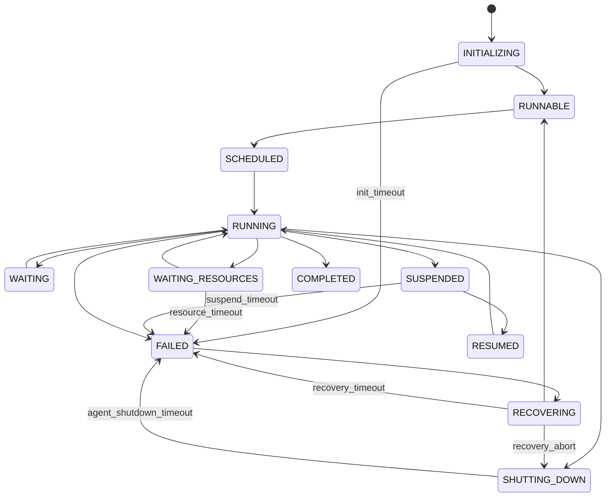

**Message lifecycle**

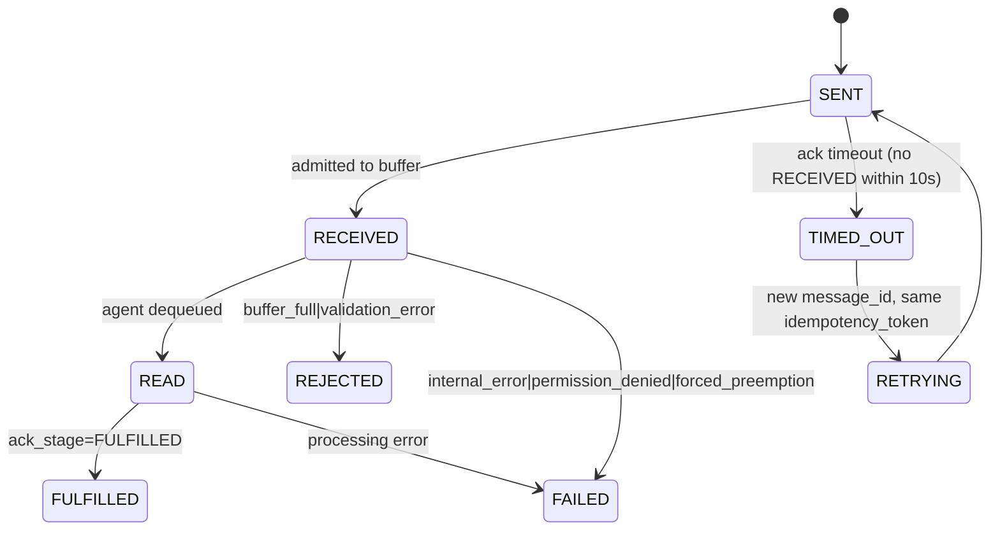

Note: There is no separate ACKNOWLEDGED state. The RECEIVED state serves as the acknowledgment stage; acknowledgment semantics are encoded via AckStage.RECEIVED.

**Worktree binding lifecycle**

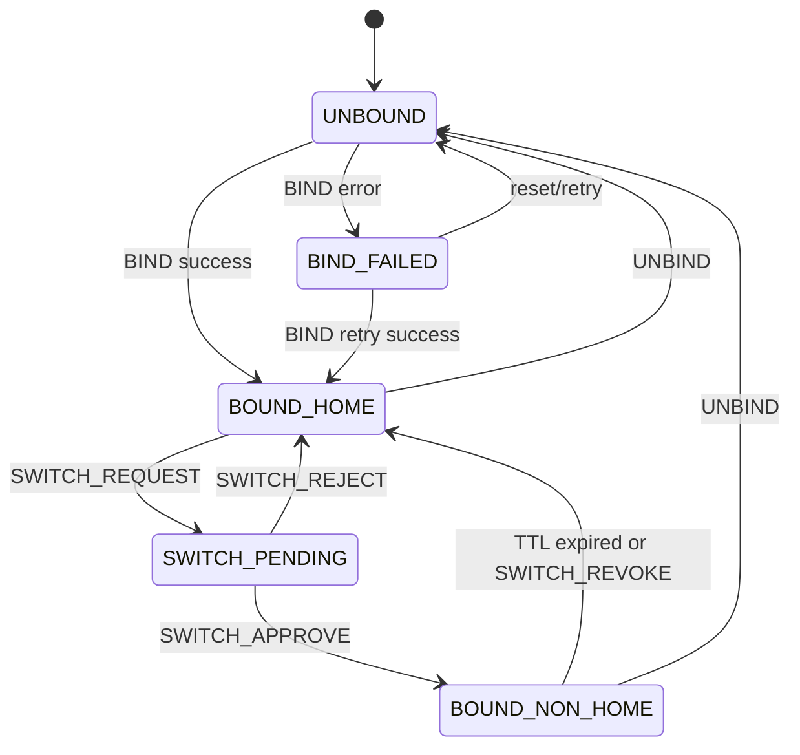

---

## Appendix D - Sequence Diagrams (Mermaid) and JSON Examples

Below are canonical flows. All messages are **unicast** and include the RFC envelope fields.

### C.1 Task submission success

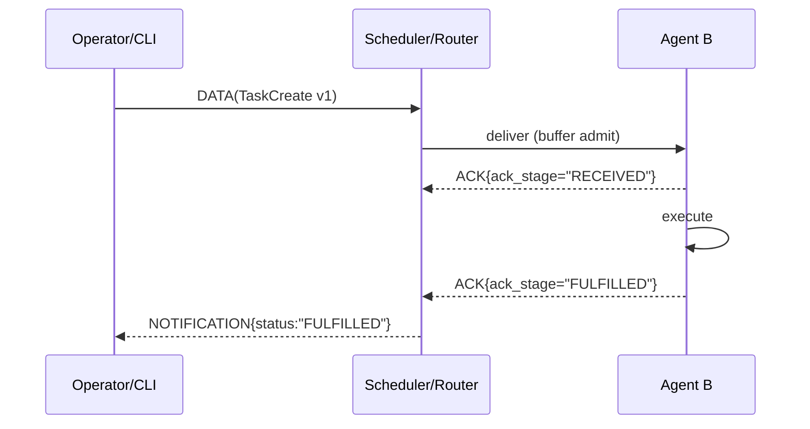

```json
{
  "message_id": "msg001",
  "producer_id": "cli",
  "correlation_id": "wf-1111",
  "sequence_number": 1,
  "message_type": "DATA",
  "content_type": "application/json",
  "payload": {"task_type":"CreateTicket","title":"Fix header overlap"}
}
```

### C.2 Timeout, retry, late ACK, idempotent reconcile

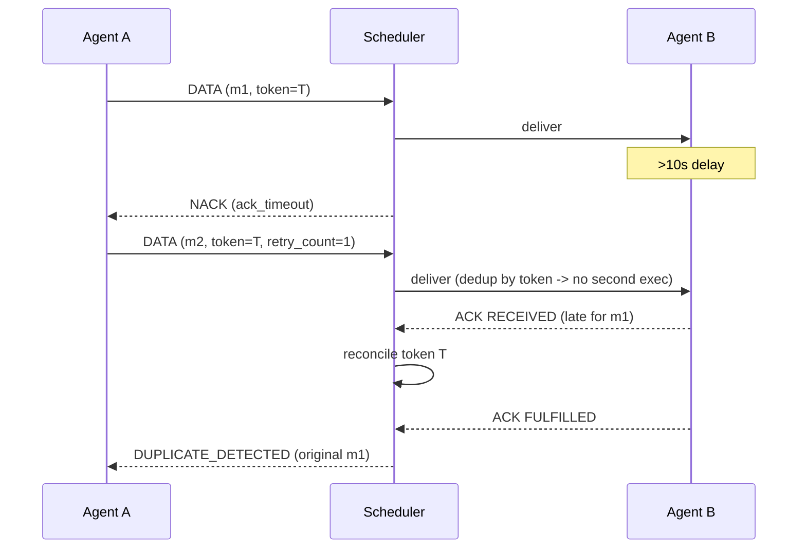

```json
{
  "status": "DUPLICATE_DETECTED",
  "original_message_id": "m1",
  "original_status": "FULFILLED",
  "cached_at": "2025-08-08T14:03:22Z"
}
```

### C.3 Buffer overflow rejection

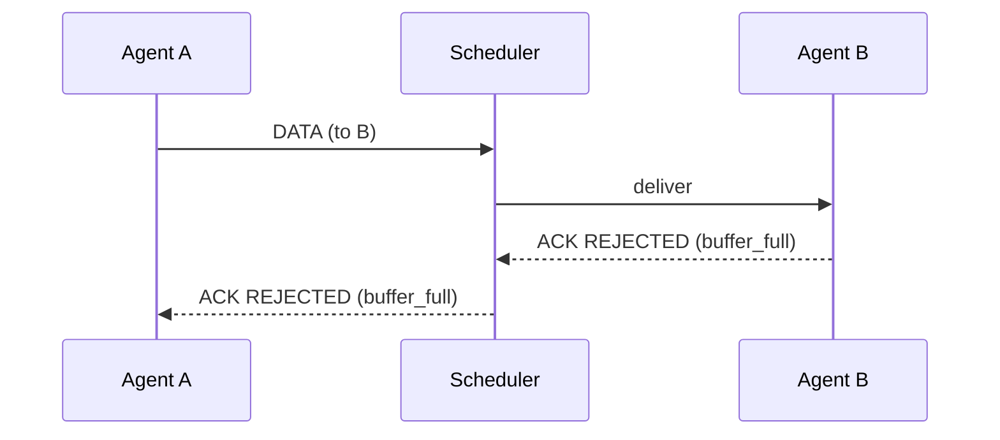

```json
{
  "message_id": "ack_rej_77",
  "producer_id": "scheduler",
  "correlation_id": "wf-3333",
  "message_type": "ACKNOWLEDGEMENT",
  "content_type": "application/json",
  "payload": {
    "ack_for_message_id": "mX",
    "ack_stage": "REJECTED",
    "error_code": "buffer_full"
  }
}
```

### C.4 Cooperative preemption by higher-priority task

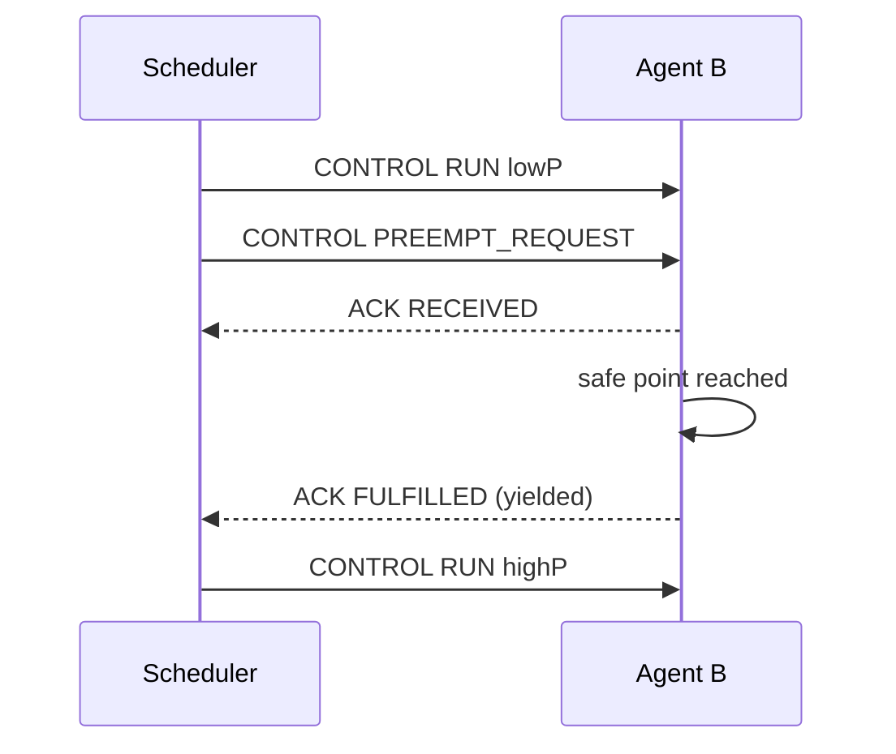

### C.5 Forced preemption after non-preemptible timeout

```mermaid
sequenceDiagram
    participant S as Scheduler
    participant B as Agent B
    S->>B: PREEMPT_REQUEST
    Note over B: still in non-preemptible; max_duration exceeded
    S->>B: TERMINATE{grace_ms:3000}
    alt responds
      B-->>S: ACK FULFILLED (terminated)
    else
      S->>B: KILL
      S->>S: mark FAILED{forced_preemption}
    end
```

### C.6 HITL escalation for conflict

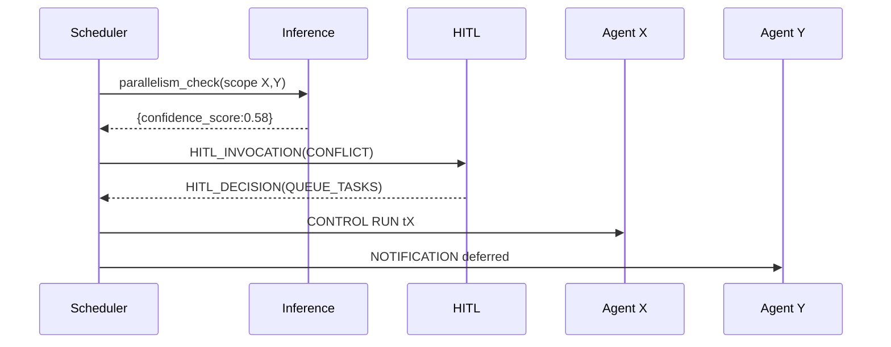

### C.7 Worktree bind/switch/unbind

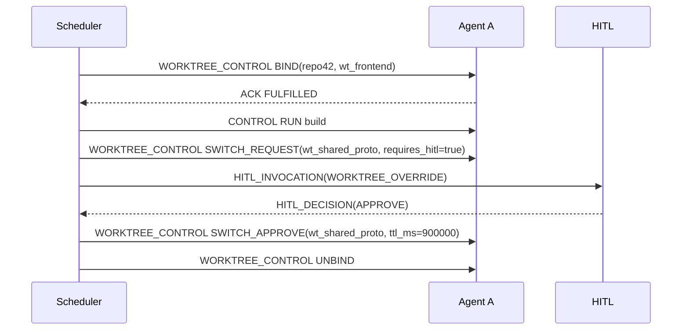

### C.8 Tool call (streaming)

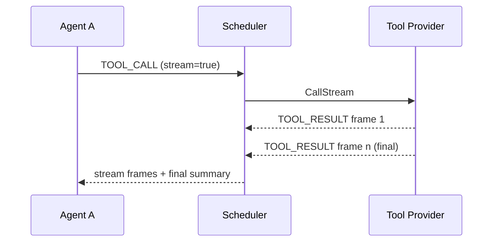

### C.9 Negotiation with timeout + HITL decision


### C.10 Negotiation Room: Producer-Critic-Coordinator Flow

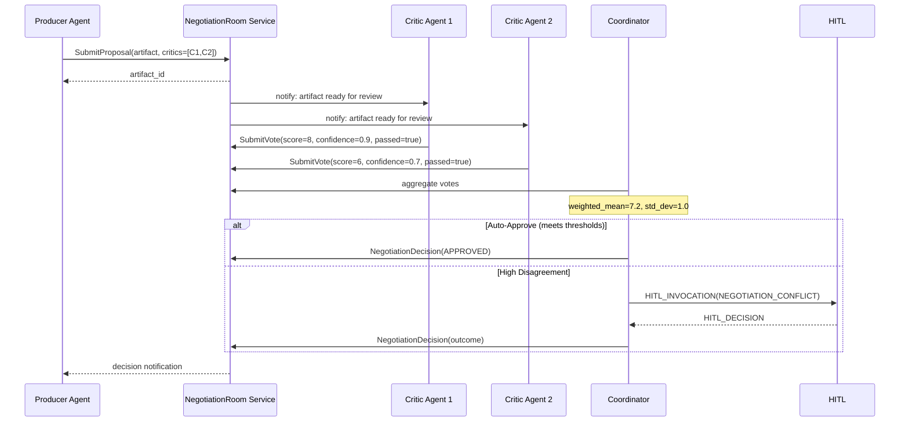

### C.11 Agent Handoff Flow

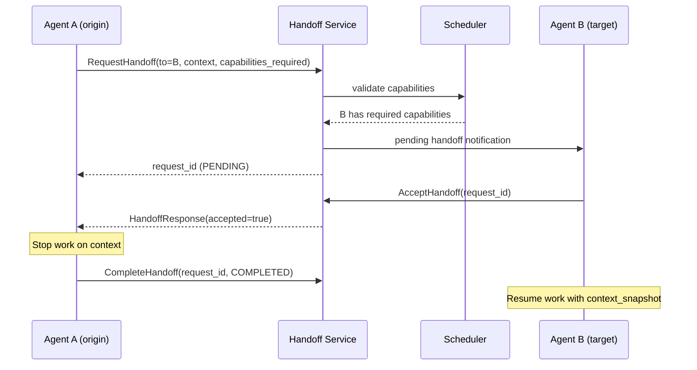

### C.12 DAG Workflow Execution

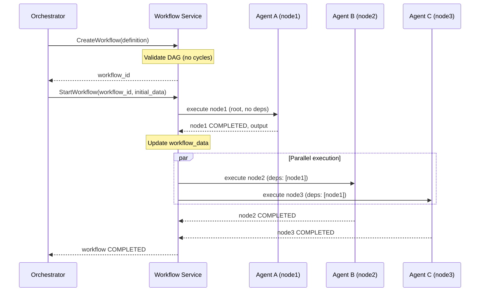

---

## Appendix E - Representative JSON Payloads

This appendix lists representative JSON payloads for common scenarios. These examples are non-normative.

---

# Protobuf Stubs (proto3)

**Notes:**

- All strings expecting UUIDs are plain `string`.
- Use `google.protobuf.Timestamp` and `Duration` where applicable.
- Payloads use `bytes` with `content_type` for flexibility (JSON or protobuf within).
- Split definitions into logical files for clarity. Implementations MAY merge into a single file.
- The canonical proto package namespace for this specification is `sw4rm.*`. Earlier drafts and examples MAY have shown other prefixes; use `sw4rm.*` for conformance and code generation.

---

## `common.proto`

```proto
syntax = "proto3";

package sw4rm.common;

import "google/protobuf/timestamp.proto";
import "google/protobuf/duration.proto";

enum MessageType {
  MESSAGE_TYPE_UNSPECIFIED = 0;
  CONTROL = 1;
  DATA = 2;
  HEARTBEAT = 3;
  NOTIFICATION = 4;
  ACKNOWLEDGEMENT = 5;
  HITL_INVOCATION = 6;
  WORKTREE_CONTROL = 7;
  NEGOTIATION = 8;
  TOOL_CALL = 9;
  TOOL_RESULT = 10;
  TOOL_ERROR = 11;
}

enum AckStage {
  ACK_STAGE_UNSPECIFIED = 0;
  RECEIVED = 1;
  READ = 2;
  FULFILLED = 3;
  REJECTED = 4;
  FAILED = 5;
  TIMED_OUT = 6;
}

enum ErrorCode {
  ERROR_CODE_UNSPECIFIED = 0;
  BUFFER_FULL = 1;
  NO_ROUTE = 2;
  ACK_TIMEOUT = 3;
  AGENT_UNAVAILABLE = 4;
  AGENT_SHUTDOWN = 5;
  VALIDATION_ERROR = 6;
  PERMISSION_DENIED = 7;
  UNSUPPORTED_MESSAGE_TYPE = 8;
  OVERSIZE_PAYLOAD = 9;
  TOOL_TIMEOUT = 10;
  PARTIAL_DELIVERY = 11; // reserved
  FORCED_PREEMPTION = 12;
  TTL_EXPIRED = 13;
  INTERNAL_ERROR = 99;
}

enum AgentState {
  AGENT_STATE_UNSPECIFIED = 0;
  INITIALIZING = 1;
  RUNNABLE = 2;
  SCHEDULED = 3;
  RUNNING = 4;
  WAITING = 5;
  WAITING_RESOURCES = 6;
  SUSPENDED = 7;
  RESUMED = 8;
  COMPLETED = 9;
  FAILED_STATE = 10;
  SHUTTING_DOWN = 11;
  RECOVERING = 12;
}

enum CommunicationClass {
  COMM_CLASS_UNSPECIFIED = 0;
  PRIVILEGED = 1;
  STANDARD = 2;
  BULK = 3;
}

enum DebateIntensity {
  DEBATE_INTENSITY_UNSPECIFIED = 0;
  LOWEST = 1;
  LOW = 2;
  MEDIUM = 3;
  HIGH = 4;
  HIGHEST = 5;
}

enum HitlReasonType {
  HITL_REASON_UNSPECIFIED = 0;
  CONFLICT = 1;
  SECURITY_APPROVAL = 2;
  TASK_ESCALATION = 3;
  MANUAL_OVERRIDE = 4;
  WORKTREE_OVERRIDE = 5;
  DEBATE_DEADLOCK = 6;
  TOOL_PRIVILEGE_ESCALATION = 7;
  CONNECTOR_APPROVAL = 8;
}

message Envelope {
  string message_id = 1;                // UUIDv4 per attempt
  string idempotency_token = 2;         // stable across retries (optional)
  string producer_id = 3;
  string correlation_id = 4;
  uint64 sequence_number = 5;
  uint32 retry_count = 6;
  MessageType message_type = 7;
  string content_type = 8;              // e.g., application/json
  uint64 content_length = 9;
  string repo_id = 10;                  // optional
  string worktree_id = 11;              // optional
  string hlc_timestamp = 12;            // optional, string-form HLC
  uint64 ttl_ms = 13;                   // optional
  google.protobuf.Timestamp timestamp = 14;
  bytes payload = 15;                    // serialized content per content_type
}

message Ack {
  string ack_for_message_id = 1;
  AckStage ack_stage = 2;
  ErrorCode error_code = 3;
  string note = 4;
}

message Empty {}
```

---

## `registry.proto`

```proto
syntax = "proto3";

package sw4rm.registry;

import "google/protobuf/timestamp.proto";
import "common.proto";

message AgentDescriptor {
  string agent_id = 1;
  string name = 2;
  string description = 3; // <=200 words
  repeated string capabilities = 4;
  sw4rm.common.CommunicationClass communication_class = 5;
  repeated string modalities_supported = 6; // MIME types
  repeated string reasoning_connectors = 7; // URIs
  bytes public_key = 8; // optional
}

message RegisterAgentRequest { AgentDescriptor agent = 1; }
message RegisterAgentResponse { bool accepted = 1; string reason = 2; }

message HeartbeatRequest {
  string agent_id = 1;
  sw4rm.common.AgentState state = 2;
  map<string,string> health = 3;
}
message HeartbeatResponse { bool ok = 1; }

message DeregisterAgentRequest { string agent_id = 1; string reason = 2; }
message DeregisterAgentResponse { bool ok = 1; }

service RegistryService {
  rpc RegisterAgent(RegisterAgentRequest) returns (RegisterAgentResponse);
  rpc Heartbeat(HeartbeatRequest) returns (HeartbeatResponse);
  rpc DeregisterAgent(DeregisterAgentRequest) returns (DeregisterAgentResponse);
}
```

---

## `router.proto`

```proto
syntax = "proto3";

package sw4rm.router;

import "common.proto";

message SendMessageRequest { sw4rm.common.Envelope msg = 1; }
message SendMessageResponse { bool accepted = 1; string reason = 2; }

message StreamRequest { string agent_id = 1; }
message StreamItem { sw4rm.common.Envelope msg = 1; }

service RouterService {
  rpc SendMessage(SendMessageRequest) returns (SendMessageResponse);
  rpc StreamIncoming(StreamRequest) returns (stream StreamItem); // per-agent inbound stream
}
```

---

## `scheduler.proto`

```proto
syntax = "proto3";

package sw4rm.scheduler;

import "google/protobuf/duration.proto";
import "common.proto";

message SubmitTaskRequest {
  string agent_id = 1;
  string task_id = 2;
  int32 priority = 3; // -19..20
  bytes params = 4;
  string content_type = 5;
  string scope = 6; // resource scope descriptor
}

message SubmitTaskResponse { bool accepted = 1; string reason = 2; }

message PreemptRequest {
  string agent_id = 1;
  string task_id = 2;
  string reason = 3;
}
message PreemptResponse { bool enqueued = 1; }

message ShutdownAgentRequest {
  string agent_id = 1;
  google.protobuf.Duration grace_period = 2;
}
message ShutdownAgentResponse { bool ok = 1; }

message PollActivityBufferRequest { string agent_id = 1; }
message ActivityEntry {
  string task_id = 1;
  string repo_id = 2;
  string worktree_id = 3;
  string branch = 4;
  string description = 5;
  string timestamp = 6;
}
message PollActivityBufferResponse { repeated ActivityEntry entries = 1; }

message PurgeActivityRequest { string agent_id = 1; repeated string task_ids = 2; }
message PurgeActivityResponse { uint32 purged = 1; }

service SchedulerService {
  rpc SubmitTask(SubmitTaskRequest) returns (SubmitTaskResponse);
  rpc RequestPreemption(PreemptRequest) returns (PreemptResponse);
  rpc ShutdownAgent(ShutdownAgentRequest) returns (ShutdownAgentResponse);
  rpc PollActivityBuffer(PollActivityBufferRequest) returns (PollActivityBufferResponse);
  rpc PurgeActivity(PurgeActivityRequest) returns (PurgeActivityResponse);
}
```

---

## `hitl.proto`

```proto
syntax = "proto3";

package sw4rm.hitl;

import "common.proto";

message HitlInvocation {
  sw4rm.common.HitlReasonType reason_type = 1;
  bytes context = 2;             // JSON or protobuf, see content_type in envelope
  repeated string proposed_actions = 3;
  int32 priority = 4;
}

message HitlDecision {
  string action = 1;
  bytes decision_payload = 2;
  string rationale = 3;
}

service HitlService {
  // Invocation is carried in Envelope.payload; this service handles the decision side.
  rpc Decide(HitlInvocation) returns (HitlDecision);
}
```

---

## `worktree.proto`

```proto
syntax = "proto3";

package sw4rm.worktree;

message BindRequest { string agent_id = 1; string repo_id = 2; string worktree_id = 3; }
message BindResponse { bool ok = 1; string reason = 2; }

message UnbindRequest { string agent_id = 1; }
message UnbindResponse { bool ok = 1; }

message SwitchRequest {
  string agent_id = 1;
  string target_worktree_id = 2;
  bool requires_hitl = 3;
}
message SwitchApprove { string agent_id = 1; string target_worktree_id = 2; uint64 ttl_ms = 3; }
message SwitchReject { string agent_id = 1; string reason = 2; }

message StatusRequest { string agent_id = 1; }
message StatusResponse {
  string repo_id = 1;
  string worktree_id = 2;
  string state = 3; // UNBOUND|BOUND_HOME|SWITCH_PENDING|BOUND_NON_HOME|BIND_FAILED
}

service WorktreeService {
  rpc Bind(BindRequest) returns (BindResponse);
  rpc Unbind(UnbindRequest) returns (UnbindResponse);
  rpc RequestSwitch(SwitchRequest) returns (StatusResponse);
  rpc ApproveSwitch(SwitchApprove) returns (StatusResponse);
  rpc RejectSwitch(SwitchReject) returns (StatusResponse);
  rpc Status(StatusRequest) returns (StatusResponse);
}
```

---

## `tool.proto`

```proto
syntax = "proto3";

package sw4rm.tool;

import "google/protobuf/duration.proto";

message ExecutionPolicy {
  google.protobuf.Duration timeout = 1;
  uint32 max_retries = 2;
  string backoff = 3; // "exponential", etc.
  bool worktree_required = 4;
  string network_policy = 5;     // e.g., "egress_restricted"
  string privilege_level = 6;    // e.g., "default"
  uint64 budget_cpu_ms = 7;
  uint64 budget_wall_ms = 8;
}

message ToolCall {
  string call_id = 1;
  string tool_name = 2;
  string provider_id = 3;
  string content_type = 4;
  bytes args = 5;
  ExecutionPolicy policy = 6;
  bool stream = 7;
}

message ToolFrame {
  string call_id = 1;
  uint64 frame_no = 2;
  bool final = 3;
  string content_type = 4;
  bytes data = 5;
  bytes summary = 6; // optional final summary
}

message ToolError {
  string call_id = 1;
  string error_code = 2;
  string message = 3;
}

service ToolService {
  rpc Call(ToolCall) returns (ToolFrame);                 // unary completion
  rpc CallStream(ToolCall) returns (stream ToolFrame);    // streaming frames
  rpc Cancel(ToolCall) returns (ToolError);               // best effort
}
```

---

## `connector.proto`

```proto
syntax = "proto3";

package sw4rm.connector;

message ToolDescriptor {
  string tool_name = 1;
  string input_schema = 2;   // JSON Schema or URL
  string output_schema = 3;
  bool idempotent = 4;
  bool needs_worktree = 5;
  uint32 default_timeout_s = 6;
  uint32 max_concurrency = 7;
  string side_effects = 8;   // "filesystem","network", etc.
}

message ProviderRegisterRequest {
  string provider_id = 1;
  repeated ToolDescriptor tools = 2;
}

message ProviderRegisterResponse { bool ok = 1; string reason = 2; }

message DescribeToolsRequest { string provider_id = 1; }
message DescribeToolsResponse { repeated ToolDescriptor tools = 1; }

service ConnectorService {
  rpc RegisterProvider(ProviderRegisterRequest) returns (ProviderRegisterResponse);
  rpc DescribeTools(DescribeToolsRequest) returns (DescribeToolsResponse);
}
```

---

## `negotiation.proto`

```proto
syntax = "proto3";

package sw4rm.negotiation;

import "common.proto";
import "google/protobuf/duration.proto";

message NegotiationOpen {
  string negotiation_id = 1;
  string correlation_id = 2;
  string topic = 3;
  repeated string participants = 4;
  sw4rm.common.DebateIntensity intensity = 5;
  google.protobuf.Duration debate_timeout = 6;
}

message Proposal {
  string negotiation_id = 1;
  string from_agent = 2;
  string content_type = 3;
  bytes payload = 4; // schema/proto/text as declared
}

message CounterProposal {
  string negotiation_id = 1;
  string from_agent = 2;
  string content_type = 3;
  bytes payload = 4;
}

message Evaluation {
  string negotiation_id = 1;
  string from_agent = 2;
  double confidence_score = 3; // optional; 0 if absent
  string notes = 4;
}

message Decision {
  string negotiation_id = 1;
  string decided_by = 2; // "consensus"|"hitl"|"policy"
  string content_type = 3;
  bytes result = 4;
}

message AbortRequest {
  string negotiation_id = 1;
  string reason = 2;
}

service NegotiationService {
  rpc Open(NegotiationOpen) returns (sw4rm.common.Empty);
  rpc Propose(Proposal) returns (sw4rm.common.Empty);
  rpc Counter(CounterProposal) returns (sw4rm.common.Empty);
  rpc Evaluate(Evaluation) returns (sw4rm.common.Empty);
  rpc Decide(Decision) returns (sw4rm.common.Empty);
  rpc Abort(AbortRequest) returns (sw4rm.common.Empty);
}
```

---

## `reasoning.proto` (proxy is optional but handy)

```proto
syntax = "proto3";

package sw4rm.reasoning;

message ParallelismCheckRequest { string scope_a = 1; string scope_b = 2; }
message ParallelismCheckResponse { double confidence_score = 1; string notes = 2; }

message DebateEvaluateRequest {
  string negotiation_id = 1;
  string proposal_a = 2;
  string proposal_b = 3;
  string intensity = 4; // map from enum if needed
}
message DebateEvaluateResponse { double confidence_score = 1; string notes = 2; }

service InferenceProxy {
  rpc CheckParallelism(ParallelismCheckRequest) returns (ParallelismCheckResponse);
  rpc EvaluateDebate(DebateEvaluateRequest) returns (DebateEvaluateResponse);
}
```

---

## `logging.proto`

```proto
syntax = "proto3";

package sw4rm.logging;

import "google/protobuf/timestamp.proto";

message LogEvent {
  google.protobuf.Timestamp ts = 1;
  string correlation_id = 2;
  string agent_id = 3;
  string event_type = 4;
  string level = 5; // INFO|WARN|ERROR
  string details_json = 6;
}

message IngestResponse { bool ok = 1; }

service LoggingService {
  rpc Ingest(LogEvent) returns (IngestResponse);
}
```

---

## Quick Python SDK Generation

To generate Python stubs from the above files:

```bash
python -m pip install grpcio grpcio-tools googleapis-common-protos
python -m grpc_tools.protoc \
  -I. \
  --python_out=./py_sdk \
  --grpc_python_out=./py_sdk \
  common.proto registry.proto router.proto scheduler.proto hitl.proto \
  worktree.proto tool.proto connector.proto negotiation.proto reasoning.proto logging.proto
```

The generation produces `*_pb2.py` and `*_pb2_grpc.py` modules in `./py_sdk`. From there, IDE tooling can scaffold client and server classes as needed.

---

## Additional Protobuf Stubs (additive)

The following additive stubs introduce Scheduler policy control, shared Negotiation policy types, and an Activity/Artifacts API. These are OPTIONAL for minimal deployments and MUST be implemented for negotiations with policy broadcast, validation reports, and artifact persistence.

## `scheduler_policy.proto`

```proto
syntax = "proto3";

package sw4rm.scheduler;

import "policy.proto";

message SetNegotiationPolicyRequest { sw4rm.policy.NegotiationPolicy policy = 1; }
message SetNegotiationPolicyResponse { bool ok = 1; string reason = 2; }

message GetNegotiationPolicyRequest {}
message GetNegotiationPolicyResponse { sw4rm.policy.NegotiationPolicy policy = 1; }

message SetPolicyProfilesRequest { repeated sw4rm.policy.PolicyProfile profiles = 1; }
message SetPolicyProfilesResponse { bool ok = 1; string reason = 2; }

message ListPolicyProfilesRequest {}
message ListPolicyProfilesResponse { repeated sw4rm.policy.PolicyProfile profiles = 1; }

message GetEffectivePolicyRequest { string negotiation_id = 1; }
message GetEffectivePolicyResponse { sw4rm.policy.EffectivePolicy effective = 1; }

message SubmitEvaluationRequest { string negotiation_id = 1; sw4rm.policy.EvaluationReport report = 2; }
message SubmitEvaluationResponse { bool accepted = 1; string reason = 2; }

message HitlActionRequest { string negotiation_id = 1; string action = 2; string rationale = 3; }
message HitlActionResponse { bool ok = 1; string reason = 2; }

service SchedulerPolicyService {
  rpc SetNegotiationPolicy(SetNegotiationPolicyRequest) returns (SetNegotiationPolicyResponse);
  rpc GetNegotiationPolicy(GetNegotiationPolicyRequest) returns (GetNegotiationPolicyResponse);
  rpc SetPolicyProfiles(SetPolicyProfilesRequest) returns (SetPolicyProfilesResponse);
  rpc ListPolicyProfiles(ListPolicyProfilesRequest) returns (ListPolicyProfilesResponse);
  rpc GetEffectivePolicy(GetEffectivePolicyRequest) returns (GetEffectivePolicyResponse);
  rpc SubmitEvaluation(SubmitEvaluationRequest) returns (SubmitEvaluationResponse);
  rpc HitlAction(HitlActionRequest) returns (HitlActionResponse);
}
```

---

## `policy.proto`

```proto
syntax = "proto3";

package sw4rm.policy;

message NegotiationPolicy {
  uint32 max_rounds = 1;
  float score_threshold = 2;      // 0..1
  float diff_tolerance = 3;       // 0..1
  uint64 round_timeout_ms = 4;
  uint64 token_budget_per_round = 5;
  uint64 total_token_budget = 6;  // optional 0=unset
  uint32 oscillation_limit = 7;
  message Hitl { string mode = 1; } // None|PauseBetweenRounds|PauseOnFinalAccept
  Hitl hitl = 8;
  message Scoring { bool require_schema_valid = 1; bool require_examples_pass = 2; float llm_weight = 3; }
  Scoring scoring = 9;
}

message AgentPreferences {
  // Same fields as NegotiationPolicy but advisory; scheduler clamps to guardrails
  uint32 max_rounds = 1;
  float score_threshold = 2;
  float diff_tolerance = 3;
  uint64 round_timeout_ms = 4;
  uint64 token_budget_per_round = 5;
  uint64 total_token_budget = 6;
  uint32 oscillation_limit = 7;
}

message EffectivePolicy {
  NegotiationPolicy policy = 1;                // derived authoritative policy
  map<string, AgentPreferences> applied = 2; // per-agent clamped prefs (optional)
}

message PolicyProfile {
  string name = 1;            // e.g., LOW/MEDIUM/HIGH
  NegotiationPolicy policy = 2;
}

message DeltaSummary { float magnitude = 1; repeated string changed_paths = 2; }

message EvaluationReport {
  string from_agent = 1;
  float deterministic_score = 2; // 0..1
  float llm_confidence = 3;      // 0..1, optional 0 if absent
  string notes = 4;
  DeltaSummary delta = 5;
}

message DecisionReport {
  string decided_by = 1;  // consensus|hitl|policy
  float final_score = 2;
  string rationale = 3;
  string stop_reason = 4; // threshold_met|max_rounds|oscillation|budget|timeout
}
```

---

## `activity.proto`

```proto
syntax = "proto3";

package sw4rm.activity;

message Artifact {
  string negotiation_id = 1;
  string kind = 2;       // contract|diff|decision|score|note
  string version = 3;    // e.g., v3
  string content_type = 4;
  bytes content = 5;
  string created_at = 6; // ISO-8601
}

message AppendArtifactRequest { Artifact artifact = 1; }
message AppendArtifactResponse { bool ok = 1; string reason = 2; }

message ListArtifactsRequest { string negotiation_id = 1; string kind = 2; }
message ListArtifactsResponse { repeated Artifact items = 1; }

service ActivityService {
  rpc AppendArtifact(AppendArtifactRequest) returns (AppendArtifactResponse);
  rpc ListArtifacts(ListArtifactsRequest) returns (ListArtifactsResponse);
}
```
