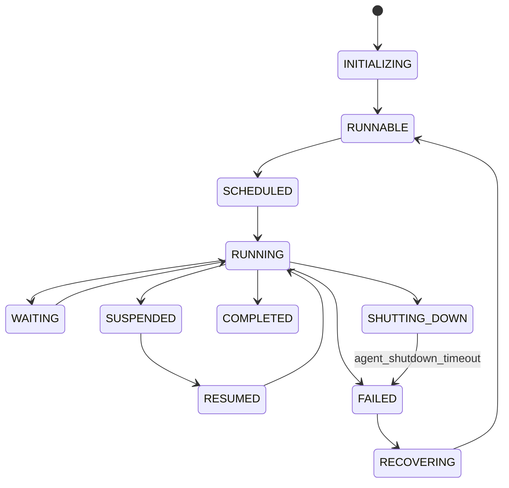
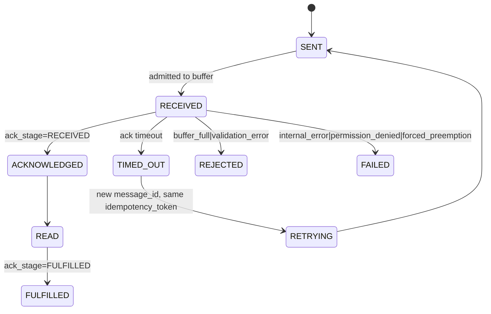
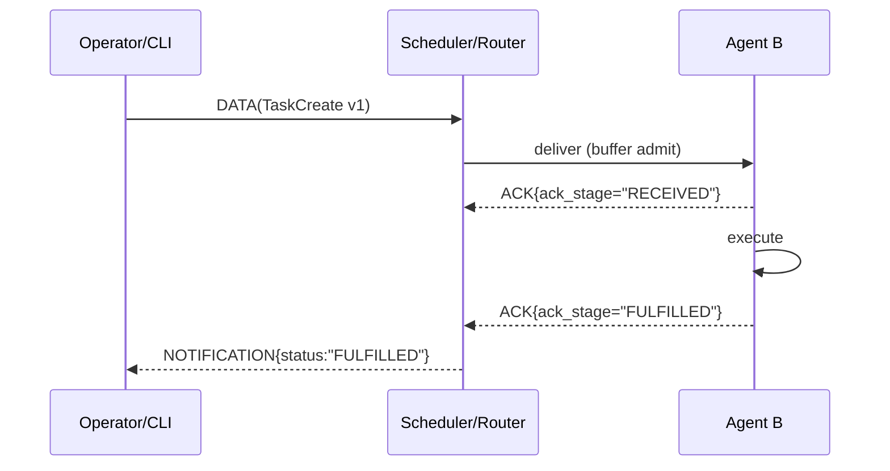
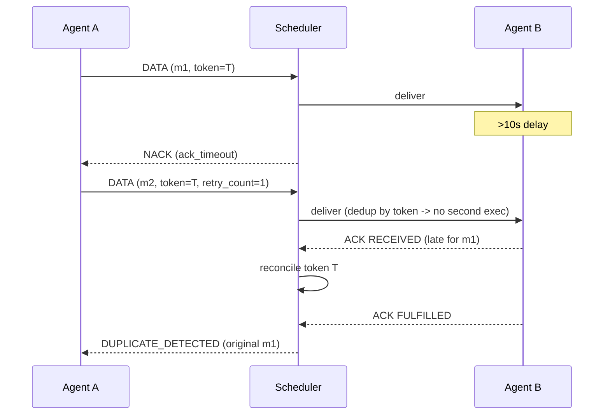
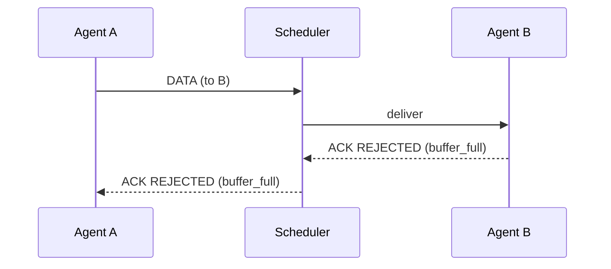
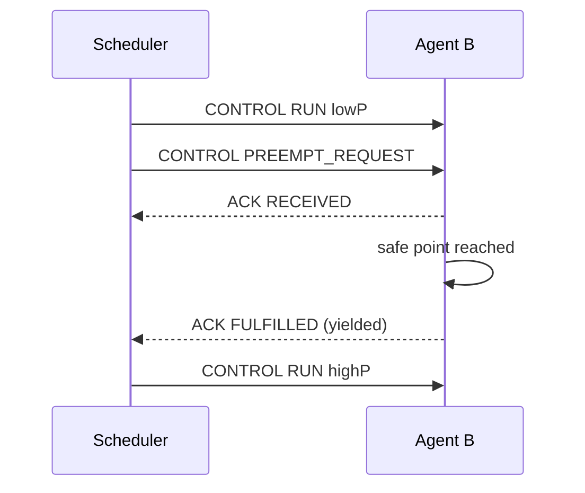
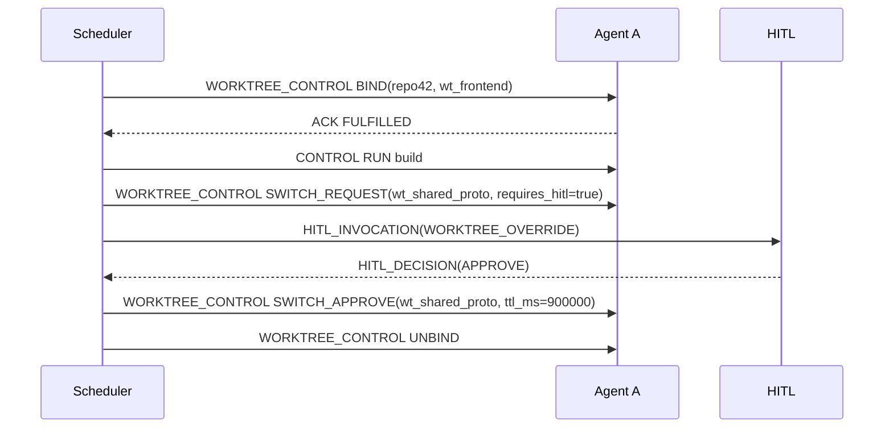
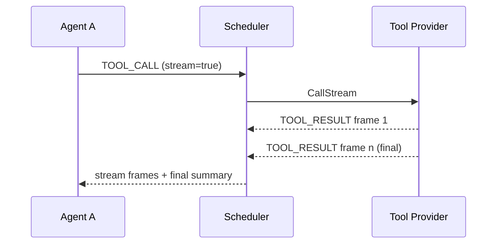
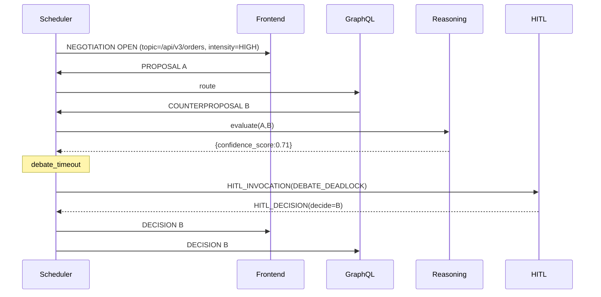

# RFC: Interruptible, Message-Driven CLI Agent Framework (Consolidated)

Version: 0.2.0 (2025-08-17)

## Versioning and Changelog

- Versioning: Pre-1.0 SemVer. Normative/implementer-impacting changes = MINOR; editorial/format-only = PATCH; pure moves/renames = no bump.
- Scope: Applies to this document and its canonical proto namespace guidance (`sw4rm.*`).
- Stability: Until 1.0, MINOR may contain breaking changes; such cases are called out explicitly.

Changelog

- 0.2.0 (2025-08-17): Canonicalize `sw4rm.*` package; add negotiation event fanout (JSON), room semantics (`correlation_id=negotiation_id`), policy broadcast (WagglePolicy/EffectivePolicy), validation/diff/scoring guidance; add optional policy/activity proto stubs. No known wire breaks vs 0.1.x beyond namespace canonicalization.
- 0.1.1 (2025-08-08): Editorial updates and proto formatting notes. No normative changes.
- 0.1.0 (2025-08-08): Initial specification document.

## 1. Status of this Memo

This document specifies a protocol and runtime architecture for a CLI framework that schedules, routes, and supervises interruptible, message-driven agents. Distribution is unlimited. Implementations that claim conformance MUST satisfy all normative requirements herein.

## 2. Abstract

The framework defines a central scheduler that orders and preempts task execution, a routed messaging plane with explicit lifecycles and acknowledgements, a Human-In-The-Loop (HITL) escalation channel, first-class repository/worktree isolation, an inter-agent negotiation protocol, and MCP-compatible tool calling. Agents are process-isolated participants that register capabilities, exchange typed messages, and MAY run multiple instances subject to concurrency policy. A technology-agnostic **Reasoning Engine** provides contextual analysis when requested. The system is suitable for single-node deployment and MUST be extensible to distributed environments.

## 3. Terminology

The key words “MUST”, “MUST NOT”, “REQUIRED”, “SHALL”, “SHALL NOT”, “SHOULD”, “SHOULD NOT”, “RECOMMENDED”, “MAY”, and “OPTIONAL” follow RFC 2119.

**Agent**: execution participant supervised by the Scheduler.

**Task**: unit of work enqueued to an Agent.

**Message**: routed unit of communication with normative lifecycle.

**Scheduler**: sole authority for ordering, preemption, routing, and HITL invocation.

**Reasoning Engine**: external decision service; MAY be deterministic or not; SHOULD return `confidence_score` when consulted for parallelism checks or negotiation evaluation; MUST NOT mutate Agent/Scheduler state directly.

**Tool**: external capability invoked via routing; MCP optional, MCP-like required.

**Worktree**: Git worktree bound to an Agent.

**Communication Class**: agent-level preference for routing (PRIVILEGED, STANDARD, BULK).

**Connector**: binding to a Tool provider or Reasoning Engine.

## 4. Architecture

Components: Scheduler, Agents, routed Messaging plane, HITL service, optional Tool/Connector layer, Observability sink. All inter-component RPCs SHALL use gRPC. The Scheduler maintains authoritative task and message state, performs reconciliation, and is the only entity that may preempt execution or escalate to HITL. Routing is **unicast** in this version. HLC MAY be enabled for causal analysis.

## 5. Transport

gRPC unary + server-streaming. Define `.proto` contracts for Registry, Scheduler control, Routing, HITL, Logging, ToolService, ConnectorService, Negotiation, Worktree. Messages and streams SHALL carry `correlation_id` and MAY include an HLC timestamp.

### 5.1. Service Health (Non‑Normative Recommendation)

While this protocol does not mandate a health signaling mechanism, we RECOMMEND implementing the gRPC Health Checking Protocol (`grpc.health.v1.Health`) for service readiness/liveness integration. This enables:

- Kubernetes gRPC probes for `readinessProbe`/`livenessProbe` where supported.
- CLI checks with `grpcurl` or `grpc-health-probe`.

Implementations that cannot adopt gRPC Health SHOULD expose a minimal HTTP `/healthz` endpoint for basic liveness.

## 6. Identity and Security

Stable `agent_id`. Signing is pluggable: MAY be disabled locally; MUST be enabled in distributed/multi-tenant mode (Ed25519/ECDSA over metadata+payload; keys via registry handshake). ACLs MUST constrain message types and tools. Worktree confinement MUST be enforced at the syscall boundary.

## 7. Scheduler: Priority, Ordering, Cooperative Preemption

**Task** priority: −19 (highest) to 20 (lowest); default 0. Order by priority then FIFO. If a new task has strictly higher priority, the Scheduler MUST preempt the running task. **Cooperative** by default: agents implement safe points; agents MAY declare bounded **non-preemptible sections** for critical regions; Scheduler defers preemption until section closes or timeout elapses. Forced preemption MAY be issued (soft terminate with grace → hard kill), marking task FAILED with `error_code=forced_preemption`.

**Communication Class**: PRIVILEGED messages insert into an urgent lane to run **next after** the in-flight message (no hard preempt). Rate-limit urgent bursts; overflow falls back to normal insertion.

## 8. Agent Lifecycle

States: INITIALIZING, RUNNABLE, SCHEDULED, RUNNING, WAITING, WAITING\_RESOURCES, SUSPENDED, RESUMED, COMPLETED, FAILED, SHUTTING\_DOWN, RECOVERING. In SHUTTING\_DOWN the agent MAY finish its current task; Scheduler MUST NOT dispatch new tasks/messages; on grace timeout mark FAILED (`agent_shutdown_timeout`).

## 9. Concurrency Model and Reasoning

`max_parallel_instances` per agent. Two instances MUST NOT process the same job unless HITL authorizes. Jobs carry a **scope** descriptor for conflict assessment. For potentially overlapping work, the Scheduler SHOULD consult the Reasoning Engine. If a returned `confidence_score` is below threshold, escalate via HITL (`CONFLICT`). If engine is down, act conservatively and escalate unless policy allows unconditional parallelism.

## 10. Activity Buffer

Each agent maintains `<task_id, repo_id, worktree_id, branch, timestamp, description≤200 words>`. Create before execution; remove on completion. Scheduler reconciles and purges entries for COMPLETED/FAILED/unknown tasks. Buffer is advisory and MUST NOT block scheduling.

## 11. Messaging Model

Lifecycle: SENT → RECEIVED → READ → FULFILLED. Errors: REJECTED, FAILED, TIMED\_OUT, RETRYING. Default 10 s to `RECEIVED`; on timeout set `TIMED_OUT` and NACK with `ack_timeout`. Late ACKs MUST be reconciled.

Note: `RECEIVED` serves as the acknowledgement stage in this protocol. There is no separate `ACKNOWLEDGED` state; acknowledgement semantics are encoded via `AckStage.RECEIVED`.

Every message MUST include:
`message_id` (UUIDv4 per attempt), `producer_id`, `correlation_id` (UUIDv4), `sequence_number` (monotonic per producer stream), `retry_count`, `message_type` (CONTROL, DATA, HEARTBEAT, NOTIFICATION, ACKNOWLEDGEMENT, HITL\_INVOCATION, WORKTREE\_CONTROL, NEGOTIATION, TOOL\_CALL, TOOL\_RESULT, TOOL\_ERROR), and `content_type`/`content_length` when payload present. MAY include `idempotency_token` (constant across retries of same logical op). When HLC is enabled include `hlc_timestamp`. MAY include `ttl_ms` (expired → FAILED `ttl_expired`). Core error codes include: `buffer_full`, `no_route`, `ack_timeout`, `agent_unavailable`, `agent_shutdown`, `validation_error`, `permission_denied`, `unsupported_message_type`, `oversize_payload`, `tool_timeout`, `partial_delivery`(reserved), `forced_preemption`, `internal_error`.

### 11.1 Idempotency Guarantees

`idempotency_token` MAY be supplied for exactly-once semantics. If present, MUST be constant across retries. The Scheduler SHALL maintain a cache mapping tokens to terminal outcomes for at least `deduplication_window` (default 3600 s; persisted).
On arrival with token:
• Token → terminal: return cached outcome (no re-exec).
• Token → non-terminal: do not start new execution; return `ALREADY_IN_PROGRESS`.
• New token: record RECEIVED and proceed.
Tokens SHOULD follow `{producer_id}:{operation_type}:{deterministic_hash}` over canonical parameters. Router dedups by token if present; else by `(producer_id, sequence_number)`. Retries MUST generate new `message_id` while preserving token.

## 12. Addressing and Modalities

**Unicast** only in this version. Payloads MUST declare `content_type`. Support `application/json`, `application/protobuf`; SHOULD support `text/plain`; MAY support `image/*`, `audio/*`. Router enforces agent modality declarations.

## 13. Buffers and Back-Pressure

Default inbound buffer per agent: 10; configurable. On overflow, reject with `buffer_full` and NACK sender. No silent drops. Scheduler SHOULD surface back-pressure metrics and MAY pace senders.

## 14. Registry, Discovery, Heartbeats

Agents register with name, ≤200-word description, capabilities, communication class, modalities, tool descriptors, ≥1 Reasoning Engine connector, and public key if signing enabled. Scheduler emits heartbeats; agents MUST respond. Join/leave broadcast; recipients maintain discovery. Debounce before removal for missed heartbeats. Deregistration MUST be explicit.

## 15. Human-In-The-Loop (HITL)

Scheduler issues `HITL_INVOCATION` with `reason_type` in {CONFLICT, SECURITY\_APPROVAL, TASK\_ESCALATION, MANUAL\_OVERRIDE, WORKTREE\_OVERRIDE, DEBATE\_DEADLOCK, TOOL\_PRIVILEGE\_ESCALATION, CONNECTOR\_APPROVAL}. Context SHOULD include case facts and Reasoning metadata when present. HITL responds with `HITL_DECISION`; Scheduler applies immediately and logs.

---

## Appendix A — Protobuf Package Namespace

The canonical `.proto` package namespace for this specification is `sw4rm.*`. Earlier drafts may show other prefixes; use `sw4rm.*` for conformance and code generation. See the `protos/` directory and the stubs below.

## 16. Repository and Worktree Binding

Agents operate from a single **home worktree** (`repo_id`, `worktree_id`). Enforce confinement: forbid path escapes, forbid device nodes, prefer `noexec,nodev,nosuid` mounts; on weaker platforms, enforce via in-process VFS and dirfd-relative opens with `O_NOFOLLOW`. Non-home worktree operation is forbidden by default; Scheduler MAY request switch with policy + HITL approval. Binding state machine: UNBOUND → BOUND\_HOME → SWITCH\_PENDING → BOUND\_NON\_HOME → …; log transitions. `WORKTREE_CONTROL` ops: BIND, UNBIND, SWITCH\_REQUEST, SWITCH\_APPROVE, SWITCH\_REJECT, SWITCH\_REVOKE, STATUS. Tools with `needs_worktree=true` MUST fail with `worktree_not_bound` if agent is unbound.

## 17. Inter-Agent Negotiation (“Debate”)

Negotiations are scheduler-mediated, identified by `negotiation_id`, scoped by `correlation_id` (set equal to the `negotiation_id` for room semantics). Open with topic, participants, `debate_intensity_factor ∈ {LOWEST,LOW,MEDIUM,HIGH,HIGHEST}`; map intensity to guardrails (rounds/time/thresholds). Participants exchange PROPOSAL/COUNTER/EVALUATION messages in `NEGOTIATION`. Scheduler enforces `debate_timeout`; on deadlock/timeout, apply tie-break or escalate with `DEBATE_DEADLOCK`. At minimum support two-party unanimity. Negotiation does not mutate repos; subsequent CONTROL/DATA does.

### 17.1 Negotiation Event Fanout (JSON over Envelopes)

For interoperability with SDKs, negotiation events are carried as `NEGOTIATION` envelopes whose payload is a JSON object. Implementations MUST preserve raw payload bytes and `correlation_id`. Unknown fields MUST be ignored by receivers. The following event kinds are defined:

- `open`: `{ kind, ts, topic: string, corr: string }`
- `policy`: `{ kind, ts, negotiation_id: string, profile?: string, policy: WagglePolicy }`
- `propose`: `{ kind, ts, from: string, ct: string, payload_b64: string }`
- `counter`: `{ kind, ts, from: string, ct: string, payload_b64: string }`
- `evaluate`: `{ kind, ts, from: string, score: number, notes: string }`
- `decide`: `{ kind, ts, by: string, ct: string, result_b64: string }`
- `abort`: `{ kind, ts, reason: string }`

Notes:

- `payload_b64` and `result_b64` hold the opaque bytes for proposals/results; `ct` is the content type. SDKs SHOULD provide convenience helpers to decode on demand.
- Services MUST NOT reorder events; ordering is that of the service stream.

SDK interop note:

- SDKs may parse these negotiation event payloads as opaque JSON and expose lightweight helpers (e.g., base64 decode for `payload_b64`/`result_b64`). Implementations MAY additionally provide convenience types for policy-related fields (e.g., WagglePolicy/EffectivePolicy) without changing the over-the-wire JSON shapes.

### 17.2 Waggle Policy and Effective Policy

The Scheduler is the source of truth for negotiation policy. On `Open`, the Scheduler MUST derive an `EffectivePolicy` from a base `WagglePolicy` and any clamped `AgentPreferences`, then broadcast a `policy` event (see 17.1). Policy MAY be selected by a profile hint provided at `Open`; the authoritative policy remains in the Scheduler.

The base `WagglePolicy` includes at least: `max_rounds: u32`, `score_threshold: f32 (0..1)`, `diff_tolerance: f32 (0..1)`, `round_timeout_ms: u64`, `token_budget_per_round: u64`, optional `total_token_budget: u64`, `oscillation_limit: u32`, `hitl` gate (`None|PauseBetweenRounds|PauseOnFinalAccept`), and `scoring` knobs (`require_schema_valid`, `require_examples_pass`, `llm_weight: f32`).

The `EffectivePolicy` is the scheduler-owned, per-negotiation policy after clamping agent preferences to scheduler guardrails. Implementations MUST persist the effective policy per room and include it in the broadcast.

### 17.3 Validation, Diff, and Scoring

Implementations SHOULD support early validation of proposals using JSON Schema and executable examples. Invalid drafts MUST be rejected without consuming a round.

Per round, implementations SHOULD compute and record a structural JSON `DeltaSummary` with a bounded `magnitude` and set of `changed_paths`. Deterministic scoring MUST run first; optional Reasoning/LLM confidence in [0,1] MAY be blended per policy `llm_weight`. Acceptance and stop decisions MUST follow `EffectivePolicy` (thresholds, oscillation/tokens/time budgets). Optional HITL pause is enforced per policy.

### 17.4 Reports and Artifacts

Implementations SHOULD emit and persist structured records per round: `EvaluationReport` (deterministic checks, scores, notes), `DecisionReport` (scores, rationale, stop reason), and artifacts: `contract_vN.json`, `diff_v{N-1}_to_vN.json`. See Annex C/D for examples and Activity/Artifacts Protobuf APIs below.

## 18. MCP Integration and Tool Calling

Tool calling is first-class; MCP optional, MCP-like required. `TOOL_CALL` includes `tool_name`, `provider_id`, typed `args`, `content_type`, `execution_policy` (timeout, retries, isolation, budgets), optional `stream=true`. Scheduler assigns `call_id`; provider returns `TOOL_RESULT` (frames if streaming) or `TOOL_ERROR`. Idempotent tools MUST ensure retries are safe or compensated. Providers run under invoking agent’s confinement and ACLs. MCP providers expose manifests + schema; non-MCP expose DescribeTools. Each Agent MUST register ≥1 Reasoning connector; Scheduler MAY proxy calls.

## 19. Observability

Log every state transition and event with timestamp (UTC ISO-8601), `correlation_id`, actor, event type, details. Flag urgent-lane dispatches; track per-agent urgent burst usage and warn on starvation risk. Streaming tool calls record frame counts + byte totals. Include `repo_id`/`worktree_id` and `negotiation_id` where relevant. For idempotency, log cache decisions and link to original attempt.

## 20. Defaults and Operational Considerations

Defaults: ACK 10s to RECEIVED; inbound buffer 10; task priority 0; idempotency `deduplication_window=3600s` (persisted). Reasoning Engine unreachable → conservative behavior: deny risky parallelism, shorten debates, escalate to HITL as policy requires.

## 21. Error Handling

Set terminal state (REJECTED/FAILED/TIMED\_OUT) with `error_code`. NACKs include precipitating `message_id`, failed stage, error code. Late-ACK reconciliation MUST correct to truthful terminal stage. For idempotent duplicates, return `DUPLICATE_DETECTED` with original attempt ID, status, cached result/error, and `cached_at`.

## 22. Conformance

Implement §§7–8, §9, §10, §11–11.1, §12–§16, §17–§19. MCP compatibility is OPTIONAL; MCP-like tool descriptors are REQUIRED.

## 23. Security Considerations

Signing risks without key hygiene; document rotation/revocation. PRIVILEGED lane can starve; rate-limit and monitor. Worktree confinement at syscall boundary; forbid symlink escape/device nodes. HITL decisions SHOULD be authenticated. Reasoning outputs are advisory; bound by policy. Protect idempotency cache from poisoning; derive tokens from stable, authenticated parameters.

## 24. Implementation Notes (Non-Normative)

Redact secrets; set retention policies. Consider hard ceilings or mandatory interleave for urgent-lane fairness. Prefer idempotent tools for mutations; gate non-idempotent with policy/HITL. HLC is advisory; document skew budgets and never use HLC alone for correctness-critical ordering. Version and log Reasoning requests/responses.

## 25. Future Work (Non-Normative)

Scheduler HA (WAL + leader election + replay), group addressing, formal Reasoning API/circuit breaker.

---

## Appendix B — Architecture Diagrams (Mermaid)

```mermaid
flowchart LR
  subgraph Scheduler
    R[Router]
    Q[Queues: Urgent + Normal]
    SM[State Manager (tasks/messages/idempotency)]
    HE[HITL Adapter]
    RE[Reasoning Proxy]
    REG[Registry + Heartbeats]
    LOG[Observability Sink]
  end
  subgraph AgentA[Agent A]
    A_in[Inbound Buffer]
    A_exec[Executor (safe points)]
    A_abuf[Activity Buffer]
    A_tools[Tool Connectors]
  end
  subgraph AgentB[Agent B]
    B_in[Inbound Buffer]
    B_exec[Executor]
    B_abuf[Activity Buffer]
    B_tools[Tool Connectors]
  end
  subgraph Tools[Tool Providers]
    T1[(Tool 1)]
    T2[(Tool 2 - MCP)]
  end
  subgraph HITL[HITL Service/UI] end
  subgraph Reasoning[Reasoning Engine] end

  REG --- R
  R <--> Q
  R --- SM
  SM --- HE
  HE --- HITL
  SM --- RE
  RE --- Reasoning
  SM --- LOG

  R -->|unicast| A_in
  R -->|unicast| B_in
  A_exec --> A_tools
  B_exec --> B_tools
  A_tools --> T1
  B_tools --> T2
```

```mermaid
flowchart TB
  subgraph Repo[Git Repository]
    WT_A[[Worktree A (Agent A home)]]
    WT_B[[Worktree B (Agent B home)]]
    WT_TMP[[Worktree TMP (non-home)]]
  end
  subgraph Scheduler
    WTC[Worktree Controller]
    POL[Policy: non-home requires HITL]
  end
  A_exec[Agent A Executor] -- confined IO --> WT_A
  B_exec[Agent B Executor] -- confined IO --> WT_B
  A_exec -. request switch .-> WTC
  WTC --> POL
  POL -->|HITL_INVOCATION(WORKTREE_OVERRIDE)| HITL
  HITL -->|HITL_DECISION| WTC
  WTC -->|SWITCH_APPROVE| A_exec
  A_exec -- confined IO --> WT_TMP
```

---

## Appendix C — Finite-State Diagrams (Mermaid)

**Agent lifecycle**



**Message lifecycle**



---

## Appendix D — Sequence Diagrams (Mermaid) and JSON Examples

Below are canonical flows. All messages are **unicast** and include the RFC envelope fields.

### C.1 Task submission success



```json
{
  "message_id": "msg001",
  "producer_id": "cli",
  "correlation_id": "wf-1111",
  "sequence_number": 1,
  "message_type": "DATA",
  "content_type": "application/json",
  "payload": {"task_type":"CreateTicket","title":"Fix header overlap"}
}
```

### C.2 Timeout, retry, late ACK, idempotent reconcile



```json
{
  "status": "DUPLICATE_DETECTED",
  "original_message_id": "m1",
  "original_status": "FULFILLED",
  "cached_at": "2025-08-08T14:03:22Z"
}
```

### C.3 Buffer overflow rejection



```json
{
  "message_id": "ack_rej_77",
  "producer_id": "scheduler",
  "correlation_id": "wf-3333",
  "message_type": "ACKNOWLEDGEMENT",
  "content_type": "application/json",
  "payload": {
    "ack_for_message_id": "mX",
    "ack_stage": "REJECTED",
    "error_code": "buffer_full"
  }
}
```

### C.4 Cooperative preemption by higher-priority task



### C.5 Forced preemption after non-preemptible timeout

```mermaid
sequenceDiagram
    participant S as Scheduler
    participant B as Agent B
    S->>B: PREEMPT_REQUEST
    Note over B: still in non-preemptible; max_duration exceeded
    S->>B: TERMINATE{grace_ms:3000}
    alt responds
      B-->>S: ACK FULFILLED (terminated)
    else
      S->>B: KILL
      S->>S: mark FAILED{forced_preemption}
    end
```

### C.6 HITL escalation for conflict


### C.7 Worktree bind/switch/unbind



### C.8 Tool call (streaming)



### C.9 Negotiation with timeout + HITL decision



---

## Appendix E — Representative JSON Payloads

I’ve already embedded JSON for success, retry/late-ACK, buffer overflow, worktree, tool, negotiation, and HITL above. If you want these as a fixture pack, I can hand you a tarball structure later.

---

# Protobuf Stubs (proto3)

**Notes:**
• All strings expecting UUIDs are plain `string` here.
• Use `google.protobuf.Timestamp` and `Duration` where helpful.
• Payloads are `bytes` + `content_type` for maximum flexibility (JSON or protobuf within).
• Split into logical files for clarity; you can merge if you prefer one file.
 • The canonical proto package namespace for this specification is `sw4rm.*`. Earlier drafts and examples may have shown other prefixes; use `sw4rm.*` for conformance and code generation.

---

## `common.proto`

```proto
syntax = "proto3";

package sw4rm.common;

import "google/protobuf/timestamp.proto";
import "google/protobuf/duration.proto";

enum MessageType {
  MESSAGE_TYPE_UNSPECIFIED = 0;
  CONTROL = 1;
  DATA = 2;
  HEARTBEAT = 3;
  NOTIFICATION = 4;
  ACKNOWLEDGEMENT = 5;
  HITL_INVOCATION = 6;
  WORKTREE_CONTROL = 7;
  NEGOTIATION = 8;
  TOOL_CALL = 9;
  TOOL_RESULT = 10;
  TOOL_ERROR = 11;
}

enum AckStage {
  ACK_STAGE_UNSPECIFIED = 0;
  RECEIVED = 1;
  READ = 2;
  FULFILLED = 3;
  REJECTED = 4;
  FAILED = 5;
  TIMED_OUT = 6;
}

enum ErrorCode {
  ERROR_CODE_UNSPECIFIED = 0;
  BUFFER_FULL = 1;
  NO_ROUTE = 2;
  ACK_TIMEOUT = 3;
  AGENT_UNAVAILABLE = 4;
  AGENT_SHUTDOWN = 5;
  VALIDATION_ERROR = 6;
  PERMISSION_DENIED = 7;
  UNSUPPORTED_MESSAGE_TYPE = 8;
  OVERSIZE_PAYLOAD = 9;
  TOOL_TIMEOUT = 10;
  PARTIAL_DELIVERY = 11; // reserved
  FORCED_PREEMPTION = 12;
  TTL_EXPIRED = 13;
  INTERNAL_ERROR = 99;
}

enum AgentState {
  AGENT_STATE_UNSPECIFIED = 0;
  INITIALIZING = 1;
  RUNNABLE = 2;
  SCHEDULED = 3;
  RUNNING = 4;
  WAITING = 5;
  WAITING_RESOURCES = 6;
  SUSPENDED = 7;
  RESUMED = 8;
  COMPLETED = 9;
  FAILED_STATE = 10;
  SHUTTING_DOWN = 11;
  RECOVERING = 12;
}

enum CommunicationClass {
  COMM_CLASS_UNSPECIFIED = 0;
  PRIVILEGED = 1;
  STANDARD = 2;
  BULK = 3;
}

enum DebateIntensity {
  DEBATE_INTENSITY_UNSPECIFIED = 0;
  LOWEST = 1;
  LOW = 2;
  MEDIUM = 3;
  HIGH = 4;
  HIGHEST = 5;
}

enum HitlReasonType {
  HITL_REASON_UNSPECIFIED = 0;
  CONFLICT = 1;
  SECURITY_APPROVAL = 2;
  TASK_ESCALATION = 3;
  MANUAL_OVERRIDE = 4;
  WORKTREE_OVERRIDE = 5;
  DEBATE_DEADLOCK = 6;
  TOOL_PRIVILEGE_ESCALATION = 7;
  CONNECTOR_APPROVAL = 8;
}

message Envelope {
  string message_id = 1;                // UUIDv4 per attempt
  string idempotency_token = 2;         // stable across retries (optional)
  string producer_id = 3;
  string correlation_id = 4;
  uint64 sequence_number = 5;
  uint32 retry_count = 6;
  MessageType message_type = 7;
  string content_type = 8;              // e.g., application/json
  uint64 content_length = 9;
  string repo_id = 10;                  // optional
  string worktree_id = 11;              // optional
  string hlc_timestamp = 12;            // optional, string-form HLC
  uint64 ttl_ms = 13;                   // optional
  google.protobuf.Timestamp timestamp = 14;
  bytes payload = 15;                    // serialized content per content_type
}

message Ack {
  string ack_for_message_id = 1;
  AckStage ack_stage = 2;
  ErrorCode error_code = 3;
  string note = 4;
}

message Empty {}
```

---

## `registry.proto`

```proto
syntax = "proto3";

package sw4rm.registry;

import "google/protobuf/timestamp.proto";
import "common.proto";

message AgentDescriptor {
  string agent_id = 1;
  string name = 2;
  string description = 3; // ≤200 words
  repeated string capabilities = 4;
  sw4rm.common.CommunicationClass communication_class = 5;
  repeated string modalities_supported = 6; // MIME types
  repeated string reasoning_connectors = 7; // URIs
  bytes public_key = 8; // optional
}

message RegisterAgentRequest { AgentDescriptor agent = 1; }
message RegisterAgentResponse { bool accepted = 1; string reason = 2; }

message HeartbeatRequest {
  string agent_id = 1;
  sw4rm.common.AgentState state = 2;
  map<string,string> health = 3;
}
message HeartbeatResponse { bool ok = 1; }

message DeregisterAgentRequest { string agent_id = 1; string reason = 2; }
message DeregisterAgentResponse { bool ok = 1; }

service RegistryService {
  rpc RegisterAgent(RegisterAgentRequest) returns (RegisterAgentResponse);
  rpc Heartbeat(HeartbeatRequest) returns (HeartbeatResponse);
  rpc DeregisterAgent(DeregisterAgentRequest) returns (DeregisterAgentResponse);
}
```

---

## `router.proto`

```proto
syntax = "proto3";

package sw4rm.router;

import "common.proto";

message SendMessageRequest { sw4rm.common.Envelope msg = 1; }
message SendMessageResponse { bool accepted = 1; string reason = 2; }

message StreamRequest { string agent_id = 1; }
message StreamItem { sw4rm.common.Envelope msg = 1; }

service RouterService {
  rpc SendMessage(SendMessageRequest) returns (SendMessageResponse);
  rpc StreamIncoming(StreamRequest) returns (stream StreamItem); // per-agent inbound stream
}
```

---

## `scheduler.proto`

```proto
syntax = "proto3";

package sw4rm.scheduler;

import "google/protobuf/duration.proto";
import "common.proto";

message SubmitTaskRequest {
  string agent_id = 1;
  string task_id = 2;
  int32 priority = 3; // -19..20
  bytes params = 4;
  string content_type = 5;
  string scope = 6; // resource scope descriptor
}

message SubmitTaskResponse { bool accepted = 1; string reason = 2; }

message PreemptRequest {
  string agent_id = 1;
  string task_id = 2;
  string reason = 3;
}
message PreemptResponse { bool enqueued = 1; }

message ShutdownAgentRequest {
  string agent_id = 1;
  google.protobuf.Duration grace_period = 2;
}
message ShutdownAgentResponse { bool ok = 1; }

message PollActivityBufferRequest { string agent_id = 1; }
message ActivityEntry {
  string task_id = 1;
  string repo_id = 2;
  string worktree_id = 3;
  string branch = 4;
  string description = 5;
  string timestamp = 6;
}
message PollActivityBufferResponse { repeated ActivityEntry entries = 1; }

message PurgeActivityRequest { string agent_id = 1; repeated string task_ids = 2; }
message PurgeActivityResponse { uint32 purged = 1; }

service SchedulerService {
  rpc SubmitTask(SubmitTaskRequest) returns (SubmitTaskResponse);
  rpc RequestPreemption(PreemptRequest) returns (PreemptResponse);
  rpc ShutdownAgent(ShutdownAgentRequest) returns (ShutdownAgentResponse);
  rpc PollActivityBuffer(PollActivityBufferRequest) returns (PollActivityBufferResponse);
  rpc PurgeActivity(PurgeActivityRequest) returns (PurgeActivityResponse);
}
```

---

## `hitl.proto`

```proto
syntax = "proto3";

package sw4rm.hitl;

import "common.proto";

message HitlInvocation {
  sw4rm.common.HitlReasonType reason_type = 1;
  bytes context = 2;             // JSON or protobuf, see content_type in envelope
  repeated string proposed_actions = 3;
  int32 priority = 4;
}

message HitlDecision {
  string action = 1;
  bytes decision_payload = 2;
  string rationale = 3;
}

service HitlService {
  // Invocation is carried in Envelope.payload; this service handles the decision side.
  rpc Decide(HitlInvocation) returns (HitlDecision);
}
```

---

## `worktree.proto`

```proto
syntax = "proto3";

package sw4rm.worktree;

message BindRequest { string agent_id = 1; string repo_id = 2; string worktree_id = 3; }
message BindResponse { bool ok = 1; string reason = 2; }

message UnbindRequest { string agent_id = 1; }
message UnbindResponse { bool ok = 1; }

message SwitchRequest {
  string agent_id = 1;
  string target_worktree_id = 2;
  bool requires_hitl = 3;
}
message SwitchApprove { string agent_id = 1; string target_worktree_id = 2; uint64 ttl_ms = 3; }
message SwitchReject { string agent_id = 1; string reason = 2; }

message StatusRequest { string agent_id = 1; }
message StatusResponse {
  string repo_id = 1;
  string worktree_id = 2;
  string state = 3; // UNBOUND|BOUND_HOME|SWITCH_PENDING|BOUND_NON_HOME|BIND_FAILED
}

service WorktreeService {
  rpc Bind(BindRequest) returns (BindResponse);
  rpc Unbind(UnbindRequest) returns (UnbindResponse);
  rpc RequestSwitch(SwitchRequest) returns (StatusResponse);
  rpc ApproveSwitch(SwitchApprove) returns (StatusResponse);
  rpc RejectSwitch(SwitchReject) returns (StatusResponse);
  rpc Status(StatusRequest) returns (StatusResponse);
}
```

---

## `tool.proto`

```proto
syntax = "proto3";

package sw4rm.tool;

import "google/protobuf/duration.proto";

message ExecutionPolicy {
  google.protobuf.Duration timeout = 1;
  uint32 max_retries = 2;
  string backoff = 3; // "exponential", etc.
  bool worktree_required = 4;
  string network_policy = 5;     // e.g., "egress_restricted"
  string privilege_level = 6;    // e.g., "default"
  uint64 budget_cpu_ms = 7;
  uint64 budget_wall_ms = 8;
}

message ToolCall {
  string call_id = 1;
  string tool_name = 2;
  string provider_id = 3;
  string content_type = 4;
  bytes args = 5;
  ExecutionPolicy policy = 6;
  bool stream = 7;
}

message ToolFrame {
  string call_id = 1;
  uint64 frame_no = 2;
  bool final = 3;
  string content_type = 4;
  bytes data = 5;
  bytes summary = 6; // optional final summary
}

message ToolError {
  string call_id = 1;
  string error_code = 2;
  string message = 3;
}

service ToolService {
  rpc Call(ToolCall) returns (ToolFrame);                 // unary completion
  rpc CallStream(ToolCall) returns (stream ToolFrame);    // streaming frames
  rpc Cancel(ToolCall) returns (ToolError);               // best effort
}
```

---

## `connector.proto`

```proto
syntax = "proto3";

package sw4rm.connector;

message ToolDescriptor {
  string tool_name = 1;
  string input_schema = 2;   // JSON Schema or URL
  string output_schema = 3;
  bool idempotent = 4;
  bool needs_worktree = 5;
  uint32 default_timeout_s = 6;
  uint32 max_concurrency = 7;
  string side_effects = 8;   // "filesystem","network", etc.
}

message ProviderRegisterRequest {
  string provider_id = 1;
  repeated ToolDescriptor tools = 2;
}

message ProviderRegisterResponse { bool ok = 1; string reason = 2; }

message DescribeToolsRequest { string provider_id = 1; }
message DescribeToolsResponse { repeated ToolDescriptor tools = 1; }

service ConnectorService {
  rpc RegisterProvider(ProviderRegisterRequest) returns (ProviderRegisterResponse);
  rpc DescribeTools(DescribeToolsRequest) returns (DescribeToolsResponse);
}
```

---

## `negotiation.proto`

```proto
syntax = "proto3";

package sw4rm.negotiation;

import "common.proto";
import "google/protobuf/duration.proto";

message NegotiationOpen {
  string negotiation_id = 1;
  string correlation_id = 2;
  string topic = 3;
  repeated string participants = 4;
  sw4rm.common.DebateIntensity intensity = 5;
  google.protobuf.Duration debate_timeout = 6;
}

message Proposal {
  string negotiation_id = 1;
  string from_agent = 2;
  string content_type = 3;
  bytes payload = 4; // schema/proto/text as declared
}

message CounterProposal {
  string negotiation_id = 1;
  string from_agent = 2;
  string content_type = 3;
  bytes payload = 4;
}

message Evaluation {
  string negotiation_id = 1;
  string from_agent = 2;
  double confidence_score = 3; // optional; 0 if absent
  string notes = 4;
}

message Decision {
  string negotiation_id = 1;
  string decided_by = 2; // "consensus"|"hitl"|"policy"
  string content_type = 3;
  bytes result = 4;
}

message AbortRequest {
  string negotiation_id = 1;
  string reason = 2;
}

service NegotiationService {
  rpc Open(NegotiationOpen) returns (sw4rm.common.Empty);
  rpc Propose(Proposal) returns (sw4rm.common.Empty);
  rpc Counter(CounterProposal) returns (sw4rm.common.Empty);
  rpc Evaluate(Evaluation) returns (sw4rm.common.Empty);
  rpc Decide(Decision) returns (sw4rm.common.Empty);
  rpc Abort(AbortRequest) returns (sw4rm.common.Empty);
}
```

---

## `reasoning.proto` (proxy is optional but handy)

```proto
syntax = "proto3";

package sw4rm.reasoning;

message ParallelismCheckRequest { string scope_a = 1; string scope_b = 2; }
message ParallelismCheckResponse { double confidence_score = 1; string notes = 2; }

message DebateEvaluateRequest {
  string negotiation_id = 1;
  string proposal_a = 2;
  string proposal_b = 3;
  string intensity = 4; // map from enum if needed
}
message DebateEvaluateResponse { double confidence_score = 1; string notes = 2; }

service ReasoningProxy {
  rpc CheckParallelism(ParallelismCheckRequest) returns (ParallelismCheckResponse);
  rpc EvaluateDebate(DebateEvaluateRequest) returns (DebateEvaluateResponse);
}
```

---

## `logging.proto`

```proto
syntax = "proto3";

package sw4rm.logging;

import "google/protobuf/timestamp.proto";

message LogEvent {
  google.protobuf.Timestamp ts = 1;
  string correlation_id = 2;
  string agent_id = 3;
  string event_type = 4;
  string level = 5; // INFO|WARN|ERROR
  string details_json = 6;
}

message IngestResponse { bool ok = 1; }

service LoggingService {
  rpc Ingest(LogEvent) returns (IngestResponse);
}
```

---

## Quick Python SDK Generation

Once you save the above files, generate Python stubs:

```bash
python -m pip install grpcio grpcio-tools googleapis-common-protos
python -m grpc_tools.protoc \
  -I. \
  --python_out=./py_sdk \
  --grpc_python_out=./py_sdk \
  common.proto registry.proto router.proto scheduler.proto hitl.proto \
  worktree.proto tool.proto connector.proto negotiation.proto reasoning.proto logging.proto
```

You’ll get `*_pb2.py` and `*_pb2_grpc.py` modules in `./py_sdk`. From there, Claude Code (or your IDE) can scaffold client/server classes. If you want, I can also spit out a minimal Python server skeleton and a client snippet for each service on the next pass.

---

## Additional Protobuf Stubs (additive)

The following additive stubs introduce Scheduler policy control, shared Waggle policy types, and an Activity/Artifacts API. These are OPTIONAL for minimal deployments and REQUIRED for negotiations with policy broadcast, validation reports, and artifact persistence.

## `scheduler_policy.proto`

```proto
syntax = "proto3";

package sw4rm.scheduler;

import "policy.proto";

message SetWagglePolicyRequest { sw4rm.policy.WagglePolicy policy = 1; }
message SetWagglePolicyResponse { bool ok = 1; string reason = 2; }

message GetWagglePolicyRequest {}
message GetWagglePolicyResponse { sw4rm.policy.WagglePolicy policy = 1; }

message SetPolicyProfilesRequest { repeated sw4rm.policy.PolicyProfile profiles = 1; }
message SetPolicyProfilesResponse { bool ok = 1; string reason = 2; }

message ListPolicyProfilesRequest {}
message ListPolicyProfilesResponse { repeated sw4rm.policy.PolicyProfile profiles = 1; }

message GetEffectivePolicyRequest { string negotiation_id = 1; }
message GetEffectivePolicyResponse { sw4rm.policy.EffectivePolicy effective = 1; }

message SubmitEvaluationRequest { string negotiation_id = 1; sw4rm.policy.EvaluationReport report = 2; }
message SubmitEvaluationResponse { bool accepted = 1; string reason = 2; }

message HitlActionRequest { string negotiation_id = 1; string action = 2; string rationale = 3; }
message HitlActionResponse { bool ok = 1; string reason = 2; }

service SchedulerPolicyService {
  rpc SetWagglePolicy(SetWagglePolicyRequest) returns (SetWagglePolicyResponse);
  rpc GetWagglePolicy(GetWagglePolicyRequest) returns (GetWagglePolicyResponse);
  rpc SetPolicyProfiles(SetPolicyProfilesRequest) returns (SetPolicyProfilesResponse);
  rpc ListPolicyProfiles(ListPolicyProfilesRequest) returns (ListPolicyProfilesResponse);
  rpc GetEffectivePolicy(GetEffectivePolicyRequest) returns (GetEffectivePolicyResponse);
  rpc SubmitEvaluation(SubmitEvaluationRequest) returns (SubmitEvaluationResponse);
  rpc HitlAction(HitlActionRequest) returns (HitlActionResponse);
}
```

---

## `policy.proto`

```proto
syntax = "proto3";

package sw4rm.policy;

message WagglePolicy {
  uint32 max_rounds = 1;
  float score_threshold = 2;      // 0..1
  float diff_tolerance = 3;       // 0..1
  uint64 round_timeout_ms = 4;
  uint64 token_budget_per_round = 5;
  uint64 total_token_budget = 6;  // optional 0=unset
  uint32 oscillation_limit = 7;
  message Hitl { string mode = 1; } // None|PauseBetweenRounds|PauseOnFinalAccept
  Hitl hitl = 8;
  message Scoring { bool require_schema_valid = 1; bool require_examples_pass = 2; float llm_weight = 3; }
  Scoring scoring = 9;
}

message AgentPreferences {
  // Same fields as WagglePolicy but advisory; scheduler clamps to guardrails
  uint32 max_rounds = 1;
  float score_threshold = 2;
  float diff_tolerance = 3;
  uint64 round_timeout_ms = 4;
  uint64 token_budget_per_round = 5;
  uint64 total_token_budget = 6;
  uint32 oscillation_limit = 7;
}

message EffectivePolicy {
  WagglePolicy policy = 1;                // derived authoritative policy
  map<string, AgentPreferences> applied = 2; // per-agent clamped prefs (optional)
}

message PolicyProfile {
  string name = 1;            // e.g., LOW/MEDIUM/HIGH
  WagglePolicy policy = 2;
}

message DeltaSummary { float magnitude = 1; repeated string changed_paths = 2; }

message EvaluationReport {
  string from_agent = 1;
  float deterministic_score = 2; // 0..1
  float llm_confidence = 3;      // 0..1, optional 0 if absent
  string notes = 4;
  DeltaSummary delta = 5;
}

message DecisionReport {
  string decided_by = 1;  // consensus|hitl|policy
  float final_score = 2;
  string rationale = 3;
  string stop_reason = 4; // threshold_met|max_rounds|oscillation|budget|timeout
}
```

---

## `activity.proto`

```proto
syntax = "proto3";

package sw4rm.activity;

message Artifact {
  string negotiation_id = 1;
  string kind = 2;       // contract|diff|decision|score|note
  string version = 3;    // e.g., v3
  string content_type = 4;
  bytes content = 5;
  string created_at = 6; // ISO-8601
}

message AppendArtifactRequest { Artifact artifact = 1; }
message AppendArtifactResponse { bool ok = 1; string reason = 2; }

message ListArtifactsRequest { string negotiation_id = 1; string kind = 2; }
message ListArtifactsResponse { repeated Artifact items = 1; }

service ActivityService {
  rpc AppendArtifact(AppendArtifactRequest) returns (AppendArtifactResponse);
  rpc ListArtifacts(ListArtifactsRequest) returns (ListArtifactsResponse);
}
```
