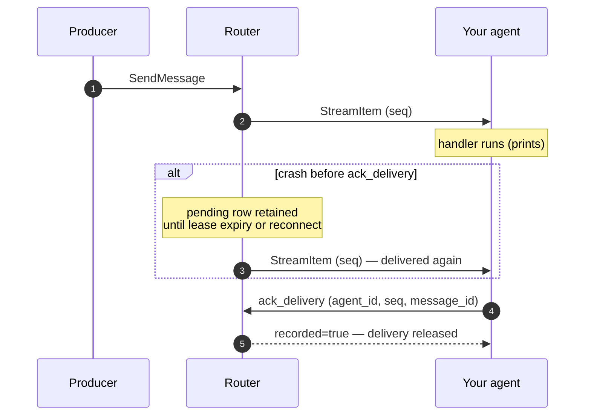

# 2.2 Your First Agent

This example uses the **0.7.0 source checkout** and the Python reference Router
and Registry. Install the source SDK and generate its protobuf modules using the
[installation guide](installation.md). Start the reference services first.

## Receive and acknowledge

Run this consumer before sending a message:

```python
import grpc
from sw4rm.clients.registry import RegistryClient
from sw4rm.clients.router import RouterClient

agent_id = "example-consumer"
registry = RegistryClient(grpc.insecure_channel("localhost:50052"))
router = RouterClient(grpc.insecure_channel("localhost:50051"))
registry.register({"agent_id": agent_id, "name": "Example consumer",
                   "capabilities": ["display"]})

for item in router.stream_incoming(agent_id):
    # Printing is the work in this example. An interrupted delivery may print twice.
    print(item.msg.message_id, item.msg.payload)
    ack = router.ack_delivery(agent_id, item.seq, item.msg.message_id)
    if not ack.recorded:
        print("Delivery was already released or is no longer in flight")
```

`item.seq` identifies router delivery storage; it is not the envelope's sequence
number. A failed handler should leave the item unacknowledged so it can be retried.
Use a permanent-failure acknowledgement only when deliberately abandoning work.



## Send a message

In another process:

```python
import grpc
from sw4rm import constants as C
from sw4rm.envelope import build_envelope
from sw4rm.clients.router import RouterClient

router = RouterClient(grpc.insecure_channel("localhost:50051"))
envelope = build_envelope(producer_id="example-producer", message_type=C.DATA,
                          content_type="text/plain", payload=b"hello")
response = router.send_message(envelope)
print(response.accepted, response.reason)
```

The Python reference routing profile delivers to eligible known queues except
the producer. It is not a general addressed task router. An accepted send means
the router accepted delivery responsibility; it does not mean the consumer's
work completed.

## Add real work

Replace printing with a bounded handler. If recovery must suppress already
completed work, use an idempotency token and a persistent completion record;
flush it before acknowledging delivery. If an external effect succeeds before
that record is persisted, a crash can still cause the effect to repeat.
Use a downstream idempotency key or an effect/completion transaction when needed.

See [activity-buffer persistence](persistence.md),
[delivery migration](../release-status.md), and
[the router API](../clients/router.md). Application ACK envelopes report progress
separately from the delivery acknowledgement shown here.

## A complete handler skeleton

The small loop below shows the boundaries that matter when turning the example
into an application. It records an incoming envelope before work, uses the
stable idempotency token when one is supplied, and releases the Router row only
after the handler has reached its chosen completion point. The activity buffer
is an application aid; it does not make an external database or API call
atomic with the acknowledgement.

```python
import grpc
from pathlib import Path

from sw4rm import constants as C
from sw4rm.activity_buffer import PersistentActivityBuffer
from sw4rm.clients.registry import RegistryClient
from sw4rm.clients.router import RouterClient
from sw4rm.persistence import JSONFilePersistence

agent_id = "example-consumer"
state_dir = Path(".sw4rm-state")
state_dir.mkdir(parents=True, exist_ok=True)
buffer = PersistentActivityBuffer(
    persistence=JSONFilePersistence(str(state_dir / "activity.json")),
    dedup_window_s=3600,
)
registry = RegistryClient(grpc.insecure_channel("localhost:50052"))
router = RouterClient(grpc.insecure_channel("localhost:50051"))
registry.register({
    "agent_id": agent_id,
    "name": "Example consumer",
    "description": "A bounded quickstart consumer",
    "capabilities": ["display"],
})

for item in router.stream_incoming(agent_id):
    envelope = item.msg
    # Convert the generated message to the dict shape used by the buffer.
    record = {field: getattr(envelope, field) for field in (
        "message_id", "producer_id", "correlation_id", "idempotency_token",
        "message_type", "content_type", "content_length", "payload",
    ) if hasattr(envelope, field)}
    token = record.get("idempotency_token", "")
    existing = buffer.get_by_idempotency_token(token) if token else None
    if existing and existing.ack_stage == C.FULFILLED:
        router.ack_delivery(agent_id, item.seq, envelope.message_id)
        continue
    buffer.record_incoming(record)
    buffer.flush()  # Retain the receipt before the handler runs.
    print(envelope.payload)
    buffer.ack({
        "ack_for_message_id": envelope.message_id,
        "ack_stage": C.FULFILLED,
        "error_code": C.ERROR_CODE_UNSPECIFIED,
    })
    buffer.flush()
    router.ack_delivery(agent_id, item.seq, envelope.message_id)
```

The generated protobuf uses integer enum values; use the constants exported by
`sw4rm.constants` rather than guessing numbers. If processing fails, leave the
delivery unacknowledged so the Router can redeliver it. If the input is
permanently invalid and will never succeed, retain the reason for operators
before acknowledging with `permanent_failure=True`.

## Sending a correlated response

`build_envelope` is the safest starting point for an outgoing message because
it fills the required identity and content metadata. Keep the request's
`correlation_id` when the response belongs to that request and give retries a
stable `idempotency_token`. This fragment belongs inside the handler above and
uses its `envelope`, `agent_id`, and `router`:

```python
from sw4rm.envelope import build_envelope

# Derive this from the incoming logical operation, not a fixed global token.
request_key = envelope.idempotency_token or envelope.message_id
reply = build_envelope(
    producer_id=agent_id,
    message_type=C.DATA,
    content_type="text/plain",
    payload=b"processed",
    correlation_id=envelope.correlation_id,
    idempotency_token=f"reply:{agent_id}:{request_key}",
)
sent = router.send_message(reply)
if not sent.accepted:
    raise RuntimeError(sent.reason)
```

The exact destination and routing profile depend on the deployed reference
service. Confirm the generated RPC contract and the [Router client reference](../clients/router.md)
before treating an accepted send as proof that another agent completed work.
If the request has no stable token, an application retry with a new message ID
cannot be recognized as the same operation by this fallback key. Supply a
logical request ID for that case. For reliable replies, persist the reply as an
outgoing intent before marking the input complete, and reconcile unsent replies
on restart; this fragment alone is not a durable request/response runtime.

## Troubleshooting the first run

- `Protobuf stubs not generated`: run `make protos` from the repository root.
- `UNAVAILABLE` or connection refused: start the Router and Registry on ports
  50051 and 50052, or update the channel addresses.
- No delivery arrives: ensure the consumer is registered with the exact
  `agent_id` used by the stream and that the sender's envelope matches the
  configured routing profile.
- A message appears twice: this is expected when a process dies before
  `ack_delivery`; use the idempotency token and persisted completion state.
- State will not load: inspect the persistence error and restore the snapshot;
  only opt into `load_failure_mode="empty"` when losing recovery history is
  acceptable.
