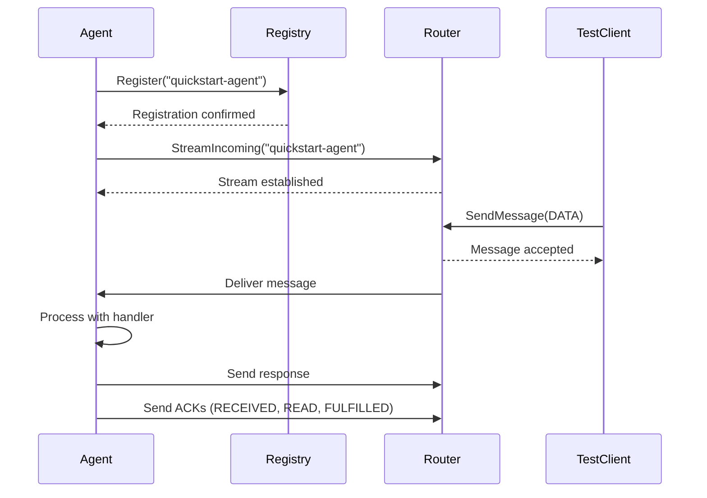

# Your First Agent

Terminology: In SW4RM, an “Agent” is a supervised, process‑isolated participant (see “Agents and Agentic Interaction” in documentation/index.md), not just an LLM wrapper or library coroutine.

Build a complete agent that handles messages, manages state, and demonstrates core SDK features.

## Overview

This guide creates an agent that:


- Connects to SW4RM services (Router and Registry)
- Registers itself with service discovery
- Processes incoming DATA messages with automatic ACK handling
- Maintains persistent message history
- Handles graceful shutdown

## Basic Agent Structure

Create `my_first_agent.py`:

```python
#!/usr/bin/env python3
"""My first SW4RM - demonstrates core SDK features."""

import grpc
import json
import signal
import sys
from pathlib import Path

from sw4rm.clients.registry import RegistryClient
from sw4rm.clients.router import RouterClient
from sw4rm.activity_buffer import PersistentActivityBuffer
from sw4rm.ack_integration import ACKLifecycleManager, MessageProcessor
from sw4rm import constants as C

class MyFirstAgent:
    def __init__(self, agent_id: str):
        self.agent_id = agent_id
        self.stop_requested = False
        
        # Initialize persistent activity buffer
        self.buffer = PersistentActivityBuffer(max_items=500)
        
    def connect(self, router_addr: str, registry_addr: str):
        """Connect to SW4RM services."""
        print(f"🔌 Connecting to router: {router_addr}, registry: {registry_addr}")
        
        # Create gRPC connections
        router_ch = grpc.insecure_channel(router_addr)
        registry_ch = grpc.insecure_channel(registry_addr)
        
        # Initialize clients
        self.registry = RegistryClient(registry_ch)
        self.router = RouterClient(router_ch)
        
        # Set up ACK lifecycle management
        self.ack_manager = ACKLifecycleManager(
            router_client=self.router,
            activity_buffer=self.buffer,
            agent_id=self.agent_id
        )
        
        # Set up message processor with handlers
        self.processor = MessageProcessor(self.ack_manager)
        self.processor.register_handler(C.DATA, self.handle_data)
        self.processor.set_default_handler(self.handle_unknown)
```

## Message Handlers

Add message processing logic:

```python
    def handle_data(self, envelope):
        """Handle DATA messages."""
        message_id = envelope.get("message_id", "")
        payload = envelope.get("payload", b"")
        
        print(f"📨 Processing DATA message {message_id}")
        print(f"   Payload size: {len(payload)} bytes")
        
        # Process the message (echo back with metadata)
        response = {
            "original_id": message_id,
            "agent_id": self.agent_id,
            "status": "processed",
            "payload_size": len(payload),
            "timestamp": int(time.time())
        }
        
        # Send response using ACK manager
        from sw4rm.envelope import build_envelope
        response_env = build_envelope(
            producer_id=self.agent_id,
            message_type=C.DATA,
            content_type="application/json", 
            payload=json.dumps(response).encode()
        )
        # Note: SDK helpers populate required envelope fields such as
        # `correlation_id`, `sequence_number`, and `content_length`. An
        # `idempotency_token` may be attached for exactly-once effects.
        
        result = self.ack_manager.send_message_with_ack(response_env)
        print(f"✅ Response sent: {result.success}")
        
        return "data_processed"
    
    def handle_unknown(self, envelope):
        """Handle unknown message types."""
        msg_type = envelope.get("message_type", "unknown")
        print(f"❓ Unknown message type: {msg_type}")
        return "unknown_handled"
```

## Registration and Main Loop

Add service registration and message processing:

```python
    def register(self):
        """Register with the registry service."""
        descriptor = {
            "agent_id": self.agent_id,
            "name": "MyFirstAgent",
            "description": "Learning the SW4RM SDK",
            "capabilities": ["echo", "processing"],
            "communication_class": C.STANDARD,
            "modalities_supported": ["application/json"],
        }
        
        try:
            response = self.registry.register(descriptor)
            accepted = getattr(response, 'accepted', False)
            reason = getattr(response, 'reason', '')
            
            if accepted:
                print(f"✅ Registered successfully: {reason}")
            else:
                print(f"❌ Registration failed: {reason}")
            
            return accepted
        except Exception as e:
            print(f"❌ Registration error: {e}")
            return False
    
    def run(self):
        """Main message processing loop."""
        print(f"🚀 Starting message loop for {self.agent_id}")
        
        try:
            for item in self.router.stream_incoming(self.agent_id):
                if self.stop_requested:
                    break
                
                # Convert protobuf message to dict
                envelope_msg = getattr(item, "msg", item)
                envelope = {
                    "message_id": getattr(envelope_msg, "message_id", ""),
                    "message_type": getattr(envelope_msg, "message_type", 0),
                    "content_type": getattr(envelope_msg, "content_type", ""),
                    "payload": getattr(envelope_msg, "payload", b""),
                    "producer_id": getattr(envelope_msg, "producer_id", ""),
                }
                
                # Process with automatic ACK handling
                result = self.processor.process_message(envelope)
                print(f"📋 Processed: {result.success}")
                
        except KeyboardInterrupt:
            print("🛑 Stopped by user")
        except Exception as e:
            print(f"❌ Error in message loop: {e}")
```

## Graceful Shutdown

Add cleanup and shutdown logic:

```python
class MyFirstAgent:
    def shutdown(self):
        """Clean shutdown."""
        print("🔄 Shutting down...")
        self.stop_requested = True
        
        # Save state
        self.buffer.flush()
        
        # Deregister
        try:
            self.registry.deregister(self.agent_id, reason="shutdown")
            print("✅ Deregistered successfully")
        except Exception as e:
            print(f"⚠️ Deregister failed: {e}")
        
        # Show final stats
        total = len(self.buffer._by_id)
        unacked = len(self.buffer.unacked())
        print(f"📊 Final stats: {total} total messages, {unacked} unacked")

def main():
    agent = MyFirstAgent("quickstart-agent")
    
    # Handle shutdown signals
    def signal_handler(signum, frame):
        print(f"\n📡 Received signal {signum}")
        agent.shutdown()
        sys.exit(0)
    
    signal.signal(signal.SIGINT, signal_handler)
    signal.signal(signal.SIGTERM, signal_handler)
    
    # Connect and run
    agent.connect("localhost:50051", "localhost:50052")
    
    if agent.register():
        agent.run()
    else:
        print("❌ Failed to register, exiting")
        return 1
    
    agent.shutdown()
    return 0

if __name__ == "__main__":
    import sys
    sys.exit(main())
```

## Test Your Agent

Create a test client (`test_my_agent.py`):

```python
#!/usr/bin/env python3
"""Test script for my first agent."""

import grpc
import json
import time
from sw4rm.clients.router import RouterClient
from sw4rm.envelope import build_envelope
from sw4rm import constants as C

def test_agent():
    # Connect to router
    channel = grpc.insecure_channel("localhost:50051")
    router = RouterClient(channel)
    
    # Send test message
    test_data = {
        "message": "Hello from test!", 
        "timestamp": int(time.time())
    }
    
    envelope = build_envelope(
        producer_id="test-client",
        message_type=C.DATA,
        content_type="application/json",
        payload=json.dumps(test_data).encode()
    )
    # Tip: `build_envelope(...)` will generate a `correlation_id` and
    # compute `content_length`; you can inspect them on the returned object.
    
    # Send message
    response = router.send_message(envelope)
    accepted = getattr(response, 'accepted', False)
    reason = getattr(response, 'reason', '')
    
    print(f"✅ Message sent: accepted={accepted}, reason={reason}")

if __name__ == "__main__":
    test_agent()
```

## Run Your Agent

!!! tip "Two Terminal Setup"
    You'll need two terminals - one for the agent and one for testing.

**Terminal 1 - Start your agent:**


```bash
python my_first_agent.py
```

Expected output:
```
🔌 Connecting to router: localhost:50051, registry: localhost:50052
✅ Registered successfully: 
🚀 Starting message loop for quickstart-agent
```

**Terminal 2 - Test your agent:**


```bash
python test_my_agent.py
```

**Back in Terminal 1**, you should see:
```
📨 Processing DATA message msg-123
   Payload size: 45 bytes
✅ Response sent: True
📋 Processed: True
```

## Understanding the Flow

Here's what happens when you run your agent:



## Key Concepts

### Automatic ACK Lifecycle

The `MessageProcessor` automatically sends acknowledgments:


1. **RECEIVED** - Immediately when message arrives
2. **READ** - Before processing begins  
3. **FULFILLED** - On successful processing
4. **REJECTED/FAILED** - On processing errors

### Activity Buffer

The `PersistentActivityBuffer` tracks:


- All incoming and outgoing messages
- ACK progression for each message
- Messages that need reconciliation
- State persisted to `sw4rm_activity.json`

### Message Handlers

Handlers are functions that:


- Receive envelope dictionaries
- Return status strings
- Are automatically wrapped with ACK logic
- Can send responses through the ACK manager

## Troubleshooting

### "Connection refused"

The most common issue is services not running:

```python
# Update connection addresses if needed
agent.connect("your-router:50051", "your-registry:50052")
```

### "Protobuf stubs not generated"

```bash
make protos
```

### "Permission denied on files"

```bash
# Create directory with proper permissions
mkdir -p ./agent_data
chmod 755 ./agent_data
```

## What's Next?

Your agent now handles basic message processing with persistent state! 

The next section adds more advanced features:

- Worktree management
- Custom control commands  
- Cross-restart state recovery

[Add Persistence Features →](persistence.md){ .md-button .md-button--primary }
