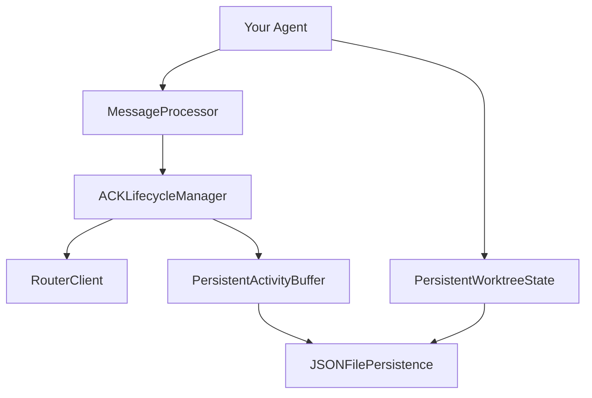

# Getting Started

Welcome to the SigAgent SDK! This guide will help you build your first production-ready agent in just a few minutes.

## What You'll Build

By the end of this quickstart, you'll have created an agent that:

- ✅ Persists message state across restarts
- ✅ Automatically handles ACK lifecycle
- ✅ Processes different message types
- ✅ Manages worktree bindings
- ✅ Gracefully handles errors and shutdown

## Prerequisites

- Python 3.9 or later
- Basic understanding of gRPC and protocol buffers
- SigAgent services running (Router and Registry)

!!! info "Don't have SigAgent services?"
    The examples work with mock services for development. You can start building and testing right away!

## Quick Overview

The SigAgent SDK provides these core components:

**Key Components:**

- **MessageProcessor**: Routes messages to handlers with automatic ACK generation
- **ACKLifecycleManager**: Handles acknowledgment lifecycle with router integration
- **PersistentActivityBuffer**: Tracks messages across restarts with reconciliation
- **PersistentWorktreeState**: Manages repository/worktree bindings with policies

## Step-by-Step Guide

-   **Step 1: Installation**
    
    Set up the SDK and generate protocol stubs
    
    [Install SDK :material-arrow-right:](installation.md)

-   **Step 2: Your First Agent**
    
    Build a basic agent with message processing
    
    [Create Agent :material-arrow-right:](first-agent.md)

-   **Step 3: Add Persistence**
    
    Enable state persistence and restart recovery
    
    [Add State :material-arrow-right:](persistence.md)

## What's Next?

After completing the quickstart:

- **[View Examples](../examples/)** - See advanced patterns and best practices
- **[API Reference](../reference/)** - Explore all SDK components in detail
- **[Architecture Guide](../architecture/)** - Understand the design and extend the SDK
- **[Production Deployment](../production/)** - Learn about monitoring, scaling, and operations

## Need Help?

- Check the [Examples](../examples/) for common patterns
- Review the [API Reference](../reference/) for detailed documentation
- Look at production considerations in the [Deployment Guide](../production/deployment.md)

Let's get started! 🚀