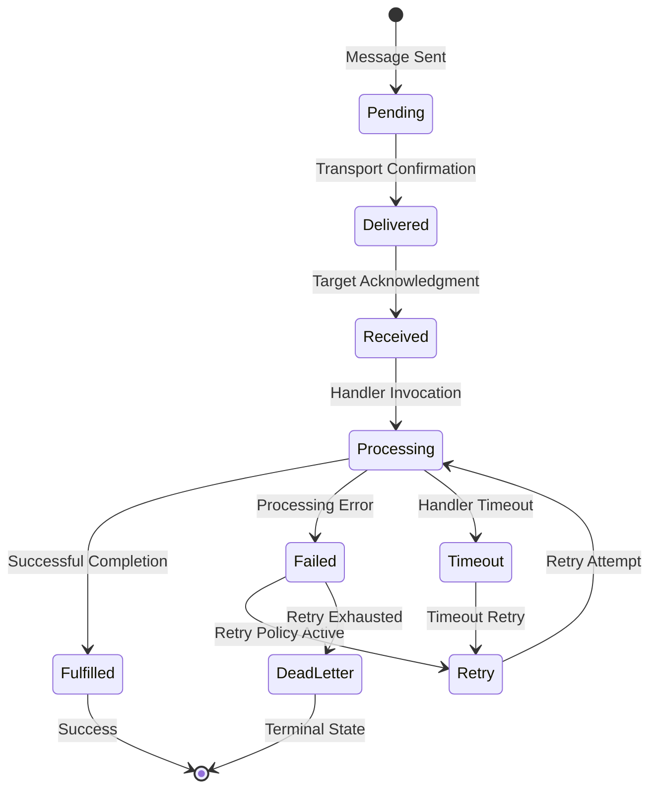

# 2. Comprehensive Getting Started Guide

Terminology: In SW4RM, an “Agent” is a supervised, process‑isolated participant with registry‑backed identity, explicit message lifecycles, and cooperative preemption (see “Agents and Agentic Interaction” in documentation/index.md). This differs from the common “LLM wrapper” usage.

This comprehensive guide provides detailed instructions for developing, configuring, and deploying production-ready agents using the SW4RM SDKs. The guide covers every aspect from system requirements and architectural concepts to advanced configuration patterns and troubleshooting procedures.

## 2.1. Learning Objectives and Deliverables

Upon completion of this quickstart guide, you will have successfully implemented and deployed a fully-functional agent system with the following capabilities:

### 2.1.1. Core Functional Requirements

- **Message State Persistence**: The agent persists complete message processing history and state across system restarts, crashes, and network partitions.
- **Acknowledgment Lifecycle Management**: The agent handles ACK messages with automatic retry policies, dead letter queues, and timeout management.
- **Multi-Protocol Message Processing**: The agent processes all SW4RM message types including `DATA`, `CONTROL`, `HITL_INVOCATION`, `WORKTREE_CONTROL`, and `TOOL_CALL`.
- **Git Repository Integration**: The agent binds to worktrees with branch switching, commit-specific context, and workspace isolation.
- **Graceful Shutdown Procedures**: The agent handles shutdown signals with proper resource cleanup and state persistence.

## 2.2. Comprehensive Prerequisites and System Requirements

### 2.2.1. Software Dependencies and Version Requirements

**Core Runtime Dependencies**:

- **Python**: You must install Python 3.11.0 or later. Python 3.12 or later is recommended for optimal performance and security.
- **Operating System**: You must use Linux (Ubuntu 20.04+, CentOS 8+), macOS 12+, or Windows 10+ with WSL2.
- **Git**: You must install Git 2.30 or later for worktree management and repository integration.

**Network Requirements**:

- **Outbound HTTPS (443)**: You must have access to package repositories (PyPI, GitHub) for installation.
- **TLS Support**: Your environment must support TLS 1.2 or later for secure communication.

**Development Tools and Utilities**:

- **Protocol Buffers**: You must install the protoc compiler version v31 series for message schema compilation.
- **gRPC Tools**: You must install grpcio-tools for Python gRPC stub generation.
- **Monitoring Tools**: You should install an OpenTelemetry-compatible observability stack. This is optional but recommended.

### 2.2.3. Knowledge Prerequisites and Technical Background

As of protocol v0.1, SW4RM can be used for single-agent applications on the same hardware. The protocol specification can lend itself to building workflows for distributed systems but is unopinionated about implementation therein. Developers are responsible for understanding these concepts when building multi-agent distributed systems. That being said may of these principles, and particularly the associated failure models, are important to understand in all contexts. 

**Essential Technical Knowledge**:


- **Distributed Systems Concepts**: Understanding eventual consistency and distributed consensus is crucial because SW4RM agents would coordinate across network boundaries where failures and partitions are common. Knowledge of the CAP theorem helps developers make informed trade-offs between consistency and availability in their agent designs.

- **Message-Driven Architectures**: Experience with asynchronous message processing is fundamental since SW4RM is built around message-driven communication patterns. Understanding message queues and pub/sub systems helps developers design robust agent interactions and handle message delivery guarantees properly.

- **gRPC and Protocol Buffers**: Familiarity with gRPC service definitions and protobuf serialization is necessary because SW4RM uses these technologies for inter-agent communication. Developers need to understand schema evolution and service versioning to maintain compatibility as their systems evolve.

**Helpful Background Knowledge**:


- **Version Control Systems**: Proficiency with Git operations is valuable because SW4RM includes worktree integration features that allow agents to work with repository contexts. Understanding branching strategies helps when designing agents that operate on different code versions.

- **Observability and Monitoring**: Experience with distributed tracing and metrics collection becomes important in production deployments where understanding agent behavior across multiple instances is crucial for debugging and performance optimization.

## 2.3. Comprehensive SDK Architecture and Component Overview

The SW4RM SDKs implement a sophisticated, layered architecture designed for reliability, performance, and maintainability. The SDK abstracts complex distributed system concerns while providing fine-grained control over system behavior through comprehensive configuration interfaces.

### 2.3.1. Detailed Component Architecture

<div class="diagram-container">

```kroki-graphviz
digraph SDK_Architecture {
    rankdir=TB;
    node [shape=rect, style=filled, fontname="Arial"];
    
    // Define clusters
    subgraph cluster_app {
        label="Agent Application Layer";
        style=filled;
        fillcolor="#e8f4f8";
        APP [label="User Application Code\nBusiness Logic Implementation", fillcolor="#d4e6f1"];
        HANDLERS [label="Message Handlers\nBusiness Logic Processors", fillcolor="#d4e6f1"];
    }
    
    subgraph cluster_core {
        label="SW4RM SDK Core Runtime";
        style=filled;
        fillcolor="#fef9e7";
        MP [label="MessageProcessor\nHandler Registry & Routing", fillcolor="#f9e79f"];
        ACK [label="ACKLifecycleManager\nDelivery Confirmation & Retry", fillcolor="#f9e79f"];
        AB [label="ActivityBuffer\nMessage History & Recovery", fillcolor="#f9e79f"];
        WS [label="WorktreeState\nRepository Context Management", fillcolor="#f9e79f"];
    }
    
    subgraph cluster_client {
        label="Client Layer";
        style=filled;
        fillcolor="#e8f8e8";
        RC [label="RouterClient\nMessage Transport", fillcolor="#a9dfbf"];
        REG [label="RegistryClient\nService Discovery", fillcolor="#a9dfbf"];
        HC [label="HealthClient\nHealth Monitoring", fillcolor="#a9dfbf"];
    }
    
    subgraph cluster_persistence {
        label="Persistence Layer";
        style=filled;
        fillcolor="#fdeaea";
        JSON [label="JSONFilePersistence\nFile-based State Storage", fillcolor="#f5b7b1"];
        REDIS [label="RedisPersistence\nDistributed Cache Storage", fillcolor="#f5b7b1"];
        POSTGRES [label="PostgresPersistence\nRelational Database Storage", fillcolor="#f5b7b1"];
    }
    
    subgraph cluster_monitoring {
        label="Monitoring & Observability";
        style=filled;
        fillcolor="#f4e8f8";
        METRICS [label="MetricsCollector\nPerformance Metrics", fillcolor="#d7b9e5"];
        TRACING [label="TracingManager\nDistributed Tracing", fillcolor="#d7b9e5"];
        LOGGING [label="LoggingManager\nStructured Logging", fillcolor="#d7b9e5"];
    }
    
    // Connections
    APP -> HANDLERS;
    HANDLERS -> MP;
    MP -> ACK;
    MP -> AB;
    MP -> WS;
    
    ACK -> RC;
    AB -> REG;
    WS -> HC;
    
    AB -> JSON;
    AB -> REDIS;
    AB -> POSTGRES;
    WS -> JSON;
    WS -> REDIS;
    WS -> POSTGRES;
    
    MP -> METRICS;
    ACK -> TRACING;
    AB -> LOGGING;
}
```

</div>

### 2.3.2. Core Component Specifications

#### 2.3.2.1. `MessageProcessor`: Message Routing Engine

**Core Functionality**:

The `MessageProcessor` component provides a registry for message handlers and routes incoming messages to appropriate handler functions. Handler registration uses Python type hints to validate message types at registration time. The component supports configurable concurrency limits to prevent resource exhaustion during high-volume message processing. Error handling includes exception catching and classification, with configurable retry policies for transient failures. Message validation can be enabled to verify incoming messages against protocol buffer schemas before processing.

**Configuration Options**:
```python
MessageProcessorConfig:
    max_concurrent_handlers: int = 10          # Maximum concurrent message handlers
    handler_timeout_seconds: int = 300         # Per-handler timeout duration
    enable_message_validation: bool = True     # Enable schema validation
    validation_strictness: str = "strict"     # "strict", "lenient", "disabled"
    retry_policy: RetryPolicy = ExponentialBackoff()  # Handler retry configuration
    circuit_breaker: CircuitBreakerConfig = None      # Circuit breaker settings
```

#### 2.3.2.2. `ACKLifecycleManager`: Guaranteed Delivery Management

**Acknowledgment State Machine**:

The `ACK` lifecycle implements a comprehensive state machine for tracking message delivery and processing status:



**Retry Policy Features**:

The `ACKLifecycleManager` supports exponential backoff retry strategies with configurable initial delay, maximum delay, and backoff multiplier values. Random jitter can be added to retry delays to help prevent thundering herd scenarios when multiple agents retry simultaneously. Circuit breaker functionality automatically suspends retry attempts after a configurable number of consecutive failures. Messages that exhaust all retry attempts are automatically routed to dead letter queues for manual inspection or alternative processing. The retry system provides a pluggable interface allowing custom retry strategy implementations.

#### 2.3.2.3. `PersistentActivityBuffer`: Stateful Message History

**Persistence Features**:

The `PersistentActivityBuffer` maintains a history of processed messages using configurable storage backends including file-based storage, Redis, and PostgreSQL. Message deduplication uses SHA-256 fingerprinting to identify and prevent duplicate message processing. The component supports crash recovery through state reconciliation mechanisms that can use vector clocks, timestamps, or sequence numbers depending on configuration. Retention policies automatically clean up old messages based on age or count limits to prevent unbounded storage growth. Optional compression can be enabled to reduce storage space requirements for message history.

**Recovery Mechanisms**:
```python
RecoveryConfig:
    enable_crash_recovery: bool = True         # Enable automatic crash recovery
    recovery_timeout_seconds: int = 60         # Maximum recovery time
    consistency_level: str = "eventual"       # "strong", "eventual", "weak"
    reconciliation_strategy: str = "vector_clock"  # "vector_clock", "timestamp", "sequence"
    max_recovery_attempts: int = 3             # Maximum recovery attempts
```

#### 2.3.2.4. `PersistentWorktreeState`: Git Integration and Repository Management

**Git Integration Features**:

The `PersistentWorktreeState` component manages Git repository contexts for agents that work with code repositories. Repository cloning supports standard Git credential management including SSH keys and personal access tokens. Branch switching operations preserve agent state while transitioning between different repository contexts. Commit tracking uses SHA-based identification to ensure agents work with consistent repository states across operations. Workspace isolation can be configured at the process level or using containerization depending on security requirements.

**Workspace Management**:

The component supports configurable workspace isolation using process-level separation or container-based isolation for enhanced security. Resource limits can be applied to workspace operations including CPU usage, memory consumption, and disk space allocation. Security policies control repository access permissions and prevent unauthorized repository operations. Automatic cleanup removes temporary workspaces and abandoned state to prevent resource leaks in long-running deployments.

## 2.4. Comprehensive Implementation Roadmap

This section provides a detailed, step-by-step implementation pathway that progresses from basic SDK installation through advanced production deployment scenarios. Each step includes comprehensive technical details, configuration options, troubleshooting guidance, and validation procedures.

### 2.4.1. Phase 1: Environment Preparation and SDK Installation

**Objectives**: Establish a secure, validated development environment with all required dependencies and configurations.

**Time Commitment**: 30-60 minutes for complete setup and validation

**Technical Requirements**:

This phase involves installing system dependencies and verifying their versions meet minimum requirements. Protocol buffer stub generation creates the necessary gRPC interface code from the SW4RM protocol definitions. SDK installation verification ensures all components are properly installed and accessible. Basic network connectivity validation confirms access to package repositories during installation.

**Detailed Instructions**:
[**Complete Installation Guide** :material-arrow-right:](installation.md){ .md-button .md-button--primary }

**Validation Criteria**:

Successful completion of this phase requires system dependencies to be installed with versions meeting the minimum requirements specified in the installation guide. Protocol buffer stub generation should complete without errors and produce the expected output files. SDK diagnostic tests should execute successfully, though specific test coverage may vary depending on the local environment configuration.

### 2.4.2. Phase 2: Basic Agent Implementation and Message Processing

**Objectives**: Implement a fully-functional agent with comprehensive message handling, error management, and basic observability.

**Time Commitment**: 45-90 minutes for complete implementation and testing

**Technical Implementation Details**:

This phase covers the implementation of message handler registration where agents define functions to process specific message types. Error handling implementation includes exception catching and configurable retry policies for failed message processing. Basic logging setup provides structured output for debugging and monitoring agent operations. Agent lifecycle management includes proper startup initialization, graceful shutdown procedures, and signal handling for process management.

**Advanced Features Covered**:

The implementation includes concurrent message processing capabilities with configurable limits to prevent resource exhaustion. Circuit breaker patterns can be implemented to provide fault tolerance when downstream services become unavailable. Structured logging includes correlation identifiers to track message processing across distributed operations. Health check endpoints provide monitoring capabilities for deployment orchestration systems.

**Detailed Tutorial**:
[**Build Your First Agent** :material-arrow-right:](first-agent.md){ .md-button .md-button--primary }

**Success Metrics**:

Successful completion of this phase is demonstrated when the agent can process test messages without unhandled exceptions. Error handling should properly catch and classify processing failures according to the implemented retry policies. Health check endpoints should return appropriate status information reflecting the agent's operational state. Logging output should include structured information with correlation identifiers for message tracking. Graceful shutdown should complete resource cleanup without leaving orphaned processes or open connections.

### 2.4.3. Phase 3: Advanced State Management and Persistence

**Objectives**: Implement state persistence with crash recovery, data consistency, and multi-backend storage support.

**Time Commitment**: 60-120 minutes for complete implementation and testing

**Persistence Features**:

This phase covers configuration of multiple storage backends including file-based persistence, Redis, and PostgreSQL depending on deployment requirements. Crash recovery mechanisms implement state reconciliation using configurable strategies such as vector clocks or timestamp-based ordering. Message deduplication prevents duplicate processing using message fingerprinting. Data retention policies automatically remove old data to prevent unbounded storage growth.

**State Management Patterns**:

Implementation includes activity buffer configuration for maintaining message processing history. Worktree state management provides Git repository integration for agents that work with code repositories. Configuration state persistence enables agent settings to survive restarts. State synchronization patterns help coordinate agent instances in distributed deployments.

**Implementation Guide**:
[**Advanced State Management** :material-arrow-right:](persistence.md){ .md-button .md-button--primary }

**Validation Requirements**:

- State persists successfully across agent restarts.
- Crash recovery completes within configured timeout limits.
- Message deduplication prevents duplicate processing.
- Storage backend failover occurs transparently.
- Data retention policies clean up expired data automatically.

### 2.4.4. Phase 4: Production Deployment and Operational Excellence

**Objectives**: Deploy agents in production-ready configurations with comprehensive monitoring, security, and scalability features.

**Time Commitment**: 2-4 hours for complete production deployment setup

**Production Readiness Checklist**:

- You deploy agents in containers with security hardening.
- You integrate agents with a service mesh for observability and traffic management.
- You configure monitoring and alerting.
- You implement security policies and access control.
- You configure scalability and validate with load testing.

**Operational Features**:

- The system supports zero-downtime deployment strategies.
- The system scales automatically based on message queue depth.
- The system provides observability with distributed tracing.
- The system supports security scanning and vulnerability management.
- The system supports disaster recovery and backup procedures.

**Production Guide**:
<!-- Production Deployment link temporarily disabled; page pending -->{ .md-button .md-button--primary }

## 2.5. Advanced Learning Pathways

After completing the core implementation phases, explore these specialized topics for advanced use cases and enterprise requirements:

### 2.5.1. Enterprise Integration Patterns

**Service Mesh Integration**: Learn to deploy agents within service mesh architectures (Istio, Linkerd) for advanced traffic management, security policies, and observability.

**Multi-Cloud Deployments**: Understand patterns for deploying agents across multiple cloud providers with cross-cloud communication and data synchronization.

**Legacy System Integration**: Explore patterns for integrating SW4RM with existing enterprise systems, message queues, and workflow engines.

[**Integration Patterns Guide** :material-arrow-right:](../examples/index.md){ .md-button }

<!-- Performance Optimization and Scaling section removed to avoid implying guarantees. Consider documenting platform-specific tuning separately. -->

### 2.5.3. Security and Compliance

**Enterprise Security**: Implement advanced security features including certificate management, secret rotation, and audit logging for compliance.

**RBAC and Authorization**: Configure fine-grained role-based access control and authorization policies for enterprise environments.

**Compliance Frameworks**: Understand compliance requirements and implementation patterns for SOX, PCI-DSS, HIPAA, and other regulatory frameworks.

<!-- Security Guide link temporarily disabled; page pending -->{ .md-button }

## 2.6. Comprehensive Reference Documentation

### 2.6.1. API Reference and SDK Documentation

**Complete API Documentation**: Comprehensive reference documentation for all SDK classes, methods, and configuration options.

<!-- API Reference link temporarily disabled; page pending -->{ .md-button }

### 2.6.2. Architecture Deep Dive

**System Architecture**: Detailed technical architecture documentation including service interactions, data flows, and system boundaries.

[**Architecture Guide** :material-arrow-right:](../architecture/index.md){ .md-button }

### 2.6.3. Troubleshooting and Operational Guidance

**Troubleshooting Guide**: Comprehensive troubleshooting procedures for common issues, error codes, and diagnostic techniques.

**Operational Runbooks**: Step-by-step operational procedures for common administrative tasks, maintenance, and incident response.

<!-- Operations Guide link temporarily disabled; page pending -->{ .md-button }

## 2.7. Expert Support and Community Resources

### 2.7.1. Community Support Channels

- **GitHub Discussions**: You can get community-driven support and discuss features.
- **Discord Server**: You can get real-time chat support for development questions.
- **Stack Overflow**: You can search tagged questions for solutions.

### 2.7.2. Professional Support Options

- **Enterprise Support**: You can get dedicated technical support for enterprise deployments.
- **Professional Services**: You can get implementation assistance and custom development.
- **Training Programs**: You can enroll in training programs for development teams.

### 2.7.3. Contributing to the Project

- **Contribution Guidelines**: Review the guidelines to contribute code, documentation, and community support.
- **Development Environment**: Learn how to set up development environments for SDK contribution.
- **Release Process**: Understand the release cycle and version management.

<!-- Community Resources link temporarily disabled; page pending -->{ .md-button }

---

**Ready to begin your SW4RM journey?** Start with the installation guide and work through each phase systematically to build enterprise-grade agentic systems with confidence and reliability.
