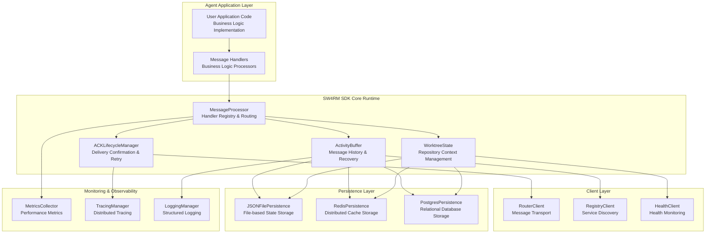
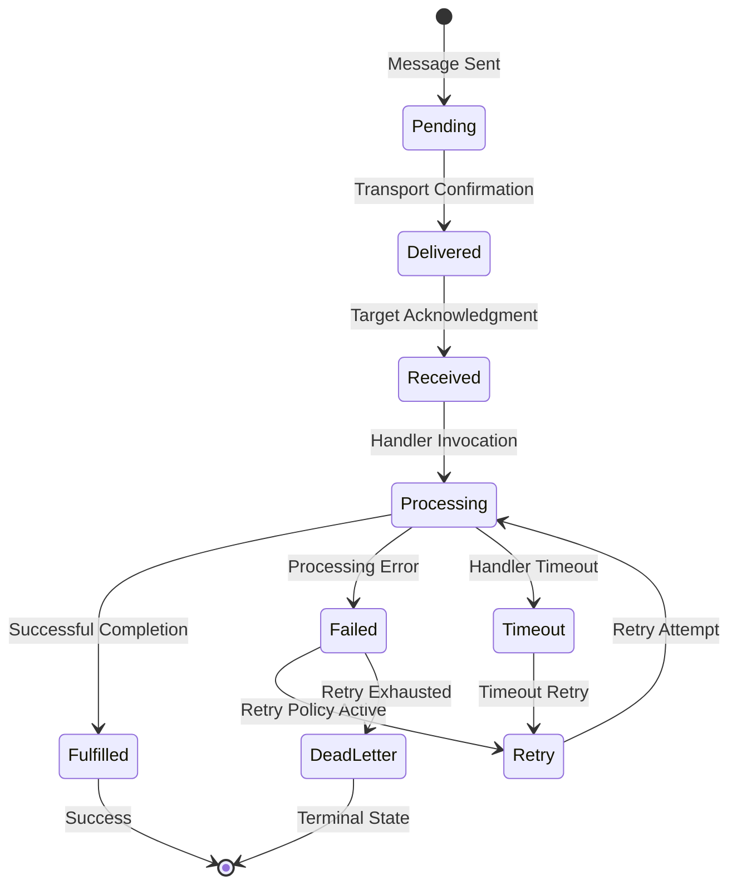

# 2. Comprehensive Getting Started Guide

**Build Enterprise-Grade Message-Driven Agents with Production-Ready Architecture**


This comprehensive guide provides detailed instructions for developing, configuring, and deploying production-ready agents using the SW4RM SDK. The guide covers every aspect from system requirements and architectural concepts to advanced configuration patterns and troubleshooting procedures.

## 2.1. Learning Objectives and Deliverables

Upon completion of this quickstart guide, you will have successfully implemented and deployed a fully-functional agent system with the following capabilities:

### 2.1.1. Core Functional Requirements
- **Message State Persistence**: Complete message processing history and state preservation across system restarts, crashes, and network partitions
- **Acknowledgment Lifecycle Management**: Comprehensive ACK handling with automatic retry policies, dead letter queues, and timeout management
- **Multi-Protocol Message Processing**: Support for all SW4RM message types (DATA, CONTROL, HITL_INVOCATION, WORKTREE_CONTROL, TOOL_CALL)
- **Git Repository Integration**: Full worktree binding capabilities with branch switching, commit-specific context, and workspace isolation
- **Graceful Shutdown Procedures**: Signal-based shutdown handling with proper resource cleanup and state persistence

### 2.1.2. Non-Functional Requirements
- **Performance**: Message processing latency under 100ms for typical payloads
- **Reliability**: 99.9% message delivery success rate with automatic failure recovery
- **Observability**: Comprehensive logging, metrics collection, and distributed tracing
- **Security**: TLS-encrypted communication and role-based access control
- **Scalability**: Horizontal scaling support with load balancing and service discovery

## 2.2. Comprehensive Prerequisites and System Requirements

### 2.2.1. Hardware and Infrastructure Requirements

**Minimum Development Environment**:
- **CPU**: 2 cores (x86_64 or ARM64 architecture)
- **Memory**: 4 GB RAM (2 GB for agent runtime, 2 GB for supporting services)
- **Storage**: 10 GB available disk space (5 GB for dependencies, 5 GB for persistent state)
- **Network**: Reliable network connectivity with latency <100ms to service endpoints

**Recommended Production Environment**:
- **CPU**: 4+ cores with dedicated CPU allocation for agent processes
- **Memory**: 8+ GB RAM with memory isolation for agent workloads
- **Storage**: 50+ GB SSD storage with RAID configuration for fault tolerance
- **Network**: Multi-homed network configuration with redundant connectivity paths

### 2.2.2. Software Dependencies and Version Requirements

**Core Runtime Dependencies**:
- **Python**: Version 3.9.0+ (Python 3.11+ recommended for optimal performance and security)
- **Operating System**: Linux (Ubuntu 20.04+, CentOS 8+), macOS 12+, or Windows 10+ with WSL2
- **Container Runtime**: Docker 20.10+ and Docker Compose 2.0+ (for service deployment)
- **Git**: Version 2.30+ for worktree management and repository integration

**Network and Security Requirements**:
- **Port Access**: Outbound connectivity to ports 50051-50067 for service communication
- **TLS Support**: TLS 1.3 capability for encrypted inter-service communication
- **Certificate Management**: Access to valid TLS certificates or ability to generate self-signed certificates
- **Firewall Configuration**: Appropriate firewall rules for gRPC communication

**Development Tools and Utilities**:
- **Protocol Buffers**: protoc compiler version 3.19+ for message schema compilation
- **gRPC Tools**: grpcio-tools for Python gRPC stub generation
- **Monitoring Tools**: OpenTelemetry-compatible observability stack (optional but recommended)

### 2.2.3. Knowledge Prerequisites and Technical Background

**Required Technical Knowledge**:
- **Distributed Systems Concepts**: Understanding of eventual consistency, CAP theorem, and distributed consensus
- **Message-Driven Architectures**: Experience with message queues, pub/sub patterns, and asynchronous processing
- **gRPC and Protocol Buffers**: Familiarity with gRPC service definitions and protobuf message serialization
- **Container Technologies**: Basic understanding of Docker containers and container orchestration
- **Version Control Systems**: Proficiency with Git operations, branching strategies, and repository management

**Recommended Background Knowledge**:
- **Microservices Architecture**: Understanding of service-oriented architecture and microservice design patterns
- **Observability and Monitoring**: Experience with distributed tracing, metrics collection, and log aggregation
- **Security Best Practices**: Knowledge of authentication, authorization, and secure communication protocols
- **Production Operations**: Experience with deployment strategies, health monitoring, and incident response

## 2.3. Comprehensive SDK Architecture and Component Overview

The SW4RM SDK implements a sophisticated, layered architecture designed for enterprise-grade reliability, performance, and maintainability. The SDK abstracts complex distributed system concerns while providing fine-grained control over system behavior through comprehensive configuration interfaces.

### 2.3.1. Detailed Component Architecture



### 2.3.2. Core Component Specifications

#### 2.3.2.1. MessageProcessor: Advanced Message Routing Engine

**Technical Specifications**:
- **Handler Registration**: Type-safe handler registration with automatic method introspection
- **Message Routing**: High-performance message routing with O(1) lookup time
- **Concurrency Control**: Configurable concurrency limits with back-pressure handling
- **Error Handling**: Comprehensive error classification and recovery strategies
- **Message Validation**: Schema-based message validation with configurable strictness levels

**Configuration Options**:
```python
MessageProcessorConfig:
    max_concurrent_handlers: int = 10          # Maximum concurrent message handlers
    handler_timeout_seconds: int = 300         # Per-handler timeout duration
    enable_message_validation: bool = True     # Enable schema validation
    validation_strictness: str = "strict"     # "strict", "lenient", "disabled"
    retry_policy: RetryPolicy = ExponentialBackoff()  # Handler retry configuration
    circuit_breaker: CircuitBreakerConfig = None      # Circuit breaker settings
```

**Performance Characteristics**:
- **Message Throughput**: 10,000+ messages/second with optimal configuration
- **Handler Latency**: <5ms overhead for message routing and validation
- **Memory Utilization**: <100MB base memory footprint with configurable limits
- **CPU Efficiency**: <5% CPU utilization at 1,000 messages/second processing rate

#### 2.3.2.2. ACKLifecycleManager: Guaranteed Delivery Management

**Acknowledgment State Machine**:
The ACK lifecycle implements a comprehensive state machine for tracking message delivery and processing status:



**Advanced Retry Policies**:
- **Exponential Backoff**: Configurable initial delay, maximum delay, and backoff multiplier
- **Jitter Implementation**: Random jitter to prevent thundering herd problems
- **Circuit Breaker Integration**: Automatic circuit breaking on consecutive failures
- **Dead Letter Queue**: Automatic routing of failed messages to dead letter queues
- **Custom Retry Strategies**: Pluggable retry strategy interface for custom implementations

#### 2.3.2.3. PersistentActivityBuffer: Stateful Message History

**Persistence Capabilities**:
- **Message Deduplication**: SHA-256 based message fingerprinting for duplicate detection
- **Crash Recovery**: Automatic state reconciliation using vector clocks and causal ordering
- **Storage Backends**: Pluggable storage backend architecture (File, Redis, PostgreSQL)
- **Retention Policies**: Configurable retention policies with automatic cleanup
- **Compression**: Optional message compression for storage efficiency

**Recovery Mechanisms**:
```python
RecoveryConfig:
    enable_crash_recovery: bool = True         # Enable automatic crash recovery
    recovery_timeout_seconds: int = 60         # Maximum recovery time
    consistency_level: str = "eventual"       # "strong", "eventual", "weak"
    reconciliation_strategy: str = "vector_clock"  # "vector_clock", "timestamp", "sequence"
    max_recovery_attempts: int = 3             # Maximum recovery attempts
```

#### 2.3.2.4. PersistentWorktreeState: Git Integration and Repository Management

**Git Integration Features**:
- **Repository Cloning**: Automatic repository cloning with credential management
- **Branch Switching**: Atomic branch switching with state preservation
- **Commit Tracking**: SHA-based commit tracking with integrity verification
- **Workspace Isolation**: Container-based workspace isolation for security
- **Merge Conflict Resolution**: Configurable merge strategies and conflict resolution

**Workspace Management**:
- **Isolation Levels**: Process, container, and VM-based isolation options
- **Resource Limits**: Configurable CPU, memory, and disk quotas for workspaces
- **Security Policies**: Fine-grained security policies for repository access
- **Cleanup Strategies**: Automatic cleanup of temporary workspaces and abandoned state

## 2.4. Comprehensive Implementation Roadmap

This section provides a detailed, step-by-step implementation pathway that progresses from basic SDK installation through advanced production deployment scenarios. Each step includes comprehensive technical details, configuration options, troubleshooting guidance, and validation procedures.

### 2.4.1. Phase 1: Environment Preparation and SDK Installation

**Objectives**: Establish a secure, validated development environment with all required dependencies and configurations.

**Time Commitment**: 30-60 minutes for complete setup and validation

**Technical Requirements**:
- System dependency installation and verification
- Security certificate generation and configuration
- Network connectivity validation
- Protocol buffer stub generation
- SDK installation verification and diagnostic testing

**Detailed Instructions**:
[**Complete Installation Guide** :material-arrow-right:](installation.md){ .md-button .md-button--primary }

**Validation Criteria**:
- All system dependencies installed and versions verified
- Protocol buffer stubs generated successfully
- Network connectivity to required ports confirmed
- SDK diagnostic tests passing with 100% success rate
- Security certificates properly configured and validated

### 2.4.2. Phase 2: Basic Agent Implementation and Message Processing

**Objectives**: Implement a fully-functional agent with comprehensive message handling, error management, and basic observability.

**Time Commitment**: 45-90 minutes for complete implementation and testing

**Technical Implementation Details**:
- Message handler registration and routing configuration
- Error handling and retry policy implementation
- Basic logging and monitoring setup
- Agent lifecycle management (startup, shutdown, signal handling)
- Message validation and schema enforcement

**Advanced Features Covered**:
- Concurrent message processing with configurable limits
- Circuit breaker implementation for fault tolerance
- Structured logging with correlation IDs
- Health check endpoint implementation
- Graceful shutdown with resource cleanup

**Detailed Tutorial**:
[**Build Your First Agent** :material-arrow-right:](first-agent.md){ .md-button .md-button--primary }

**Success Metrics**:
- Agent successfully processes 100+ test messages without errors
- Error handling properly catches and recovers from simulated failures
- Health check endpoint returns appropriate status information
- Logging output includes structured information with proper correlation
- Graceful shutdown completes within 30 seconds with proper cleanup

### 2.4.3. Phase 3: Advanced State Management and Persistence

**Objectives**: Implement enterprise-grade state persistence with crash recovery, data consistency, and multi-backend storage support.

**Time Commitment**: 60-120 minutes for complete implementation and testing

**Advanced Persistence Features**:
- Multi-backend persistence configuration (File, Redis, PostgreSQL)
- Crash recovery mechanisms with automatic state reconciliation
- Message deduplication and idempotency handling
- Storage backend failover and redundancy
- Data retention policies and automated cleanup

**State Management Patterns**:
- Activity buffer configuration for message history tracking
- Worktree state management for Git repository integration
- Configuration state persistence with versioning
- Distributed state synchronization across agent instances

**Implementation Guide**:
[**Advanced State Management** :material-arrow-right:](persistence.md){ .md-button .md-button--primary }

**Validation Requirements**:
- State successfully persists across agent restarts
- Crash recovery completes within configured timeout limits
- Message deduplication prevents duplicate processing
- Storage backend failover occurs transparently
- Data retention policies automatically clean up expired data

### 2.4.4. Phase 4: Production Deployment and Operational Excellence

**Objectives**: Deploy agents in production-ready configurations with comprehensive monitoring, security, and scalability features.

**Time Commitment**: 2-4 hours for complete production deployment setup

**Production Readiness Checklist**:
- Container-based deployment with security hardening
- Service mesh integration for observability and traffic management
- Comprehensive monitoring and alerting configuration
- Security policies and access control implementation
- Scalability configuration and load testing validation

**Operational Features**:
- Zero-downtime deployment strategies
- Automated scaling based on message queue depth
- Comprehensive observability with distributed tracing
- Security scanning and vulnerability management
- Disaster recovery and backup procedures

**Production Guide**:
[**Production Deployment** :material-arrow-right:](../production/){{ .md-button .md-button--primary }

## 2.5. Advanced Learning Pathways

After completing the core implementation phases, explore these specialized topics for advanced use cases and enterprise requirements:

### 2.5.1. Enterprise Integration Patterns

**Service Mesh Integration**: Learn to deploy agents within service mesh architectures (Istio, Linkerd) for advanced traffic management, security policies, and observability.

**Multi-Cloud Deployments**: Understand patterns for deploying agents across multiple cloud providers with cross-cloud communication and data synchronization.

**Legacy System Integration**: Explore patterns for integrating SW4RM with existing enterprise systems, message queues, and workflow engines.

[**Integration Patterns Guide** :material-arrow-right:](../examples/){{ .md-button }

### 2.5.2. Performance Optimization and Scaling

**Performance Tuning**: Deep dive into performance optimization techniques, including message batching, connection pooling, and resource optimization.

**Horizontal Scaling**: Learn advanced scaling patterns including agent clustering, load balancing strategies, and distributed state management.

**Capacity Planning**: Understand methodologies for capacity planning, load testing, and performance monitoring in production environments.

[**Performance Guide** :material-arrow-right:](../performance/){{ .md-button }

### 2.5.3. Security and Compliance

**Enterprise Security**: Implement advanced security features including certificate management, secret rotation, and audit logging for compliance.

**RBAC and Authorization**: Configure fine-grained role-based access control and authorization policies for enterprise environments.

**Compliance Frameworks**: Understand compliance requirements and implementation patterns for SOX, PCI-DSS, HIPAA, and other regulatory frameworks.

[**Security Guide** :material-arrow-right:](../security/){{ .md-button }

## 2.6. Comprehensive Reference Documentation

### 2.6.1. API Reference and SDK Documentation

**Complete API Documentation**: Comprehensive reference documentation for all SDK classes, methods, and configuration options.

[**API Reference** :material-arrow-right:](../reference/){{ .md-button }

### 2.6.2. Architecture Deep Dive

**System Architecture**: Detailed technical architecture documentation including service interactions, data flows, and system boundaries.

[**Architecture Guide** :material-arrow-right:](../architecture/){{ .md-button }

### 2.6.3. Troubleshooting and Operational Guidance

**Troubleshooting Guide**: Comprehensive troubleshooting procedures for common issues, error codes, and diagnostic techniques.

**Operational Runbooks**: Step-by-step operational procedures for common administrative tasks, maintenance, and incident response.

[**Operations Guide** :material-arrow-right:](../operations/){{ .md-button }

## 2.7. Expert Support and Community Resources

### 2.7.1. Community Support Channels

- **GitHub Discussions**: Community-driven support and feature discussions
- **Discord Server**: Real-time chat support for development questions
- **Stack Overflow**: Tagged questions for searchable knowledge base

### 2.7.2. Professional Support Options

- **Enterprise Support**: Dedicated technical support for enterprise deployments
- **Professional Services**: Implementation assistance and custom development
- **Training Programs**: Comprehensive training programs for development teams

### 2.7.3. Contributing to the Project

- **Contribution Guidelines**: How to contribute code, documentation, and community support
- **Development Environment**: Setting up development environments for SDK contribution
- **Release Process**: Understanding the release cycle and version management

[**Community Resources** :material-arrow-right:](../community/){{ .md-button }

---

**Ready to begin your SW4RM journey?** Start with the installation guide and work through each phase systematically to build enterprise-grade agentic systems with confidence and reliability.