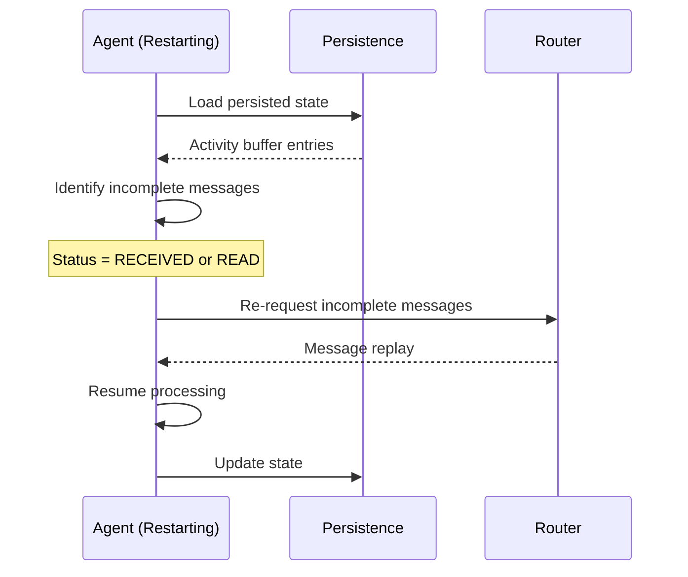

# 2.6 Persistence and State Management

This guide covers persistence options, recovery patterns, and state management strategies for building resilient SW4RM agents.

## 2.6.1 Overview

SW4RM agents maintain two primary types of persistent state:

| State Type | Purpose | Default Backend |
|------------|---------|-----------------|
| **Activity Buffer** | Message processing history and deduplication | JSON file |
| **Worktree State** | Git repository bindings and workspace context | JSON file |

## 2.6.2 Persistence Backends

The SDK provides a `PersistenceBackend` protocol that you can implement for custom backends. Two backends are included:

| Backend | Use Case | Status |
|---------|----------|--------|
| `JSONFilePersistence` | Development, single-agent | ✅ Implemented |
| `SQLitePersistence` | Production, single-node | ✅ Implemented |
| Redis | Distributed deployments | 🔮 Planned |
| PostgreSQL | Enterprise deployments | 🔮 Planned |

### JSON File Backend (Development)

The default backend stores state as JSON files on disk. Use this backend for development and single-agent deployments.

```python
from sw4rm.activity_buffer import PersistentActivityBuffer
from sw4rm.persistence import JSONFilePersistence

# Configure file-based persistence
persistence = JSONFilePersistence(
    file_path="/var/lib/sw4rm/state/activity_buffer.json"
)

buffer = PersistentActivityBuffer(
    persistence=persistence,
    dedup_window_s=3600  # 1 hour deduplication window
)
```

**Features:**

- Atomic writes via temp file + rename
- Base64 encoding for binary payloads
- Automatic corruption recovery (returns empty state)

### SQLite Backend (Production Single-Node)

Use SQLite for durable persistence with ACID guarantees on single-node deployments.

```python
from sw4rm.activity_buffer import PersistentActivityBuffer
from sw4rm.persistence import SQLitePersistence

# Configure SQLite persistence
persistence = SQLitePersistence(
    db_path="/var/lib/sw4rm/state/activity.sqlite3"
)

buffer = PersistentActivityBuffer(
    persistence=persistence,
    dedup_window_s=3600
)
```

**Features:**

- WAL mode for concurrent reads
- ACID-compliant transactions
- Automatic schema creation
- Indexed message lookups

**Schema:**
```sql
CREATE TABLE activity_records (
    seq INTEGER PRIMARY KEY AUTOINCREMENT,
    message_id TEXT UNIQUE NOT NULL,
    ts_ms INTEGER NOT NULL,
    direction TEXT NOT NULL,
    envelope_json TEXT NOT NULL,
    ack_stage INTEGER NOT NULL,
    error_code INTEGER NOT NULL,
    ack_note TEXT NOT NULL
);
```

### Custom Backends

Implement the `PersistenceBackend` protocol for custom storage:

```python
from sw4rm.persistence import PersistenceBackend
from typing import Dict, List, Any

class MyCustomPersistence:
    """Custom persistence backend."""

    def save_records(self, records: Dict[str, Dict[str, Any]], order: List[str]) -> None:
        """Save activity records and their ordering."""
        # Your implementation here
        pass

    def load_records(self) -> tuple[Dict[str, Dict[str, Any]], List[str]]:
        """Load activity records and their ordering."""
        # Your implementation here
        return {}, []

    def clear(self) -> None:
        """Clear all stored data."""
        # Your implementation here
        pass
```

## 2.6.3 Activity Buffer Configuration

### Buffer Parameters

The `PersistentActivityBuffer` class provides message tracking with deduplication:

```python
from sw4rm.activity_buffer import PersistentActivityBuffer

buffer = PersistentActivityBuffer(
    persistence=persistence,
    dedup_window_s=3600,  # Deduplication window in seconds (default: 3600)
    max_items=1000        # Maximum records to retain (default: 1000)
)
```

### Core Methods

```python
# Record an incoming message
buffer.record_incoming(envelope_dict)

# Record an outgoing message
buffer.record_outgoing(envelope_dict)

# Update with ACK information (pass ACK as dict)
buffer.ack({
    "ack_for_message_id": message_id,
    "ack_stage": 3,  # FULFILLED
    "error_code": 0,
    "note": ""
})

# Get record by message_id
record = buffer.get(message_id)

# Check for duplicates by idempotency token
existing = buffer.get_by_idempotency_token(token)

# Find all unacked messages (RECEIVED or READ stage)
unacked = buffer.unacked()

# Get recent messages
recent = buffer.recent(n=100)

# Force save to persistence
buffer.flush()
```

## 2.6.4 Message Deduplication

### Idempotency Token Processing

The activity buffer deduplicates messages using the Three-ID model:

- **message_id**: Unique per transmission attempt (UUIDv4)
- **idempotency_token**: Stable across retries for deduplication
- **correlation_id**: Links related messages (request/response)

```python
# Check if message is a duplicate before processing
existing = buffer.get_by_idempotency_token(envelope["idempotency_token"])
if existing:
    # Duplicate detected - skip processing
    return existing

# Record and process new message
buffer.record_incoming(envelope)
# ... process message ...
buffer.ack({
    "ack_for_message_id": envelope["message_id"],
    "ack_stage": 3  # FULFILLED
})
```

### Deduplication Window

The deduplication window determines how long idempotency tokens are tracked:

```python
buffer = PersistentActivityBuffer(
    persistence=persistence,
    dedup_window_s=3600,  # 1 hour (default)
)
```

Messages older than `dedup_window_s` may be pruned, allowing the same idempotency token to be reused after the window expires.

## 2.6.5 Crash Recovery

### Recovery Flow

When an agent restarts after a crash, the activity buffer automatically loads persisted state:



### Reconciliation

Use the `reconcile()` method to find messages that need retry after a restart:

```python
# Load existing state on startup
buffer = PersistentActivityBuffer(persistence=persistence)

# Find messages that weren't fully processed
incomplete = buffer.reconcile()
for record in incomplete:
    if record.ack_stage < 3:  # Not yet FULFILLED
        # Re-process or request replay from Router
        handle_incomplete_message(record)
```

### Unacked Message Detection

The `unacked()` method finds messages that haven't been fully acknowledged (still in RECEIVED or READ stage):

```python
# Find all messages that need acknowledgment
stale_messages = buffer.unacked()
for record in stale_messages:
    # Trigger retry logic
    retry_message(record)
```

## 2.6.6 Worktree State Persistence

### Persisting Git Context

Use `PersistentWorktreeState` to track repository bindings across restarts:

```python
from sw4rm.worktree_state import PersistentWorktreeState, WorktreePersistence

# Configure worktree persistence
persistence = WorktreePersistence(file_path="/var/lib/sw4rm/worktree.json")

worktree = PersistentWorktreeState(
    persistence=persistence,
    policy=None  # Use default policy, or provide custom WorktreePolicyHook
)

# Bind to a repository
worktree.bind(
    repo_id="org/repo",
    worktree_id="main",
    metadata={"path": "/workspace/repo"}
)

# State is automatically persisted
# On restart, bindings are automatically restored from persistence
```

### Worktree Lifecycle

```python
# Check current binding
if worktree.is_bound():
    binding = worktree.current()
    print(f"{binding.repo_id}/{binding.worktree_id}")

# Get detailed status
status = worktree.status()
print(f"Bound: {status['bound']}")

# Switch to different worktree (unbinds then rebinds)
worktree.switch(repo_id="org/repo", worktree_id="feature-branch")

# Unbind
worktree.unbind()
```

## 2.6.7 Planned Features

The following features are planned for future releases:

### Checkpointing (🔮 Planned)

Periodic state snapshots for faster recovery:

```python
# Planned API - not yet implemented
buffer = PersistentActivityBuffer(
    persistence=persistence,
    checkpoint_interval=300,     # Checkpoint every 5 minutes
    max_checkpoints=10,          # Keep last 10 checkpoints
)
```

### Multi-Instance Coordination (🔮 Planned)

Distributed locking for multi-agent deployments:

```python
# Planned API - not yet implemented
from sw4rm.persistence import DistributedLock

async with DistributedLock(
    persistence=redis_persistence,
    resource="agent:task-123",
    timeout_seconds=30
):
    await process_task()
```

### Retention Policies (🔮 Planned)

Automatic data expiration and cleanup:

```python
# Planned API - not yet implemented
buffer = PersistentActivityBuffer(
    persistence=persistence,
    retention_hours=168,         # Delete entries older than 7 days
    cleanup_interval=3600,       # Run cleanup every hour
)
```

### Health Checks and Metrics (🔮 Planned)

Monitoring and diagnostics for persistence backends:

```python
# Planned API - not yet implemented
health = await persistence.health_check()
stats = buffer.get_statistics()
```

!!! note "Current Workaround"
    For now, you can implement manual cleanup by periodically calling `buffer.clear()` or by implementing custom logic using `buffer.recent()` to identify old entries.

## 2.6.8 Best Practices

### Development

- Use the JSON file backend for local development.
- Set a reasonable `max_items` limit (default: 1000).
- Use context manager (`with buffer:`) to ensure data is saved on exit.

### Production (Single-Node)

- Use SQLite backend for durable persistence with ACID guarantees.
- Configure `max_items` based on expected message volume.
- Call `buffer.flush()` at critical checkpoints.
- Implement application-level cleanup using `reconcile()` after restarts.

### Security

- Encrypt sensitive payload data before persistence.
- Store persistence files in secure locations with appropriate permissions.
- Consider encrypting the SQLite database file at rest.

---

## See Also

- [First Agent Tutorial](first-agent.md) - Basic agent implementation
- [Installation Guide](installation.md) - Environment setup
- [ACK Lifecycle](../protocol/acks.md) - Message acknowledgment patterns
