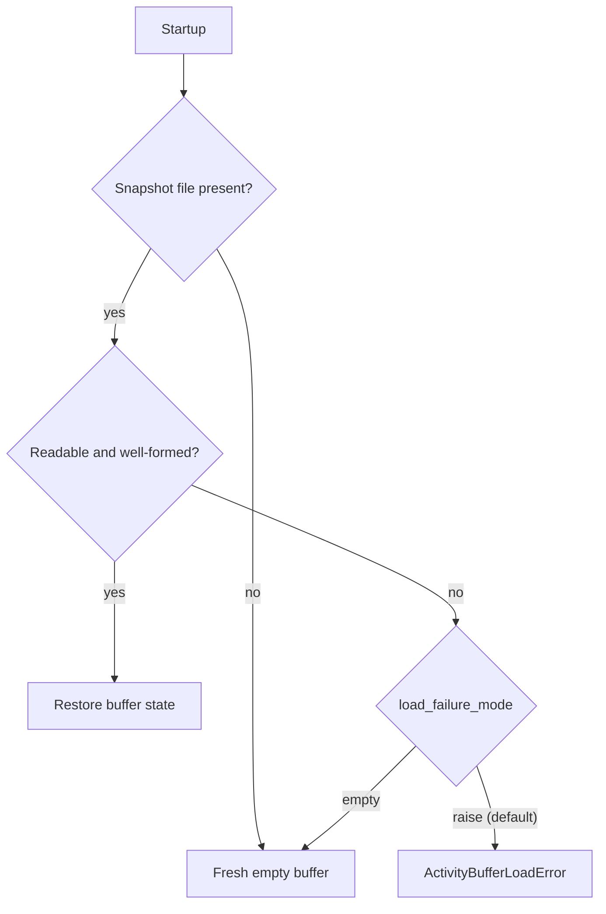

# 2.6 Persistence and Recovery

This page describes the Python activity-buffer backends. Other SDKs have their
own snapshot formats and APIs; see [implementation coverage](../protocol/implementation.md)
and the SDK READMEs. A stored activity record is not a transaction with an
arbitrary external effect.

## JSON snapshots

```python
from pathlib import Path
from sw4rm.activity_buffer import PersistentActivityBuffer
from sw4rm.persistence import JSONFilePersistence

state_dir = Path(".sw4rm-state")
state_dir.mkdir(parents=True, exist_ok=True)
buffer = PersistentActivityBuffer(
    persistence=JSONFilePersistence(str(state_dir / "activity.json")),
    dedup_window_s=3600,
)
```

The backend writes a temporary file, flushes it, atomically replaces the current
snapshot, and syncs the containing directory on supported local filesystems.
It assumes one writer. A missing file means a fresh buffer; unreadable or
malformed state raises `ActivityBufferLoadError`. Save errors propagate.




Python exposes an explicit degraded startup option:

```python
buffer = PersistentActivityBuffer(
    persistence=JSONFilePersistence(".sw4rm-state/activity.json"),
    load_failure_mode="empty",
)
```

This logs degraded recovery and starts empty. It forfeits the persisted
completion/deduplication history; it is not automatic recovery from corruption.
Keep the default error behavior when the previous state matters.

## SQLite snapshots

```python
from pathlib import Path
from sw4rm.activity_buffer import PersistentActivityBuffer
from sw4rm.persistence import SQLitePersistence

state_dir = Path(".sw4rm-state")
state_dir.mkdir(parents=True, exist_ok=True)
buffer = PersistentActivityBuffer(
    persistence=SQLitePersistence(str(state_dir / "activity.sqlite3")),
    dedup_window_s=3600,
)
```

SQLite uses WAL and synchronous commits. A save replaces the snapshot in one
transaction; this is intended for modest local write rates. The state directory
must already exist. SQLite support is not a general production-readiness claim,
a distributed store, or evidence of multi-writer buffer coordination.

## Buffer operations and deduplication

The buffer keeps incoming and outgoing records separate from the Router's
pending-delivery rows. These operations are useful when implementing a restart
reconciliation loop:

```python
buffer.record_incoming(envelope)
buffer.record_outgoing(envelope)
buffer.ack({
    "ack_for_message_id": message_id,
    "ack_stage": 3,  # sw4rm.constants.FULFILLED
    "error_code": 0,
    "note": "completed",
})
record = buffer.get(message_id)
duplicate = buffer.get_by_idempotency_token(token)
pending = buffer.unacked()
recent = buffer.recent(n=50)
outgoing_to_reconcile = buffer.reconcile()
buffer.flush()
```

`payload` and `audit_proof` may be `bytes`. JSON persistence encodes those
canonical byte fields as base64 with an explicit marker and decodes them back
to `bytes` when loading; SQLite applies the same envelope encoding inside its
JSON column. Other envelope fields are preserved as their original JSON
values.

Check the token before starting work, and record the incoming envelope before
performing it. A token lookup returns the record only while it remains inside
`dedup_window_s`; after that window the application must decide whether reuse is
safe. A `message_id` identifies the individual transmission and should not be
reused for a retry.

`reconcile()` returns unacknowledged outgoing records that may need an
application-specific retry or status check after restart. It does not resend
anything automatically, because the application may need to inspect the
provider's result before repeating an external call.

## Persist completion before releasing delivery

Recording an incoming message is not recording its successful completion. After
work succeeds, update the activity ACK/state and flush the completion record
before calling the router's delivery acknowledgement. On redelivery, check a
previously completed token before repeating work.

Calling a downstream effect and then flushing a token still leaves a crash
interval between those operations. Use an idempotent downstream API or a
transaction joining the effect and completion record when repeated effects are
unacceptable. See [release migration](../release-status.md).

## Worktree state and other local state

Repository bindings are managed by the Worktree service, through the SDK's
`WorktreeClient`; they are not activity-buffer records. A typical client binds
an agent to a repository and worktree, checks status after a restart, and
unbinds when the execution context is no longer valid:

```python
from sw4rm.clients.worktree import WorktreeClient

worktree = WorktreeClient(worktree_channel)
worktree.bind("agent-1", "repo-main", "wt-feature")
status = worktree.status("agent-1")
print(status.state, status.worktree_id)
worktree.unbind("agent-1")
```

The service owns the binding state and enforces its state machine. Persist
application checkpoints and repository metadata separately; do not assume a
local activity snapshot can reconstruct a remote worktree binding.

## Retention and security

`max_items` bounds the local activity buffer. Choose it from expected message
volume and the time required for reconciliation, then monitor capacity rather
than silently deleting records needed for recovery. The buffer may contain
payloads and identifiers, so restrict file permissions and encrypt sensitive
payloads or the storage volume according to the deployment's security policy.

There is no built-in distributed Redis or PostgreSQL backend in this guide.
When introducing one, implement the persistence backend contract, document its
single-writer and transaction semantics, and test crash boundaries before
calling it production-ready.

## Verification

The Python suite exercises snapshot round trips, write failures, corrupt state,
and recovery behavior. The process-kill tests under `tests/crash_conformance`
exercise selected Python reference-stack failure boundaries. They do not certify
other SDK stores or arbitrary filesystems. The release report records each SDK's
actual test results separately.
