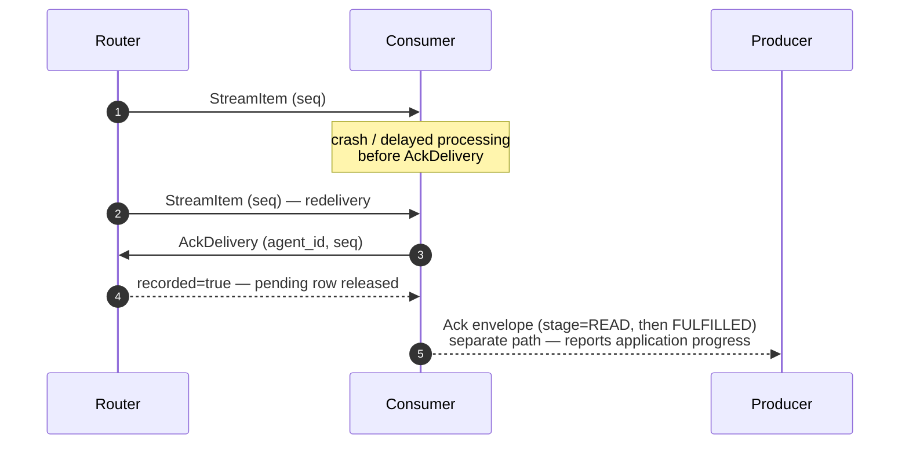

# Release status and migration

The next release target is **0.7.0**. It is under development and has not been
published. The published Python, JavaScript, Rust, and Elixir packages remain
**0.6.0**, checked against their registries on 2026-09-04. Common Lisp also has
a 0.6.0 GitHub release. Local 0.6.1–0.6.7 values were development checkpoints;
they were not public package releases.

| SDK | Package | Registry |
|---|---|---|
| Python | `sw4rm-sdk` | [PyPI](https://pypi.org/project/sw4rm-sdk/) |
| JavaScript/TypeScript | `@sw4rm/js-sdk` | [npm](https://www.npmjs.com/package/@sw4rm/js-sdk) |
| Rust | `sw4rm-sdk` | [crates.io](https://crates.io/crates/sw4rm-sdk) |
| Elixir | `sw4rm_sdk` | [Hex](https://hex.pm/packages/sw4rm_sdk) |
| Common Lisp | `sw4rm-sdk` ASDF system | [GitHub releases](https://github.com/rahulrajaram/sw4rm/releases) |

See the [generated inventory](reference/release-contract.md) for every local
version carrier. An SDK installation supplies a library. The reference servers
are separate processes and must be upgraded separately.

## Why 0.7.0

The pre-1.0 version policy uses minor releases for changes that affect
implementers. Delivery acknowledgements change what a consumer must do, and
persistence failures now surface instead of permitting silent recovery to an
empty buffer. These changes warrant migration instructions rather than a
0.6.1 patch label.

## Upgrade the router and consumers together

1. Generate or install bindings for the 0.7.0 contract in every consumer.
2. Preserve `StreamItem.seq` alongside the envelope. It is a router delivery
   identifier, distinct from `Envelope.sequence_number`.
3. Complete processing or durably hand responsibility to another component.
4. Persist the completion/deduplication record when using a persistent buffer.
5. Call `AckDelivery` with the receiving agent ID and delivery sequence.

Successful acknowledgement releases that recipient's pending row. Duplicate,
unknown, wrong-recipient, or expired-to-pending acknowledgements return
`recorded=false`. A permanent-failure acknowledgement deliberately discards
that delivery; it is not a retry request. To retry, leave the delivery unacked.
The exact RPC path is `/sw4rm.router.RouterService/AckDelivery` with
`DeliveryAckRequest{agent_id, seq, message_id, outcome}`; per-SDK call examples
are in [SDK parity](sdk-parity.md).

A 0.6.0 consumer connected to the new reference router cannot send the new RPC
through its old client. Its messages can be repeatedly redelivered. A new client
calling the new RPC against an old server receives gRPC `UNIMPLEMENTED`. There
is no automatic mixed-version negotiation or silent downgrade.

Preserve int64 sequences exactly; JavaScript represents them as strings.
The router validates recipient names but does not authenticate their ownership.
Operate the reference stack inside a trusted boundary.

## Delivery is separate from completion

`AckDelivery` releases router storage. An `Ack` envelope describing `READ` or
`FULFILLED` reports application progress. Sending one does not perform the
other. See [acknowledgements](protocol/acks.md).

At-least-once delivery permits duplicate processing. A flushed completion token
can suppress a later duplicate, but the effect and token are not one transaction.
If a process dies between an external effect and recording completion, that
effect can happen again. Use an idempotent downstream operation or a transaction
covering both effect and completion when that distinction matters.

## Policy result alignment

For `fail_with_abstain`, Python's `all_votes` now includes the generated abstain
records, matching the shared SDK contract. The injected records remain available
on the action and are dictionaries; downstream aggregation must accept them.
The default fraction of 0.5 means at least half after rounding up, not a strict
majority for an even-sized critic set. Quorum counting excludes duplicate and
unrequested critics, but applications must validate the input votes before
aggregating their scores.

## Persistence migration

A missing activity snapshot is a fresh start. An unreadable or malformed
snapshot is an error. The Python and JavaScript persistent buffers expose an
explicit degraded-start option; it forfeits recovery evidence and must be chosen
by the application. Save failures propagate. JSON formats remain SDK-specific;
sharing a protocol does not make activity files interchangeable.
Python reads the previous payload marker and writes an explicit list of encoded
byte fields for payloads and audit proofs. Older readers do not understand that
new marker; do not assume snapshots written by 0.7.0 can be read after downgrading.

Filesystem durability depends on the selected backend and platform. The local
file implementations flush a temporary snapshot, atomically replace the target,
and sync its directory where supported. These are single-writer stores, not a
shared database. See [SDK coverage](protocol/implementation.md).

## Validation and publication

See the dated [verification record](release-verification.md) for actual suite
results, artifact checks, reproduction commands, and remaining qualification gaps.

The release must pass version/proto consistency, package import checks, SDK
behavioral suites, shared numerical vectors, and documentation checks. Six
Python reference-stack crash scenarios have recorded passing results. They do
not certify every backend, platform, arbitrary side effect, or production load.

The 28-day operational observation target and optional Temporal experiment are
separate research objectives. The former is not complete; the latter has not
executed against Temporal. Neither establishes a comparative performance claim.
Publication is an explicit maintainer action after review; this development
checkpoint creates no release tags or registry uploads.
