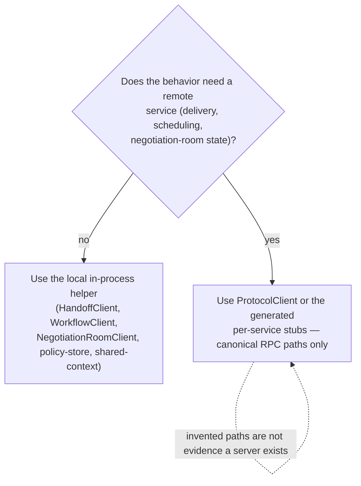

# SDK parity in the 0.7.0 development target

Parity means that an application can use any of the five SDKs to exchange every
canonical SW4RM message and invoke every canonical RPC. The common coordination
helpers also run the same behavioral fixtures. This is a development-tree
contract; it does not describe the previously published 0.6.0 packages.

## The supported wire interface

The canonical schema contains **15 services, 57 RPCs, and 127 message types**
(the shared conformance corpus additionally carries 12 synthetic map-entry
types, for 139 named types overall). The
[generated RPC inventory](reference/release-contract.md) and
[complete protobuf schema](reference/protobuf.md) come from `protos/`.

| SDK | Interface covering every RPC | Message representation |
|---|---|---|
| Python | `sw4rm.clients.ProtocolClient.call()` / `.stream()`; generated stubs remain available | Generated `sw4rm.protos` messages |
| JavaScript / TypeScript | `ProtocolClient.call()` / `.stream()` | Proto field names, `Uint8Array`/`Buffer` bytes, decimal strings for full-range 64-bit integers |
| Rust | Public `sw4rm_sdk::proto::sw4rm::<service>::<service>_client` modules | Generated Prost structs, native `i64`/`u64` |
| Elixir | Public `Sw4rm.Proto.<Service>.<ServiceName>.Stub` modules | Generated protobuf structs, native integers |
| Common Lisp | `protocol-client`, `call-protocol-rpc`, `stream-protocol-rpc` | Keyword plists, octet vectors, native integers; maps are alists |

Python, JS and Lisp `ProtocolClient` dispatch an application call once; they do
not add an SDK retry loop. gRPC's own transport behavior is separate. Applications
must decide whether an uncertain side effect may be retried. Existing convenience
clients retain their documented retry policies.

Python streams expose the gRPC iterator and its cancellation/status methods.
JS streams expose `ClientReadableStream.cancel()` and error events. Rust and
Elixir expose their generated transport APIs. Lisp returns a cancellable handle;
`wait-for-stream` waits for completion and signals a remote status or callback
error. Its callback receives each message and then `nil` once. Explicit
cancellation can therefore produce a `CANCELLED` condition when joining.

### Python

```python
import grpc
from sw4rm.clients import ProtocolClient
from sw4rm.protos import router_pb2

with grpc.insecure_channel("localhost:50051") as channel:
    client = ProtocolClient(channel)
    # Use the actual sequence from an incoming StreamItem after processing it.
    reply = client.call(
        "/sw4rm.router.RouterService/AckDelivery",
        router_pb2.DeliveryAckRequest(agent_id="worker-1", seq=42),
        timeout=3,
    )
```

### JavaScript

```javascript
import { ProtocolClient } from '@sw4rm/js-sdk';

const client = new ProtocolClient({ address: 'localhost:50051', deadlineMs: 3000 });
try {
  await client.call('/sw4rm.router.RouterService/AckDelivery', {
    agent_id: 'worker-1', seq: '42',
  });
} finally {
  client.close();
}
```

The JS wire client rejects unknown fields, unsafe numeric integers, invalid enum
names, and invalid field types before serialization. Responses preserve 64-bit
integers as decimal strings; do not convert them to `number` unless they are in
its safe integer range. Enum responses use the generated loader's string names.

### Rust

```rust
use sw4rm_sdk::proto::sw4rm::router::router_service_client::RouterServiceClient;
use sw4rm_sdk::proto::sw4rm::router::{DeliveryAckOutcome, DeliveryAckRequest};

#[tokio::main]
async fn main() -> Result<(), Box<dyn std::error::Error>> {
    let channel = tonic::transport::Channel::from_static("http://localhost:50051")
        .connect()
        .await?;
    let mut client = RouterServiceClient::new(channel);
    // Use the actual sequence from an incoming StreamItem after processing it.
    let request = tonic::Request::new(DeliveryAckRequest {
        agent_id: "worker-1".into(),
        seq: 42,
        message_id: String::new(),
        outcome: DeliveryAckOutcome::Delivered as i32,
    });
    let _reply = client.ack_delivery(request).await?;
    Ok(())
}
```

### Elixir

```elixir
{:ok, channel} = GRPC.Stub.connect("localhost:50051")

request = %Sw4rm.Proto.Router.DeliveryAckRequest{
  agent_id: "worker-1",
  seq: 42,
  message_id: "",
  outcome: :DELIVERY_ACK_OUTCOME_DELIVERED
}

{:ok, _reply} = Sw4rm.Proto.Router.RouterService.Stub.ack_delivery(channel, request)
```

### Common Lisp

```lisp
(let ((client (make-instance 'sw4rm-sdk:protocol-client
                             :address "localhost:50051" :timeout-ms 3000)))
  (unwind-protect
       (sw4rm-sdk:call-protocol-rpc
        client "/sw4rm.router.RouterService/AckDelivery"
        '(:agent-id "worker-1" :seq 42))
    (sw4rm-sdk:disconnect client)))
```

Lisp native transport was exercised on Linux x86-64, SBCL 2.2.9, and gRPC C core
1.51.1 (`libgrpc.so.29`). The loader also accepts `libgrpc.so`. The bindings use
the [gRPC C structure layout](https://github.com/grpc/grpc/blob/v1.51.1/include/grpc/impl/codegen/grpc_types.h).
Other platforms, TLS handshakes, and other native ABI versions need separate
qualification. Missing native transport produces an error on network calls.

## Common helper behavior

| Contract | What is tested in all five SDKs |
|---|---|
| Message encoding | 512 shared cases: populated messages, numeric boundaries, empty messages, and explicit nested-message presence |
| RPC exchange | All 57 paths with populated and boundary requests; both server-streaming paths return multiple messages |
| Delegation and cancellation | Shared SW4-004/SW4-005 retry, redirect, budget and cancellation cases |
| Score summary | Arithmetic mean, bounds, population deviation, confidence weighting and zero-confidence fallback |
| Quorum | Distinct critics, thresholds, timeout actions and injected abstentions |
| Portable idempotency | Eight shared vectors covering empty, binary and Unicode inputs and producer/operation changes |
| Envelope construction | Parent correlation, timestamps and payload survive the protobuf boundary; integer precision is preserved |

Envelope builders preserve `parent_correlation_id`. Python `RouterClient` and
Rust's `EnvelopeData` conversion preserve canonical envelope fields. Elixir
provides `Sw4rm.Envelope.to_proto/1` and `from_proto/1`; its local lowercase state
atoms are translated to wire enums. Lisp's legacy envelope codec now includes
`google.protobuf.Timestamp`, and its HLC stub uses the Unix epoch.

`effective_policy_id`, `audit_proof`, and `audit_policy_id` remain SDK-local
annotations: the canonical Envelope schema has no fields for them. They are not
sent as envelope fields. Raw `ProtocolClient` inputs must use the canonical
schema. Persistence formats, local object models, and helper defaults such as
binary payload MIME types remain language-specific.

### Portable idempotency without changing existing tokens

Use `compute_idempotency_token` in Python/Rust/Elixir,
`computeIdempotencyToken` in JS, or `compute-idempotency-token` in Lisp. Each takes
a producer ID, operation name and already-canonicalized bytes (JS takes an object
with those fields). The `sw4rm-idempotency-bytes-v1` profile computes:

```text
hash = first 16 lowercase hex characters of SHA256(
    UTF8(producer_id) || LF || UTF8(operation) || LF || canonical_bytes
)
token = producer_id + ":" + operation + ":" + hash
```

Applications must supply identical bytes. Sorting a JSON object's keys alone is
not a general cross-language canonicalization rule: number and Unicode encoding
also matter. The profile matches the existing JS byte-oriented helper.

The older `compute_deterministic_hash` / `compute-deterministic-hash` and
JSON/plist convenience functions retain their previous outputs for compatibility.
They are **not a portable contract**. Rust serializes the supplied Serde value
without normalizing arbitrary struct/map ordering; Elixir uses an inspected-term
representation. The legacy Lisp plist helper can lose key/value associations and
should not be used for new deduplication identities. Existing persisted tokens
must be handled deliberately before replacing a legacy algorithm.

## Local helpers and remote services

The Python/JS/Rust local `HandoffClient`, `WorkflowClient`, and
`NegotiationRoomClient` implementations are not substitutes for remote RPCs.
Use the wire interfaces above for service calls. Python's local `HandoffClient`
now rejects a supplied channel instead of silently ignoring it.



Lisp's older convenience clients include methods outside the canonical schema.
The new `protocol-client` exposes only canonical paths and is the complete wire
interface. Existing convenience methods remain for compatibility; their presence
is not evidence that a server implements an invented RPC.

The fixture server used for parity is a serialization oracle. It checks request
messages and returns fixtures; it does not implement scheduling, handoff, or
workflow execution. Actual router delivery tests run separately against the
Python reference router. See [implementation coverage](protocol/implementation.md)
for service availability and durability boundaries.

## Keeping this contract current

Run `python scripts/generate_sdk_wire_contract.py` with the repository's declared
Python development dependencies prepared. It fails if the shared corpus, Lisp
bindings, Python/JS method inventories, or Rust wire tests are stale. After a
reviewed proto change, `--write` regenerates them. The generator fails closed for
unsupported oneofs and client-streaming methods.

Each SDK consumes the shared corpus; the live fixture checks every RPC, including
metadata and server streams. CI enables the optional Rust, Elixir and Lisp live
checks explicitly. Python/JS package guards also inspect all RPC bindings through
isolated distributable layouts. No test downloads a tool or resolves dependencies.

See [verification](release-verification.md) for dated suite and package results.
